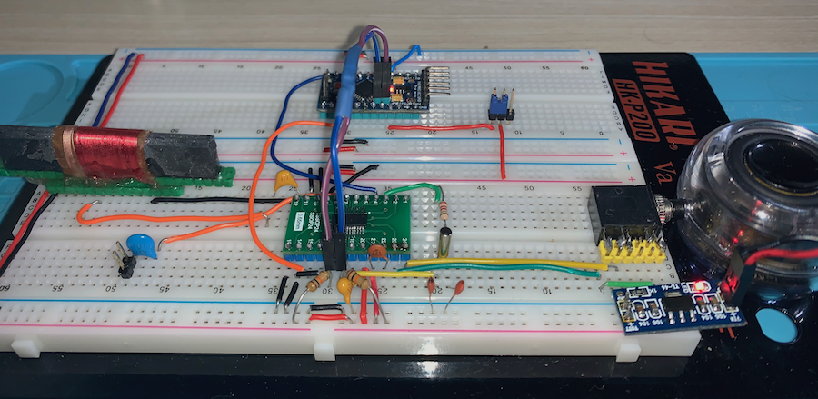

# Si4735 Library for Arduino

[Leia este documento em Português](https://github.com/pu2clr/SI4735/blob/master/README-pt-BR.md)

This is an Arduino library for the SI4735, BROADCAST AM/FM/SW RADIO RECEIVER IC from Silicon Labs.  This library is intended to provide an easier interface for controlling the SI4735 by using Arduino platform. __The communication used by this library is I2C__. 

This library was built based on [“__Si47XX PROGRAMMING GUIDE; AN332__ ”](https://www.silabs.com/documents/public/application-notes/AN332.pdf). It also can be used on __all members of the SI47XX family__ respecting, of course, the features available for each IC version. These functionalities can be seen in the comparison matrix shown in table 1 (__Product Family Function__); pages 2 and 3 of the programming guide.

This library can be freely distributed using the MIT Free Software model. [Copyright (c) 2019 Ricardo Lima Caratti](https://github.com/pu2clr/SI4735#mit-licence)  

Contact: pu2clr@gmail.com

There is a facebook group called [__Si47XX for radio listeners__](https://www.facebook.com/groups/532613604253401/) where the purpose is exchanging experiences with projects based on Silicon Labs  SI47XX IC family. You will be welcome to the group [Si47XX Radio Listening](https://www.facebook.com/groups/532613604253401/).


__Attention__: 
* __Documentation  under construction__. 
* __The SI4735 is a 3.3V part. If you are not using a 3.3V version of Arduino, you have to use a kind of 5V to 3.3V converter__.


## Summary

1. [License Copyright](https://github.com/pu2clr/SI4735#mit-licence)
2. [Thanks](https://github.com/pu2clr/SI4735#thanks)
3. [Your support is important](https://github.com/pu2clr/SI4735#your-support-is-important)
4. [About the SI4735](https://github.com/pu2clr/SI4735#about-the-si4735)
5. [Terminology](https://github.com/pu2clr/SI4735#si4735-terminology)
6. [Labrary Features](https://github.com/pu2clr/SI4735#si4735-arduino-library-features)
7. [Library Installation](https://github.com/pu2clr/SI4735#library-installation)
8. [Hardware Requirements and Setup](https://github.com/pu2clr/SI4735#hardware-requirements-and-setup)
   * [Schematic](https://github.com/pu2clr/SI4735#schematic)
   * [Component Parts](https://github.com/pu2clr/SI4735#parts)
   * [Photos (Tools and Accessories)](https://github.com/pu2clr/SI4735#photos-tools-and-accessories)
9.  [API Documentation](https://github.com/pu2clr/SI4735#api-documentation)
    * [__RDS Support__](https://github.com/pu2clr/SI4735#rds)
    * [__SI4735 and SSB (Single Side Band) Support__](https://github.com/pu2clr/SI4735#si4735-patch-support-for-single-side-band)
1.  [References](https://github.com/pu2clr/SI4735#references)
2.  [Examples](https://github.com/pu2clr/SI4735/tree/master/examples)
3.  [Videos](https://github.com/pu2clr/SI4735#videos) 
     * [Si4735 Arduino Library example. OLED Application.](https://youtu.be/7Sg4z8tDSA8)
     * [SI4735 Arduino Library and a simple FM and AM radio implementation](https://youtu.be/vzunuxam_Lg) 
     * [SI4735 ARDUINO LIBRARY BANDWIDTH TEST](https://youtu.be/dN1s3RoXGos)   

<BR>

## MIT License 

Copyright (c) 2019 Ricardo Lima Caratti

Permission is hereby granted, free of charge, to any person obtaining a copy of this software and associated documentation files (the "Software"), to deal in the Software without restriction, including without limitation the rights to use, copy, modify, merge, publish, distribute, sublicense, and/or sell copies of the Software, and to permit persons to whom the Software is furnished to do so, subject to the following conditions:

The above copyright notice and this permission notice shall be included in all copies or substantial portions of the Software.

THE SOFTWARE IS PROVIDED "AS IS", WITHOUT WARRANTY OF ANY KIND, EXPRESS OR IMPLIED, INCLUDING BUT NOT LIMITED TO THE ARRANTIES OF MERCHANTABILITY, FITNESS FOR A PARTICULAR PURPOSE AND NONINFRINGEMENT. IN NO EVENT SHALL THE AUTHORS OR COPYRIGHT HOLDERS BE LIABLE FOR ANY CLAIM, DAMAGES OR OTHER LIABILITY, WHETHER IN AN ACTION OF CONTRACT, TORT OR OTHERWISE, ARISING FROM, OUT OF OR IN CONNECTION WITH THE SOFTWARE OR THE USE OR OTHER DEALINGS IN THE SOFTWARE.

<BR>
<BR>


## Thanks

* I would like to thank Mr Francisco Scaramella  for the suggestions and contributions provided in the electronics field as well as for the testing of the functions implemented in this library.
* I would like to thank [Mr Vadim Afonkin](https://youtu.be/fgjPGnTAVgM) for making available the SSBRX patches for SI4735-D60 on his [Dropbox repository](https://www.dropbox.com/sh/xzofrl8rfaaqh59/AAA5au2_CVdi50NBtt0IivyIa?dl=0). 


<BR>
<BR>


## Your support is important.

If you would like to support this library development, consider joining this project via Github. Alternatively, make suggestions on features you would like available in this library. Thank you!

<BR>
<BR>

## About the SI4735  

The Si4735 is DSP radio receiver IC from Silcon Labs. It has great performance on AM (LW/MW/SW) and local FM station. The SI4735 can be programmed by using commands and responses. You can contron it via a microcontroller like Arduino. To make the SI4735 perform an action, the microccontroller have to send a set of bytes (command and arguments) that the device interpret it and executes the given command.

<BR>

## Radios based on Si47XX Family

The table below shows some radios based on SI47XX  

| Manufacturer | Model | CI |More information |
| ------------ | ----- | ---- |----------- | 
| Tecsun | PL310ET | Si4734 |[About](https://www.tecsunradios.com.au/store/product/tecsun-pl310et-multi-band-radio/)|
| Tecsun | PL-365 | Si4735 |[Review](https://swling.com/blog/2017/02/charlie-reviews-the-tecsun-pl-365/)|
| Tecsun | PL-360 | Si4734 |[Review](https://www.edn.com/review-tecsun-pl-360-emi-receiver/) |
| Tecsun | PL380 |  Si4734 |[Reviews](https://www.eham.net/reviews/view-product?id=10240) |
| Tecsun |  PL880 | Si4735 | [Reviews](https://www.eham.net/reviews/view-product?id=11457) |
| Degen | DE1103 DSP | Si4735 | [Review](https://swling.com/blog/2015/11/the-new-degen-de1103-dsp-first-impressions-review/)|
| Degen | DE1123/Kaito KA1123 | Si4734 |[Review](https://frrl.wordpress.com/2009/07/11/review-of-the-degen-de1123-dsp-amfmsw-pocket-radio-with-1gb-mp3-player-recorder/)|
| Degen | DE1125/Kaito KA801 | Si4734 | [Reviews](https://www.eham.net/reviews/view-product?id=9584)|
| Degen | DE1126 | Si4734 | [Review](https://sites.google.com/site/zliangas/de1126-review)|
| Degen | DE1127 (discontinued) | Si4734 | [Review](https://herculodge.typepad.com/herculodge/2012/01/dave-zantow-provides-firmware-updates-for-degen-de1127-and-de1126-models.html) |
| Sangean | ATS-909X |  Si4735 | [Review](https://swling.com/blog/tag/sangean-ats-909x-review/) |
| XHDATA | D808 | Si4735 |[Review](https://swling.com/blog/2018/04/a-detailed-review-of-the-xhdata-d-808-and-comparison-with-the-tecsun-pl-660/)|
| RADIWOW | R-108 |  | [Review](https://www.hagensieker.com/wordpress/2019/05/08/radiwow-r-108-short-wave-radio-review/)|
| C Crane |  CC Skywave |  |[Review](https://swling.com/blog/2014/12/review-of-the-c-crane-cc-skywave-portable-radio/) |


<BR>
<BR>

### Functional Block Diagram

The image below shows the SI473X-D60 block diagram. It was extracted from Silicon Labs Si4730/31/34/35-D60 / BROADCAST AM/FM/SW/LW RADIO RECEIVER (page 21). __Note that the author of this Library highlights in red the pin operating voltages that can be connected to the Arduino__. Be aware of the operating voltage of the Arduino pins you will use in your project. Preferably use an Arduino with 3.3V operating voltage. If you are not using a 3.3V version of Arduino, you must use a kind of 5V to 3.3V converter on RST, SCLK, SDIO and SEN (depending on your project). 


<BR>
<BR>

### The main Si4735 features

* FM band support (64–108 MHz)
* AM (MW) band support (520–1710 kHz)
* SW band support (2.3–26.1 MHz)
* LW band support (153–279 kHz)
* Allows firmware upgrade. Including the possibility of adjustments to demodulate SSB.
* Advanced AM/FM seek tuning
* Automatic frequency control (AFC)
* Automatic gain control (AGC)
* Digital FM stereo decoder
* AM/FM/SW/LW digital tuning
* RDS/RBDS processor
* Digital audio out
* I2C and SPI interface 
* Great Programming Guide and additional documentation to deal with the device


<BR>
<BR>


## SI4735 Terminology

| Term | Description |
| ---- | ----- |
| API  | Application Programming Interface (API). In this context, it is an interface that you can use to simplify the implementation and maintenance of your software (Arduino sketch) | 
|Arduino Libraries|Libraries are files written in C or C++ (.c, .cpp) which provide your sketches with extra functionality. The SI4735 Library provides extra functionalities to make easier the Arduino deal with Si4735 device| 
|IDE   |Integrated Development Environment|      
|Sketch|Name that Arduino environment uses for a program|
|interrupt|In this context, it is a Arduino Resource. Allows important tasks to be performed regardless of the flow of your program|
|C++| A object-oriented programming (OOP) language. It is a superset of the C language with an additional concept of "classes." |
|programming guide| In this context it refers to [Si47XX PROGRAMMING GUIDE](https://www.silabs.com/documents/public/application-notes/AN332.pdf)|
| LNA | Low Noise Amplifier |
|POC| Proof of Concept|
| SEN | Serial enable pin, active low; used as device select in 3-wire and SPI operation and address selection in 2-wire operation| 
| CTS | Clear to send |
| STC | Seek/Tune Complete |
| RESP | Response byte (n = 1 to 15) |
| RESPONSEn | Response register (16-bit) in 3-Wire mode (n = 1 to 8)| 
| RST  | Also RSTb—Reset pin, active low |
| RCLK | External reference clock |
| SSB | [Single Side Band](https://en.wikipedia.org/wiki/Single-sideband_modulation) | 
| SDIO | Serial data in/data out pin|
| SCLK | Serial clock pin |
| I2C | [I²C - Inter-Integrated Circuit](https://pt.wikipedia.org/wiki/I²C)|
| Soft Mute | Resource used to attenuate the audiooutputs and minimize audible noise in very weak signalconditions | 
| Firmware Upgrades | The Si473x-D60 contains on-chip program  RAM to accommodate minor changes to the firmware | 

<BR>
<BR>
<BR>
<BR>

## SI4735 Arduino Library Features

This library uses the I2C communication protocol and implements most of the functions offered by Si4735 (BROADCAST AM / FM / SW / LW RADIO RECEIVER). The main features of this library are listed below.

1. Open Source 
2. Built Based on [Si47XX PROGRAMMING GUIDE](https://www.silabs.com/documents/public/application-notes/AN332.pdf)
3. C++ Lenguage and Object-oriented programming
4. Available on Arduino IDE (Manage Libraries)
5. Simplifies projects based on SI4735
6. __I2C communication__
7. More than 60 SI4735 [functions implemented](https://github.com/pu2clr/SI4735#api-documentation)
8. [RDS support](https://github.com/pu2clr/SI4735#rds)(__under construction...__)
9. [SSB (Single Side Band) patch support](https://github.com/pu2clr/SI4735#single-side-band-ssb-support) 

<BR>
<BR>

## Library Installation

You can install this library on your Arduino environment using different methods. The best ways to do that are described below.  

### Installing via Arduino IDE

This is the easiest method to install this library.


<BR>


<BR>

### Installing via this repository 


<BR>


First, you have to download this library in zip format. [Click here](https://github.com/pu2clr/SI4735/archive/master.zip) to download.

Unzip the SI4735.zip file in your Arduino Library folder. 

* On __Windows__: "My Documents\Arduino\libraries"
* On __MAC OS__: ˜/Documents/Arduino/libraries
* On __Linux__: ˜/Documents/Arduino/libraries


<BR>
<BR>


## Hardware Requirements and Setup

This library has been written for the Arduino platform and has been successfully tested on Pro Mini. I beleave it will work on any other Arduino with I2C support.


### Arduino 5V and Si4735

__The SI4735 device  works with  3.3V only. If you are not using a 3.3V version of Arduino, you have to use a kind of converter__. 
This includes the Arduino operating pins.  


### Schematic

The main porpuse of this prototype is testing de Si4735 Arduino Library. It does not intend to be a real radio for exigent listener. However, it is possible to start with it and after include some devices to improve, for example,  its sensibility beyond other desired features.

The image bellow shows a version of Slicon Labs SSOP Typical Application Schematic. The basic difference are the pull-up resitors on I2C bus. 


* __See some Shortwave antenna configuration on__  [Si47XX ANTENNA, SCHEMATIC, LAYOUT, AND DESIGN GUIDELINES; AN383](https://www.silabs.com/documents/public/application-notes/AN383.pdf)

* __THE SI4735 IS A 3.3V PART. IF YOU ARE NOT USING A 3.3V VERSION OF ARDUINO, YOU HAVE TO USE A KIND OF 5V TO 3.3V CONVERTER.__

<BR>
<BR>

#### The image bellow shows the Slicon Labs SSOP Typical Application Schematic.


<BR>
<BR>

### Parts

The table below shows the component parts used to build the radio prototype based on Si4735 and used the Slicon Labs SSOP Typical Application Schematic as main source. However, some parts were included by the author of this project. 


|Part	| Description |
|-------| ------------ |
| C1    | 22nF Monolithic Multilayer Chip Ceramic non polarized capacitor (Place it close to VA pin)|
| C2    | 100pF Monolithic Multilayer Chip Ceramic non polarized capacitor |
| C3    | 470nF Monolithic Multilayer Chip Ceramic non polarized capacitor| 
| C4    | 100nF Monolithic Multilayer Chip Ceramic non polarized capacitor (Place it close to VD pin)|
| C5 and C6 | 22pF (Crystal load capacitors) | 
| C7 and C8[ˆ1] | 4.7uF Monolithic Multilayer Chip Ceramic non polarized capacitor | 
| R3    | 2.2K |
| (R4 and R5)[ˆ2] | 2K to 10K (pull-up resistors) |
| L1 | Ferrite loop stick (about 500 μH) |
| X1    | 32.768 kHz crystal |
| SI4735 | digital CMOS AM(LW, MW and SW)/FM radio receiver IC |

  * [ˆ1]: C7 and C8 are ceramic capacitors included by the author of this project. They are not present on original Silicon Labs schematic. 
  * [ˆ2]: R4 and R5 are pull-up resistor included by the author of this project. They are not present on original Silicon Labs schematic.  This will also depend on other devices connected to the same I2C bus.  __Always try to use the lowest possible value__.

__Notes from Silicon Labs Broadcast AM/FM/SW/LW Radio Receiver documentation (page 12)__:
* Place C1 close to VA and C4 close to VD pin.
* All grounds connect directly to GND plane on PCB.
* Pins 6 and 7 are no connects, leave floating.
* Pins 10 and 11 are unused. Tie these pins to GND.
* To ensure proper operation and receiver performance, follow the guidelines in “AN383: Si47xx Antenna, Schematic,
* Layout, and Design Guidelines.” Silicon Laboratories will evaluate schematics and layouts for qualified customers.
* Pin 8 connects to the FM antenna interface, and pin 12 connects to the AM antenna interface.
* Place Si473x-D60 as close as possible to antenna and keep the FMI and AMI traces as short as possible.

<BR>

## Photos (Tools and Accessories) 

This item describes some tools and accessories you might need to build your radio based on SI4735. Most of the accessories used in this project you will find on eBay and AliExpress.


|Arduino Pro Mini|Arduino Pro Mini| 
|---------------|---------------|  
|||

* Pro Mini 3.3V 8MHz /5V 16M Atmega328 Replace ATmega128 Arduino Compatible Nano

<BR> 

| FT232 USB Adapter |FT232 USB Adapter| 
|---------------|---------------|   
|||

* FT232RL 3.3V 5.5V FTDI USB to TTL Serial Adapter Module for Arduino Mini Port 


<BR>

|Magnifier|Solder| 
|---------------|---------------|   
|||

* 50-1000X Magnifier Wireless WiFi Electric Microscope 2.0MP 8LED Endoscope Camera
* Soldering Iron Station with Temperature Control 

<BR>

|Adapter for SI4735|Soldering Accessories| 
|---------------|---------------|   
|||

* SO SOP SOIC SSOP TSSOP 24 Pin to DIP 24 Adapter PCB Board Converter
* 50g Soldering Paste Solder Flux Paste Cream for PCB PGA SMD BGA
* BGA SMD Soldering Paste Flux
  

<BR>

It was a bit hard to solder the kind of CI on adapter. However, by using a electronic magnifier it was possible.

### SI4735 soldered on adapter

|Si4735 on Adapter|Si4735 on Adapter| 
|---------------|---------------|  
|||

|Si4735 on Adapter|Si4735 on Adapter| 
|---------------|---------------|   
|||


#### Protoboard

The basic circuit built on protoboard is based on the “__SSOP Typical Application Schematic__”, suggested by the Silicon Labs Documentation (Si4730/31/34/35-D60-BROADCAST AM/FM/SW/LW RADIO RECEIVER; page 19). Two pull-up 10K resistors were added on I2C bus. Also, it is recomended to add two 4.7uF capacitors between the CI audio output  and audio amplifier. The photos below do not show these capacitors. See  [C7 and C8 on schematic](https://github.com/pu2clr/SI4735#schematic).


<BR>
<BR>


The figure above shows the very basic shematic implementation (no Button or Encoder).  This protoboard is used by some test  implemented in this project. [See folder examples for more details](./examples) 

<BR>
<BR>



The figure above shows a schematic implementation using buttons and Encoder. This protoboard will be used in some examples (sketches) writen in this project.  [See folder examples for more details](./examples). 

<BR>
<BR>


## API Documentation

This item shows the SI4735 Arduino Library implemantation. Here you can find the set of functions and methods that you can use to build your radio. 

### API Index 

* [Defined Data Types and Structures](https://github.com/pu2clr/SI4735#defined-data-types-and-structures)
* [__Public Methods__](https://github.com/pu2clr/SI4735#public-methods)
  * [__Usual methods__](https://github.com/pu2clr/SI4735#public-methods)
  * [setup](https://github.com/pu2clr/SI4735#setup)
  * [setPowerUp](https://github.com/pu2clr/SI4735#setpowerup)
  * [analogPowerUp](https://github.com/pu2clr/SI4735#analogpowerup)
  * [powerDown]()
  * [setFrequency](https://github.com/pu2clr/SI4735#setfrequency)
  * [frequencyUp](https://github.com/pu2clr/SI4735#frequencyup)
  * [frequencyDown](https://github.com/pu2clr/SI4735#frequencydown)
  * [setTuneFrequencyAntennaCapacitor](https://github.com/pu2clr/SI4735#settunefrequencyantennacapacitor)
  * [setTuneFrequencyFast](https://github.com/pu2clr/SI4735#settunefrequencyfast)
  * [setTuneFrequencyFreeze](https://github.com/pu2clr/SI4735#settunefrequencyfreeze)
  * [isCurrentTuneFM](https://github.com/pu2clr/SI4735#iscurrenttunefm)
  * [seekStation](https://github.com/pu2clr/SI4735#seekstation)
  * [setAM](https://github.com/pu2clr/SI4735#setam)
  * [setFM](https://github.com/pu2clr/SI4735#setfm)
  * [setVolume](https://github.com/pu2clr/SI4735#setvolume)
  * [getVolume](https://github.com/pu2clr/SI4735#getvolume)
  * [volumeUp](https://github.com/pu2clr/SI4735#volumeup)
  * [volumeDown](https://github.com/pu2clr/SI4735#volumedown)
  * [getCurrentVolume](https://github.com/pu2clr/SI4735#getcurrentvolume)
* [__FM Stereo and mono Control__](https://github.com/pu2clr/SI4735#fm-stereo-and-mono-control)
  * [setFmBlendStereoThreshold](https://github.com/pu2clr/SI4735#setfmblendstereothreshold)
  * [setFmBlendMonoThreshold](https://github.com/pu2clr/SI4735#setfmblendmonothreshold)
  * [setFmBlendRssiStereoThreshold](https://github.com/pu2clr/SI4735#setfmblendrssistereothreshold)
  * [setFmBLendRssiMonoThreshold](https://github.com/pu2clr/SI4735#setfmblendrssimonothreshold)
  * [setFmBlendSnrStereoThreshold](https://github.com/pu2clr/SI4735#setfmblendsnrstereothreshold)
  * [setFmBLendSnrMonoThreshold](https://github.com/pu2clr/SI4735#setfmblendsnrmonothreshold)
  * [setFmBlendMultiPathStereoThreshold](https://github.com/pu2clr/SI4735#setfmblendmultipathstereothreshold)
  * [setFmBlendMultiPathMonoThreshold](https://github.com/pu2clr/SI4735#setfmblendmultipathmonothreshold)
* [__Si4735 current status__](https://github.com/pu2clr/SI4735#si4735-current-status)
  * [getFrequency](https://github.com/pu2clr/SI4735#getfrequency)
  * [getCurrentFrequency](https://github.com/pu2clr/SI4735#getcurrentfrequency) 
  * [getStatus](https://github.com/pu2clr/SI4735#getstatus)
  * [getTuneCompleteTriggered](https://github.com/pu2clr/SI4735#gettunecompletetriggered)
  * [getSignalQualityInterrupt](https://github.com/pu2clr/SI4735#getsignalqualityinterrupt)
  * [getRadioDataSystemInterrupt](getRadioDataSystemInterrupt)
  * [getStatusError](https://github.com/pu2clr/SI4735#getstatuserror)
  * [getStatusCTS](https://github.com/pu2clr/SI4735#getstatuscts)
  * [getACFIndicator](https://github.com/pu2clr/SI4735#getacfindicator)
  * [getBandLimit](https://github.com/pu2clr/SI4735#getbandlimit)
  * [getReceivedSignalStrengthIndicator](https://github.com/pu2clr/SI4735#getreceivedsignalstrengthindicator)
  * [getStatusSNR](https://github.com/pu2clr/SI4735#getstatussnr)
  * [getStatusMULT](https://github.com/pu2clr/SI4735#getstatusmult)
  * [getAntennaTuningCapacitor](https://github.com/pu2clr/SI4735#getantennatuningcapacitor)
  * [getStatusValid](https://github.com/pu2clr/SI4735#getstatusvalid)
* [__SI4735 Received Signal Quality__](https://github.com/pu2clr/SI4735#si4735-received-signal-quality)
  * [getCurrentReceivedSignalQuality](https://github.com/pu2clr/SI4735#getcurrentreceivedsignalquality)
  * [getCurrentRSSI](https://github.com/pu2clr/SI4735#getcurrentrssi)
  * [getCurrentSNR](https://github.com/pu2clr/SI4735#getcurrentsnr)
  * [getCurrentRssiDetectLow](https://github.com/pu2clr/SI4735#getcurrentrssidetectlow)
  * [getCurrentRssiDetectHigh](https://github.com/pu2clr/SI4735#getcurrentrssidetecthigh)
  * [getCurrentSnrDetectLow](https://github.com/pu2clr/SI4735#getcurrentsnrdetectlow)
  * [getCurrentSnrDetectHigh](https://github.com/pu2clr/SI4735#getcurrentsnrdetecthigh)
  * [getCurrentValidChannel](https://github.com/pu2clr/SI4735#getcurrentvalidchannel)
  * [getCurrentAfcRailIndicator](https://github.com/pu2clr/SI4735#getcurrentafcrailindicator)
  * [getCurrentSoftMuteIndicator](https://github.com/pu2clr/SI4735#getcurrentsoftmuteindicator)
  * [getCurrentStereoBlend](https://github.com/pu2clr/SI4735#getcurrentstereoblend)
  * [getCurrentPilot](https://github.com/pu2clr/SI4735#getcurrentpilot)
  * [getCurrentMultipath](https://github.com/pu2clr/SI4735#getcurrentmultipath)
  * [getCurrentSignedFrequencyOffset](https://github.com/pu2clr/SI4735#getcurrentsignedfrequencyoffset)
  * [getCurrentMultipathDetectLow](https://github.com/pu2clr/SI4735#getcurrentmultipathdetectlow)
  * [getCurrentMultipathDetectHigh](https://github.com/pu2clr/SI4735#getcurrentmultipathdetecthigh)
  * [getCurrentBlendDetectInterrupt](https://github.com/pu2clr/SI4735#getcurrentblenddetectinterrupt)
* [__Current AGC Status__](https://github.com/pu2clr/SI4735#current-agc-status)
  * [getAutomaticGainControl](https://github.com/pu2clr/SI4735#getautomaticgaincontrol)
  * [isAgcEnabled](https://github.com/pu2clr/SI4735#isagcenabled)
  * [getAgcGainIndex](https://github.com/pu2clr/SI4735#getagcgainindex)
  * [setAutomaticGainControl](https://github.com/pu2clr/SI4735#setautomaticgaincontrol)
* [__Filters__](https://github.com/pu2clr/SI4735#filters)
  * [setBandwidth](https://github.com/pu2clr/SI4735#setbandwidth) 
* [__SI4735 Firmware Information__](https://github.com/pu2clr/SI4735#si4735-firmware-information)
  * [getFirmwarePN](https://github.com/pu2clr/SI4735#getfirmwarepn)
  * [getFirmwareFWMAJOR](https://github.com/pu2clr/SI4735#getfirmwarefwmajor)
  * [getFirmwareFWMINOR](https://github.com/pu2clr/SI4735#getfirmwarefwminor)
  * [getFirmwarePATCHH](https://github.com/pu2clr/SI4735#getfirmwarepatchh)
  * [getFirmwarePATCHL](https://github.com/pu2clr/SI4735#getfirmwarepatchl)
  * [getFirmwareCMPMAJOR](https://github.com/pu2clr/SI4735#getfirmwarecmpmajor)
  * [getFirmwareCMPMINOR](https://github.com/pu2clr/SI4735#getfirmwarecmpminor)
  * [getFirmwareCHIPREV](https://github.com/pu2clr/SI4735#getfirmwarechiprev)
* [__RDS__](https://github.com/pu2clr/SI4735#rds)
  * [setRdsIntSource](https://github.com/pu2clr/SI4735#setrdsintsource)
  * [setRdsConfig](https://github.com/pu2clr/SI4735#setrdsconfig)
  * [getRdsStatus](https://github.com/pu2clr/SI4735#getrdsstatus)
  * [getRdsReceived](https://github.com/pu2clr/SI4735#getrdsreceived)
  * [getRdsSyncLost](https://github.com/pu2clr/SI4735#getrdssynclost)
  * [getRdsSyncFound](https://github.com/pu2clr/SI4735#getrdssyncfound)
  * [getRdsNewBlockA](https://github.com/pu2clr/SI4735#getrdsnewblocka)
  * [getRdsNewBlockB](https://github.com/pu2clr/SI4735#getrdsnewblockb)
  * [getRdsSync](https://github.com/pu2clr/SI4735#getrdssync)
  * [getGroupLost](https://github.com/pu2clr/SI4735#getgrouplost)
  * [getNumRdsFifoUsed](https://github.com/pu2clr/SI4735#getnumrdsfifoused)
  * [getRdsPI](https://github.com/pu2clr/SI4735#getrdspi)
  * [getRdsGroupType](https://github.com/pu2clr/SI4735#getrdsgrouptype)
  * [getRdsVersionCode](https://github.com/pu2clr/SI4735#getrdsversioncode)
  * [getRdsProgramType](https://github.com/pu2clr/SI4735#getrdsprogramtype)
  * [getRdsText](https://github.com/pu2clr/SI4735#getrdstext)
  * [getRdsTime](https://github.com/pu2clr/SI4735#getrdstime)
* [__SI4735 Patch Support for Single Side Band__](https://github.com/pu2clr/SI4735#si4735-patch-support-for-single-side-band)
  * [SI4735 patch](https://github.com/pu2clr/SI4735#si4735-patch-support-for-single-side-band)
  * [queryLibraryId](https://github.com/pu2clr/SI4735#querylibraryid)
  * [patchPowerUp](https://github.com/pu2clr/SI4735#patchpowerup)
  * [downloadPatch](https://github.com/pu2clr/SI4735#downloadpatch)
  * [Single Side Band (SSB) Methods](https://github.com/pu2clr/SI4735#single-side-band-ssb-methods) 
  * [setSSBBfo](https://github.com/pu2clr/SI4735#setssbbfo)
  * [setSSBConfig](https://github.com/pu2clr/SI4735#setssbconfig)
  * [setSSB](https://github.com/pu2clr/SI4735#setssb)
  * [setSSBAudioBandwidth](https://github.com/pu2clr/SI4735#setssbaudiobandwidth)
  * [setSBBSidebandCutoffFilter](https://github.com/pu2clr/SI4735#setsbbsidebandcutofffilter)
  * [setSSBAvcDivider](https://github.com/pu2clr/SI4735#setssbavcdivider)
  * [setSSBAvcDivider](https://github.com/pu2clr/SI4735#setssbavcdivider)
  * [setSSBAutomaticVolumeControl](https://github.com/pu2clr/SI4735#setssbautomaticvolumecontrol)
  * [setSSBSoftMute](https://github.com/pu2clr/SI4735#setssbsoftmute)
  * [setSSBDspAfc](https://github.com/pu2clr/SI4735#setssbdspafc)
  * [setSSBConfig](https://github.com/pu2clr/SI4735#setssbconfig)
  * [setSSBBfo](https://github.com/pu2clr/SI4735#setssbbfo)


### Defined Data Types and Structures


To make the SI4735 device easier to deal, some defined data types were built to handle byte and bits responses.

```cpp
/*****************************************************************
 * SI473X data types 
 * These data types will be usefull to deal with SI473X 
 *****************************************************************/

/*
 * Power Up arguments data type 
 * See Si47XX PROGRAMMING GUIDE; AN332; pages 64 and 65
 */
    typedef union {
    struct
    {
        // ARG1
        byte FUNC : 4;    // Function (0 = FM Receive; 1–14 = Reserved; 15 = Query Library ID)
        byte XOSCEN : 1;  // Crystal Oscillator Enable (0 = crystal oscillator disabled; 1 = Use crystal oscillator and and OPMODE=ANALOG AUDIO) .
        byte PATCH : 1;   // Patch Enable (0 = Boot normally; 1 = Copy non-volatile memory to RAM).
        byte GPO2OEN : 1; // GPO2 Output Enable (0 = GPO2 output disabled; 1 = GPO2 output enabled).
        byte CTSIEN : 1;  // CTS Interrupt Enable (0 = CTS interrupt disabled; 1 = CTS interrupt enabled).
        // ARG2
        byte OPMODE; // Application Setting. See page 65
    } arg;
    byte raw[2]; // same arg memory position, so same content.
} si473x_powerup;

```

```cpp 
/*
 * Represents how the  frequency is stored in the si4735.
 * It helps to convert frequency in unsigned int to two bytes (FREQL and FREQH)  
 */
typedef union {
    struct
    {
        byte FREQL; // Tune Frequency High Byte.
        byte FREQH; // Tune Frequency Low Byte.
    } raw;
    unsigned value;
} si47x_frequency;

```

```cpp

/* 
 *  Represents searching for a valid frequency data type.
 */
typedef union {
    struct
    {
        byte RESERVED1 : 2;
        byte WRAP : 1;   // Determines whether the seek should Wrap = 1, or Halt = 0 when it hits the band limit.
        byte SEEKUP : 1; // Determines the direction of the search, either UP = 1, or DOWN = 0.
        byte RESERVED2 : 4;
    } arg;
    byte raw;
} si47x_seek;
```


```cpp
/*  
 * Response status command 
 * See Si47XX PROGRAMMING GUIDE; pages 73 and 
 */
typedef union {
    struct
    {
        // Status
        byte STCINT : 1; // Seek/Tune Complete Interrupt; 1 = Tune complete has been triggered.
        byte DUMMY1 : 1;
        byte RDSINT : 1; // Radio Data System (RDS) Interrup; 0 = interrupt has not been triggered.
        byte RSQINT : 1; // Received Signal Quality Interrupt; 0 = interrupt has not been triggered.
        byte DUMMY2 : 2;
        byte ERR : 1; // Error. 0 = No error 1 = Error
        byte CTS : 1; // Clear to Send.
        // RESP1
        byte VALID : 1; // Valid Channel
        byte AFCRL : 1; // AFC Rail Indicator
        byte DUMMY3 : 5;
        byte BLTF : 1; // Reports if a seek hit the band limit
        // RESP2
        byte READFREQH; // Read Frequency High Byte.
        // RESP3
        byte READFREQL; // Read Frequency Low Byte.
        // RESP4
        byte RSSI; // Received Signal Strength Indicator (dBμV)
        // RESP5
        byte SNR; // This byte contains the SNR metric when tune is complete (dB).
        // RESP6
        byte MULT; // Contains the multipath metric when tune is complete
        // RESP7
        byte READANTCAP; // Contains the current antenna tuning capacitor value
    } resp;
    byte raw[7];
} si47x_response_status;
```

```cpp
/*
 * Firmware Information
 */
typedef union {
    struct
    {
        // status ("RESP0")
        byte STCINT : 1;
        byte DUMMY1 : 1;
        byte RDSINT : 1;
        byte RSQINT : 1;
        byte DUMMY2 : 2;
        byte ERR : 1;
        byte CTS : 1;
        byte PN;       //  RESP1 - Final 2 digits of Part Number (HEX).
        byte FWMAJOR;  // RESP2 - Firmware Major Revision (ASCII).
        byte FWMINOR;  // RESP3 - Firmware Minor Revision (ASCII).
        byte PATCHH;   // RESP4 - Patch ID High Byte (HEX).
        byte PATCHL;   // RESP5 - Patch ID Low Byte (HEX).
        byte CMPMAJOR; // RESP6 - Component Major Revision (ASCII).
        byte CMPMINOR; // RESP7 - Component Minor Revision (ASCII).
        byte CHIPREV;  // RESP8 - Chip Revision (ASCII).
        // RESP9 to RESP15 not used
    } resp;
    byte raw[9];
} si47x_firmware_information;
```

```cpp
/*
 * Status of FM_TUNE_FREQ or FM_SEEK_START commands or 
 * Status of AM_TUNE_FREQ or AM_SEEK_START commands.
 * 
 * See Si47XX PROGRAMMING GUIDE; AN332; pages 73 and 139
 */
typedef union {
    struct
    {
        byte INTACK : 1; // If set, clears the seek/tune complete interrupt status indicator.
        byte CANCEL : 1; // If set, aborts a seek currently in progress.
        byte RESERVED2 : 6;
    } arg;
    byte raw;
} si47x_tune_status;
```

```cpp
/*
 * Property Data type (help to deal with SET_PROPERTY command on si473X)
 */
typedef union {
    struct
    {
        byte byteLow;
        byte byteHigh;
    } raw;
    unsigned value;
} si47x_property;
```

```cpp
/*
 ********************** RDS Data types *******************************
 */

/* 
 * Data type for status information about the received signal quality
 * FM_RSQ_STATUS and AM_RSQ_STATUS
 * See Si47XX PROGRAMMING GUIDE; AN332; pages 75 and 
 */
typedef union {
    struct
    {
        // status ("RESP0")
        byte STCINT : 1;
        byte DUMMY1 : 1;
        byte RDSINT : 1;
        byte RSQINT : 1;
        byte DUMMY2 : 2;
        byte ERR : 1;
        byte CTS : 1;
        // RESP1
        byte RSSIILINT : 1; // RSSI Detect Low.
        byte RSSIHINT : 1;  // RSSI Detect High.
        byte SNRLINT : 1;   // SNR Detect Low.
        byte SNRHINT : 1;   // SNR Detect High.
        byte MULTLINT : 1;  // Multipath Detect Low
        byte MULTHINT : 1;  // Multipath Detect High
        byte DUMMY3 : 1;
        byte BLENDINT : 1; // Blend Detect Interrupt.
        // RESP2
        byte VALID : 1; // Valid Channel.
        byte AFCRL : 1; // AFC Rail Indicator.
        byte DUMMY4 : 1;
        byte SMUTE : 1; // Soft Mute Indicator. Indicates soft mute is engaged.
        byte DUMMY5 : 4;
        // RESP3
        byte STBLEND : 7; // Indicates amount of stereo blend in% (100 = full stereo, 0 = full mono).
        byte PILOT : 1;   // Indicates stereo pilot presence.
        // RESP4 to RESP7
        byte RSSI;    // RESP4 - Contains the current receive signal strength (0–127 dBμV).
        byte SNR;     // RESP5 - Contains the current SNR metric (0–127 dB).
        byte MULT;    // RESP6 - Contains the current multipath metric. (0 = no multipath; 100 = full multipath)
        byte FREQOFF; // RESP7 - Signed frequency offset (kHz).
    } resp;
    byte raw[8];
} si47x_rqs_status;
```

```cpp
/*
 * FM_RDS_STATUS (0x24) command
 * Data type for command and response information 
 * See Si47XX PROGRAMMING GUIDE; AN332; pages 77 and 78
 */

// Command data type
typedef union {
    struct
    {
        byte INTACK : 1;     // Interrupt Acknowledge; 0 = RDSINT status preserved; 1 = Clears RDSINT.
        byte MTFIFO : 1;     // Empty FIFO; 0 = If FIFO not empty; 1 = Clear RDS Receive FIFO.
        byte STATUSONLY : 1; // Determines if data should be removed from the RDS FIFO.
        byte dummy : 5;
    } arg;
    byte raw;
} si47x_rds_command;

```cpp
// Response data type for current channel and reads an entry from the RDS FIFO.
typedef union {
    struct
    {
        // status ("RESP0")
        byte STCINT : 1;
        byte DUMMY1 : 1;
        byte RDSINT : 1;
        byte RSQINT : 1;
        byte DUMMY2 : 2;
        byte ERR : 1;
        byte CTS : 1;
        // RESP1
        byte RDSRECV : 1;      // RDS Received; 1 = FIFO filled to minimum number of groups set by RDSFIFOCNT.
        byte RDSSYNCLOST : 1;  // RDS Sync Lost; 1 = Lost RDS synchronization.
        byte RDSSYNCFOUND : 1; // RDS Sync Found; 1 = Found RDS synchronization.
        byte DUMMY3 : 1;
        byte RDSNEWBLOCKA : 1; // RDS New Block A; 1 = Valid Block A data has been received.
        byte RDSNEWBLOCKB : 1; // RDS New Block B; 1 = Valid Block B data has been received.
        byte DUMMY4 : 2;
        // RESP2
        byte RDSSYNC : 1; // RDS Sync; 1 = RDS currently synchronized.
        byte DUMMY5 : 1;
        byte GRPLOST : 1; // Group Lost; 1 = One or more RDS groups discarded due to FIFO overrun.
        byte DUMMY6 : 5;
        // RESP3 to RESP11
        byte RDSFIFOUSED; // RESP3 - RDS FIFO Used; Number of groups remaining in the RDS FIFO (0 if empty).
        byte BLOCKAH;     // RESP4 - RDS Block A; HIGH byte
        byte BLOCKAL;     // RESP5 - RDS Block A; LOW byte
        byte BLOCKBH;     // RESP6 - RDS Block B; HIGH byte
        byte BLOCKBL;     // RESP7 - RDS Block B; LOW byte
        byte BLOCKCH;     // RESP8 - RDS Block C; HIGH byte
        byte BLOCKCL;     // RESP9 - RDS Block C; LOW byte
        byte BLOCKDH;     // RESP10 - RDS Block D; HIGH byte
        byte BLOCKDL;     // RESP11 - RDS Block D; LOW byte
        // RESP12 - Blocks A to D Corrected Errors.
        // 0 = No errors;
        // 1 = 1–2 bit errors detected and corrected;
        // 2 = 3–5 bit errors detected and corrected.
        // 3 = Uncorrectable.
        byte BLED : 2;
        byte BLEC : 2;
        byte BLEB : 2;
        byte BLEA : 2;
    } resp;
    byte raw[13];
} si47x_rds_status;
```

```cpp
/*
 * FM_RDS_INT_SOURCE property data type
 * See Si47XX PROGRAMMING GUIDE; AN332; page 103
 */
typedef union {
    struct
    {
        byte RDSRECV : 1;      // If set, generate RDSINT when RDS FIFO has at least FM_RDS_INT_FIFO_COUNT entries.
        byte RDSSYNCLOST : 1;  // If set, generate RDSINT when RDS loses synchronization.
        byte RDSSYNCFOUND : 1; // f set, generate RDSINT when RDS gains synchronization.
        byte DUMMY1 : 1;       // Always write to 0.
        byte RDSNEWBLOCKA : 1; // If set, generate an interrupt when Block A data is found or subsequently changed
        byte RDSNEWBLOCKB : 1; // If set, generate an interrupt when Block B data is found or subsequently changed
        byte DUMMY2 : 10;      // Reserved - Always write to 0.
    } refined;
    byte raw[2];
} si47x_rds_int_source;
```

```cpp
/*
 * Data type for FM_RDS_CONFIG Property
 * 
 * IMPORTANT: all block errors must be less than or equal the associated block error threshold for the group 
 * to be stored in the RDS FIFO. 
 * 0 = No errors; 1 = 1–2 bit errors detected and corrected; 2 = 3–5 bit errors detected and corrected; 3 = Uncorrectable.
 * Recommended Block Error Threshold options:
 *  2,2,2,2 = No group stored if any errors are uncorrected.
 *  3,3,3,3 = Group stored regardless of errors.
 *  0,0,0,0 = No group stored containing corrected or uncorrected errors.
 *  3,2,3,3 = Group stored with corrected errors on B, regardless of errors on A, C, or D.
 *  
 */
typedef union {
    struct
    {
        byte RDSEN : 1; // 1 = RDS Processing Enable.
        byte DUMMY1 : 7;
        byte BLETHD : 2; // Block Error Threshold BLOCKD
        byte BLETHC : 2; // Block Error Threshold BLOCKC.
        byte BLETHB : 2; // Block Error Threshold BLOCKB.
        byte BLETHA : 2; // Block Error Threshold BLOCKA.
    } arg;
    byte raw[2];
} si47x_rds_config;
```

```cpp
/*
 * Block A data type
 */
typedef union {
    struct
    {
        unsigned pi;
    } refined;
    struct
    {
        byte lowValue;
        byte highValue; // Most Significant byte first
    } raw;
} si47x_rds_blocka;
```


```cpp
/*
 * Block B data type
 * More about Group Type Contents see: https://github.com/pu2clr/SI4735/tree/master/examples/SI4735_RDS
 * See also Si47XX PROGRAMMING GUIDE; AN332; pages 78 and 79
 */
typedef union {
    struct
    {
        byte content : 5;            // Depends on Group Type and Version codes.
        byte programType : 5;        // PTY (Program Type) code
        byte trafficProgramCode : 1; // 0 = No Traffic Alerts; 1 = Station gives Traffic Alerts
        byte versionCode : 1;        // 0=A; 1=B
        byte groupType : 4;          // Group Type code.

    } refined;
    struct
    {
        byte lowValue;
        byte highValue; // Most Significant Byte first
    } raw;
} si47x_rds_blockb;
```

```cpp
typedef union {
    struct
    {
        byte offset : 5;
        byte offset_sense : 1; //
        byte minute : 6;       //
        byte hour : 4;         //
        unsigned mjd;
    } refined;
    byte raw[4];
} si47x_rds_date_time;
```


```cpp
/* AGC data types
 * FM / AM and SSB structure to AGC
 * See Si47XX PROGRAMMING GUIDE; AN332; For FM page 80; for AM page 142
 * See AN332 REV 0.8 Universal Programming Guide Amendment for SI4735-D60 SSB and NBFM patches; page 18. 
 */
typedef union {
    struct {
        // status ("RESP0")
        byte STCINT : 1;
        byte DUMMY1 : 1;
        byte RDSINT : 1;   // Not used for AM/SSB
        byte RSQINT : 1;
        byte DUMMY2 : 2;
        byte ERR : 1;
        byte CTS : 1;
        // RESP1
        byte AGCDIS : 1; // This bit indicates if the AGC is enabled or disabled. 0 = AGC enabled; 1 = AGC disabled.
        byte DUMMY:7;
        // RESP2
        byte AGCIDX; // For FM (5 bits - READ_LNA_GAIN_INDEX - 0 = Minimum attenuation (max gain)). For AM (8 bits). This byte reports the current AGC gain index.
    } refined;
    byte raw[3];
} si47x_agc_status;
```


```cpp
/* 
 * If FM, Overrides AGC setting by disabling the AGC and forcing the LNA to have a certain gain that ranges between 0 
 * (minimum attenuation) and 26 (maximum attenuation).
 * If AM, overrides the AGC setting by disabling the AGC and forcing the gain index that ranges between 0
 * See Si47XX PROGRAMMING GUIDE; AN332; For FM page 81; for AM page 143
 */
typedef union {
    struct {
        // ARG1
        byte AGCDIS : 1; // if set to 1 indicates if the AGC is disabled. 0 = AGC enabled; 1 = AGC disabled.
        byte DUMMY : 7;
        // ARG2
        byte AGCIDX; // AGC Index; If AMAGCDIS = 1, this byte forces the AGC gain index; 0 = Minimum attenuation (max gain)
    } arg;
    byte raw[2];
} si47x_agc_overrride;
```


<BR>
<BR>
<BR>


## Public Methods

To use the methods below you have to declare the class SI4735 in your sketch. The folder __examples__ has some examples that show how to use these methods. For example: see [Proof of Concept for SI4735 Arduino Library](https://github.com/pu2clr/SI4735/blob/master/examples/SI4735_POC/SI4735_POC.ino) 

<BR>


### setup

```cpp
/* 
 * Starts the Si473X device. 
 * 
 * @param byte resetPin Digital Arduino Pin used to RESET command 
 * @param byte interruptPin interrupt Arduino Pin (see your Arduino pinout). If less than 0, iterrupt disabled
 * @param byte defaultFunction
 */
void SI4735::setup(byte resetPin, byte interruptPin, byte defaultFunction)
```

#### If you are not using interrupt use the __setup__ method as shown below.

```cpp
/* 
 * Starts the Si473X device.  
 * Use this setup if you are not using interrupt resource
 * 
 * @param byte resetPin Digital Arduino Pin used to RESET command 
 * @param byte defaultFunction
 */
void SI4735::setup(byte resetPin, byte defaultFunction)
```


#### Example of using setup

```cpp

#include <SI4735.h>

#define INTERRUPT_PIN 2
#define RESET_PIN 12

SI4735 si4735;

void setup()
{
    si4735.setup(RESET_PIN, INTERRUPT_PIN, FM_FUNCTION);
}
```

[See full example](https://github.com/pu2clr/SI4735/blob/master/examples/SI4735_POC/SI4735_POC.ino)


### setPowerUp

```cpp
/*
 * Set the Power Up parameters for si473X. 
 * Use this method to chenge the defaul behavior of the Si473X. Use it before PowerUp()
 * See Si47XX PROGRAMMING GUIDE; AN332; pages 65 and 129
 * @param byte CTSIEN sets Interrupt anabled or disabled (1 = anabled and 0 = disabled )
 * @param byte GPO2OEN sets GP02 Si473X pin enabled (1 = anabled and 0 = disabled )
 * @param byte PATCH  Used for firmware patch updates. Use it always 0 here. 
 * @param byte XOSCEN byte XOSCEN set external Crystal enabled or disabled 
 * @param byte FUNC sets the receiver function have to be used [0 = FM Receive; 1 = AM (LW/MW/SW) and SSB (if SSB patch apllied)]
 * @param byte OPMODE set the kind of audio mode you want to use.
 */
void SI4735::setPowerUp(byte CTSIEN, byte GPO2OEN, byte PATCH, byte XOSCEN, byte FUNC, byte OPMODE)
```

### analogPowerUp


```cpp
/*
 * Powerup in Analog Mode
 * You have to call setPowerUp before call analogPowerUp. 
 * Use setPowerUp to select FM, AM or SSB (if SSB patch apllied) mode.
 */
void SI4735::analogPowerUp(void) 
```

#### Example of using analogPowerUp

```cpp 
    // Set the initial SI473X behavior
    // CTSIEN   1 -> Interrupt anabled;
    // GPO2OEN  1 -> GPO2 Output Enable;
    // PATCH    0 -> Boot normally;
    // XOSCEN   1 -> Use external crystal oscillator;
    // FUNC     defaultFunction = 0 = FM Receive; 1 = AM (LW/MW/SW) Receiver.
    // OPMODE   SI473X_ANALOG_AUDIO = 00000101 = Analog audio outputs (LOUT/ROUT).

    setPowerUp(1, 1, 0, 1, defaultFunction, SI473X_ANALOG_AUDIO);
    analogPowerUp();
```    

### powerDown

```cpp
/* 
 * Moves the device from powerup to powerdown mode.
 * After Power Down command, only the Power Up command is accepted.
 */
void SI4735::powerDown(void)
```


### setFrequency

```cpp
/*
 * Set the frequency to the corrent function of the Si4735 (AM or FM)
 * You have to call setup or setPowerUp before call setFrequency.
 * 
 * @param unsigned freq Is the frequency to change. For example, FM => 10390 = 103.9 MHz; AM => 810 = 810 KHz. 
 */
void SI4735::setFrequency(unsigned freq) 
```

#### Example of using setFrequency

```cpp
    si4735.setFM(); 
    si4735.setFrequency(fm_freq); 
    showStatus(fm_freq,"MHz");
```    

[See full example](https://github.com/pu2clr/SI4735/blob/master/examples/SI4735_POC/SI4735_POC.ino)


### frequencyUp
```cpp
/*
 *  Increments the current frequency on current band/function by using the current step.
 *  See setFrequencyStep
 */ 
void SI4735::frequencyUp()
```


### frequencyDown
```cpp
/*
 *  Decrements the current frequency on current band/function by using the current step.
 *  See setFrequencyStep
 */ 
void SI4735::frequencyDown()
```


### setTuneFrequencyAntennaCapacitor

```cpp
/*
 * Selects the tuning capacitor value.
 * For FM, Antenna Tuning Capacitor is valid only when using TXO/LPI pin as the antenna input.
 * See Si47XX PROGRAMMING GUIDE; AN332; pages 71 and 136
 * 
 * @param capacitor If zero, the tuning capacitor value is selected automatically. 
 *                  If the value is set to anything other than 0:
 *                  AM - the tuning capacitance is manually set as 95 fF x ANTCAP + 7 pF. ANTCAP manual range is 1–6143;
 *                  FM - the valid range is 0 to 191.    
 *                  According to Silicon Labs, automatic capacitor tuning is recommended (value 0). 
 */
void SI4735::setTuneFrequencyAntennaCapacitor(unsigned capacitor)
```


### setTuneFrequencyFast

```cpp
/*
 * If set, executes fast and invalidated tune. The tune status will not be accurate
 * @param FAST if 1 executes fast and invalidated tune. Defult value is 0.
 */
inline void setTuneFrequencyFast(byte FAST) 
```

### setTuneFrequencyFreeze

```cpp
/*
 * Freeze Metrics During Alternate Frequency Jump. Only used on FM. 
 */ 
inline void setTuneFrequencyFreeze(byte FREEZE) 
```


### seekStation
```cpp
/*
 * Look for a station 
 * See Si47XX PROGRAMMING GUIDE; AN332; page 72
 * 
 * @param SEEKUP Seek Up/Down. Determines the direction of the search, either UP = 1, or DOWN = 0. 
 * @param Wrap/Halt. Determines whether the seek should Wrap = 1, or Halt = 0 when it hits the band limit.
 */
void SI4735::seekStation(byte SEEKUP, byte WRAP)
```

#### Example of using seekStation

```cpp
    si4735.seekStation(1,1);
```

#### seekStationUp and seekStationDown

```cpp
/*
 * Search for the next station 
 */
void SI4735::seekStationUp() 

/*
 * Search the previous station
 */
void SI4735::seekStationDown()
```

[See full example](https://github.com/pu2clr/SI4735/blob/master/examples/SI4735_POC/SI4735_POC.ino)


### setAM

```cpp
/*
 * Set the radio to AM function. It means: LW, MW and SW.
 */ 
void SI4735::setAM()
```

##### You can also use __setAM__ with parameters as shown below

```cpp
/*
 * Set the radio to AM (LW/MW/SW) function. 
 * 
 * @param fromFreq minimum frequency for the band
 * @param toFreq maximum frequency for the band
 * @param initialFreq initial frequency 
 * @param step step used to go to the next channel   
 */
void SI4735::setAM(unsigned fromFreq, unsigned toFreq, unsigned initialFreq, byte step)
```


### setFM

```cpp
/*
 * Set the radio to FM function
 */
void SI4735::setFM()
```

##### You can also use __setFM__ with parameters as shown below

```cpp
/*
 * Set the radio to FM function. 
 * 
 * @param fromFreq minimum frequency for the band
 * @param toFreq maximum frequency for the band
 * @param initialFreq initial frequency (default frequency)
 * @param step step used to go to the next channel   
 */
void SI4735::setFM(unsigned fromFreq, unsigned toFreq, unsigned initialFreq, byte step)
```


#### Example of using setAM() and setFM()

```cpp
    switch (key)
    {
    case 'A':
      si4735.setAM();
      si4735.setFrequency(am_freq);
      break;
    case 'F':
      si4735.setFM();
      si4735.setFrequency(fm_freq);
      break;
      .
      .
      .
```

[See full example](https://github.com/pu2clr/SI4735/blob/master/examples/SI4735_POC/SI4735_POC.ino)


#### isCurrentTuneFM

```cpp 
/*
 * Returns true if the radio is running FM (FM_TUNE_FREQ).
 */ 
bool SI4735::isCurrentTuneFM()
```


### setVolume

```cpp
/* 
 * Set the volume level
 * @param byte volume (domain: 0 - 63) 
 */
void SI4735::setVolume(byte volume)
```

#### Example of using setVolume()

```cpp
  si4735.setVolume(45);
```

[See full example](https://github.com/pu2clr/SI4735/blob/master/examples/SI4735_POC/SI4735_POC.ino)


### getVolume

```cpp
/*
 * Gets the current volume level.
 */
byte SI4735::getVolume()
```

### volumeUp

```cpp
/*
 *  Set sound volume level Up   
 */
void SI4735::volumeUp()
```


### volumeDown
```cpp
/*
 *  Set sound volume level Down   
 */
void SI4735::volumeDown()
```

#### Example of using volumeUp() and volumeDown()

```cpp
    switch (key)
    {
    case '+':
        si4735.volumeUp();
        break;
    case '-': 
        si4735.volumeDown();
        break;
    .
    .
    .    
```

[See full example](https://github.com/pu2clr/SI4735/blob/master/examples/SI4735_POC/SI4735_POC.ino)


### getCurrentVolume

```cpp 
/*
 * Returns the current volume level
 */ 
inline byte SI4735::getCurrentVolume() 
```

<BR>
<BR>

### FM Stereo and Mono Control

Methods to control the Stereo and Mono behaviour of the SI47XX.    

#### setFmBlendStereoThreshold
```cpp
/*
 * Sets RSSI threshold for stereo blend (Full stereo above threshold, blend below threshold). 
 * To force stereo, set this to 0. To force mono, set this to 127.
 * See Si47XX PROGRAMMING GUIDE; AN332; page 90. 
 */
void SI4735::setFmBlendStereoThreshold(uint8_t parameter)
```

#### setFmBlendMonoThreshold

```cpp
/*
 * Sets RSSI threshold for mono blend (Full mono below threshold, blend above threshold). 
 * To force stereo set this to 0. To force mono set this to 127. Default value is 30 dBμV.
 *  See Si47XX PROGRAMMING GUIDE; AN332; page 56.
 */
void SI4735::setFmBlendMonoThreshold(uint8_t parameter)
```

#### setFmBlendRssiStereoThreshold
```cpp
/* 
 * Sets RSSI threshold for stereo blend. (Full stereo above threshold, blend below threshold.) 
 * To force stereo, set this to 0. To force mono, set this to 127. Default value is 49 dBμV.
 * See Si47XX PROGRAMMING GUIDE; AN332; page 59. 
 */
void SI4735::setFmBlendRssiStereoThreshold(uint8_t parameter)

```

#### setFmBLendRssiMonoThreshold
```cpp
/*
 * Sets RSSI threshold for mono blend (Full mono below threshold, blend above threshold). 
 * To force stereo, set this to 0. To force mono, set this to 127. Default value is 30 dBμV.
 * See Si47XX PROGRAMMING GUIDE; AN332; page 59.  
 */
void SI4735::setFmBLendRssiMonoThreshold(uint8_t parameter)
```


#### setFmBlendSnrStereoThreshold
```cpp
/*
 * Sets SNR threshold for stereo blend (Full stereo above threshold, blend below threshold). 
 * To force stereo, set this to 0. To force mono, set this to 127. Default value is 27 dB.
 * See Si47XX PROGRAMMING GUIDE; AN332; page 59.  
 */
void SI4735::setFmBlendSnrStereoThreshold(uint8_t parameter)
```

#### setFmBLendSnrMonoThreshold

```cpp
/*
 * Sets SNR threshold for mono blend (Full mono below threshold, blend above threshold). 
 * To force stereo, set this to 0. To force mono, set this to 127. Default value is 14 dB.
 * See Si47XX PROGRAMMING GUIDE; AN332; page 59. 
 */
void SI4735::setFmBLendSnrMonoThreshold(uint8_t parameter)
```


#### setFmBlendMultiPathStereoThreshold

```cpp
/* 
 * Sets multipath threshold for stereo blend (Full stereo below threshold, blend above threshold). 
 * To force stereo, set this to 100. To force mono, set this to 0. Default value is 20.
 * See Si47XX PROGRAMMING GUIDE; AN332; page 60.
 */
void SI4735::setFmBlendMultiPathStereoThreshold(uint8_t parameter)
```

#### setFmBlendMultiPathMonoThreshold

```cpp
/*
 * Sets Multipath threshold for mono blend (Full mono above threshold, blend below threshold). 
 * To force stereo, set to 100. To force mono, set to 0. The default is 60.
 * See Si47XX PROGRAMMING GUIDE; AN332; page 60.
 */
void SI4735::setFmBlendMultiPathMonoThreshold(uint8_t parameter)
```


<BR>
<BR>
<BR>

## SI4735 Current Status

Allows to query the current frequency, RSSI, SNR, multipath, and the antenna tuning capacitance value (0-191). 
You have to call getStatus before any method to get the information about SI4735 status

<BR>


### getFrequency

```cpp
/*
 * Gets the current frequency of the Si4735 (AM/SSB or FM)
 * The method status do it an more. See getStatus below. 
 * See Si47XX PROGRAMMING GUIDE; AN332; pages 73 (FM) and 139 (AM)
 */
unsigned SI4735::getFrequency()
```


### getCurrentFrequency

```cpp
/*
 * Gets the current frequency saved in memory. 
 * Unlike getFrequency, this method gets the current frequency recorded after the last setFrequency command. 
 * This method avoids bus traffic and CI processing.
 * However, you can not get others status information like RSSI.
 */
unsigned SI4735::getCurrentFrequency() 
```


### getStatus

```cpp
/*
 * Gets the current status  of the Si4735 (AM or FM)
 * See Si47XX PROGRAMMING GUIDE; AN332; pages 73 (FM) and 139 (AM)
 *
 */
void SI4735::getStatus()


/*
 * Gets the current status  of the Si4735 (AM or FM)
 * See Si47XX PROGRAMMING GUIDE; AN332; pages 73 (FM) and 139 (AM)
 * 
 * @param byte INTACK Seek/Tune Interrupt Clear. If set, clears the seek/tune complete interrupt status indicator;
 * @param byte CANCEL Cancel seek. If set, aborts a seek currently in progress;
 * 
 */
void SI4735::getStatus(byte INTACK, byte CANCEL) {
```


### getTuneCompleteTriggered

```cpp
/*
 * Tune complete has been triggered (STCINT)
 */
inline bool SI4735::getTuneCompleteTriggered()
```


### getSignalQualityInterrup

```cpp
/* 
 * Gets Received Signal Quality Interrupt(RSQINT)
 * 
 */
inline bool SI4735::getSignalQualityInterrup()
```


### getRadioDataSystemInterrupt

```cpp
/* 
 * Gets Radio Data System (RDS) Interrupt
 */
inline bool SI4735::getRadioDataSystemInterrupt()
```


### getStatusError

```cpp
/*
 * Return the Error flag (true or false) of status of the least Tune or Seek 
 * See Si47XX PROGRAMMING GUIDE; AN332; pages 63
 * @return true or false
 */
inline bool SI4735::getStatusError()
```


### getStatusCTS

```cpp
/*
 * Gets the Error flag of status response 
 * See Si47XX PROGRAMMING GUIDE; AN332; pages 63
 */
inline bool SI4735::getStatusCTS()
```


### getACFIndicator

```cpp
/* 
 * Returns true if the AFC rails (AFC Rail Indicator). 
 */
inline bool SI4735::getACFIndicator()
```


### getBandLimit


```cpp
/* 
 * Returns true if a seek hit the band limit (WRAP = 0 in FM_START_SEEK) or 
 * wrapped to the original frequency (WRAP = 1).
 */
inline bool SI4735::getBandLimit()
```


### getReceivedSignalStrengthIndicator
```cpp
/*
 * Received Signal Strength Indicator.
 * This byte contains the receive signal strength when tune is complete (dBμV).
 */
inline byte SI4735::getReceivedSignalStrengthIndicator()
```

### getStatusSNR

```cpp
/*
 * SNR.
 * This byte contains the SNR metric when tune is complete (dB).
 */
inline byte SI4735::getStatusSNR()
```

### getStatusMULT

```cpp
/* 
 * Multipath.
 * This byte contains the multipath metric when tune is complete. 
 * Multipath indi- cator is available only for Si474x, Si4706-C30 and later and 
 * Si4704/05/30/31/34/35/84/85-D50 and later.
 */
inline byte SI4735::getStatusMULT()
```


### getAntennaTuningCapacitor

```cpp
/* 
 * Read Antenna Tuning Capacitor (Si4704/05/06/2x only). 
 * Returns a byte that contains the current antenna tuning capacitor value.
 */
inline byte SI4735::getAntennaTuningCapacitor()
```


### getStatusValid

```cpp
/*
 * Returns true if the channel is currently valid as determined by the seek/tune properties (0x1403, 0x1404, 0x1108) 
 * and would have been found during a Seek.
 * See Si47XX PROGRAMMING GUIDE; AN332; pages 63
 */
inline bool SI4735::getStatusValid()
```

<BR>
<BR>
<BR>

## SI4735 Received Signal Quality

You have a set o methods that allowto get some information about Received Signal Quality.
See  Si47XX PROGRAMMING GUIDE; AN332; pages 75 and 141


### getCurrentReceivedSignalQuality

```cpp
/*  
 * Queries the status of the Received Signal Quality (RSQ) of the current channel. The methods getCurrentRSSI(), getCurrentSNR() etc,
 * depend on this method. So, it have to be called first. However, this method is called internally by getFrequency(). In this case,
 * you do not need to use getCurrentReceivedSignalQuality if you are using getFrequency.
 * In other words, you can call getCurrentRSSI(), getCurrentSNR() etc, after call getFrequency().
 * 
 * @param INTACK Interrupt Acknowledge; 0 = Interrupt status preserved; 1 = Clears RSQINT, SNRHINT, SNRLINT, RSSIHINT, RSSILINT
 */
void getCurrentReceivedSignalQuality(byte INTACK)
```

### getCurrentRSSI

```cpp
/* 
 * Gets current receive signal strength (0–127 dBμV).
 * AM and FM
 */
inline byte SI4735::getCurrentRSSI() 
```

### getCurrentSNR

```cpp
/*
 * Gets current SNR metric (0–127 dB).
 * AM and FM
 */
inline byte SI4735::getCurrentSNR() 
```

### getCurrentRssiDetectLow

```cpp
/* 
 * Returns true if RSSI Detect Low.
 * AM and FM
 */ 
inline bool SI4735::getCurrentRssiDetectLow() 
```  


### getCurrentRssiDetectHigh

```cpp
/* 
 * Return true if RSSI Detect High
 * AM and FM
 */ 
inline bool SI4735::getCurrentRssiDetectHigh() 
```

### getCurrentSnrDetectLow

```cpp
/* 
 * Returns true if SNR Detect Low.
 */ 
inline bool SI4735::getCurrentSnrDetectLow() 
```  

### getCurrentSnrDetectHigh

```cpp
/* 
 * Returns true if SNR Detect High
 */ 
inline bool SI4735::getCurrentSnrDetectHigh() 
```    

### getCurrentValidChannel

```cpp
/*
 *  Returns true if Valid Channel.
 */ 
inline bool SI4735::getCurrentValidChannel() 
```  

### getCurrentAfcRailIndicator

```cpp
/*
 *  Returns true AFC (Automatic Frequency Control) Rail Indicator.
 */ 
inline bool SI4735::getCurrentAfcRailIndicator() 
```    

### getCurrentSoftMuteIndicator

```cpp
/*
 * Returns true if soft mute is engaged.
 */
inline bool SI4735::getCurrentSoftMuteIndicator() 
```    

### getCurrentStereoBlend

```cpp
/* 
 *  Returns the amount of stereo blend in% (100 = full stereo, 0 = full mono).
 */ 
inline byte SI4735::getCurrentStereoBlend()
```    

### getCurrentPilot

```cpp
/*
 * Returns true if stereo pilot presence.
 */ 
inline bool SI4735::getCurrentPilot() 
```    

### getCurrentMultipath

```cpp
/* 
 * Returns the current multipath metric. (0 = no multipath; 100 = full multipath)
 */ 
inline byte SI4735::getCurrentMultipath() 
``` 

### getCurrentSignedFrequencyOffset

```cpp
/* 
 * Returns Signed frequency offset (kHz).
 */ 
inline byte SI4735::getCurrentSignedFrequencyOffset() 
```  

### getCurrentMultipathDetectLow

```cpp
/* 
 * Returns true if Multipath Detect Low.
 */ 
inline bool SI4735::getCurrentMultipathDetectLow()  
```   

### getCurrentMultipathDetectHigh

```cpp
/*
 * Returns true if Multipath Detect High
 */ 
inline bool SI4735::getCurrentMultipathDetectHigh()   
```

### getCurrentBlendDetectInterrupt

```cpp
/*
 * Returns true if Blend Detect Interrupt
 */ 
inline bool SI4735::getCurrentBlendDetectInterrupt()  
```

<BR>
<BR>
<BR>

## __Current AGC Status__

 Methods to query AGC status.  Returns whether the AGC is enabled or disabled and it returns the gain index. You have to call __getAutomaticGainControl__ before isAgcEnabled and getAgcGainIndex.


### getAutomaticGainControl

```cpp
/*
 * Queries AGC STATUS
 * See Si47XX PROGRAMMING GUIDE; AN332; For FM page 80; for AM page 142.
 * See AN332 REV 0.8 Universal Programming Guide Amendment for SI4735-D60 SSB and NBFM patches; page 18. 
 * After call this method, you can call isAgcEnabled to know the AGC status and getAgcGainIndex to know the gain index value.
 */
void SI4735::getAutomaticGainControl()
```

### isAgcEnabled

```cpp
/* 
 *  Returns true if the AGC is enabled
 */ 
inline bool isAgcEnabled()
```


### getAgcGainIndex

```cpp
/* 
 *  Returns the current AGC gain index.
 */ 
inline byte getAgcGainIndex() 
```

### setAutomaticGainControl

```cpp
/* 
 * If FM, overrides AGC setting by disabling the AGC and forcing the LNA to have a certain gain that ranges between 0 
 * (minimum attenuation) and 26 (maximum attenuation);
 * If AM/SSB, Overrides the AM AGC setting by disabling the AGC and forcing the gain index that ranges between 0 
 * (minimum attenuation) and 37+ATTN_BACKUP (maximum attenuation);
 * 
 * @param byte AGCDIS This param selects whether the AGC is enabled or disabled (0 = AGC enabled; 1 = AGC disabled);
 * @param byte AGCIDX AGC Index (0 = Minimum attenuation (max gain); 1 – 36 = Intermediate attenuation); 
 *             > 37 - Maximum attenuation (min gain) ).
 * 
 * See Si47XX PROGRAMMING GUIDE; AN332; For FM page 81; for AM page 143 
 */
void SI4735::setAutomaticGainControl(byte AGCDIS, byte AGCIDX)
```


<BR>
<BR>
<BR>

## Filters

Si4735 filters configuration


### setBandwidth

```cpp
/*
 * Selects the bandwidth of the channel filter for AM reception. The choices are 6, 4, 3, 2, 2.5, 1.8, or 1 (kHz). 
 * The default bandwidth is 2 kHz.
 * Works only in AM / SSB (LW/MW/SW) 
 * @param AMCHFLT the choices are:   0 = 6 kHz Bandwidth;                    
 *                                   1 = 4 kHz Bandwidth;
 *                                   2 = 3 kHz Bandwidth;
 *                                   3 = 2 kHz Bandwidth;
 *                                   4 = 1 kHz Bandwidth;
 *                                   5 = 1.8 kHz Bandwidth;
 *                                   6 = 2.5 kHz Bandwidth. 
 * @param AMPLFLT Enables the AM Power Line Noise Rejection Filter.
 */
void setBandwidth(byte AMCHFLT, byte AMPLFLT)
```


<BR>
<BR>
<BR>

## SI4735 Firmware Information

Allows to query the part number, chip revision, firmware revision, patch revision and component revision numbers.

<BR>


### getFirmwarePN

```cpp
/*
 * Returns the final 2 digits of Part Number (HEX)
 * See Si47XX PROGRAMMING GUIDE; AN332; page 66
 */
inline byte SI4735::getFirmwarePN()
```


### getFirmwareFWMAJOR

```cpp
/*
 * Returns the Firmware Major Revision (ASCII).
 * See Si47XX PROGRAMMING GUIDE; AN332; page 66
 */
inline byte SI4735::getFirmwareFWMAJOR()
```


### getFirmwareFWMINOR

```cpp
/*
 * Returns the Firmware Minor Revision (ASCII).
 * See Si47XX PROGRAMMING GUIDE; AN332; page 66
 */
inline byte SI4735::getFirmwareFWMINOR()
```


### getFirmwarePATCHH

```cpp
/*
 * Returns the Patch ID High Byte (HEX).
 * See Si47XX PROGRAMMING GUIDE; AN332; page 66
 */
inline byte SI4735::getFirmwarePATCHH()
```

### getFirmwarePATCHL

```cpp
/*
 * Returns the Patch ID Low Byte (HEX).
 * See Si47XX PROGRAMMING GUIDE; AN332; page 66
 */
inline byte SI4735::getFirmwarePATCHL()
```

### getFirmwareCMPMAJOR

```cpp
/*
 * Returns the Component Major Revision (ASCII).
 * See Si47XX PROGRAMMING GUIDE; AN332; page 66
 */
inline byte SI4735::getFirmwareCMPMAJOR()
```

### getFirmwareCMPMINOR


```cpp
/*
 * Returns the Component Minor Revision (ASCII).
 * See Si47XX PROGRAMMING GUIDE; AN332; page 66.
 */
inline byte SI4735::getFirmwareCMPMINOR()
```


### getFirmwareCHIPREV

```cpp
/*
 * Returns the Chip Revision (ASCII).
 * See Si47XX PROGRAMMING GUIDE; AN332; page 66
 */
inline byte SI4735::getFirmwareCHIPREV()
```


<BR>
<BR>
<BR>


## RDS

This library implements some RDS features of the SI4735. The table below shows the features that this library implements.

<BR>
<BR>

### RDS Features implemented 
| Feature | Infoirmation type | Description |  
| ---------- | --------------- | ---------- | 
| PTY | Program Type | PTY is a 5-bit that indicates the program type (see table below) |
| PS | Program Service Name | Station name. It has eight static caharacter with the name of the station | 
| RT | Radiotext (under construction...) | String with up to 64 characters with additional information about the content currently being transmitted  |
| CT | Clock Time (under construction...) | It provides the the current clock |


<BR>
<BR> 

The table below shows the main group types implemented by this library

| Group Type | Description |
| ---------- | ----------- |
| 0A | Basic information |
| 0B |  Basic information |
| 1A  | Additional information |
| 3A | Setup open data application |
| 4A | Date and time (UTC) and Offset to convert UTC to local time | 
| 10A | Program Type Name | 
| 15B | Basic information |

<BR>
<BR>

### RDS Program type description
| RDS/RBDS Code | European Program Type | North American Program Type |
| -------- | ---------- | ------ |
| 0 | No program definition type |	No program definition type |
| 1 | News	News |
| 2	 | Current affairs | Information |
| 3	| Information |	Sport |
| 4	| Sport | Talk |
| 5	| Education | Rock |
| 6	| Drama	| Classic Rock |
| 7	| Culture |	Adult Hits |
| 8	| Science |	Soft Rock |
| 9	| Variable | Top 40 |
| 10 | Popular Music (Pop) | Country Music |
| 11 | Rock Music | Oldies Music |
| 12 | Easy Listening |	Soft Music |
| 13 | Light Classical | Nostalgia |
| 14 | Serious Classical | Jazz |
| 15 | Other Music | Classical |
| 16 | Weather | Rhythm & Blues Music |
| 17 | Finance | Soft Rhythm & Blues Music |
| 18 | Children’s Programs | Language |
| 19 | Social Affairs | Religious Music |
| 20 | Religion | Religious Talk |
| 21 | Phone-in Talk | Personality
| 22 | Travel |	Public |
| 23 | Leisure	| College |
| 24 | Jazz Music | Not assigned |
| 25 | Country Music | Not assigned |
| 26 | National Music |	Not assigned |
| 27 | Oldies Music	Not assigned |
| 28 | Folk Music |	Not assigned |
| 29 | Documentary | Weather |
| 30 | Alarm Test | Emergency Test |
| 31 | Alarm | Emergency |

<BR>
<BR>

### setRdsIntSource

```cpp
/* 
 * Configures interrupt related to RDS
 * Use this method if want to use interrupt
 * See Si47XX PROGRAMMING GUIDE; AN332; page 103
 * 
 * @param RDSRECV If set, generate RDSINT when RDS FIFO has at least FM_RDS_INT_FIFO_COUNT entries.
 * @param RDSSYNCLOST If set, generate RDSINT when RDS loses synchronization.
 * @param RDSSYNCFOUND set, generate RDSINT when RDS gains synchronization.
 * @param RDSNEWBLOCKA If set, generate an interrupt when Block A data is found or subsequently changed
 * @param RDSNEWBLOCKB If set, generate an interrupt when Block B data is found or subsequently changed
 */
void SI4735::setRdsIntSource(byte RDSNEWBLOCKB, byte RDSNEWBLOCKA, byte RDSSYNCFOUND, byte RDSSYNCLOST, byte RDSRECV)
```

### setRdsConfig

```cpp
/*
 * Set RDS property 
 * 
 * @param byte RDSEN RDS Processing Enable; 1 = RDS processing enabled.
 * @param byte BLETHA Block Error Threshold BLOCKA.   
 * @param byte BLETHB Block Error Threshold BLOCKB.  
 * @param byte BLETHC Block Error Threshold BLOCKC.  
 * @param byte BLETHD Block Error Threshold BLOCKD. 
 *  
 * IMPORTANT: 
 * All block errors must be less than or equal the associated block error threshold 
 * for the group to be stored in the RDS FIFO. 
 * 0 = No errors.
 * 1 = 1–2 bit errors detected and corrected. 
 * 2 = 3–5 bit errors detected and corrected. 
 * 3 = Uncorrectable.
 * Recommended Block Error Threshold options:
 *  2,2,2,2 = No group stored if any errors are uncorrected.
 *  3,3,3,3 = Group stored regardless of errors.
 *  0,0,0,0 = No group stored containing corrected or uncorrected errors.
 *  3,2,3,3 = Group stored with corrected errors on B, regardless of errors on A, C, or D.
 */
void SI4735::setRdsConfig(byte RDSEN, byte BLETHA, byte BLETHB, byte BLETHC, byte BLETHD)
```


### getRdsStatus

```cpp
/*
 * RDS COMMAND FM_RDS_STATUS
 * See Si47XX PROGRAMMING GUIDE; AN332; pages 77 and 78
 * @param INTACK Interrupt Acknowledge; 0 = RDSINT status preserved. 1 = Clears RDSINT.
 * @param MTFIFO 0 = If FIFO not empty, read and remove oldest FIFO entry; 1 = Clear RDS Receive FIFO.
 * @param STATUSONLY Determines if data should be removed from the RDS FIFO.
 */
void SI4735::getRdsStatus(byte INTACK, byte MTFIFO, byte STATUSONLY)
```

##### You can also use __getRdsStatus__ with no parameters as shown below

```cpp
/*
 * Gets RDS Status.
 * Call getRdsStatus(byte INTACK, byte MTFIFO, byte STATUSONLY) if you want other behaviour
 * same getRdsStatus(0,0,0)
 */
void SI4735::getRdsStatus() 
```


### getRdsReceived

```cpp
/*
 * Returns true if the number of the groups is filled.
 * (1 = FIFO filled to minimum number of groups)
 * You have to call getRdsStatus before. 
 */ 
inline bool getRdsReceived()       
```


### getRdsSyncLost

```cpp
/* 
 * Returns true if when the RDS synchronization status is lost (1 = Lost RDS synchronization)
 * You have to call getRdsStatus before. 
 */ 
inline bool getRdsSyncLost()  
```

### getRdsSyncFound

```cpp
/* 
 * Returns true when RDS synchronization status is found (Found RDS synchronization)
 * You have to call getRdsStatus before. 
 */ 
inline bool getRdsSyncFound() 
```

### getRdsNewBlockA

```cpp
/* 
 * Returns true when a valid Block A data has been received.
 * You have to call getRdsStatus before. 
 */ 
inline bool getRdsNewBlockA() 
```

### getRdsNewBlockB

```cpp
/* 
 * Returns true when a valid Block B data has been received.
 * You have to call getRdsStatus before. 
 */ 
inline bool getRdsNewBlockB() 
```

### getRdsSync

```cpp
/* 
 * Returns true when RDS currently synchronized.
 * You have to call getRdsStatus before. 
 */ 
inline bool getRdsSync() 
```


### getGroupLost

```cpp
/*
 * Returns true when One or more RDS groups discarded due to FIFO overrun.
 * You have to call getRdsStatus before. 
 */ 
 inline bool getGroupLost()          
 ```


### getNumRdsFifoUsed

```cpp
/*
 * Returns the number of groups remaining in the RDS FIFO (0 if empty).
 * You have to call getRdsStatus before.   
 */
inline byte getNumRdsFifoUsed() 
```

### getRdsPI

```cpp
/* 
 * Returns the programa type. 
 * Read the Block A content
 */  
unsigned SI4735::getRdsPI(void) 
```

### getRdsGroupType

```cpp
/*
 * Returns the Group Type (extracted from the Block B) 
 */ 
unsigned SI4735::getRdsGroupType(void)
```

### getRdsVersionCode

```cpp
/*
 * Gets the version code (extracted from the Block B)
 * Returns  0=A or 1=B
 */
unsigned SI4735::getRdsVersionCode(void)
```

### getRdsProgramType

```cpp
/* 
 * Returns the Program Type (extracted from the Block B)
 */ 
unsigned SI4735::getRdsProgramType(void)
```


### getRdsText

```cpp
/*
 * Gets the RDS Text when the message is of the Group Type 2 version A
 */  
String SI4735::getRdsText(void)
```

### getRdsTime

```cpp
/* 
 * Gets the RDS time and date when the Group type is 4 
 */  
String SI4735::getRdsTime()
```


<BR>
<BR>
<BR>

## SI4735 Patch Support for Single Side Band 

In this context, a patch is a piece of software used to change the behavior of the SI4735 device.

There is little information available about patching the SI4735. The following information is the understanding of the author of this project and it is not necessarily correct.

A patch is executed internally (run by internal MCU) of the device. Usually, patches are  used to fixes bugs or add improvements and new features of the firmware installed in the internal ROM of the device. Patches to the SI4735 are distributed in binary form and have to be transferred to the internal RAM of the device by the host MCU (in this case Arduino). Since the RAM is volatile memory, the patch stored into the device gets lost when you turn off the system. Consequently, the content of the patch has to be transferred again to the device each time after turn on the system or reset the device.

I would like to thank [Mr Vadim Afonkin](https://youtu.be/fgjPGnTAVgM) for making available the SSBRX patches for 
SI4735-D60 on his [Dropbox repository](https://www.dropbox.com/sh/xzofrl8rfaaqh59/AAA5au2_CVdi50NBtt0IivyIa?dl=0). 

The link above will show two files, __amrx_6_0_1_ssbrx_patch_full_0x9D29.csg__ and __amrx_6_0_1_ssbrx_patch_init_0xA902.csg__.  It is important to know that the patch content of the original files is in const hexadecimal representation. Actally, the original files are in ASCII format (not in binary format).  If you are not using C/C++ or if you want to load the files directly to the SI4735, you must convert the values to numeric value of the hexadecimal constants. For example: 0x15 = 21 (00010101); 0x16 = 22 (00010110); 0x01 = 1 (00000001); 0xFF = 255 (11111111); 

__ATTENTION__:
The author of this project does not guarantee that procedures shown here will work in your development environment. Given this, it is at your own risk to continue with the procedures suggested here. __This library works with the I2C communication protocol and it is designed to apply a SSB extension PATCH to CI SI4735-D60__. Once again, the author disclaims any liability for any damage this procedure may cause to your SI4735 or other devices that you are using. 


[Clicl here to see a Si4735 SSB firmware update support ](https://github.com/pu2clr/SI4735/tree/master/examples/SI4735_07_SSB_OLED_TEST)


### queryLibraryId

```cpp
/*
   Call it first if you are applying a patch on SI4735. 
   Used to confirm if the patch is compatible with the internal device library revision.
   See Si47XX PROGRAMMING GUIDE; AN332; pages 64 and 215-220.
*/
si47x_firmware_query_library SI4735::queryLibraryId()
```

### patchPowerUp

```cpp
/*
 *  This method can be used to prepare the device to apply SSBRX patch
 *  Call queryLibraryId before call this method. 
 *  Powerup the device by issuing the POWER_UP command with FUNC = 1 (AM/SW/LW Receive) 
 *  See Si47XX PROGRAMMING GUIDE; AN332; pages 64 and 215-220 and
 *  AN332 REV 0.8 UNIVERSAL PROGRAMMING GUIDE AMENDMENT FOR SI4735-D60 SSB AND NBFM PATCHES; page 7.
 * 
 *  @return a struct si47x_firmware_query_library (see it in SI4735.h)
 */
void SI4735::patchPowerUp()
```


### downloadPatch

```cpp
/*
 *  Transfers the content of a patch stored in a array of bytes to the SI4735 device. 
 *  You must mount an array as shown below and know the size of that array as well.
 *  
 *  See Si47XX PROGRAMMING GUIDE; AN332; pages 64 and 215-220.  
 * 
 *  It is importante to say  that patches to the SI4735 are distributed in binary form and 
 *  have to be transferred to the internal RAM of the device by the host MCU (in this case Arduino).
 *  Since the RAM is volatile memory, the patch stored into the device gets lost when you turn off 
 *  the system. Consequently, the content of the patch has to be transferred again to the device 
 *  each time after turn on the system or reset the device.
 * 
 *  The disadvantage of this approach is the amount of memory used by the patch content. 
 *  This may limit the use of other radio functions you want implemented in Arduino.
 * 
 *  Example of content:
 *  const PROGMEM byte ssb_patch_content_full[] =
 *   { // SSB patch for whole SSBRX full download
 *       0x15, 0x00, 0x0F, 0xE0, 0xF2, 0x73, 0x76, 0x2F,
 *       0x16, 0x6F, 0x26, 0x1E, 0x00, 0x4B, 0x2C, 0x58,
 *       0x16, 0xA3, 0x74, 0x0F, 0xE0, 0x4C, 0x36, 0xE4,
 *          .
 *          .
 *          .
 *       0x16, 0x3B, 0x1D, 0x4A, 0xEC, 0x36, 0x28, 0xB7,
 *       0x16, 0x00, 0x3A, 0x47, 0x37, 0x00, 0x00, 0x00,
 *       0x15, 0x00, 0x00, 0x00, 0x00, 0x00, 0x9D, 0x29};   
 * 
 *  const int size_content_full = sizeof ssb_patch_content_full;
 * 
 *  @param ssb_patch_content point to array of bytes content patch.
 *  @param ssb_patch_content_size array size (number of bytes). The maximum size allowed for a patch is 15856 bytes
 * 
 *  @return false if an error is found.
 */
bool SI4735::downloadPatch(byte *ssb_patch_content, unsigned ssb_patch_content_size)
```


<BR>
<BR>
<BR>

## Single Side Band (SSB) Methods

This feature will work only on SI4735-D60. To use this feature, you have to apply  a specific SSB patch. 
Importantly, Silicon Labs only provides support and documentation on this content to some customers.


### setSSBBfo

```cpp
/* 
 * Sets the SSB Beat Frequency Offset (BFO). 
 * @param offset 16-bit signed value (unit in Hz). The valid range is -16383 to +16383 Hz. 
 */ 
void SI4735::setSSBBfo(int offset)
```


### setSSBConfig

```cpp
/*
 * Set the SSB receiver mode details:
 * 1) Enable or disable AFC track to carrier function for receiving normal AM signals;
 * 2) Set the audio bandwidth;
 * 3) Set the side band cutoff filter;
 * 4) Set soft-mute based on RSSI or SNR;
 * 5) Enable or disbable automatic volume control (AVC) function. 
 * 
 * See AN332 REV 0.8 UNIVERSAL PROGRAMMING GUIDE; page 24 
 * 
 * @param AUDIOBW SSB Audio bandwidth; 0 = 1.2KHz (default); 1=2.2KHz; 2=3KHz; 3=4KHz; 4=500Hz; 5=1KHz.
 * @param SBCUTFLT SSB side band cutoff filter for band passand low pass filter
 *                 if 0, the band pass filter to cutoff both the unwanted side band and high frequency 
 *                  component > 2KHz of the wanted side band (default).
 * @param AVC_DIVIDER set 0 for SSB mode; set 3 for SYNC mode.
 * @param AVCEN SSB Automatic Volume Control (AVC) enable; 0=disable; 1=enable (default).
 * @param SMUTESEL SSB Soft-mute Based on RSSI or SNR.
 * @param DSP_AFCDIS DSP AFC Disable or enable; 0=SYNC MODE, AFC enable; 1=SSB MODE, AFC disable. 
 */
void SI4735::setSSBConfig(byte AUDIOBW, byte SBCUTFLT, byte AVC_DIVIDER, byte AVCEN, byte SMUTESEL, byte DSP_AFCDIS)
```


### setSSBDspAfc

```cpp
/* 
 * Sets DSP AFC disable or enable
 * 0 = SYNC mode, AFC enable
 * 1 = SSB mode, AFC disable
 */
void SI4735::setSSBDspAfc(byte DSP_AFCDIS)
```


### setSSBSoftMute

```cpp
/* 
 * Sets SSB Soft-mute Based on RSSI or SNR Selection:
 * 0 = Soft-mute based on RSSI (default).
 * 1 = Soft-mute based on SNR.
 */
void SI4735::setSSBSoftMute(byte SMUTESEL)
```

### setSSBAutomaticVolumeControl

```cpp
/*
 * Sets SSB Automatic Volume Control (AVC) for SSB mode
 * 0 = Disable AVC.
 * 1 = Enable AVC (default).
 */
void SI4735::setSSBAutomaticVolumeControl(byte AVCEN)
```

### setSSBAvcDivider

```cpp
/*
 * Sets AVC Divider
 * for SSB mode, set divider = 0
 * for SYNC mode, set divider = 3 Other values = not allowed.
 */
void SI4735::setSSBAvcDivider(byte AVC_DIVIDER)
```

### setSBBSidebandCutoffFilter

```cpp
/* 
 * Sets SBB Sideband Cutoff Filter for band pass and low pass filters:
 * 0 = Band pass filter to cutoff both the unwanted side band and high frequency components > 2.0 kHz of the wanted side band. (default)
 * 1 = Low pass filter to cutoff the unwanted side band. 
 * Other values = not allowed.
 */
void SI4735::setSBBSidebandCutoffFilter(byte SBCUTFLT)
```


### setSSBAudioBandwidth


```cpp
/*
 * SSB Audio Bandwidth for SSB mode
 * 
 * 0 = 1.2 kHz low-pass filter (default)
 * 1 = 2.2 kHz low-pass filter .
 * 2 = 3.0 kHz low-pass filter.
 * 3 = 4.0 kHz low-pass filter.
 * 4 = 500 Hz band-pass filter for receiving CW signal, i.e. [250 Hz, 750 Hz]
 *     with center frequency at 500 Hz when USB is selected or [-250 Hz, -750 1Hz] with center 
 *     frequency at -500Hz when LSB is selected* .
 * 5 = 1 kHz band-pass filter for receiving CW signal, i.e. [500 Hz, 1500 Hz] with center 
 *     frequency at 1 kHz when USB is selected or [-500 Hz, -1500 1 Hz] with center frequency 
 *     at -1kHz when LSB is selected* .
 * Other values = reserved.
 * Note:
 *   If audio bandwidth selected is about 2 kHz or below, it is recommended to set SBCUTFLT[3:0] to 0 
 *   to enable the band pass filter for better high- cut performance on the wanted side band. 
 *   Otherwise, set it to 1.
 * 
 * See AN332 REV 0.8 UNIVERSAL PROGRAMMING GUIDE; page 24 
 */
void SI4735::setSSBAudioBandwidth(byte AUDIOBW)
```


### setSSB

```cpp
/*
 * Set the radio to SSB (LW/MW/SW) function. 
 * 
 * See AN332 REV 0.8 UNIVERSAL PROGRAMMING GUIDE; pages 13 and 14
 * 
 * @param fromFreq minimum frequency for the band
 * @param toFreq maximum frequency for the band
 * @param initialFreq initial frequency 
 * @param step step used to go to the next channel  
 * @param usblsb SSB Upper Side Band (USB) and Lower Side Band (LSB) Selection; 
 *               value 2 (banary 10) = USB; 
 *               value 1 (banary 01) = LSB.   
 */
void SI4735::setSSB(unsigned fromFreq, unsigned toFreq, unsigned initialFreq, byte step, byte usblsb)
```

<BR>
<BR>

## References

1. [Silicon Labs Si4737 WB/AM/FM Stereo/RDS single-chip receiver HAL library for Arduino ](https://github.com/rickeywang/Si4737_i2c)
2. [BROADCAST AM/FM/SW/LW RADIO RECEIVER](https://www.silabs.com/documents/public/data-sheets/Si4730-31-34-35-D60.pdf)
3. [SI47XX PROGRAMMING GUIDE](https://www.silabs.com/documents/public/application-notes/AN332.pdf)
4. AN332 REV 0.8 UNIVERSAL PROGRAMMING GUIDE AMENDMENT FOR SI4735-D60 SSB AND NBFM PATCHES
5. [Installing Additional Arduino Libraries](https://www.arduino.cc/en/Guide/Libraries#toc3)
6. [Specification of the radio data system (RDS) for VHF/FM sound broadcasting in the frequency range from 87,5 to 108,0 MHz](http://www.interactive-radio-system.com/docs/EN50067_RDS_Standard.pdf)
7. [Radio Data System](https://en.wikipedia.org/wiki/Radio_Data_System)
8. [RDS Encoder](https://haddadi.github.io/papers/RDSencoderHaddadi.pdf)
9. [RDS in Europe, RBDS in the USA –What are the differences and how canreceivers cope with both systems?](https://sigidwiki.com/images/a/ad/RDS_in_Europe,_RBDS_in_the_USA.pdf)
10. [RBDS & RDS PTY Codes and Program Types](https://www.fmsystems-inc.com/rbds-rds-pty-codes-program-types/)
11. [Using RDS/RBDS with the Si4701/03](https://www.silabs.com/documents/public/application-notes/AN243.pdf)
12. [Si47XX ANTENNA, SCHEMATIC, LAYOUT, AND DESIGN GUIDELINES; AN383](https://www.silabs.com/documents/public/application-notes/AN383.pdf)
13. __Other implementations using Si4735 and Arduino__
    * [This is a git fork of [Michael Kennedy's]](https://github.com/FlyingLotus1983/Si4735)  
    * [Arduino Si4735 radio library](https://sourceforge.net/projects/arduino-si4735/)
    * [SI4735 AM & FM Receiver Shield](https://www.sparkfun.com/products/retired/10342)
    * [Si4735 Digital AM/FM Radio Receiver](https://os.mbed.com/users/bwilson30/notebook/si4735-digital-amfm-radio-receiver/)
    * [Ryan Owens for SparkFun Electronics](https://github.com/csdexter/Si4735)
    * [Silicon Labs Si4737 WB/AM/FM Stereo/RDS single-chip receiver HAL library for Arduino](https://devhub.io/repos/rickeywang-Si4737_i2c)
    * [Enhanced Software for Elektor DSP-Radio (Si4735)](https://www.elektormagazine.com/labs/enhanced-software-for-elektor-dsp-radio-si4735)
14. __I2C__ 
    * [Taking The Leap Off Board: An Introduction To I2C Over Long Wires](https://hackaday.com/2017/02/08/taking-the-leap-off-board-an-introduction-to-i2c-over-long-wires/)
    * [Issues with the I²C (Inter-IC) Bus and How to Solve Them](https://www.digikey.com/en/articles/techzone/2018/aug/issues-with-the-i2c-bus-and-how-to-solve-them)
    * [I2C Manual; Application Note; AN10216-01] (https://www.nxp.com/docs/en/application-note/AN10216.pdf)
    * IMPROVING NOISE IMMUNITY FOR SERIAL INTERFACE; A Lattice Semiconductor White Paper; July 2014
    * [Bus Buffers Simplify Design of Large, Noisy I2C Systems](https://www.analog.com/en/technical-articles/bus-buffers-simplify-design-of-large-noisy-i2c-systems.html#)
    * [Common Problems In Systems](https://www.i2c-bus.org/i2c-primer/common-problems/)
  15. __Forums__
      * [How to reduce I2C bus noise](https://www.microchip.com/forums/m456630.aspx)
      * [Radio interferes with I2C bus communication](https://www.microchip.com/forums/m456630.aspx)
      * [Reducing Noise on an I2C bus line](http://e2e.ti.com/support/interface/f/138/t/552072)
      * [Noise on I2C bus](https://forum.allaboutcircuits.com/threads/noise-on-i2c-bus.41916/)
      * [Noises on the I2C BUS](https://electronics.stackexchange.com/questions/292032/noises-on-the-i2c-bus)


<BR>

## Videos

* [Si4735 Arduino Library example. OLED Application.](https://youtu.be/7Sg4z8tDSA8)
* [SI4735 Arduino Library and a simple FM and AM radio implementation](https://youtu.be/vzunuxam_Lg) 
* [SI4735 ARDUINO LIBRARY BANDWIDTH TEST](https://youtu.be/dN1s3RoXGos) 
* [Si4735 Arduino Library and SSB Support (Listening to a QSO on 20 meters)](https://youtu.be/W2Ssjb9P_f4)  
* [Evaluating SSB audio from the SI4735-based radio prototype](https://youtu.be/Xj7zuiyvysI)

