<meta name="google-site-verification" content="_wADvyP4vuP_aw0YTmu90mdAhz70vNwTF_pdAMMb0HY" />

# [PU2CLR SI4735 Library for Arduino](https://pu2clr.github.io/SI4735/)

[Se você estiver entendendo este texto, talvez queira ler este documento em Português](https://pu2clr.github.io/SI4735/extras/docbr/)

# Preface

|          |            |
|----------|------------|
|  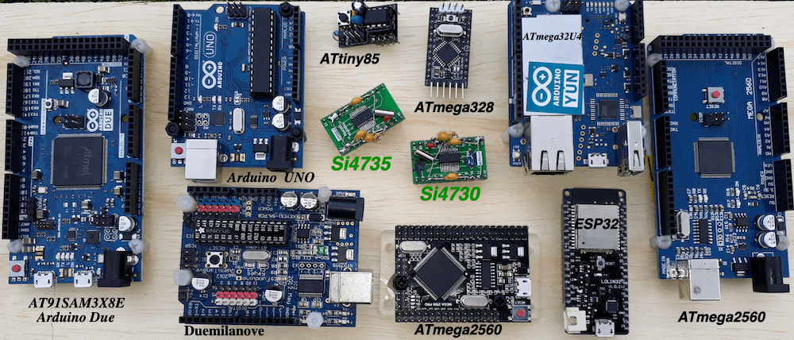  | This document is aimed at the Arduino developers, radio experimenters, hobbyists and anyone interested in building a receiver based on the Si473X IC family from Silicon Labs.  This project is about an Arduino library for the SI473X BROADCAST AM, SSB and FM/RDS RADIO RECEIVERS. Actually, AM and SSB modes from 150kHz to 30MHz; and FM mode from 64 to 108 MHz.


<BR>

This library is intended to provide an easier interface for controlling the SI47XX (including the boards ["PL102BA-S V:2.1 10628"](https://pu2clr.github.io/SI4735/extras/BOARD_PL102BA/) and ["NE928-10A V:01"](https://pu2clr.github.io/SI4735/extras/BOARD_NE928_10A_V_01/) based on SI4730) by using Arduino platform. [It also has support to the SSB mode on SI4735-D60 and SI4732-A10 devices](https://pu2clr.github.io/SI4735/#si4735-patch-support-for-single-side-band). __The communication protocol used by this library is the I²C__. 

This library was built based on ["AN332 Si47XX PROGRAMMING GUIDE REV 1.0"](https://web.engr.oregonstate.edu/~traylor/ece473/data_sheets/AN332.pdf) and __AN332 REV 0.8 UNIVERSAL PROGRAMMING GUIDE AMENDMENT FOR SI4735-D60/SI4732-A10 SSB AND NBFM PATCHES__. It also can be used on __all members of the SI473X family__ respecting, of course, the features available in each IC version. Please, follow the [contents below](https://pu2clr.github.io/SI4735/#contents) to get the most out of this document. 

This library can be freely distributed using the MIT Free Software model. 

[Copyright (c) 2019 Ricardo Lima Caratti](https://pu2clr.github.io/SI4735/#mit-license). 

Contact: __pu2clr@gmail.com__.

## Contents

1. [SI4735 Library construction history](https://pu2clr.github.io/SI4735/#si4735-library-construction-history)
2. [Thanks](https://pu2clr.github.io/SI4735/#thanks)
3. [Labrary Features](https://pu2clr.github.io/SI4735/#si4735-arduino-library-features)
4. [License Copyright](https://pu2clr.github.io/SI4735/#mit-license)
5. [Library Installation](https://pu2clr.github.io/SI4735/#library-installation)
6. [Other Arduino Libraries Developed by the Author](https://pu2clr.github.io/SI4735/#other-arduino-libraries-developed-by-the-author)
7. [Groups and Forums](https://pu2clr.github.io/SI4735/#groups-and-forums)
8. [Your support is important](https://pu2clr.github.io/SI4735/#your-support-is-important)
9. [About the SI4732 and SI4735](https://pu2clr.github.io/SI4735/#about-the-si4732-and-si4735)
10. [Terminology](https://github.com/pu2clr/SI4735#terminology)
11. [Documentation](https://pu2clr.github.io/SI4735/#documentation)
   * [API Documentation](https://pu2clr.github.io/SI4735/extras/apidoc/html/) 
   * [About Class, Methods(functions) and custom data type structures](https://pu2clr.github.io/SI4735/#defined-data-types-and-structures)
   * [PU2CLR SI4735 Arduino Library methods (functions)](https://pu2clr.github.io/SI4735/extras/apidoc/html/)
   * [RDS support](https://pu2clr.github.io/SI4735/#rds)
   * [SSB support](https://pu2clr.github.io/SI4735/#si4735-patch-support-for-single-side-band)
   * [EEPROM support](https://pu2clr.github.io/SI4735/#eeprom-support)
   * [Digital Audio Support](https://pu2clr.github.io/SI4735/#digital-audio-support)
   * [Using an external active crystal or signal generator with SI47XX](extras/schematic#si473x-and-external-active-crystal-oscillator-or-signal-generator)
   * [Customizing PU2CLR Arduino Library](https://pu2clr.github.io/SI4735/#customizing-pu2clr-arduino-library)
12. [Hardware Requirements and Setup](https://pu2clr.github.io/SI4735/#hardware-requirements-and-setup)
13. [__SCHEMATIC__](https://pu2clr.github.io/SI4735/#schematic)
   * [All schematics](https://pu2clr.github.io/SI4735/extras/schematic)
   * [Component Parts](https://pu2clr.github.io/SI4735/#parts)
   * [Tips to build](https://pu2clr.github.io/SI4735/#tips-to-build)
   * [Other schematics](https://pu2clr.github.io/SI4735/extras/schematic)
     * [Atmega328 based board and OLED](extras/schematic#atmega328-based-board-and-oled)
     * [ESP32 based board](extras/schematic#esp32-based-board)
     * [Standalone ATmega328 with or without external Crystal (SI4735-D60 and LCD 16x2)](extras/schematic#standalone-atmega328-with-or-without-external-crystal-si4735-d60-and-lcd-16x2)
     * [Arduino / ATmega328 with Nokia 5110](extras/schematic#arduino--atmega328-with-nokia-5110)
     * [Basic schematic with TFT](extras/schematic#basic-schematic-with-tft)
     * [Arduino DUE/MEGA and touch TFT display](extras/schematic#arduino-duemega-and-touch-tft-display)
     * [Attiny85 basic circuit](extras/schematic#attiny85-basic-circuit)
     * [Bluepill - STM32F103C8 basic schematic](extras/schematic#bluepill---stm32f103c8-basic-schematic)
     * [Android and iOS Remote Control for PU2CLR Arduino Library DSP receivers](extras/schematic#android-and-ios-remote-control-for-pu2clr-arduino-library-dsp-receivers)
     * [External Mute Circuit](extras/schematic#external-mute-circuit)
     * [SI473X and external active crystal oscillator or signal generator](extras/schematic#si473x-and-external-active-crystal-oscillator-or-signal-generator)
     * [Band Pass Filter controlled by Arduino](extras/schematic#band-pass-filter-controlled-by-arduino)
     * [Storing data into the internal EEPROM before shutdowning](extras/schematic#storing-data-into-the-internal-eeprom-before-shutdowning)
14. [Most Frequent Problems](https://pu2clr.github.io/SI4735/#most-frequent-problems)
15. [Boards where this library has been successfully tested](https://pu2clr.github.io/SI4735/#boards-where-this-library-has-been-successfully-tested)
16. [Photos (Tools and Accessories)](https://pu2clr.github.io/SI4735/#photos-tools-and-accessories)
17. [References](https://pu2clr.github.io/SI4735/#references)
18. [Examples](https://pu2clr.github.io/SI4735/examples)
    * [Using Arduino Serial Monitor](examples/SI47XX_01_SERIAL_MONITOR) 
    * [LCD20x4, Encoder and buttons](examples/SI47XX_02_LCD_20x4_I2C)
    * [OLED, Encoder and button](examples/SI47XX_03_OLED_I2C)
    * [TFT and touch screen](examples/SI47XX_04_TFT)
    * [ATTINY85](examples/SI47XX_05_ATTINY85)
    * [ESP32](examples/SI47XX_06_ESP32)
    * [ESP8266](examples/SI47XX_06_ESP8266)
    * [STM32](examples/SI47XX_07_STM32) 
    * [FM RDS/RBDS](examples/SI47XX_10_RDS)
    * [About the board based on SI4730-D60 labeled "PL102BA-S V:2.1 10628"](https://pu2clr.github.io/SI4735/extras/BOARD_PL102BA/)
    * [About the board based on Si4730 labeled "NE928-10A V:01"](https://pu2clr.github.io/SI4735/extras/BOARD_NE928_10A_V_01/)
    * [Mobile Device as Remote Control to the SI4735 prototype](https://github.com/pu2clr/bluetooth_remote_control)
    * [Auto Band Pass Filter examples](examples/SI47XX_99_AUTO_BANDPASS_FILTER)
    * [Famous sketches and kits from third parties based on this Library](examples/SI47XX_KITS)
    * [Tools](https://github.com/pu2clr/SI4735/tree/master/examples/TOOLS)
19. [Third Party Projects](https://pu2clr.github.io/SI4735/extras/Third_Party_Projects)
20. [Videos](https://pu2clr.github.io/SI4735/#videos) 
    * [Project examples made by the author](https://pu2clr.github.io/SI4735/#project-examples-made-by-the-author)
    * [Third-party projects using this library](https://pu2clr.github.io/SI4735/#third-party-projects-using-this-library)
21. [Commercial Receivers based on Si47XX Family](https://pu2clr.github.io/SI4735/#commercial-receivers-based-on-si47xx-family) 


## Attention
* __The SI473X device can work from 1.6V to 3.6V. If you are not using a 3.3V version of Arduino, you have to use a kind of 5V to 3.3V bidirectional converter. It is important to say that just power the Si47XX device with 3.3V from Arduino board is not enough. You have to be aware that the Arduino that operates with 5V will send 5V signals to the SI473X device through the digital pins and the I2C bus. That configuration can make the system unstable or damage the Si473X device__.  
* __This library has been successfully tested on many boards including:  ESP32; STM32; Mega 2560;  DUE; ATmega328 and Atmega32u4 based boards; ATtiny85, Raspberry Pi Pico (RP2040) and more__. See [Boards where this library has been successfully tested](https://pu2clr.github.io/SI4735/#boards-where-this-library-has-been-successfully-tested).  
* __The Si47XX IC family  functionalities__ can be seen in the comparison matrix shown in table 1 (__Product Family Function__); pages 2 and 3 of the [“Si47XX PROGRAMMING GUIDE; AN332 (REV 1.0)”](https://web.engr.oregonstate.edu/~traylor/ece473/data_sheets/AN332.pdf).


## SI4735 Library construction history

I started my work on building an Arduino library for SI375 in early November 2019. The initial idea was to build a receiver by using an Arduino board, few components and the SI4735 device from Silicon Labs. Checking some videos on Youtube, I realized that the receiver besed on Si4735-D60 could go far beyond the initial proposal, __including listening to amateur radio and citizens band stations on SSB mode__. Via forums and websites, I also realized that there was a great demand for experimenters who would like to see the SI4735 device working on SSB mode. So, instead of developing a simple receiver based on the SI4735, __I decided to develop a library for Arduino platform that would provide full support to the SI4735 and all SI473X device family as well__.

With this library, more than 60 examples were developed using various display types. [These examples can assist the experimenter in building their own receiver](https://github.com/pu2clr/SI4735/tree/master/examples).

Judging by the groups created around the SI47XX devices, I estimate that this library is currently being used by thousands of experimenters, applications and commercial receivers. If you are an experimenter or a radio enthusiast and want to try to build your own receiver based on the SI473X devices, then this library is for you.  

The following video is a little joke that shows the trajectory of the construction of this library. [__"PU2CLR SI4735 Arduino Library. IT IS OPEN SOURCE IT IS FREE. IT IS FOR YOU"__](https://www.youtube.com/embed/aB02Qry5-bU).



<BR> 

## Thanks

* Mrs. [Nancy Daniels Yoga](https://github.com/LadyRoninEngineer/Si473x) for sharing experiences and suggestions for noise reduction on the I2C bus and also for sharing the excellent board projects for the SI4732-A10 device;
* Mr. Tom Nardi for his great article ["Multi-Band Receiver On A Chip Controlled By Arduino"](https://hackaday.com/2020/03/02/multi-band-receiver-on-a-chip-controlled-by-arduino/) on Hackaday website;
* Mr. Gert Baak, [PE0MGB](https://www.qrz.com/db/PE0MGB), for library improvements suggestions and the Article [Arduino All band radio with SI4735 by Gert PE0MGB](https://www.pi4raz.nl/razzies/razzies202009.pdf);  
* Dr. George R Steber, [WB9LVI](https://www.qrz.com/db/WB9LVI) for his great article __NanoSSB RX - An Ultra Low Cost SSB Multiband Receiver__ on __ARRL QEX Magazine__ (November/December 2021);  
* Mr. Benjamin Neveu for his article __SSB Receiver Controlled by a Smartphone__ publised on __ARRL QEX Magazine__(September/October 2022);  
* Mr. Jim Reagan, [W0CHL](https://www.qrz.com/db/W0CHL), for contributions on circuit design and user interface;  
* [Mr. Vadim Afonkin](https://youtu.be/fgjPGnTAVgM) for making available the SSBRX patches for SI4735-D60 on his [Dropbox repository](https://www.dropbox.com/sh/xzofrl8rfaaqh59/AAA5au2_CVdi50NBtt0IivyIa?dl=0);
* Mr. Luiz Carlos, [PT2MC](https://www.qrz.com/db/PT2MC), for guiding me  about external mute circuit; 
* Mr. Thiago Lima for sharing his board project based on the ESP32 and SI4732-A10 devices;
* Mr. Francisco Scaramella  for the suggestions and contributions provided in the electronics field as well as for the testing of the functions implemented in this library;
* Mr. David Kellmer (USA) for suggesting corrections on the documentation and sketches; 
* WH2Q, Morikaku Gotoh, for his suggestion about Automatic Volume Control on AM mode; 
* Mr. Diego Stanfield for testing the SI4732-A10 with SSB;
* All members of the Facebook groups ["Si47XX for radio experimenters"](https://www.facebook.com/groups/532613604253401/) and ["Si47XX para radioescutas"](https://www.facebook.com/groups/1121785218031286/) for the  suggestions and corrections during the development of this project.
* Mr.  Toni for his post [SI4735 SI4732 all band radio receiver LW MW FM SW](https://xtronic.org/circuit/audio/si4735-si4732-all-band-radio-receiver-mw-fm-sw/)
* Mr. Scacchi Ugo for the post [HAM RADIO  -  ARDUINO SI4735 Based Radio](https://www.i2sdd.net/ARDUINO/SI4735/si4735.HTML)
* Mr. Miguel Angelo Bartié, PY2OHH, for the post [RECEIVER FM/MW/SW(AM SSB and CW) with SI4735 prototype](https://www.qsl.net/py2ohh/trx/si4735/SI4735.html)   
* Mr. Felix Angga for his great receiver based on SI4735 interface - [SlametRadio](https://github.com/felangga/slametradio) 
* Mr. DAVID W ZANTOW, [N9EWO](https://www.qrz.com/db/N9EWO), for his Reviews about [ATS-25 / ATS25 / LW / MW / SW / FM DSP Receiver](https://www.qsl.net/n9ewo/ats25.html)

<BR>

## Your support is important.

If you want to support this library development, consider joining this project via Github. Alternatively, make suggestions on new features and report errors if you find them. Thank you!


[Go to contents](https://pu2clr.github.io/SI4735/#contents)

## SI4735 Arduino Library Features

This library uses the I²C communication protocol and implements most of the functions offered by Si47XX (BROADCAST AM / FM / SW / LW RADIO RECEIVER) IC family from Silicon Labs. This library also has primitive functions that make it easier for you to implement commands that may not have been implemented yet. See [setProperty, getProperty sendCommand, getCommandResponse and getStatusResponse](https://pu2clr.github.io/SI4735/extras/apidoc/html/group__group10.html) functions and also [How to customize PU2CLR Arduino Library](https://pu2clr.github.io/SI4735/#customizing-pu2clr-arduino-library). It is worth noting, however, that this library is constantly improving. Check the API documentation before implementing a new function. It is likely that your demand is already implemented. [See the API documentation for this library](https://pu2clr.github.io/SI4735/extras/apidoc/html/). __The main features of this library are listed below__.


1. Open Source. It is free. You can use, copy, modify, merge, publish, distribute, sublicense, and/or sell copies of the Software. See [MIT License](https://pu2clr.github.io/SI4735/#mit-license) to know more.   
2. Built based on [AN332 SI47XX PROGRAMMING GUIDE (REV 1.0)](https://web.engr.oregonstate.edu/~traylor/ece473/data_sheets/AN332.pdf) and __AN332 REV 0.8 UNIVERSAL PROGRAMMING GUIDE AMENDMENT FOR SI4735-D60 SSB AND NBFM PATCHES__;
3. C++ Language and Object-oriented programming. You can easily extend the SI4735 class by adding more functionalities. See [Customizing PU2CLR Arduino Library](https://pu2clr.github.io/SI4735/#customizing-pu2clr-arduino-library); 
4. Available on Arduino IDE (via Manage Libraries). Easy to install and use. See [Library Installation](https://pu2clr.github.io/SI4735/#library-installation);
5. Cross-platform. You can compile and run this library on most of board available on Arduino IDE (Examples: ATtiny85, boards based on ATmega328 and ATmega-32u4, ATmega2560, ARM Cortex, STM32, Arduino DUE, ESP32 and more). See [Boards where this library has been successfully tested](https://pu2clr.github.io/SI4735/#boards-where-this-library-has-been-successfully-tested);
6. Simplifies projects based on SI4735;
7. __I²C communication protocol__ and Automatic I²C bus address detection; 
8. [More than __120__ functions implemented](https://pu2clr.github.io/SI4735/extras/apidoc/html/). You can customize almost every feature available on Si47XX family; 
9. [More than 60 examples to guide the user](https://github.com/pu2clr/SI4735/tree/master/examples);
10. [RDS support](https://pu2clr.github.io/SI4735/#rds);
11. [SSB (Single Side Band) patch support](https://pu2clr.github.io/SI4735/#si4735-patch-support-for-single-side-band);
12. Clock reference selection (crystal or external clock reference);
13. FM Receive de-emphasis to 50 or 75 μs selection, AGC, AVC and filter controls, and more... 

[Go to contents](https://pu2clr.github.io/SI4735/#contents)

<BR>

## Groups and Forums 

There is a __Facebook__ group called [__Si47XX for Radio Experimenters__](https://www.facebook.com/groups/532613604253401/) where the purpose is exchanging experiences with projects based on Silicon Labs  SI47XX IC family. You will be welcome to the group [Si47XX for Radio Experimenters](https://www.facebook.com/groups/532613604253401/).

You can also be a member of __group.io__ [SI47XX for hobbyists](https://groups.io/g/si47xx)



[Follow a project using this library on hackaday.io](https://hackaday.io/project/170145-si4735-ssb-receiver-controlled-by-arduino)

## MIT License 

Copyright (c) 2019 Ricardo Lima Caratti

Permission is hereby granted, free of charge, to any person obtaining a copy of this software and associated documentation files (the "Software"), to deal in the Software without restriction, including without limitation the rights to use, copy, modify, merge, publish, distribute, sublicense, and/or sell copies of the Software, and to permit persons to whom the Software is furnished to do so, subject to the following conditions:

The above copyright notice and this permission notice shall be included in all copies or substantial portions of the Software.

THE SOFTWARE IS PROVIDED "AS IS", WITHOUT WARRANTY OF ANY KIND, EXPRESS OR IMPLIED, INCLUDING BUT NOT LIMITED TO THE ARRANTIES OF MERCHANTABILITY, FITNESS FOR A PARTICULAR PURPOSE AND NONINFRINGEMENT. IN NO EVENT SHALL THE AUTHORS OR COPYRIGHT HOLDERS BE LIABLE FOR ANY CLAIM, DAMAGES OR OTHER LIABILITY, WHETHER IN AN ACTION OF CONTRACT, TORT OR OTHERWISE, ARISING FROM, OUT OF OR IN CONNECTION WITH THE SOFTWARE OR THE USE OR OTHER DEALINGS IN THE SOFTWARE.

<BR>

[Go to contents](https://pu2clr.github.io/SI4735/#contents)

<BR>

## Library Installation

You can install this library on your Arduino environment using different methods. The best ways to do that are described below.  


### Installing via Arduino IDE

This is the easiest method to install this library.

#### The image below shows the Arduino IDE Manage Libraries interface.

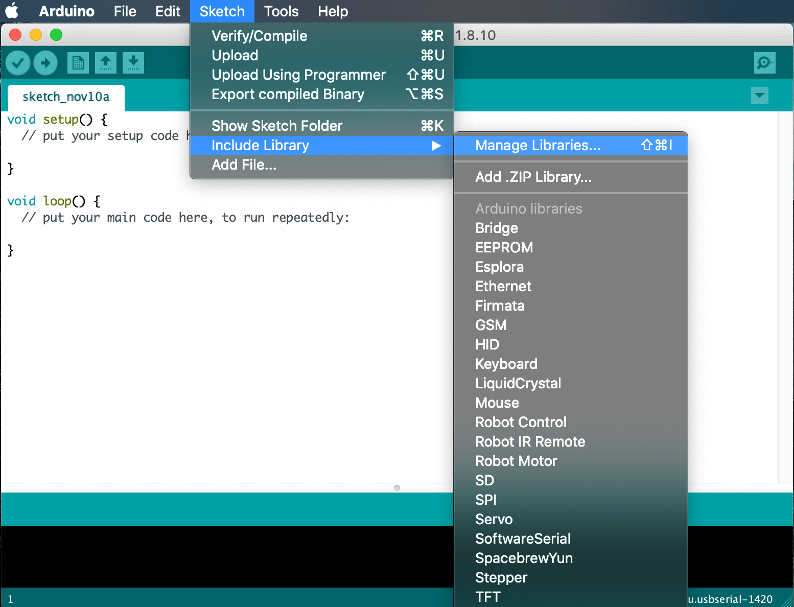


#### The image below shows the PU2CLR Si4735 Library finding process.

<BR>

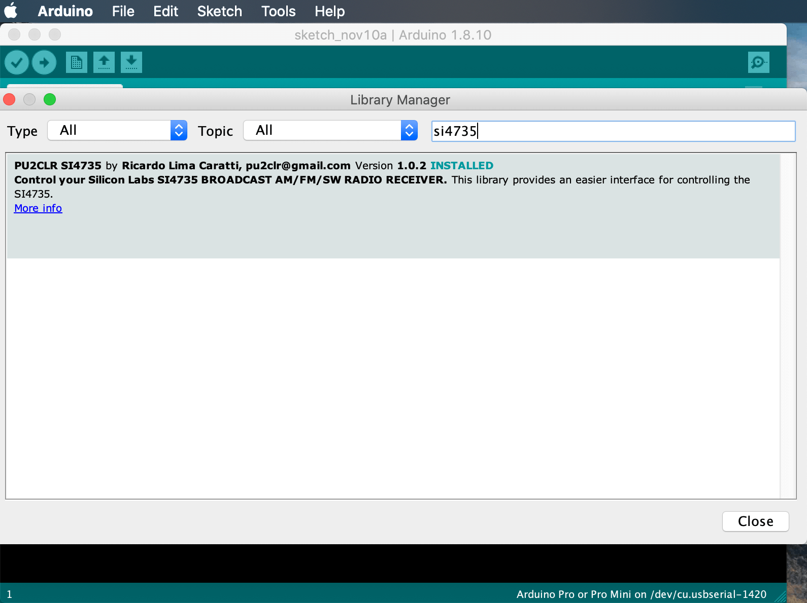

<BR>

#### The video below shows how to install the PU2CLR Arduino Library on your Arduino IDE. 



### Installing via this repository 

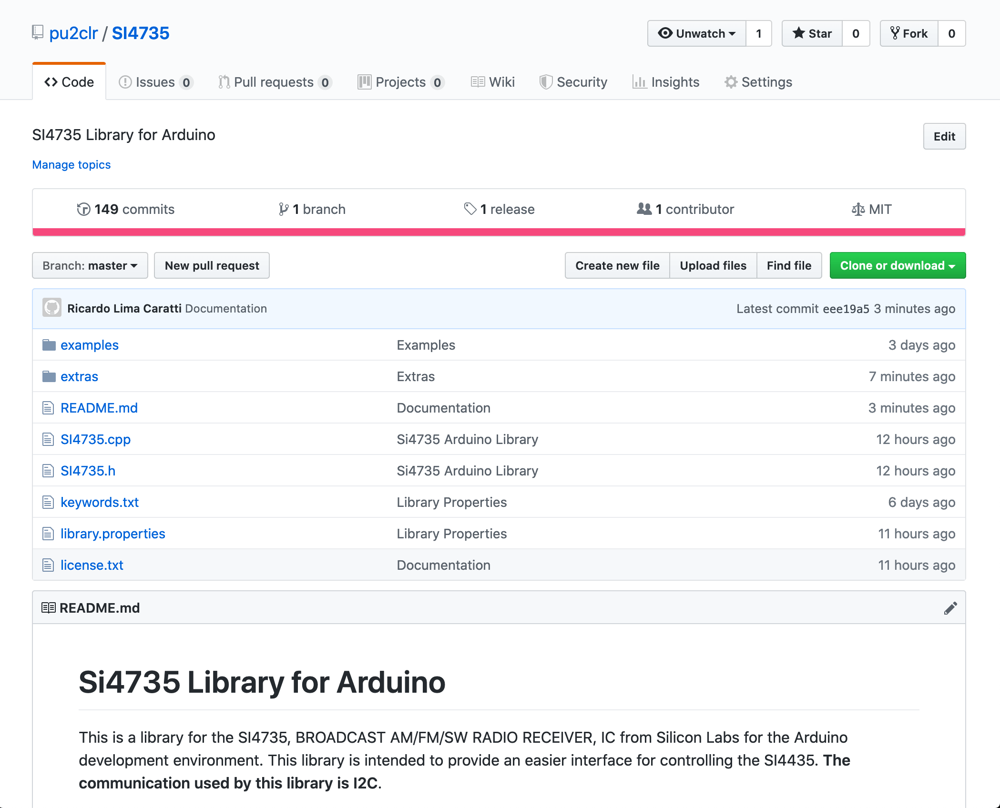

<BR>

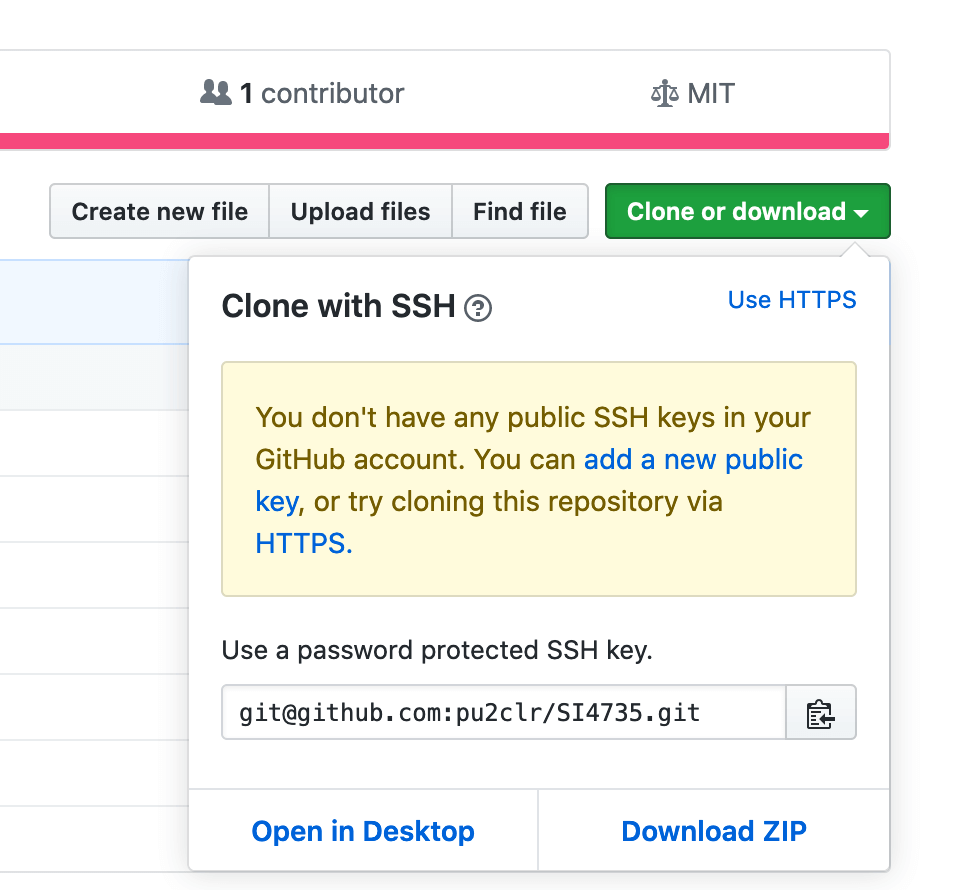

First, you have to [download](https://github.com/pu2clr/SI4735/archive/master.zip) this library in zip format. 
After, unzip the SI4735-master.zip file in your Arduino Library folder. 

* On __Windows__: "My Documents\Arduino\libraries"
* On __MAC OS__: ˜/Documents/Arduino/libraries
* On __Linux__: ˜/Documents/Arduino/libraries

With that approach, you will have the __most current version__ of the library. However, __it may not be the most stable version__. This is because the current version is always in development. [Prefer releases](https://github.com/pu2clr/SI4735/releases).
Do you need some old version (release) of this library?  If so, [check here](https://github.com/pu2clr/SI4735/releases). 


[Go to contents](https://pu2clr.github.io/SI4735/#contents)

<BR>


## About the SI4732 and SI4735  

The SI4732-A10 and SI4735-D60 are DSP receivers IC from Silcon Labs. They have great performance on AM, SSB (LW/MW/SW) from 150kHz to 30MHz and  FM (VHF) from 64 to 108 MHz. __It is important to note that the engineers and programmers at Silicon Labs did an excellent job by implementing all the internal resources in this IC family. This library implements just the interface  that allows you to use the SI473X resources with  Arduino based board controller__. 
The SI473X can be programmed by sending commands and getting responses. You can control it via a microcontroller like Arduino using  I²C  communication protocol. To make the SI473X perform an action, the microcontroller has to send a set of bytes (command and arguments) that the device interprets and executes the given command. The  image below illustrates the interaction between the MCU and the SI473X device. 

<BR>

### Interaction between Arduino based board and SI473X devices via  I²C  interface

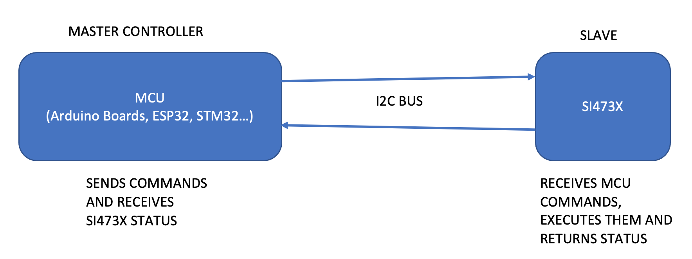


<BR>

### Functional Block Diagram

The image below shows the SI473X-D60 block diagram. It was extracted from Silicon Labs Si4730/31/34/35-D60 / BROADCAST AM/FM/SW/LW RADIO RECEIVER (page 21). __Note that the author of this Library highlights in red the pin operating voltages that can be connected to the Arduino__. Be aware of the operating voltage of the Arduino pins you will use in your project. Preferably use an Arduino with 3.3V operating voltage. If you are not using a 3.3V version of Arduino, you must use a kind of 5V to 3.3V converter on RST, SCLK, SDIO and SEN (depending on your project). 


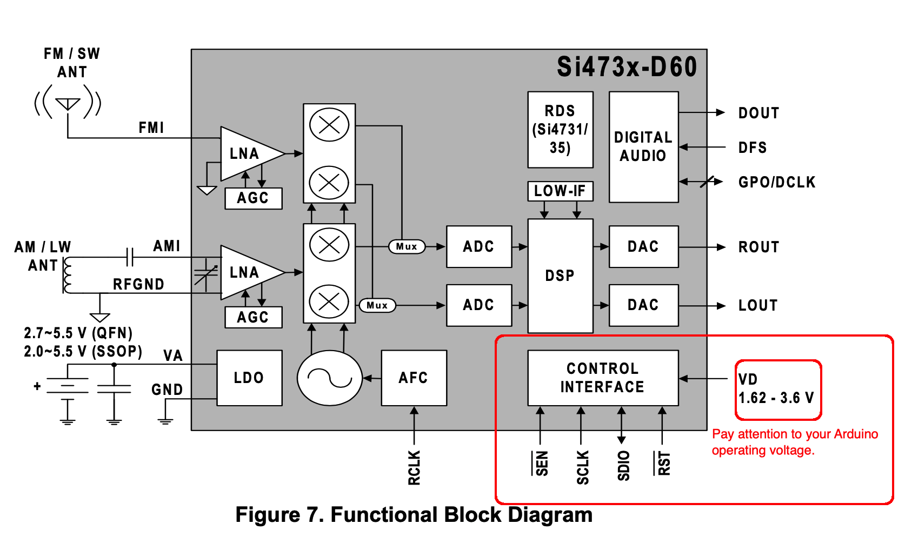


According to the Si47XX PROGRAMMING GUIDE/AN332, the Si4732-A10 has the same firmware FMRX component and AM_SW_LW RX component as that of Si4735-D60. It is considered as the most recent revision as D60. So, __all descriptions related to the SI4735-D60 also apply to Si4732-A10__. __Including SSB patch support__. See the Si4732-A10 block diagram below.  


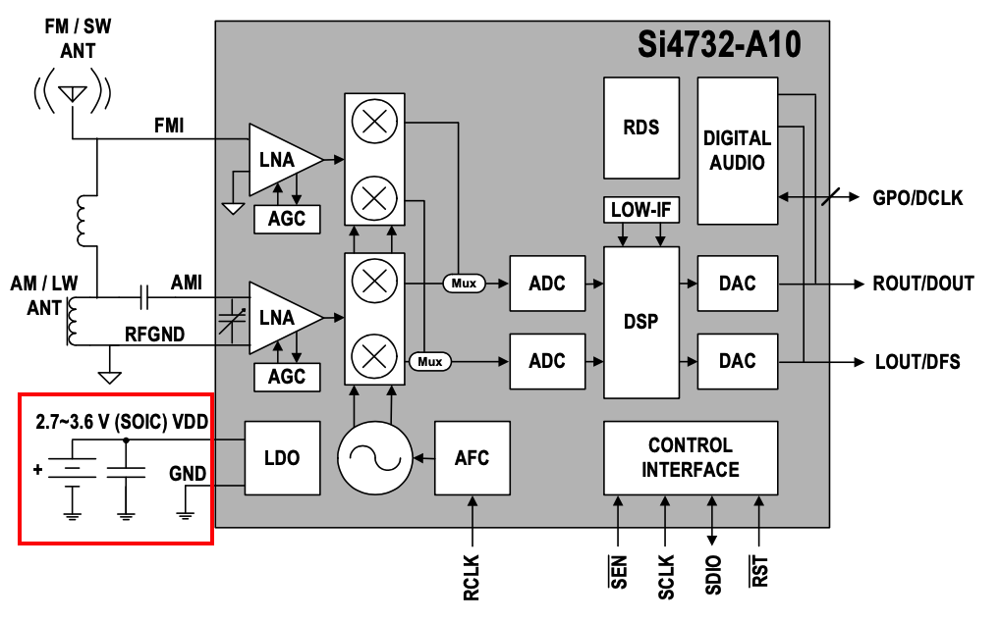


#### SI4735-D60 and SI4732-A10 I²C bus address 

While the Si4735-D60 provides the 0x11 I²C bus address when the SEN pin is connected to the ground and the SI4732-A10 provides the same address when the SEN pin is connected to the +VCC.  Also, this library provides the function __getDeviceI2CAddress__ to detect the I²C bus address automatically. This way, you don't need to worry about this setup if you use this function. See [getDeviceI2CAddress()](https://pu2clr.github.io/SI4735/extras/apidoc/html/group__group05.html#ga668008457910e916ebadf15bda2e5b29).


<BR>

### The main Si4735-D60 and Si4732-A10 features

* FM (VHF) support (64–108 MHz)
* AM (MW) band support (520–1710 kHz)
* SW band support (2.3–26.1 MHz)
* LW band support (153–279 kHz)
* Allows firmware upgrade. Including the possibility of adjustments to demodulate SSB.
* Advanced AM/FM seek tuning
* Automatic frequency control (AFC)
* Automatic gain control (AGC)
* Digital FM stereo decoder
* AM/FM/SW/LW digital tuning
* SSB patch support
* RDS/RBDS processor
* Digital audio out (__Attention__: Crystal and digital audio mode cannot be used at the same time)
* I²C and SPI interface 
* Great Programming Guide and additional documentation to deal with the device

[Go to contents](https://pu2clr.github.io/SI4735/#contents)

<BR>

## Terminology

| Term | Description |
| ---- | ----- |
| API  | Application Programming Interface (API). In this context, it is an interface that you can use to simplify the implementation and maintenance of your software (Arduino sketch). All API documentation about this library can be found on [https://pu2clr.github.io/SI4735/extras/apidoc/html/index.html](https://pu2clr.github.io/SI4735/extras/apidoc/html/index.html). | 
| Arduino Libraries|Libraries are files written in C or C++ (.c, .cpp) which provide your sketches with extra functionality. The SI4735 Library provides extra functionalities to make easier the Arduino deal with Si473X devices| 
| BPF  | Band Pass Filter |
| DFS  | I²S - digital frame synchronization input |
| DIN  | I²S - digital data input |
| DCLK | I²S - digital bit synchronization input clock |
| ESD  | Electrostatic discharge. Device used to protect the receiver from static electricity discharge |
| IDE  | Integrated Development Environment|    
| I²C  | [I²C - Inter-Integrated Circuit](https://pt.wikipedia.org/wiki/I²C)|  
| I²S  | Serial bus interface used for connecting digital audio devices 
| Sketch |Name that Arduino environment uses for a program|
| Interrupt |In this context, it is a Arduino Resource. Allows important tasks to be performed regardless of the flow of your program|
| C++ | A object-oriented programming (OOP) language. It is a superset of the C language with an additional concept of "classes." |
| programming guide | In this context it refers to [Si47XX PROGRAMMING GUIDE (REV 1.0)](https://web.engr.oregonstate.edu/~traylor/ece473/data_sheets/AN332.pdf)|
| LNA | Low Noise Amplifier |
| POC | Proof of Concept|
| SEN | Serial enable pin, active low; used as device select in 3-wire and SPI operation and address selection in 2-wire operation| 
| CTS | Clear to send |
| STC | Seek/Tune Complete |
| RESP | Response byte (n = 1 to 15) |
| RESPONSEn | Response register (16-bit) in 3-Wire mode (n = 1 to 8)| 
| RST  | Also RSTb—Reset pin, active low |
| RCLK | External reference clock |
| SSB | [Single Side Band](https://en.wikipedia.org/wiki/Single-sideband_modulation) | 
| Attack | attack-time delay -  the time needed for a receiver to respond to an incoming signal |
| SDIO | Serial data in/data out pin|
| SCLK | Serial clock pin |
| Soft Mute | Resource used to attenuate the audiooutputs and minimize audible noise in very weak signalconditions | 
| Firmware Upgrades | The Si4732-A10 and SI4735-D60 contain on-chip program  RAM to accommodate minor changes to the firmware | 

[Go to contents](https://pu2clr.github.io/SI4735/#contents)

<BR>

## Documentation 




This library has tow documentation sources: 

* [SI4735 Arduino Library documentation generated by Doxygen (updated)](https://pu2clr.github.io/SI4735/extras/apidoc/html/)
* [Legacy documentation (not updated frequently)](https://github.com/pu2clr/SI4735/wiki) 

[Doxygen](http://www.doxygen.nl/index.html) is a tools that can generate documentation from source code. This tools help the development team to keep the documentation updated. 

If you prefer, you can also read the documentation directly from the [SI4735.cpp](https://pu2clr.github.io/SI4735/SI4735.cpp) and [SI4735.h](https://pu2clr.github.io/SI4735/SI4735.h). These files are also well documented. 

### Main functions 

This library has more than 120 functions. The table below shows the mains functions used in a regular receiver. Full details on the functions shown below can be read on [https://pu2clr.github.io/SI4735/extras/apidoc/html/](https://pu2clr.github.io/SI4735/extras/apidoc/html/).

| Method / Function               | Description |
| ------------------                | ----------- | 
| setup                             | Use this function to start the device up with the parameters shown below. |
| getStatus                         | Used to get the current status of the Si4735. |
| getCurrentRSSI                    | Get the current receive signal strength (0–127 dBμV). |
| getCurrentSNR                     | Gets the current SNR metric (0–127 dB). |
| getFrequency                      | Gets the current frequency of the Si4735. |
| frequencyUp                       | Increments the current frequency on current band/function by using the current step. |
| frequencyDown                     | Decrements the current frequency on current band/function by using the current step. |
| setFrequencyStep                  | Sets the current step value. |
| setVolume                         | Sets volume level (0 to 63). |
| setFM                             | Sets the radio to FM function. |
| isCurrentTuneFM                   | Returns true if the current function is FM (FM_TUNE_FREQ). |  
| getCurrentPilot                   | Checks the current pilot. Indicates stereo pilot presence. | 
| setAM                             | Sets the radio to AM function. It means: LW MW and SW. |
| setAmSoftMuteMaxAttenuation       | Sets the Am Soft Mute Max Attenuation. |
| setAutomaticGainControl           | Automatic Gain Control setup. |
| getAutomaticGainControl           | Queries Automatic Gain Control STATUS. |
| setBandwidth                      | Selects the bandwidth of the channel filter for AM reception. |
| isAgcEnabled                      | Checks if the AGC is enabled (returns true if enabled). |
| setRdsConfig                      | Sets RDS property. |
| getRdsStatus                      | Gets the RDS status. Store the status in currentRdsStatus member. COMMAND FM_RDS_STATUS. |
| getRdsReceived                    | Get the Rds Received FIFO. |
| getRdsSync                        | Get the Rds Sync. Returns true if RDS currently synchronized. |
| getRdsSyncFound                   | Get the Rds Sync Found. Returns true if found RDS synchronization. |
| getRdsText2A                      | Gets the Text processed for the 2A group. |
| getRdsText2B                      | Gets the Text processed for the 2B group. |
| getRdsText0A                      | Gets the station name and other messages. |
| getRdsTime                        | Gets the RDS time and date when the Group type is 4. | 
| reset                             | Reset the SI473X.  |
| queryLibraryId                    | Queries the library information of the Si47XX device. | 
| patchPowerUp                      | This method can be used to prepare the device to apply SSBRX patch. |
| downloadPatch                     | Transfers the content of a SSB patch stored in a array of bytes to the SI4735 device. |
| downloadPatchFromEeprom           | Transfers the content of a SSB patch stored in an eeprom to the SI4735 device. |
| setSSBConfig                      | Sets the SSB receiver mode. |
| setSSB                            | Tunes the SSB (LSB or USB) receiver to a frequency between 520 and 30 MHz in 1 kHz steps.|
| setSSBAutomaticVolumeControl      | Sets SSB Automatic Volume Control (AVC) for SSB mode. |
| setSSBBfo                         | Sets the SSB Beat Frequency Offset (BFO). |
| setSSBAudioBandwidth              | SSB Audio Bandwidth for SSB mode. |
| setSBBSidebandCutoffFilter        | Sets SBB Sideband Cutoff Filter for band pass and low pass filters. |
| setTuneFrequencyAntennaCapacitor  | Only FM. Freeze Metrics During Alternate Frequency Jump. |
| setI2CFastModeCustom              | Sets the I²C bus to a given value. |
| setI2CStandardMode                | Sets I²C bus to 100kHz. |
| setAudioMuteMcuPin                | This function sets the mcu digital pin you want to use to control the external audio mute circuit. | 

[Go to contents](https://pu2clr.github.io/SI4735/#contents)


### Defined Data Types and Structures

The Si47XX family works with many internal data that can be represented by data structure or defined data type in C/C++. These C/C++ resources have been used widely here. This approach made the library easier to build and maintain. Each data structure created here has its reference (name of the document and page on which it was based). In other words, to make the SI47XX device easier to deal with, some defined data types were created to handle  byte and bits to process  commands, properties and responses. __The goal of this approach is separating data from code__. 

All data types defined in Si4735 Arduino Library are explained [here](https://pu2clr.github.io/SI4735/extras/apidoc/html/)

### Public methods 

This library was developed using the C++ language and the Object-oriented Programming approach. Methods are functions that belong to the class, in this case SI4735 class. Click [here](https://pu2clr.github.io/SI4735/extras/apidoc/html/group__group01.html) to go to API docummentation.

All methods defined in Si4735 class are explained [here](https://pu2clr.github.io/SI4735/extras/apidoc/html/). The list below refer to the method groups implemented by the Si4735 class.   


#### Si47XX device setup and startup

Methods of this group are useful to configure the way that the Si47XX devices have to be initiate. 


#### Firmware Information

Allows to query the part number, chip revision, firmware revision, patch revision and component revision numbers.

#### Current Status 

The Si4735 class has a set of methods to query the current frequency, RSSI, SNR, multipath, and the antenna tuning capacitance value (0-191).

#### Current AGC Status

Methods to query AGC status.  Returns whether the AGC is enabled or disabled and it returns the gain index. 


#### Si4735 filters configuration

The SI4735 class has a set of methods to setup filters on AM and SSB mode.

#### Audio 

Methods to setup the audio mode (Digital or Analog), volume, mute etc. 

### RDS

This library implements some RDS features of the SI4735. All function to deal with RDS are documented [here](https://pu2clr.github.io/SI4735/extras/apidoc/html/group__group16.html). Below you have some videos showing the RDS functionalities implemented by the PU2CLR Si4735 Arduino Library.




 


See [RDS example implementations for more details](https://github.com/pu2clr/SI4735/tree/master/examples/SI47XX_10_RDS).


### SI4735 Patch Support for Single Side Band

The SI4735 class implements a set of methods to apply patches and deal with SSB mode. All API documentation about pathces can be seen [here](https://pu2clr.github.io/SI4735/extras/apidoc/html/group__group17.html).

The SSB patches used in some examples of this library were tested only on SI4735-D60 and SI4732-A10 devices.  __The updates used in that examples are unlikely to work on other SI47XX devices__.

__First of all, it is important to say that the SSB patch content is not part of this library__. The patches used with test purpose here were made available by Mr. [Vadim Afonkin](https://youtu.be/fgjPGnTAVgM) on his [Dropbox repository](https://www.dropbox.com/sh/xzofrl8rfaaqh59/AAA5au2_CVdi50NBtt0IivyIa?dl=0). Also, on Silcon Labs website, [support and community](https://www.silabs.com/community/audio-radio/forum.topic.20.10.html/ssb_and_or_ask_fskn-nJpo), there is a topic called "__SSB and/or ASK/FSK/nPSK demodulation on Si radio chips__". If you follow that topic, you will see a post from a member called "__DASM__" making available a [link to a patch](https://www.silabs.com/content/usergenerated/asi/cloud/attachments/siliconlabs/en/community/groups/audio-radio/forum/jcr:content/content/primary/qna/ssb_and_or_ask_fskn-nJpo/lookattachment_p216-Fwrr/si4735_patch.txt) for the SI4735-D60 and SI4732-A10. The structure of this file is a bit different if compared with Vadim's files __amrx_6_0_1_ssbrx_patch_full_0x9D29.csg__ and __amrx_6_0_1_ssbrx_patch_init_0xA902.csg__. However, they have the same idea and can be easily adjusted for patching. If you have some experience with C, all you have to do is following the recommendations of the SI47XX PROGRAMMING GUIDE AN332; page 219.

IT IS IMPORTANT TO NOTE THAT THE AUTHOR OF THIS LIBRARY DOES NOT ENCOURAGE ANYONE TO USE THE SSB PATCHES CONTENT FOR COMMERCIAL PURPOSES. __IN OTHER WORDS, THIS LIBRARY ONLY SUPPORTS SSB PATCHES, THE PATCHES THEMSELVES ARE NOT PART OF THIS LIBRARY__.

#### What does SSB patch means?

In this context, a patch is a piece of software used to change the behavior of the SI4735-D60 and SI4732-A10 device.

There is little information available about patching the SI4735-D60 and SI4732-A10. The following information is the understanding of the author of this project and it is not necessarily correct.

A patch is executed internally (run by internal MCU) of the device. Usually, patches are  used to fixes bugs or add improvements and new features of the firmware installed in the internal ROM of the device. Patches to the SI473X are distributed in binary form and have to be transferred to the internal RAM of the device by the host MCU (in this case Arduino boards). Since the RAM is volatile memory, the patch stored into the device gets lost when you turn the system off. Consequently, the content of the patch has to be transferred again to the device each time after turn the system on or reset the device.

I would like to thank [Mr Vadim Afonkin](https://youtu.be/fgjPGnTAVgM) for making available the SSBRX patches for
SI4735-D60 on his [Dropbox repository](https://www.dropbox.com/sh/xzofrl8rfaaqh59/AAA5au2_CVdi50NBtt0IivyIa?dl=0). On this repository you have two files, __amrx_6_0_1_ssbrx_patch_full_0x9D29.csg__ and __amrx_6_0_1_ssbrx_patch_init_0xA902.csg__.  It is important to know that the patch content of the original files is constant hexadecimal representation used by the language C/C++. Actally, the original files are in ASCII format (not in binary format).  If you are not using C/C++ or if you want to load the files directly to the SI4735-D60 or SI4732-A10, you must convert the values to numeric value of the hexadecimal constants. 

##### For example: 

| Hexadecimal C/C++ constant | Binary representation | Decimal representation | 
| -------------------------- | --------------------- | ---------------------- | 
| 0x15                       | 00010101              |  21                    |
| 0x01                       | 00000001              |   1                    |
| 0xFF                       | 11111111              | 255                    |


__ATTENTION__:
The author of this project does not guarantee that procedures shown here will work in your development environment. Given this, it is at your own risk to continue with the procedures suggested here. __This library works with the I²C communication protocol and it is designed to apply a SSB extension PATCH to CI SI4735-D60 or SI4732-A10__. Once again, the author disclaims any liability for any damage this procedure may cause to your SI4735 or other devices that you are using.

All methods/functions to deal with SSB on Si4735-D60 can be seen [here](https://pu2clr.github.io/SI4735/extras/apidoc/html/group__group17.html).

This library implements many SSB examples. See the table below. 

| SSB sketch | SSB sketch | SSB sketch |
| ------ | ------ | ------ |
| [SI4735_03_POC_SSB ](https://github.com/pu2clr/SI4735/tree/master/examples/SI47XX_01_SERIAL_MONITOR/SI4735_03_POC_SSB)| [SI473X_04_ALL_IN_ONE](https://github.com/pu2clr/SI4735/tree/master/examples/SI47XX_02_LCD_20x4_I2C/SI473X_04_ALL_IN_ONE) | [SI4735_02_ALL_IN_ONE_OLED](https://github.com/pu2clr/SI4735/tree/master/examples/SI47XX_03_OLED_I2C/SI4735_02_ALL_IN_ONE_OLED) |
| [SI47XX_01_TFT_ILI9225 - TFT](https://github.com/pu2clr/SI4735/tree/master/examples/SI47XX_04_TFT/SI47XX_01_TFT_ILI9225)| [SI47XX_02_TFT_TOUCH_SHIELD - Touch Screen](https://github.com/pu2clr/SI4735/tree/master/examples/SI47XX_04_TFT/SI47XX_02_TFT_TOUCH_SHIELD) | [SI47XX_02_ESP32_TOUCH_ALL_IN_ONE](https://github.com/pu2clr/SI4735/tree/master/examples/SI47XX_06_ESP32/SI47XX_02_ESP32_TOUCH_ALL_IN_ONE) |
| [SI4735_02_POC_SSB.ino](https://github.com/pu2clr/SI4735/tree/master/examples/SI47XX_07_STM32/SI4735_02_POC_SSB) | [SI47XX_03_RDS_TFT_ILI9225](https://github.com/pu2clr/SI4735/tree/master/examples/SI47XX_10_RDS/SI47XX_03_RDS_TFT_ILI9225) | [ 	SI47XX_02_RDS_TFT_TOUCH_SHIELD](https://github.com/pu2clr/SI4735/tree/master/examples/SI47XX_10_RDS/SI47XX_02_RDS_TFT_TOUCH_SHIELD) |
| [SI4735_04_RDS_ALL_IN_ONE_OLED](https://github.com/pu2clr/SI4735/tree/master/examples/SI47XX_10_RDS/SI4735_04_RDS_ALL_IN_ONE_OLED) |  |  | 



See SSB example implementations [here](https://github.com/pu2clr/SI4735/tree/master/examples).

[Go to contents](https://pu2clr.github.io/SI4735/#contents)

<BR>

### EEPROM support

Depending on your MCU memory size, to use SSB mode may not be possible due to the large amount of memory required by the patch. To solve this problem this library implemented the function __downloadPatchFromEeprom__. This function reads the patch content from an external EEPROM and transfer it to the SI4732-A10 or SI4735-D60 devices. To run this function you must have a external I2C EEPROM device well configured with your MCU and the Si4732/35 device on I²C bus. Also, the EEPROM must have the patch content generated by the sketch  SI47XX_09_SAVE_SSB_PATCH_EEPROM stored in it. [See folder TOOLS](https://github.com/pu2clr/SI4735/tree/master/examples/TOOLS/SI47XX_09_SAVE_SSB_PATCH_EEPROM).

The example [SI4735_06_SSB_EEPROM](https://github.com/pu2clr/SI4735/tree/master/examples/SI47XX_01_SERIAL_MONITOR/SI4735_06_SSB_EEPROM) shows this functionality on an Arduino Pro Mini. 

The example [SI47XX_03_SSB_Tiny4kOLED](https://github.com/pu2clr/SI4735/tree/master/examples/SI47XX_05_ATTINY85/SI47XX_03_SSB_Tiny4kOLED) implements this functionality on an ATtiny85.

To store the SSB patch content into an EEPROM, [See sketch SI47XX_09_SAVE_SSB_PATCH_EEPROM](https://github.com/pu2clr/SI4735/tree/master/examples/TOOLS/SI47XX_09_SAVE_SSB_PATCH_EEPROM). 

__Attention__: The full ssb patch needs about 16KB on eeprom.  __All data that you have stored before into your eeprom device will be lost after the execution of the sketch SI47XX_09_SAVE_SSB_PATCH_EEPROM__.  

__The EEPROM device used for testing was the AT24C256 Serial I²C Interface__

[Watch the video: ATtiny85 working with SI4735-D60 and SSB](https://www.youtube.com/watch?v=Dnk5tp0o880) 

 


<BR>
<BR>

#### SAVING RECEIVER STATUS INTO THE INTERNAL EEPROM


You can store useful receiver data into the internal Arduino EEPROM. Currente band information, Bandthwith, step, mode, audio volume and filter are examples of data that can be stored into the internal EEPROM and restored when you turn the receiver on again. See the section [Storing data into the internal EEPROM before shutdowning](extras/schematic#storing-data-into-the-internal-eeprom-before-shutdowning) for details. 


<BR>


### Digital Audio support 

First of all, it is important to say that passive Crystal and digital audio mode cannot be used at the same time on SI47XX devices. The document Si47XX ANTENNA, SCHEMATIC, LAYOUT, AND DESIGN GUIDELINES; AN383; rev 0.8; page 6; you will find the following note: "Crystal and digital audio mode cannot be used at the same time".  So, for Digital Audio, you have to remove the crystal, and capacitors connected to the crystal from the circuit. 

This library supports the external clock reference and has implemented the digital audio functions. 
You can configure digital audio and external clock reference by using the functions: __setup, radioPowerUp, digitalOutputFormat, digitalOutputSampleRate, setRefClock and setRefClockPrescaler__. 

See the [API Documentation](https://pu2clr.github.io/SI4735/extras/apidoc/html/) for more details. 

<BR>

### Customizing PU2CLR Arduino Library

Maybe you need some Si47XX device functions that the __PU2CLR SI4735 Arduino Library__ has not implemented so far. Also, you may want to change some existent function behaviors. This topic describes some approaches to add new SI473X features to your application.


__Please, check the [API documentation](https://pu2clr.github.io/SI4735/extras/apidoc/html/) before implementing something you think is new. It is possible that what you want has already been implemented__. 

####  Primitive Functions
This library has primitive functions that make it easier for you to implement commands that may not have been implemented yet. The methods [setProperty, getProperty sendCommand, getCommandResponse and getStatusResponse](https://pu2clr.github.io/SI4735/extras/apidoc/html/group__group10.html) can be used to setup the SI473X devices directely. They can also be useful to check some features of the SI473X devices. To use those methods you have to be guided by the ["AN332 Si47XX PROGRAMMING GUIDE REV 1.0"](https://web.engr.oregonstate.edu/~traylor/ece473/data_sheets/AN332.pdf) and __AN332 REV 0.8 UNIVERSAL PROGRAMMING GUIDE AMENDMENT FOR SI4735-D60 SSB AND NBFM PATCHES__ Silicon Labs documentation.  If you are familiar with bit operators in C / C ++, you will have no problem in using the above functions. 

The example below configures the GPIO by sending the 0x81 (GPIO_SET) command(AN332 Si47XX Programming guide page 195). 

```cpp

SI4735 rx;
uint8_t args[] = {0b00001010} // will set the GPIO 1 and 3 to high
uint8_t response[0]

.
.
.

rx.sendCommand(0x81,1,args);
.
.
rx.getCommandResponse(1,response);
.
.
.

```

#### Extending the SI4735 class

The best way to customize the PU2CLR SI4735 Arduino Library for your needs is extending the current version of the library by using C++ OOP approaching.  For example: 

```cpp
#include <SI4735.h>
class MyCustomSI4735 : public SI4735 { // extending the original class SI4735
  public:
    // New functions / methods
    int methodA() {    // some SI47XX command that PU2CLR SI4735 Arduino Library does not implement
      return 0;
    }

    int methodB() {    // another SI47XX command that PU2CLR SI4735 Arduino Library does not implement
      return 1;
    }

    // Overwriting existent methods
    void setTuneFrequencyAntennaCapacitor(uint16_t capacitor) { 
      // Here, your setTuneFrequencyAntennaCapacitor code that will replace the original code 
      // Tip: currentFrequencyParams is a protected member of SI4735 class and can be referred in your code
      currentFrequencyParams.arg.ANTCAPH = 0;         // it is just an example 
      currentFrequencyParams.arg.ANTCAPL = capacitor; // it is just an example 
      return;
    }

    void reset() {
      /// your reset code that will replace the original reset code 
      pinMode(resetPin, OUTPUT);
      delay(1);
      digitalWrite(resetPin, LOW);
      delay(50);
      digitalWrite(resetPin, HIGH);
    }
};

MyCustomSI4735 radio; // the instance of your custom class based on SI4735 class

void setup()
{
  Serial.begin(9600);
  while (!Serial);
  Serial.println("Customizing Si4735 class example.");
  radio.setup(12, 0); // Arduino pin 12 as reset and FM mode (0)
  radio.setFM(8400, 10800, 10390, 10); 
  // Setting the tune capacitor with your code instead Si4735 library code.
  radio.setTuneFrequencyAntennaCapacitor(100);
  // Calling new functions implemented by you.
  Serial.println(radio.methodA());
  Serial.println(radio.methodB());
}

void loop() {
  // Your code with your custom SI4734 library.
}
```

If you use that approach, all you have to do is download the current version of PU2CLR SI4735 Arduino Library. Instead of using PU2CLR SI4735 Arduino Library class directly, you can use your own class that extends the original class.  This way, you always have the current version of the library customized for your needs. So, no extra work will be needed when you update the PU2CLR SI4735 Arduino Library. In other words, your custom code will be always synchronized with the PU2CLR SI4735 Arduino Library code.


__Please, check the [API documentation](https://pu2clr.github.io/SI4735/extras/apidoc/html/) before implementing something you think is new. It is possible that what you want has already been implemented__. 

See also:
* [How to use C++ Classes in Arduino IDE without creating a Library](https://www.radishlogic.com/arduino/use-c-class-arduino-ide-without-creating-library/?fbclid=IwAR07yO6OvyUlAa4d28N7VTWtY2vHjlUbtkxKiO7LJKOUkPou1bh8Lvwg8rA)
* [Arduino the Object Oriented way](https://paulmurraycbr.github.io/ArduinoTheOOWay.html)

[Go to contents](https://pu2clr.github.io/SI4735/#contents)

<BR>

## Hardware Requirements and Setup

This library has been written for the Arduino platform and has been successfully tested on many boards. See [Boards where this library has been successfully tested](https://pu2clr.github.io/SI4735/#boards-where-this-library-has-been-successfully-tested)


### Arduino 5V and Si4735

* __THE SI4735 IS A 3.3V PART. IF YOU ARE NOT USING A 3.3V VERSION OF ARDUINO or anothe board, YOU HAVE TO USE A KIND OF 5V-3.3V BIDIRECTIONAL CONVERTER. Also pay attention to the appropriated pinout of your board to select the correct interrupt (IRQ- if you are using), RST, SDIO and SCLK pins. The table below shows some Arduino board pinout.__ 

<BR>

|Board | InterrupT (IRQ) Pins| I²C / TWI pins | successfully tested | Voltage converter |
|------|---------------------| ---------------| ------------------- | ----------------- | 
|328-based <br> (Nano, Uno or Mini 5V) |	D2 and D3 | A4 (SDA/SDIO), A5 (SCL/SCLK) |  Yes | Yes | 
|328-based <br> (Pro Mini 3.3 / 8Mhz) | D2 and D3 | A4 (SDA/SDIO), A5 (SCL/SCLK) |  Yes | No | 
| Mega 2560 | 2, 3, 18, 19, 20 and  21 | 20 (SDA/SDIO), 21 (SCL/SCLK) | Yes | Yes |
| 32u4-based <br> (Micro, Leonardo or Yum)	| 0, 1, 2, 3 and 7 | 2 (SDA/SDIO), 3 (SCL/SCLK) |  Yes | Yes |
| Zero | all digital pins except pin 4 | D8 (SDA/SDIO) and D9 (SCL/SCLK)  | Not tested | No |
| Due	| all digital pins | 20 (SDA/SDIO), 21 (SCL/SCLK) | Yes  |  No |
| 101	| all digital pins. <br> Only pins 2, 5, 7, 8, 10, 11, 12, 13 work with CHANGE| -  | Not tested | No |
| ESPRESSIF ESP32 | all GPIO pins |  Most pins (usually 21 and 22) | Yes | No | 
| STM32F103  | PA0, PA1 | PB6 (SCL) and PB7(SDA) | Yes | No |


### Schematic

The main purpose of this prototype is to test the Si4735 Arduino Library. It does not intend to be a real radio for exigent listeners. However, it is possible to start with it and then, if you wish, you can include some devices to the circuit to improve, for example,  its sensibility beyond other desired features.
[Click here to see a complete set of schematics and tips](https://pu2clr.github.io/SI4735/extras/schematic)

The image below shows a version of Silicon Labs SSOP Typical Application Schematic connect to the host MCU (Arduino Pro Mini 3.3V). __Pay attention to the Si4735-D60 SEN pin (16).  When the SEN pin is connected to the ground, the I²C bus address is 0x11. When the SEN pin is connected to +3.3V, the I²C bus address is 0x63.  By default, the "Si4735 Arduino Library" uses the 0x11 I²C bus address (SEN pin connected to GND). If you want to use the address 0x63 (SEN connected on +3.3V), see the functions (methods) getDeviceI2CAddress, setDeviceI2CAddress and setDeviceOtherI2CAddress__.   

<BR>

#### Basic Schematic with SI4735-D60

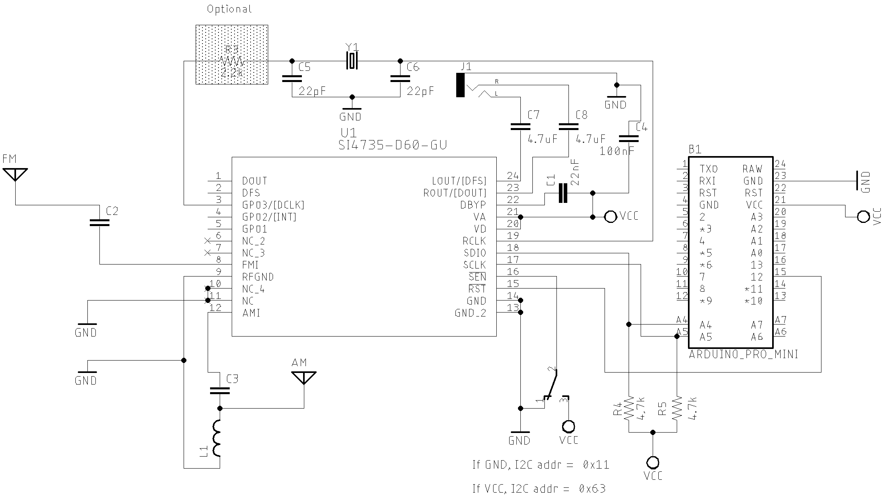


#### Basic Schematic with SI4732-A10

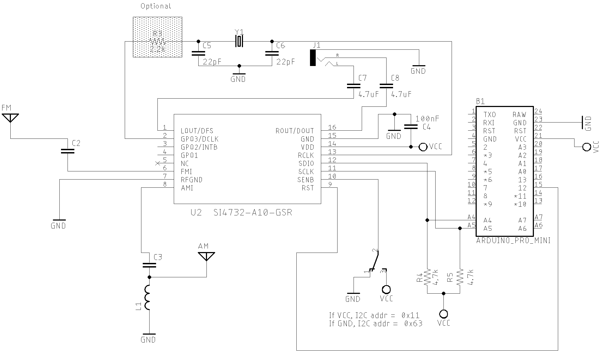


__Please, check the folder [extras/schematic/](https://pu2clr.github.io/SI4735/extras/schematic)__. There, you will find other schematics with OLED, LCD, Nokia 5110, TFT, buttons and encoders setup. Also, check the comments at the beginning of each sketch example. You will find the SI473X, button, encoder, display and Arduino settings. 


#### The picture below shows the SI4735-D60/SI4730-D60 pinout (SSOP)

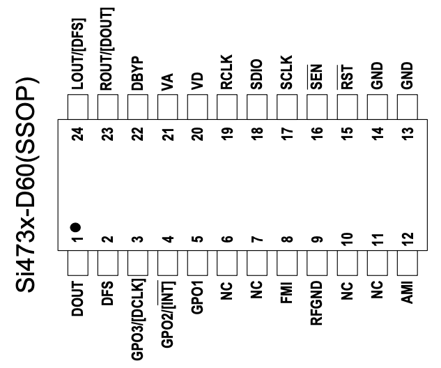

#### The picture below shows the SI4732-A10 pinout (16L SOIC Package)

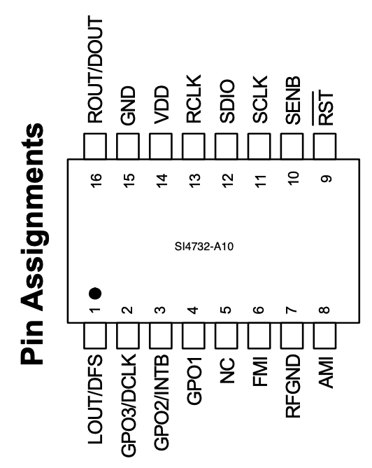

 

#### The picture below shows the SI473X pinout (QFN)

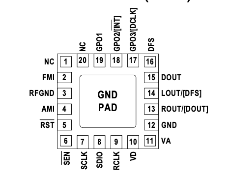


* The SI4735-D60 and SI4732-A10 have SSB patch support
* __See some Shortwave antenna configuration on__  [Si47XX ANTENNA, SCHEMATIC, LAYOUT, AND DESIGN GUIDELINES; AN383](https://www.silabs.com/documents/public/application-notes/AN383.pdf)

* __Pay attention to the appropriated Arduino pinout to select the correct interrupt (IRQ), RST, SDIO and SCLK pins. The previous table shows some Arduino board pinout__.  
* __Be sure about the pinout of your device and Arduino connections. For example: the Si4735-D60/Si4730_D60 SEN pin (16 on SSOP version and 6 on QFN version) when connected to the ground, the I²C bus address is 0x11. When this pin is connected to +3.3V, the I²C bus address is 0x63__. See the functions [getDeviceI2CAddress](https://pu2clr.github.io/SI4735/#getdevicei2caddress) and [setDeviceI2CAddress](https://pu2clr.github.io/SI4735/#setdevicei2caddress) to correct setup. If you follow the schematic used in this project, you do not need to do anything (the default I²C bus address is 0x11). If you do not know how this pin is configured on the board, use [getDeviceI2CAddress](https://pu2clr.github.io/SI4735/#getdevicei2caddress).  

<BR>

#### The image bellow shows the Silicon Labs SSOP Typical Application Schematic.

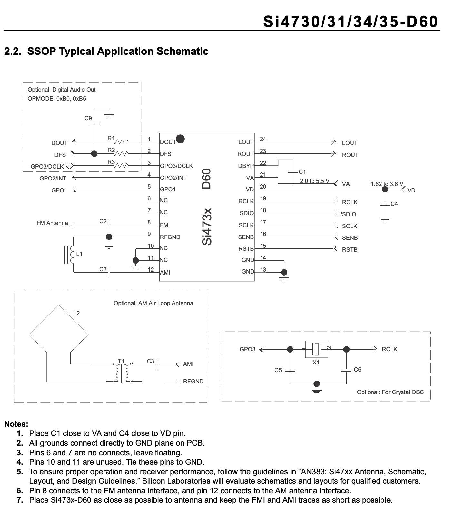


<BR>

### Parts

The table below shows the component parts used to build the radio prototype based on Si4735 and used the Silicon Labs SSOP Typical Application Schematic as main source. However, some parts were included by the author of this project. 


|Part	| Description |
|-------| ------------ |
| C1    | 22nF Monolithic Multilayer Chip Ceramic non polarized capacitor (Place it close to VA pin)|
| C2    | 1nF Monolithic Multilayer Chip Ceramic non polarized capacitor |
| C3    | 470nF Monolithic Multilayer Chip Ceramic non polarized capacitor| 
| C4    | 100nF Monolithic Multilayer Chip Ceramic non polarized capacitor (Place it close to VD pin)|
| C5 and C6 | 22pF (Crystal load capacitors) | 
| C7 and C8 *1 | 4.7uF Monolithic Multilayer Chip Ceramic non polarized capacitor | 
| R3    | 2.2K |
| (R4 and R5) *2 | 2.2K to 10K (pull-up resistors) |
| L1 | Ferrite loop stick (about 500 μH) |
| X1    | 32.768 kHz crystal |
| SI4735 | digital CMOS AM(LW, MW and SW)/FM radio receiver IC |

  * *1: C7 and C8 are ceramic capacitors included by the author of this project. They are not present on original Silicon Labs schematic. Actually, you can use also electrolytic capacitors. Values between 2.2uF to 10uF will work well. 
  * *2: R4 and R5 are pull-up resistor included by the author of this project. They are not present on original Silicon Labs schematic.  This will also depend on other devices connected to the same I²C bus.  __Always try to use the lowest possible value__.

__Notes from Silicon Labs Broadcast AM/FM/SW/LW Radio Receiver documentation (page 12)__:
* Place C1 close to VA and C4 close to VD pin.
* All grounds connect directly to GND plane on PCB.
* Pins 6 and 7 are no connects, leave floating.
* Pins 10 and 11 are unused. Tie these pins to GND.
* To ensure proper operation and receiver performance, follow the guidelines in “AN383: Si47xx Antenna, Schematic,
* Layout, and Design Guidelines.” Silicon Laboratories will evaluate schematics and layouts for qualified customers.
* Pin 8 connects to the FM antenna interface, and pin 12 connects to the AM antenna interface.
* Place Si473x-D60 as close as possible to antenna and keep the FMI and AMI traces as short as possible.

[Go to contents](https://pu2clr.github.io/SI4735/#contents)

<BR>

### Tips to build 

* Try to follow what the Silicon Labs recommends; 
* Start building the minimum circuit and test it;
* Check if the Si47XX RESET pin (15 on SSOP version or 5 on QFN version) is connected on  your MCU (Arduino) pin defined as RESET the (the most of schematics and examples of this project this pin is the digital pin 12);
* Use the minimum sketch to test the minimum circuit. The first three examples of this project (see  examples folder) can be used to test the minimum circuit; 
* Try not improvising the I²C bus connection. Start using a 3.3V MCU (Arduino Pro Mini 8MHz or DUE,  ESP32 or other 3.3V device) to connect with SI4735;
* If you are using the __Arduino Pro Mini__ 3.3V board, select the correct __Processor__ on Arduino IDE (ATmega328, 3.3V, 8MHz); 
* Some devices provide internal pull-up resistors that in some cases can be enabled or disabled. Also, the capacitance of the I²C bus is another variable that have be considered to select the right resistor values. However, that capacitance is not easy to be measured. For these reasons, it can be a liitle dificult calculate the right resitor values at first. That said, start with a high pullup resistor to I²C bus and then reduce it until the best value. For example: start with 10K and try to reduce the value to 4,7K, 3,3K, 2.2K etc. Select the lowest resistor you can.
* I²C bus devices are available in different speeds. If you are using an I²C display device, check if its speed is compatible with the Si47XX and also with the current speed used by the master MCU;
* Using different voltage levels between I²C devices can be unsafe and can destroy parts connected on I²C bus, specially the Si47XX;
* It is important to wire all your I²C devices on the same common ground. 
* If you are using Arduino Mini Pro, UNO or similar, pay attention to the pin 13 and the use of internal pull-up resistor. This pin has a LED and a resistor connected on the board. When this pin is set to HIGH, the LED comes on. If you use the internal pull-up resistor of the pin 13, you might experiment problem due to the drop voltage caused by the LED circuit. If this occurs in your project, you can do: 
  *  Use the pin 14 instead pin 13. This pin is the A0 (Analog). But you have to refer it by 14 to use it as digital pin; 
  *  Change the circuit and sketch to use external pull-up on pin 13;
  *  Remove the LED or resitor connected to the LED from the board.   
* Use only batteries to power your circuit. Receptions in LW, MW and SW can be seriously harmed by the use of power supplies connected to the grid. 
* See some Shortwave antenna configuration on [Si47XX ANTENNA, SCHEMATIC, LAYOUT, AND DESIGN GUIDELINES; AN383](https://www.silabs.com/documents/public/application-notes/AN383.pdf)  

[Go to contents](https://pu2clr.github.io/SI4735/#contents)

<BR>

## Most Frequent Problems

### The system does not start.

Depending on your setup, the system can hang at the beginning. 

It has been observed in several tests. Some tips:

1. Avoid using the computer connected to the mains during testing. The electrical grid can disturb the communication between the Arduino based board and the SI47XX device;
2. The RESET pin is not configured properly. Check the connection of the SI47XX pin 15 (RST) and the Arduino based board;
3. Try to use a 22K pull-up on Arduino Board pin used for reseting (RESET PIN). It may be needed if you are using some Arduino based boards like (Atmega32, Atmega128 etc)
4. If the SI47XX pin 16 (SEN) is grounded, the I²C bus address must be 0x11, otherwise it must be 0x63 (the default I2C bus address is 0x11). Preferably, keep this pin grounded;
5. Check if the pins 17 (SCLK / SCL) and 18 (SDIO / SDA) of the SI47XX device are correctly connected to the Arduino board pins;
6. Check the pull-up resistors connected to the pins 17 (SCLK / SCL) and 18 (SDIO / SDA) of the SI47XX device;
7. Check the voltage on SI47XX pin 15 (RST).  It should be 3.3V. All digital pins of your Arduino must have 3.3v when in HIGH condition. If it is greater than 3.3V, probably you are using an 5V board; 
8. If you are using the board Arduino Pro Mini 3.3V (8MHz), be sure you selected the correct board on Arduino IDE Tools menu, Processor: __"Atmega328P (3.3V, 8MHz)"__. By default, the Arduino IDE uses the 5V processor version; 
9. Do not try to power an ATmega328 Arduino Board designed to work with 5V and 16MHz with a 3.3V supply. That configuration will make your system unstable. See [ATmega328P Datasheet](http://ww1.microchip.com/downloads/en/DeviceDoc/Atmel-7810-Automotive-Microcontrollers-ATmega328P_Datasheet.pdf);  
10. Do not try to power your Arduino based board designed to work with 3.3V with greater voltage. See the technical specifications of your Arduino Board and remember that the maximum voltage of the SI47XX MCU CONTROL INTERFACE is 3.6V;
11. Check the external crystal and its capacitors connections. 

__Attention__: The pins numbers above is considering Si473x-D60(SSOP) package.


### On FM mode, the receiver jump from a station to another station without any action.

If you are using Arduino Mini Pro, UNO or similar, pay attention to the pin 13 and the use of internal pull-up resistor. This pin has a LED and a resistor connected on the board. When this pin is set to HIGH, the LED comes on. If you use the internal pull-up resistor of the pin 13, you might experiment problem due to the drop voltage caused by the LED circuit. If this occurs in your project, do one of the following:
  *  Use the pin 14 instead pin 13. This pin is the A0 (Analog). But you have to refer it by 14 to use it as digital pin; 
  *  Change the circuit and sketch to use external pull-up on pin 13; or
  *  Remove the LED or the resitor connected to the LED from the Arduino Board.   

### After power up or try to tune the receiver, the display shows LW and 0 kHz

This problem can be a little complicated to solve. It can occur in many situations. I have observed that very few times in my experiments: 
 
* When I am powering the system using the computer USB and the computer is connected to the grid, it might occur. __Please, test your system using only batteries__.
* If you are using the board Arduino Pro Mini 3.3V (8MHz), be sure you have selected the correct board on the IDE Tools menu, Processor: __"Atmega328P (3.3V, 8MHz)"__. By default, the Arduino IDE uses the 5V processor version.
* Check if the RESET pin of the SI473X and the controller are well connected.  
* This problem also can be caused by the external crystal connected to the SI473X device (in general 32768K). This crystal needs a minimum delay to become stable after a reset or power up command. Currently, this delay is 10ms. Try to increase that delay by using the method setMaxDelayPowerUp.

__Example:__

```cpp
void setup() {
 
 si4735.setMaxDelayPowerUp(500); // now the delay after power up will be 500 ms
 si4735.setup(RESET_PIN, FM_FUNCTION);

}
```


* Also, for some reason, the frequency switching needs a little delay (the default value is 30ms).  Try to increase that delay by using the method setMaxDelaySetFrequency.

__Example:__

```cpp
void setup() {
  si4735.setMaxDelaySetFrequency(50);
  si4735.setup(RESET_PIN, FM_FUNCTION);
}
```

* __Finally, if no previous attempt could not solve the issue, check that the crystal is working correctly__.


### I cannot tune satisfactorily any station on LW, MW or SW

* Please, use only batteries to power your system up on LW, MW or SW; 
* Check your circuit on AMI pin of the Si47XX device;
* Keep as far as possible from noise sources (LED light bulb, computers and any device connected to the power grid);
* Try to find a suitable size for the antenna wire. Too long can be a big noise pickup. If too short, it may not be enough to pick up radio stations.
 

### When the receiver starts or when I switches it from FM to AM and vice-versa, I have loud click in the speaker  

Some users may be uncomfortable with the loud popping of the speaker during some transitions caused by some Si47XX device commands. This problem occurs during the receiver transition from the power down to power up internal commands. Also, every time the user changes the mode (FM to AM or AM to FM) the sequence power down and power up internal commands is required by the Si47XX devices. 

The SI473X devices have HIGH DC (DC bias) component in the analog audio output pins (SI4735-D60 pins 23 and 24). When the device goes to power down mode, the voltage on the audio pins drops to 0V.  The device do it internally and there is no  way to avoid that. When the device goes to power up, that audio pins suddenly goes to the  HIGH DC again. This transition causes the loud pop in the speaker. So far, the author of this library have not found an internal SI473X device solution to solve the loud popping of the speaker. It is important to say that internal SI473X mute or volume commands will not work for this purpose. However, it is possible to solve this problem by adding an extra __mute__ circuit and control it by the MCU (Atmega, ESP32, STM32, ATtiny85 etc). 

The schematic below shows this approach.

<BR>


Considering that you are using a MCU based on Atmega328. When the D14 (A0) is HIGH the Si47XX output audio will be drained to the ground. At that condition, no audio will be transferred to the amplifier input and, consequently, to the speaker. So, no loud click in the speaker. 

When the D14 is LOW, the most of signal audio output from the Si47XX will be transfered to the input of the amplifier. 

The code below shows all you have to do in your sketch to implement this resource.


```cpp

#include <SI4735.h>
#define AUDIO_MUTE 14      // Pin A0 - Switch AGC ON/OF

Si4735 r;

void setup() {
  .
  
  // It is all you have to do to control a external audio mute circuit if you have one. 
  r.setAudioMuteMcuPin(AUDIO_MUTE); // Tells the system to control an external audio mute circuit. 

  r.setup(RESET_PIN, -1, 1, SI473X_ANALOG_AUDIO); // Starts on FM mode and ANALOG audio mode. 
  .
  .
  .

} 
```




Some low power audio amplifiers IC also implement mute circuit that can be controlled externally. You can find this resource on __[LM4906](http://www.ti.com/lit/ds/symlink/lm4906.pdf), [LM4863](https://www.ti.com/lit/ds/symlink/lm4863.pdf?ts=1588602798363), KA8602B, MC34119, PAM8403__ and __HT82V739__ devices.


[Go to contents](https://pu2clr.github.io/SI4735/#contents)


## Saving Memory on ATmega328 applications

* Use [MiniCore](https://github.com/MCUdude/MiniCore) board setup instead regular Arduino Atmega328 setup. You can save about 1KB by removing the bootloader and using LTO option;
* You can also use the regular Arduino setup and use the hex file without bootloader (use xloader application in this case);
* Do not use the String class, sprintf or dtostrf functions to format numbers. Use itoa function or your own implementation to convert number to char array. You can save about 2KB.  See example below.

```cpp
/**
  Converts a number to a char string and places leading zeros. 
  It is useful to mitigate memory space used by sprintf or generic similar function
*/
void convertToChar(uint16_t value, char *strValue, uint8_t len)
{
  char d;
  for (int i = (len - 1); i >= 0; i--)
  {
    d = value % 10;
    value = value / 10;
    strValue[i] = d + 48;
  }
  strValue[len] = '\0';
}
```

__TIP:__ The SI4735 Arduino Library has a function to format numeric values like frequency, bfo, rssi etc. See [convertToChar documentation](https://pu2clr.github.io/SI4735/extras/apidoc/html/group__group18.html#ga133ec11bfc2c68100b47a63da4484767)


Example:

```cpp
.
.
.
void showFrequency()
{
  char freqDisplay[10];

  if (band[bandIdx].bandType == FM_BAND_TYPE)
  {
    rx.convertToChar(currentFrequency, freqDisplay, 5, 3, ','); // Formats the FM frequency
  }
  else
  {
    if (band[bandIdx].bandType == MW_BAND_TYPE || band[bandIdx].bandType == LW_BAND_TYPE)
      rx.convertToChar(currentFrequency, freqDisplay, 5, 0, '.'); // Formats LW and MW frequency
    else
      rx.convertToChar(currentFrequency, freqDisplay, 5, 2, '.'); // Formats SW frequency
  }
  showValue(0, 0, oldFrequency, freqDisplay, 2, 11);
}
.
.
.

```

* Regarding SSB patch, use the __patch_ssb_compressed.h__ and [downloadCompressedPatch](https://pu2clr.github.io/SI4735/extras/apidoc/html/group__group17.html#gaf1b8947db928728ada66ef3edaa79e76) instead __init.h__ and [downloadPatch](https://pu2clr.github.io/SI4735/extras/apidoc/html/group__group17.html#gafd1343bd8b4f0c290ef81c418222036c). It will save about 1K of memory.  

Explanation: The first byte of each line of the original patch content is a command 0x15 or 0x16. To shrink the patch size stored into the controller the first byte is ommited and a new array will be added to indicate the position where the command 0x15 occours (which occurs much less often). For the other lines, the downloadCompressedPatch method will include the value 0x16. The value 0x16 occurs on most lines in the patch. 


```cpp 

#include <patch_ssb_compressed.h> // SSB patch for whole SSBRX initialization string

const uint16_t size_content = sizeof ssb_patch_content; // See ssb_patch_content.h
const uint16_t cmd_0x15_size = sizeof cmd_0x15;         // Array of lines where the 0x15 command occurs in the patch content.


void loadSSB()
{
  .
  .
  rx.setI2CFastModeCustom(500000);
  rx.queryLibraryId(); // Is it really necessary here? I will check it.
  rx.patchPowerUp();
  delay(50);
  rx.downloadCompressedPatch(ssb_patch_content, size_content, cmd_0x15, cmd_0x15_size);
  rx.setSSBConfig(bandwidthSSB[bwIdxSSB].idx, 1, 0, 1, 0, 1);
  rx.setI2CStandardMode();
  .
  .

}
```


<BR>

## Boards where this library has been successfully tested


This library can be useful to develop a cross-platform software. So far, it has been successfully tested on the architectures shown below.    


The table below shows the some boards where this library has been successfully tested.


|    | Board | Need voltage converter | I²C Pins | Used Reset Pin | Features |
|--- | ----- | ---------------------- | -------- | --------- | -----  |
|  1 | Arduino Pro Mini 3.3V 8MHz | No | A4 and A5 | 12 | [More...](https://store.arduino.cc/usa/arduino-pro-mini) |
|  2 | Mega 2560 Pro | Yes | 20 and 21 | 12 | [More...](https://store.arduino.cc/usa/mega-2560-r3)|
|  3 | ESP WEMOS LOLIN32 | No | GPIO21 and GPIO22 [4] | GPIO25 [5] | [More...](https://docs.platformio.org/en/latest/boards/espressif32/lolin32.html) |
|  4 | ESP32 Dev Module | No | GPIO21 and GPIO22 [4] | GPIO25 [5]| [More...](https://www.espressif.com/sites/default/files/documentation/esp32_datasheet_en.pdf) |
|  5 | ESP32 Wrover Module | No | GPIO21 and GPIO22 [4] | GPIO25 [5]| [More...](https://www.espressif.com/sites/default/files/documentation/esp32-wrover_datasheet_en.pdf) |
|  6 | ESP8266 | No | GPIO4 and GPIO5 | GPIO2  |  [More...](https://docs.ai-thinker.com/_media/esp8266/docs/esp-12f_product_specification_en.pdf) |
|  7 | Arduino UNO | Yes | A4 and A5 | 12 | [More...](https://store.arduino.cc/usa/arduino-uno-rev3) |
|  8 | Arduino NANO ATmega 328 | Yes | A4 and A5 | 12 | [More...](https://store.arduino.cc/usa/arduino-nano) |
|  9 | Arduino NANO ATmega 168 | Yes | A4 and A5 | 12 | [More...](https://www.arduino.cc/en/uploads/Main/ArduinoNanoManual23.pdf) |
| 10 | Arduino NANO 33 IoT | No [6] | A4 and A5 | 12 | [More...](https://www.arduino.cc/en/Guide/NANO33BLE) |
| 11 | Arduino Yún / ATmega-32u4 | Yes | 2 and 3 | 12 | [More...](https://store.arduino.cc/usa/arduino-yun)|
| 12 | ATtiny84 | No | 7 and 8 | 6 | [More...](http://ww1.microchip.com/downloads/en/devicedoc/Atmel-7701_Automotive-Microcontrollers-ATtiny24-44-84_Datasheet.pdf)|
| 13 | ATtiny85 | No | 5 and 7 | 2 (D3) | [More...](https://ww1.microchip.com/downloads/en/DeviceDoc/Atmel-2586-AVR-8-bit-Microcontroller-ATtiny25-ATtiny45-ATtiny85_Datasheet.pdf)|
| 14 | Arduino DUE | No | 2 and 3 |   12 | [More...](https://store.arduino.cc/usa/due) |
| 15 | BlueDuino 3.3V (ATmega-32u4) | No | 2 and 3 | 10 | [More...](https://wiki.aprbrother.com/en/BlueDuino_rev2.html) |
| 16 | Arduino Mini Pro 5V 16Mhz | Yes | 2 and 3 |  10 | [More...](https://store.arduino.cc/usa/arduino-pro-mini) |
| 17 | STM32F746G-DISCO | No | - | - | [More...](https://www.st.com/en/evaluation-tools/32f746gdiscovery.html?fbclid=IwAR2D9OwhInHQ8WYxeflJQ7QV2aNscFbfcbeblaFcYq0angJIjCKmkQBPTBc) |
| 18 | STM32F103 Series  |  No | PB6 (SCL) and PB7(SDA) | PA12 | [More...](https://circuitdigest.com/microcontroller-projects/getting-started-with-stm32-development-board-stm32f103c8-using-arduino-ide) |
| 19 | STM32F411 Series  |  No | PB6 (SCL) and PB7(SDA) | PA12 | [More...](https://hackaday.com/2021/01/20/blue-pill-vs-black-pill-transitioning-from-stm32f103-to-stm32f411/) |
| 20 | Raspberry Pi Pico  | No | GP0 (0) and GP1 (1) | GP16 (16) | [More...](https://www.tomshardware.com/how-to/program-raspberry-pi-pico-with-arduino-ide) | 
| 21 | WeAct Studio RP2040 Pico  | No | GP0 (0) and GP1 (1) | GP16 (16) | [More...](https://productreview.click/shop/raspberry-pi-pico-board-rp2040-2mb-4mb-8mb-16mb-support-micropython-c-c、circuitpython/) | 
| 22 | Seeeduino XIAO | No  | A4 and A5  |  3 |  [More...](https://wiki.seeedstudio.com/Seeeduino-XIAO/)  | 
| 23 | Teensy 3.1     | No  | A4 and A5  | 12  |  [More...](https://www.pjrc.com/teensy/teensy31.html) | 
| 24 | Teensy 4.1     | No  | A4 and A5  | 12  |  [More...](https://www.pjrc.com/store/teensy41.html) | 
| 25 | Atmega8        | No  | PC4 and PC5 | PD6 | [More...](https://github.com/MCUdude/MightyCore) |
| 26 | Atmega32       | No  | PC1 and PC0 | PB2 | [More...](https://github.com/MCUdude/MightyCore) |
| 27 | Atmega128      | No  | PC1 and PC0 | PB2 | [More...](https://ww1.microchip.com/downloads/en/DeviceDoc/doc2467.pdf) |
| 28 | LGT8F328P      | No  |  A4 and A5 | 12 | [More...](https://ett.co.th/prodAVR/NANO-F328-C/LGT8F328P.pdf) |
| 29 | LUATOS ESP32C3 | No  |  GPIO4 and GPIO5 | GPIO8 | [More...](https://templates.blakadder.com/luatos_CORE-ESP32.html) |


1. More about ESP boards on [ESPRESSIF Development Boards](https://www.espressif.com/en/products/hardware/development-boards).
2. More about BlueDuino on [Seed](https://www.seeedstudio.com/Blueduino-Rev2-Arduino-compatible-pius-BLE-CC2540-p-2550.html).
3. On [Arduino.cc](https://www.arduino.cc/) you can see the technical specification about many board. 
4. It seams that in some ESP32 board, the I²C bus is not configured prorpelly by default. However, you can set almost any pin on ESP32 to setup I²C capabilities. All you have to do is call __Wire.begin(SDA, SCL);__ where SDA and SCL are the ESP32 GPIO pins. See the folder examples to check how to use ESP32 devices. 
5. You can use the pin 12 too.  
6. Arduino Nano 33 BLE only supports 3.3V I/Os and is NOT 5V tolerant so please make sure you are not directly connecting 5V
signals to this board or it will be damaged. Also, as opposed to Arduino Nano boards that support 5V operation, the 5V pin does NOT
supply voltage but is rather connected, through a jumper, to the USB power input.


<BR> 

The table below shows some SI473X, SI474X devices and Si4730 based-boards where the __PU2CLR SI4735 Arduino Library__ has been successfully tested. 

| SI473X board / IC        | FM | RDS | AM | SSB | LW | MW | SW | Tested | 
| -------------------------| -- | --- | -- | --- | -- | -- | -- | ------ | 
| SI4735-D60               |  X | X   | X  |  X  |  X |  X | X  |   Yes  |
| SI4735-B20               |  X | X   | X  |     |  X |  X | X  |   Yes  |  
| SI4732-A10 (*1)          |  X | X   | X  |  X  |  X |  X | X  |   Yes  | 
| SI4730-D60 (*2)          |  X | X*  | X  |     | X* |  X | X* |   Yes  |
| SI4734-D60               |  X |     | X  |     |  X |  X | X  |   Yes  |
| NE928-10A SI4730         |  X |     | X  |     |    |    |    |   Yes  | 
| PL102BA V2.11 10628 (*2) |  X | X*  | X  |     | X* |  X | X* |   Yes  |
| SI4743-C10               |  X | X   | X  |     | X  |  X | X  |   Yes  | 
| SI4745-C10               |  X | X   | X  |     | X  |  X | X  |   Yes  | 
 
1.   __Acording to Silicon Labs guide AN332, the SI4732-A10 has the same firmware FMRX component and AM_SW_LW RX component as that of SI4735-D60. See Si47XX PROGRAMMING GUIDE; AN332; page 2. So, like the SI4735-D60, it is possible to use it to listen to SSB mode with the SI4732-A10__.

2. Although the SI4730-D60 does not officially support SW, several tests performed during the development of this library, as well as tests performed by other experimenters, it was observed excellent performance of this IC on HF/SW band. See "Si47XX PROGRAMMING GUIDE; pages 2 and 3; Table 1 - Product Family Function" for more details. See the video [Si4730-D60 ultimate testing (FM/RDS + LW + SW)](https://youtu.be/lRYE854EOrk). __It is important to note that the author of this library does not guarantee all SI4730-D60 devices sold on the market will work in LW and SW bands and FM with RDS as well__.


<BR>


#### The videos below show the PU2CLR Si4735 Arduino Library working on some boards




[Go to contents](https://pu2clr.github.io/SI4735/#contents)

<BR>

## Photos (Tools and Accessories) 

This item describes some tools and accessories you might need to build your radio based on SI4735. Most of the accessories used in this project you will find on eBay and AliExpress.


|Arduino Pro Mini|Arduino Pro Mini| 
|---------------|---------------|  
|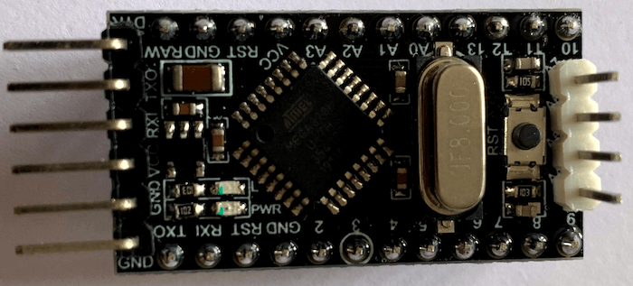|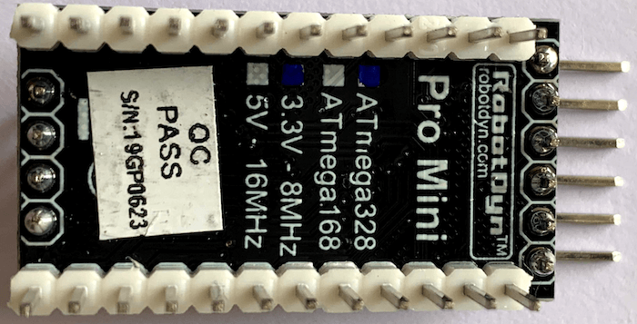|

* Pro Mini 3.3V 8MHz Atmega328 Replace ATmega128 Arduino Compatible Nano

<BR> 

| FT232 USB Adapter |FT232 USB Adapter| 
|---------------|---------------|   
|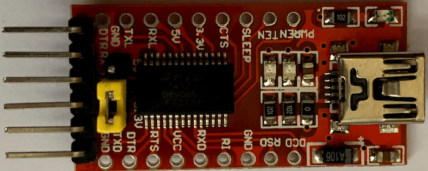|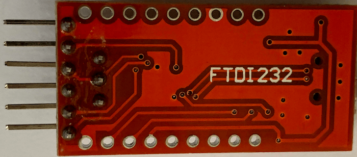|

* FT232RL 3.3V/5.5V FTDI USB to TTL Serial Adapter Module for Arduino Mini Port 

<BR>

|Magnifier|Solder| 
|---------------|---------------|   
|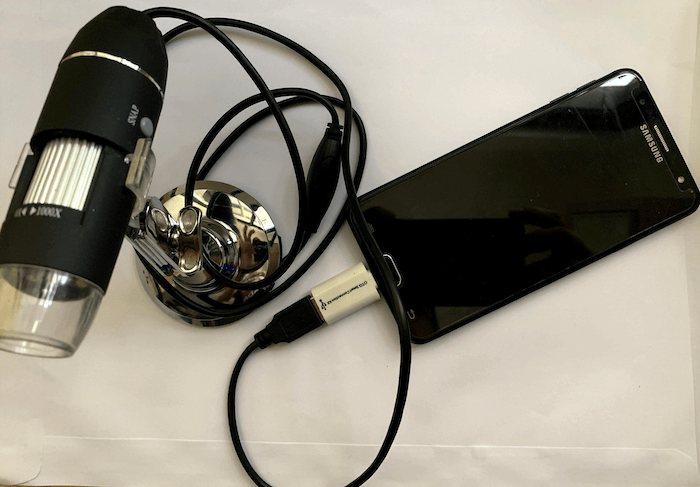|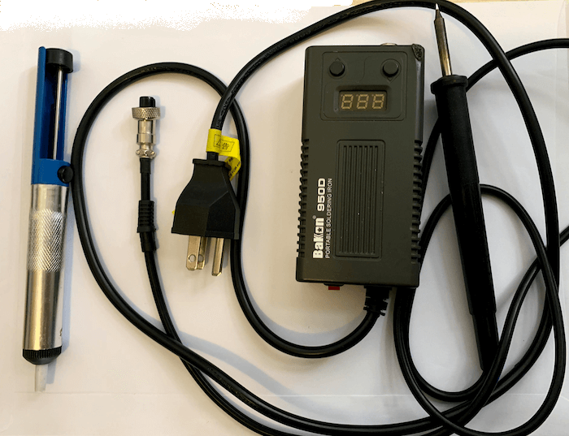|

* 50-1000X Magnifier Wireless WiFi Electric Microscope 2.0MP 8LED Endoscope Camera
* Soldering Iron Station with Temperature Control 

<BR>

|Adapter for SI4735|Soldering Accessories| 
|---------------|---------------|   
|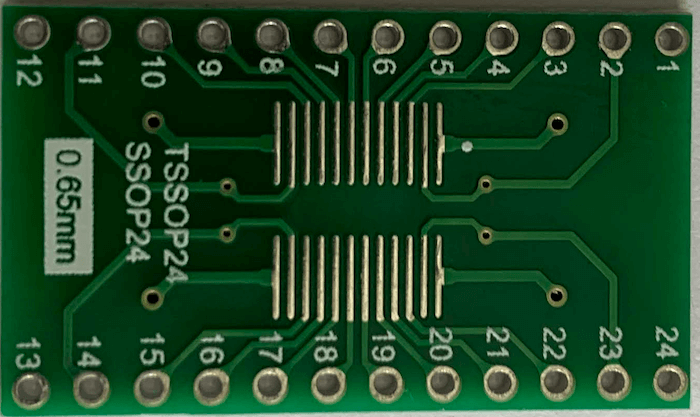|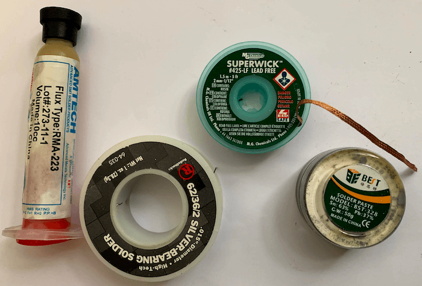|

* SO SOP SOIC SSOP TSSOP 24 Pin to DIP 24 Adapter PCB Board Converter
* 50g Soldering Paste Solder Flux Paste Cream for PCB PGA SMD BGA
* BGA SMD Soldering Paste Flux
  

<BR>

It was a bit hard to solder the kind of CI on adapter. However, by using a electronic magnifier it was possible.

### SI4735 soldered on adapter

|Si4735 on Adapter|Si4735 on Adapter| 
|---------------|---------------|  
|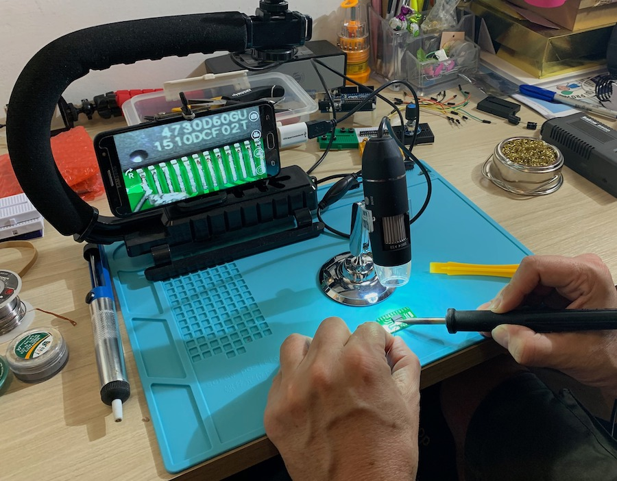|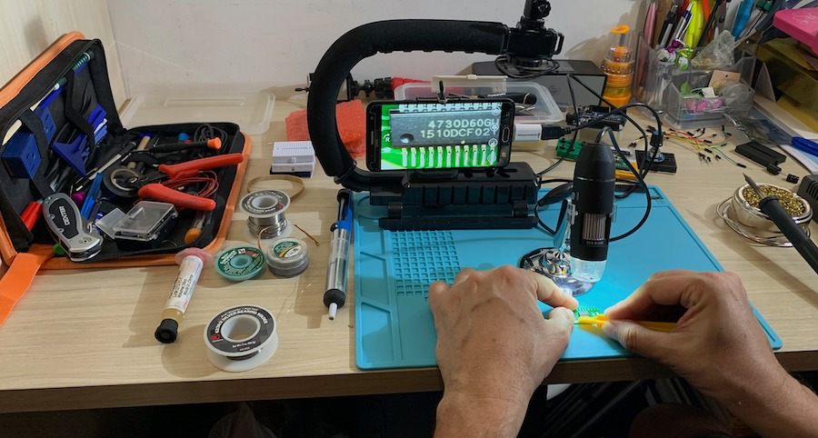|
|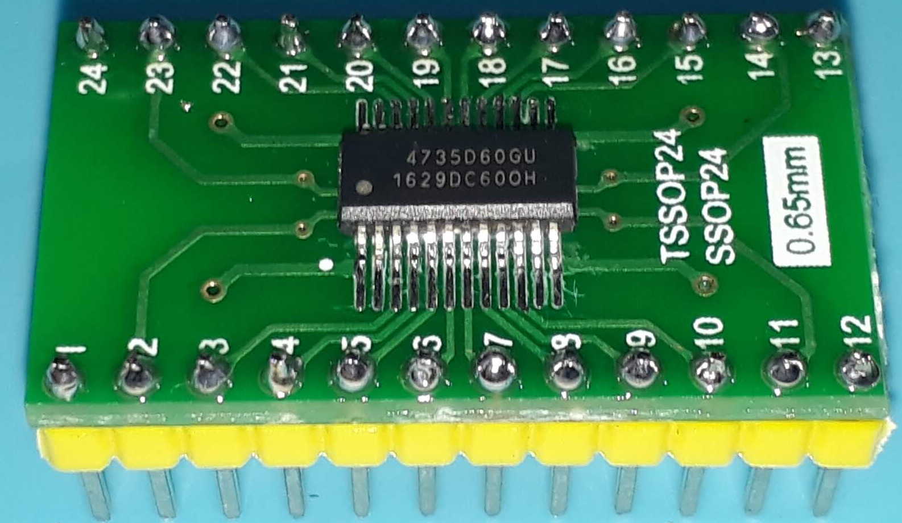|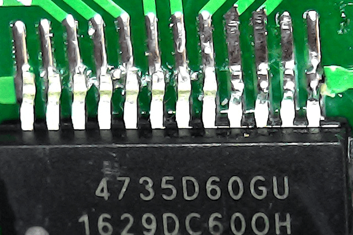|


[Go to contents](https://pu2clr.github.io/SI4735/#contents)


#### Protoboard

The basic circuit built on protoboard is based on the “__SSOP Typical Application Schematic__”, suggested by the Silicon Labs Documentation (Si4730/31/34/35-D60-BROADCAST AM/FM/SW/LW RADIO RECEIVER; page 19). Two pull-up 4.7K resistors were added on I²C bus (It is an arbitrary value. Actually, this value may vary depending on your devices connected to the bus). Also, it is recomended to add two 4.7uF capacitors between the CI audio output  and audio amplifier. The photos below do not show these capacitors. See  [C7 and C8 on schematic](https://pu2clr.github.io/SI4735/#schematic).

<BR>

The figure below shows a suggestion to shrink the prototype and connections. If you are just doing prototyping, I recommend this approach due to the short connections with the Si4735 (recommended by the manufacturer).

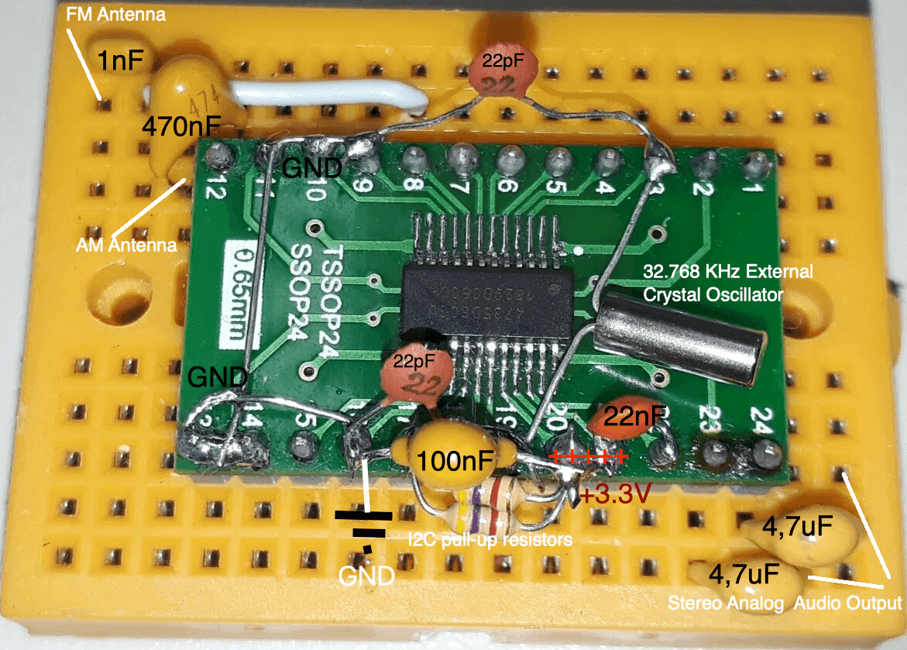

<BR>

The configuration above connected to Arduino Pro Mini is shown below. 


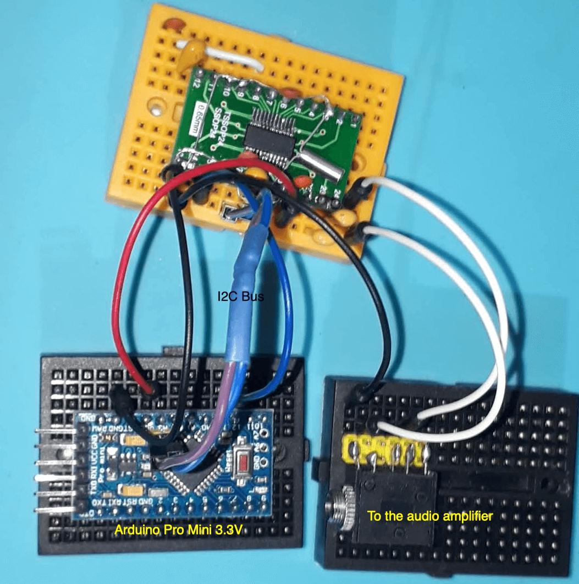


<BR>


The following photo shows the most common prototyping approach. Use this approach if you don't want to solder the components on the adapter plate.

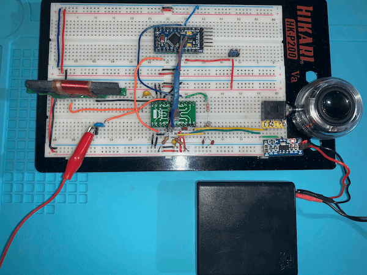

The figure above shows the very basic shematic implementation (no Button or Encoder). See the folder [examples](./examples) for more details and other configuration with LCD and OLED

## References

1. [Silicon Labs Si4737 WB/AM/FM Stereo/RDS single-chip receiver HAL library for Arduino ](https://pu2clr.github.io/rickeywang/Si4737_i2c)
2. [BROADCAST AM/FM/SW/LW RADIO RECEIVER](https://www.silabs.com/documents/public/data-sheets/Si4730-31-34-35-D60.pdf)
3. [SI47XX PROGRAMMING GUIDE (REV 1.0)](https://web.engr.oregonstate.edu/~traylor/ece473/data_sheets/AN332.pdf)
4. AN332 REV 0.8 UNIVERSAL PROGRAMMING GUIDE AMENDMENT FOR SI4735-D60 SSB AND NBFM PATCHES
5. [DIGITAL METHOD OF SSB MODULATION](http://science.lpnu.ua/sites/default/files/journal-paper/2018/sep/14625/5.pdf)
6. [Understanding the 'Phasing Method' of Single Sideband Demodulation](https://wwwusers.ts.infn.it/~milotti/Didattica/Segnali/SSB-Lyons.pdf)
7. [Design a modulator and demodulator SSB by DSP processor TMS320C50 for PLC systems](https://ieeexplore.ieee.org/document/1280328)
8. [Installing Additional Arduino Libraries](https://www.arduino.cc/en/Guide/Libraries#toc3)
9. [Specification of the radio data system (RDS) for VHF/FM sound broadcasting in the frequency range from 87,5 to 108,0 MHz](http://www.interactive-radio-system.com/docs/EN50067_RDS_Standard.pdf)
10. [Radio Data System](https://en.wikipedia.org/wiki/Radio_Data_System)
11. [RDS Encoder](https://haddadi.github.io/papers/RDSencoderHaddadi.pdf)
12. [RDS in Europe, RBDS in the USA –What are the differences and how canreceivers cope with both systems?](https://sigidwiki.com/images/a/ad/RDS_in_Europe,_RBDS_in_the_USA.pdf)
13. [RBDS & RDS PTY Codes and Program Types](https://www.fmsystems-inc.com/rbds-rds-pty-codes-program-types/)
14. [Using RDS/RBDS with the Si4701/03](https://www.silabs.com/documents/public/application-notes/AN243.pdf)
15. [Si47XX ANTENNA, SCHEMATIC, LAYOUT, AND DESIGN GUIDELINES; AN383](https://www.silabs.com/documents/public/application-notes/AN383.pdf)
16. __Other implementations using Si4735 and Arduino__
    * [This is a git fork of [Michael Kennedy's]](https://github.com/FlyingLotus1983/Si4735)  
    * [Arduino Si4735 radio library](https://sourceforge.net/projects/arduino-si4735/)
    * [SI4735 AM & FM Receiver Shield](https://www.sparkfun.com/products/retired/10342)
    * [Si4735 Digital AM/FM Radio Receiver](https://os.mbed.com/users/bwilson30/notebook/si4735-digital-amfm-radio-receiver/)
    * [Ryan Owens for SparkFun Electronics](https://pu2clr.github.io/csdexter/Si4735)
    * [Silicon Labs Si4737 WB/AM/FM Stereo/RDS single-chip receiver HAL library for Arduino](https://devhub.io/repos/rickeywang-Si4737_i2c)
    * [Enhanced Software for Elektor DSP-Radio (Si4735)](https://www.elektormagazine.com/labs/enhanced-software-for-elektor-dsp-radio-si4735)
17. __I²C__ 
    * [Taking The Leap Off Board: An Introduction To I²C Over Long Wires](https://hackaday.com/2017/02/08/taking-the-leap-off-board-an-introduction-to-i2c-over-long-wires/)
    * [Difference between I²C and SPI](https://dcubestore.com/blog/difference-between-i2c-and-spi/?fbclid=IwAR2pnpqKe9q2R7r28q0PiPt5Cb_JzqdgKkcsLIb43ZSb4ZForI-fWQmZtM0)
    * [Issues with the I²C (Inter-IC) Bus and How to Solve Them](https://www.digikey.com/en/articles/techzone/2018/aug/issues-with-the-i2c-bus-and-how-to-solve-them)
    * [I²C Manual; Application Note; AN10216-01](https://www.nxp.com/docs/en/application-note/AN10216.pdf)
    * IMPROVING NOISE IMMUNITY FOR SERIAL INTERFACE; A Lattice Semiconductor White Paper; July 2014
    * [Bus Buffers Simplify Design of Large, Noisy I²C Systems](https://www.analog.com/en/technical-articles/bus-buffers-simplify-design-of-large-noisy-i2c-systems.html#)
    * [Common Problems In Systems](https://www.i2c-bus.org/i2c-primer/common-problems/)
    * [Tutorial: Arduino and the I2C bus – Part One](https://tronixstuff.com/2010/10/20/tutorial-arduino-and-the-i2c-bus/)
18.  __Forums__
      * [How to reduce I²C bus noise](https://www.microchip.com/forums/m456630.aspx)
      * [Radio interferes with I²C bus communication](https://www.microchip.com/forums/m456630.aspx)
      * [Reducing Noise on an I²C bus line](http://e2e.ti.com/support/interface/f/138/t/552072)
      * [Noise on I²C bus](https://forum.allaboutcircuits.com/threads/noise-on-i2c-bus.41916/)
      * [Noises on the I²C BUS](https://electronics.stackexchange.com/questions/292032/noises-on-the-i2c-bus)
19. ["Multi-Band Receiver On A Chip Controlled By Arduino" commented by Tom Nardi on Hackaday](https://hackaday.com/2020/03/02/multi-band-receiver-on-a-chip-controlled-by-arduino/) 
20. __C/C++ for Arduino__ 
    * [How to use C++ Classes in Arduino IDE without creating a Library](https://www.radishlogic.com/arduino/use-c-class-arduino-ide-without-creating-library/?fbclid=IwAR07yO6OvyUlAa4d28N7VTWtY2vHjlUbtkxKiO7LJKOUkPou1bh8Lvwg8rA)
    * [Arduino the Object Oriented way](https://paulmurraycbr.github.io/ArduinoTheOOWay.html)
    * [Arduino Object Oriented Programming (OOP)](https://roboticsbackend.com/arduino-object-oriented-programming-oop/)
    * [Writing a Library for Arduino](https://www.arduino.cc/en/Hacking/LibraryTutorial)

[Go to contents](https://pu2clr.github.io/SI4735/#contents)

## Videos

Here you can see some experiments using this library. Watch them.



### Project examples made by the author

* [Si4735 All in One Receiver running on Arduino Pro Mini 3.3V (8MHz) and TFT Display](https://youtu.be/oL8qyRglZ8I)
* [Si4735 All in One Receiver with TFT Touch Screen](https://youtu.be/Zs59ThVumuE)
* [Si4735 Arduino Library example. OLED Application.](https://youtu.be/7Sg4z8tDSA8)
* [SI4735 Arduino Library and a simple FM and AM radio implementation](https://youtu.be/vzunuxam_Lg) 
* [SI4735 ARDUINO LIBRARY BANDWIDTH TEST](https://youtu.be/dN1s3RoXGos) 
* [Si4735 Arduino Library and SSB Support (Listening to a QSO on 20 meters)](https://youtu.be/W2Ssjb9P_f4)
* [Evaluating SSB audio from the SI4735-based radio prototype](https://youtu.be/Xj7zuiyvysI)
* [How to "SI4735 Arduino Library and ATtiny85"](https://youtu.be/zb9TZtYVu-s)
* [SI4735 Arduino Library working with ATtiny85](https://youtu.be/U9Xpqh3K4e0)
* [NE928-10A V:01 board working with "Si4735 Arduino Library"](https://youtu.be/An7Iq_BLxJY)
* [SI4730-D60 labeled "PL102BA-S V:2.1 10628"](https://youtu.be/lRYE854EOrk)
* [Si4735 Arduino Library and Bluepill STM32F103](https://youtu.be/v4o5_lKKATc)

### Third-party projects using this library

* [Si4735 - Si5351FM AM SSB / All-Mode Receiver By LZ1PPL](https://www.lz1ppl.com/en/2021/04/22/si4735-all-mode-reciver/)
* [SI4735 SSB](https://youtu.be/z-mkR93L7SI)
* [All Band Radio with a Nice Interface](https://youtu.be/hRHSzFr_lQE)
* [SI4735 11 ALL IN ONE TEST OLED ver from jg3pup](https://youtu.be/bWAcBXwdYmI)
* [New HF SSB receiver made of Si4735 is done!](https://youtu.be/Q50NToLuLK4)
* [SSB DSP radio (Si4735) version 5 revision 2](https://youtu.be/Q3jkiwOWeUo)
* [Si4735 LCD版でSSBを受信](https://youtu.be/bBeU09wal0I)
* [Wefax576 via SI4735 with audio cable fldigi](https://youtu.be/kJuxSI1GlDs)
* [SI4735 Radio KIT prototype](https://youtu.be/ENqokz09xvU)
* [SI4735 KIT. First LF test](https://youtu.be/hjDvo8ehZi4)
* [SI4735 KIT. First SSB test](https://youtu.be/bZW6NiOEGSQ)
* [SI4735 KIT - First FM test](https://youtu.be/LudpuwJSajU)
* [Great interface by Gert Baak](https://youtu.be/hRHSzFr_lQE)
* [Arduino All band radio with SI4735 by Gert PE0MGB](https://www.pi4raz.nl/razzies/razzies202009.pdf)
* [si4735 betatest radio](https://youtu.be/Gkh1zHn8NgE)
* [Dual Conversion HF Receiver Silabs Si4732/Si4735 and Si5351](https://lu7ads.blogspot.com/?fbclid=IwAR0TNxYh9SkS5T7RA_0mm2rZs4ycP7e0Y-SH6ORsT5Uj0C0wFKSEg6Gqd20)
* [Manufacture of 50MHz AM QRP transceiver TRX-505 / JR0DBK](https://yuki-lab.jp/hw/trx-505/index.html?fbclid=IwAR2IWnGjvKpN4LBfQiB4-6j4hDODlqzjMvfZbzB5DdnWvzJHcDYc2AbrFrU)
* [Rádio FM V3 (LCD 16x2) by Andersom](https://create.arduino.cc/projecthub/acardosodasilva/radio-fm-v3-e80a57)
* [SI4735 SI4732 all band radio receiver LW MW FM SW](https://xtronic.org/circuit/audio/si4735-si4732-all-band-radio-receiver-mw-fm-sw/)
* [HAM RADIO  -  ARDUINO SI4735 Based Radio](https://www.i2sdd.net/ARDUINO/SI4735/si4735.HTML)
* [RECEIVER FM/MW/SW(AM SSB and CW) with SI4735 prototype](https://www.qsl.net/py2ohh/trx/si4735/SI4735.html)
* [ATS-25 / ATS25 / LW / MW / SW / FM DSP Receiver (with Bernard Binns FREE 4.0 Firmware review](https://www.qsl.net/n9ewo/ats25.html)
* [SI4735 D60 TFT 2.8" ESP32 ALL BAND RADIO](https://www.tindie.com/products/jasonkits/si4735-d60-tft-28-esp32-all-band-radio/)
* [DSP RADIO Multi Band AM/MW/LW/SW-SSB/FM with RDS](https://www.tindie.com/products/jasonkits/dsp-radio-multi-band-ammwlwsw-ssbfm-with-rds/)


#### Videos that powered the standalone SI473X devices: 

* [Prepper Radios: SI4732 All Band Shortwave Radio](https://youtu.be/6cyw0diZVTI)
* [AM/FM/SW/LW радиоприемник Si4730/Si4735](https://youtu.be/gKCR7FTb9g4)
* [Si4735 All in One Receiver running on Arduino Pro Mini 3.3V (8MHz) and TFT Display](https://youtu.be/oL8qyRglZ8I)


[Go to contents](https://pu2clr.github.io/SI4735/#contents)

## Commercial Receivers based on Si47XX Family

The table below shows some radios based on SI47XX  

| Manufacturer | Model | Device |More information |
| ------------ | ----- | ---- |----------- | 
| Tecsun | PL310ET | Si4734 |[About](https://www.tecsunradios.com.au/store/product/tecsun-pl310et-multi-band-radio/)|
| Tecsun | PL-330 | Si4735 |[Review](https://swling.com/blog/tag/tecsun-pl-330/)|
| Tecsun | PL-365 | Si4735 |[Review](https://swling.com/blog/2017/02/charlie-reviews-the-tecsun-pl-365/)|
| Tecsun | PL-360 | Si4734 |[Review](https://www.edn.com/review-tecsun-pl-360-emi-receiver/) |
| Tecsun | PL380 |  Si4734 |[Reviews](https://www.eham.net/reviews/view-product?id=10240) |
| Tecsun |  PL880 | Si4735 | [Reviews](https://www.eham.net/reviews/view-product?id=11457) |
| CountyComm | GP-7/SSB | Si4735 | [Reviews](https://youtu.be/NO9hwmGFWfY) | 
| Degen | DE1103 DSP | Si4735 | [Review](https://swling.com/blog/2015/11/the-new-degen-de1103-dsp-first-impressions-review/)|
| Degen | DE1123/Kaito KA1123 | Si4734 |[Review](https://frrl.wordpress.com/2009/07/11/review-of-the-degen-de1123-dsp-amfmsw-pocket-radio-with-1gb-mp3-player-recorder/)|
| Degen | DE1125/Kaito KA801 | Si4734 | [Reviews](https://www.eham.net/reviews/view-product?id=9584)|
| Degen | DE1126 | Si4734 | [Review](https://sites.google.com/site/zliangas/de1126-review)|
| Degen | DE1127 (discontinued) | Si4734 | [Review](https://herculodge.typepad.com/herculodge/2012/01/dave-zantow-provides-firmware-updates-for-degen-de1127-and-de1126-models.html) |
| Sangean | ATS-909X | Si4735 | [Review](https://swling.com/blog/tag/sangean-ats-909x-review/) |
| Sangean | ATS-909X2| Si4735 | [Review](https://www.qsl.net/n9ewo/ats909x2.html) |
| XHDATA | D808 | Si4735 |[Review](https://swling.com/blog/2018/04/a-detailed-review-of-the-xhdata-d-808-and-comparison-with-the-tecsun-pl-660/)|
| RADIWOW | R-108 | SI4734 | [Review](https://www.hagensieker.com/wordpress/2019/05/08/radiwow-r-108-short-wave-radio-review/)|
| C Crane |  CC Skywave |  |[Review](https://swling.com/blog/2014/12/review-of-the-c-crane-cc-skywave-portable-radio/) |
| Unknown | ATS-20  | SI4732 | [Review](https://www.eham.net/reviews/view-product?id=15287) |
| Unknown | ATS-25  | Si4732 | [Review](https://ke2yk.com/2021/09/04/review-the-new-ats-25-si4732-receiver/)|
| Unknown | ATS-100 | Si4732 | [Review](https://www.cafago.com/en/p-e19420.html)|


[Go to contents](https://pu2clr.github.io/SI4735/#contents)


## Other Arduino Libraries Developed by the Author

* [PU2CLR SI4844 Arduino Library](https://github.com/pu2clr/SI4844). This is an Arduino library for the SI4844, BROADCAST ANALOG TUNING DIGITAL DISPLAY AM/FM/SW RADIO RECEIVER,  IC from Silicon Labs.  It is available on Arduino IDE. This library is intended to provide an easier interface for controlling the SI4844.
* [PU2CLR AKC695X Arduino Library](https://pu2clr.github.io/AKC695X/). The AKC695X is a family of IC DSP receiver from AKC technology. The AKC6955 and AKC6959sx support AM and FM modes. On AM mode the AKC6955 and AKC6959sx work on LW, MW and SW. On FM mode they work from 64MHz to 222MHz.
[PU2CLR KT0915 Arduino Library](https://pu2clr.github.io/KT0915/). The KT0915 is a full band AM (LW, MW and SW) and FM DSP receiver that can provide you a easy way to build a high quality radio with low cost.
* [PU2CLR BK108X](https://pu2clr.github.io/BK108X/). The BK1086 and BK1088 are DSP receivers from BAKEN. The BK1088 is a BROADCAST FM and AM (LW, MW and ) RECEIVER and BK1086 is a subset of the BK1088 (it does not have LW and SW acording to the Datasheet).
* [PU2CLR RDA5807 Arduino Library](https://pu2clr.github.io/RDA5807/). The RDA5807 is a FM DSP integrated circuit receiver (50 to 115MHz) with low noise amplifier support. This device requires very few external components if compared with other similar devices. It also supports RDS/RBDS functionalities, direct auto gain control (AGC) and real time adaptive noise cancellation function.
* [PU2CLR SI470X Arduino Library](https://pu2clr.github.io/SI470X/). It is a Silicon Labs device family that integrates the complete functionalities for FM receivers, including RDS (Si4703).
* [PU2CLR MCP23008 Arduino Library](https://pu2clr.github.io/MCP23008/). It is an Arduino Library to control the MCP23008 8-Bit I/O Expander. The MCP23008 device provides 8-bit, general purpose, parallel I/O expansion. It can be controlled via I2C bus applications. It is a great and inexpensive device that allow you to add more devices to be controlled by your Arduino board via I2C protocol.
* [PU2CLR - PCF8574 Arduino Library](https://pu2clr.github.io/PCF8574/). It is an Arduino Library to control the PCF8574 8-Bit I/O Expander. The PCF8574 device provides 8-bit, general purpose, parallel I/O expansion. It can be controlled via I²C bus applications. It is a great and inexpensive device that allow you to add more peripherals to be controlled by your Arduino board via I²C protocol. 

### More Arduino Projects developed by author 

* [Multipurpose signal generator with SI5351](https://pu2clr.github.io/SI5351/). It is a multipurpose signal generator controlled by Arduino. This project uses the SI5351 from Silicon Labs. The Arduino sketch is configured to control the SI5351 with three channels from 32.768KHz to 160MHz and steps from 1Hz to 1MHz.
* [Shortwave Arduino Transmiter](https://pu2clr.github.io/Small-Shortwave-Transmitter/). This project is about a shortwave transmitter from 3 MHz to 30 MHz. It uses the SI5351 oscillator from Silicon Labs controlled by Arduino. Also, you can use it with a crystal oscillator. In this case, you will not need the SI5351 device and Arduino. 
* [Android and iOS Bluetooth Remote Control for PU2CLR Arduino Library DSP receivers](https://pu2clr.github.io/bluetooth_remote_control/). This project is an extension of the Arduino library projects for: [SI4735](https://pu2clr.github.io/SI4735/); [AKC6959](https://pu2clr.github.io/AKC695X/) and [KT0915](https://pu2clr.github.io/KT0915/). It is a simple example that shows a way to use your smartphone as a remote control via Bluetooth. In order to follow the steps presented here, I am assuming that you have some knowledge in development for mobile devices. Also, you will need to be familiar with the Javascript programming language. The development environment used by this project is the [Apache Cordova](https://cordova.apache.org/docs/en/latest/guide/overview/index.html). Cordova is a open-source mobile development framework that allows you to develop cross-platform applications. That means you can code once and deploy the application in many system, including iOS and Android. 
Cordova provides an easy way to develop for iOS and Android.  
* [Band Pass Filter controlled by Arduino](https://pu2clr.github.io/auto_bpf_arduino/). It is a HF band pass filter controlled by Arduino. It is designed for HF receivers. With this project, you can use a set of up to four HF bandpass filters that can be selected by Arduino. To do that you will need just two digital Arduino pins.

