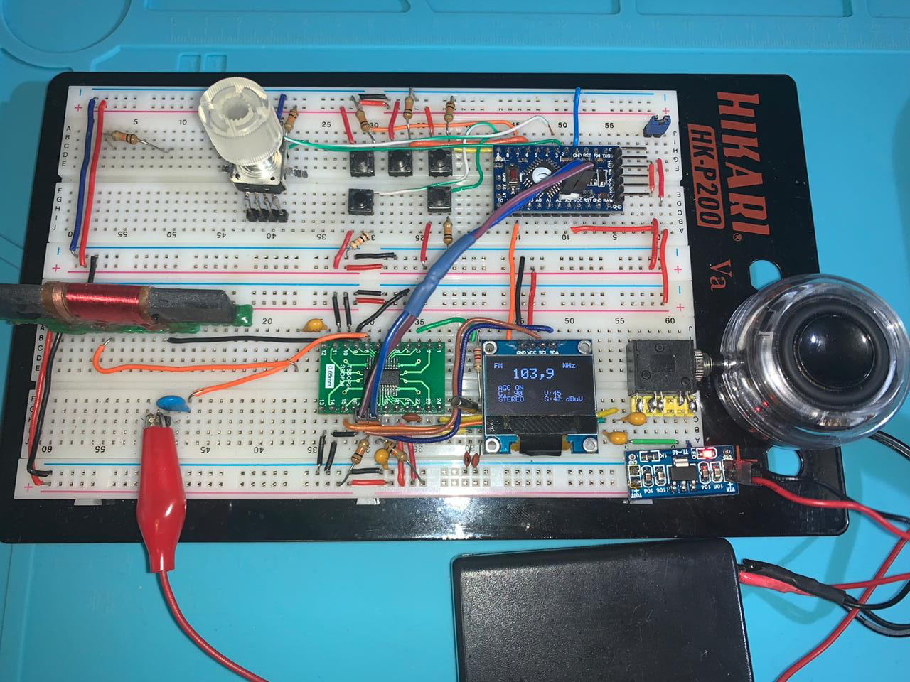

# Examples

This folder has some examples that might help you to use the Si4735 Arduino Library in your project. If you find some error or problem during your implementation, please let me know. 

## Summary

1. [Example 01 - Proof of Concept](https://github.com/pu2clr/SI4735/tree/master/examples#example-01---proof-of-concept)
2. [Example 02 - Proof of Concept with SW](https://github.com/pu2clr/SI4735/tree/master/examples#example-02---proof-of-concept-with-sw)
3. [Example 03 - SS4735 Arduino Library example with LCD 20x4 I2C](https://github.com/pu2clr/SI4735/tree/master/examples#example-03---ss4735-arduino-library-example-with-lcd-20x4-i2c)
4. [Example 04 - SS4735 Arduino Library example with I2C OLED](https://github.com/pu2clr/SI4735/tree/master/examples#example-04---ss4735-arduino-library-example-with-i2c-oled)
5. [Example 05 - Bandwidth filter test (9 band SW Receiver with OLED)](https://github.com/pu2clr/SI4735/tree/master/examples#example-05---bandwidth-filter-test-9-band-sw-receiver-with-oled)
6. [Example 06 - Proof of Concept with SSB](https://github.com/pu2clr/SI4735/tree/master/examples#example-06---proof-of-concept-with-ssb)
7. [Example 07 - Si4735 SSB firmware update support with OLED/I2C)](https://github.com/pu2clr/SI4735/tree/master/examples#example-07---si4735-ssb-firmware-update-support-with-oledi2c)
8. [Example 08 - Si4735 SSB firmware update support with LCD/I2C](https://github.com/pu2clr/SI4735/tree/master/examples#example-08---si4735-ssb-firmware-update-support-with-lcdi2c)
9. [Example 09 - Si4735 AM/FM radio with OLED S-Meter](https://github.com/pu2clr/SI4735/tree/master/examples#example-09---si4735-amfm-radio-with-oled-s-meter)
10. [Example 10 - Si4735 SW Receiver with OLED S-Meter](https://github.com/pu2clr/SI4735/tree/master/examples#example-10---si4735-sw-receiver-with-oled-s-meter)
11. [Example 11 - SI4735 all in one with SSB Support](https://github.com/pu2clr/SI4735/tree/master/examples#example-11---si4735-all-in-one-with-ssb-support)

 

## Example 01 - Proof of Concept

Test and validation of the SI4735 Arduino Library. The main advantages of using this sketch are: 
* It is a easy way to check if your circuit is working;
* You do not need to connect any display device to make your radio works;
* You do not need connect any push buttons or encoders to change volume and frequency;
* The Arduino IDE is all you need to control the radio.  

So, I strongly recommend starting with this sketch. This example is a proof of concept of SI4735 Arduino Library. The [SI4735_POC.ino](https://github.com/pu2clr/SI4735/tree/master/examples/SI4735_POC) sketch uses just the __Serial Monitor__ and works only on your __Arduino IDE__. However, you can easily replace the Serial Monitor functions to the device functions that you want to use. 

### Controls used by example 01

| Keyboard command | Description |           
| ---------------- | ----------- |
| A or a | Select MW(AM) |
| F  or f| Select FN |
| U or u | Frequency Up | 
| D or d | Frequency Down |
| S | Seek - Goes to next station |
| s | Seek - Goes to previous station |
| + | Volume Up |
| - | Volume Down |
| 0 | Shows current status | 
| 1 | Goes to previous SW band | 
| 2 | Goes to next SW band |

Click [here](https://github.com/pu2clr/SI4735/blob/master/examples/SI4735_01_POC/SI4735_01_POC.ino) to see this example.

 

## Example 02 - Proof of Concept with SW

This example shows how can you use SW features of the Si4735 Arduino Library. Like the previous exemple (Proof of Concept), the [SI4735_POC_SW.ino](examples/SI4735_POC_SW/SI4735_POC_SW.ino) sketch __works only on Arduino IDE__. It uses the Serial Monitor to get the commands and show the information. 

### SW Bands used by the example 02
| Band | From (KHz) | To (KHz) | Default (KHz)|
| ---- | ---------- | -------- | ------------ | 
| 60m | 4600| 5200| 4700|
| 49m | 5700| 6200| 6000|
| 40-41m | 7000 | 7500 | 7200|
| 31m | 9300 | 10000 | 9600 |
| 25m | 11400 | 12200 | 1800|
| 22m | 13500 | 13900 | 13600|
| 19m | 15000 | 15800 | 15200|
| 16m | 17400 | 17900 | 17600|
| 21m | 21400 | 21800 | 21500|
| 11m | 27000 | 27500 | 27220|

### Controls used by the example 02

| Keyboard command | Description |
| ---------------- | ----------- | 
| A or a | Select MW(AM) |
| F or f | Select FN |
| U or u | Frequency Up | 
| D or d | Frequency Down |
| S | Seek - Goes to next station |
| s | Seek - Goes to previous station |
| + | Volume Up |
| - | Volume Down |
| 1 | Previous SW band | 
| 2 | Next SW band | 
| 0 | Show current status | 

Click [here](https://github.com/pu2clr/SI4735/blob/master/examples/SI4735_02_POC_SW/SI4735_02_POC_SW.ino) to see this example.

 

## Schematic for Proof of Concept (Examples 01 and 02)

The schematic below is the same shown at the main page of this project and shows how you can setup you SI4735 device.

__See some shortwave antenna configuration on__  [Si47XX ANTENNA, SCHEMATIC, LAYOUT, AND DESIGN GUIDELINES; AN383](https://www.silabs.com/documents/public/application-notes/AN383.pdf)

 

## Example 03 - SS4735 Arduino Library example with LCD 20x4 I2C

It is a example that shows how to set up a LCD and SI4735 on the same I2C bus. 
This sketch uses the Rotary Encoder Class implementation from Ben Buxton. The source code is included together with this sketch. This sketch also uses the LiquidCrystal I2C Library by Frank de Brabander. You can install LiquidCrystal I2C via Manage Libraries on your Arduino IDE. 

Click [here](https://github.com/pu2clr/SI4735/blob/master/examples/SI4735_03_LCD_20x4_I2C/SI4735_03_LCD_20x4_I2C.ino) to see this example.

__Click [here](https://youtu.be/vzunuxam_Lg) to see a video about this example__.

 

## Example 04 - SS4735 Arduino Library example with I2C OLED

This sketch uses the Rotary Encoder Class implementation from Ben Buxton. The source code is included together with this sketch. This sketch also uses the SSD1306Ascii Arduino Library by Bill Greiman. You can install SSD1306Ascii via Manage Libraries on your Arduino IDE. The photo below show this example on a protoboard. 

Click [here](https://github.com/pu2clr/SI4735/blob/master/examples/SI4735_04_OLED_I2C/SI4735_04_OLED_I2C.ino) to see this example.

__Click [here](https://youtu.be/7Sg4z8tDSA8) to see a video about this example__.

 

## Schematic for I2C display device, buttons and encoder (Examples 03 and 04)

The schematic below is a sugestion to connect a I2C Display (OLED or LCD 20x4 or another device), buntons and encoder as well. 

__Pay attention to the your I2C device voltage. The system can become unstable if you are using a wrong voltage__.

 

## Example 05 - Bandwidth filter test (9 band SW Receiver with OLED)

This example is a 11 band SW receiver based on SI4735.  It shows the selection of the bandwidth of the channel filter for AM reception (in this case SW). The choices are: 6, 4, 3, 2, 2.5, 1.8, or 1 (kHz). With this resource, you can separate  two stations in adjacent channels. __You can use the same schematic shown for the examples 03 and 04__. 

Click [here](https://github.com/pu2clr/SI4735/blob/master/examples/SI4735_05_SW_OLED_FILTER_TEST/SI4735_05_SW_OLED_FILTER_TEST.ino) to see this example.

__Click [here](https://youtu.be/dN1s3RoXGos) to see a video about this example__.

 

## Example 06 - Proof of Concept with SSB

This example shows how can you use SSB features of the Si4735 Arduino Library. It uses the Serial Monitor to get the commands and show the information. 

This sketch will download a SSB patch to your SI4735 device (patch_full.h or patch_init.h). It can take up to 15KB of the Arduino memory.
    
In this context, a patch is a piece of software used to change the behavior of the SI4735 device.
There is little information available about patching the SI4735. The following information is the understanding of the author of 
this project and it is not necessarily correct. A patch is executed internally (run by internal MCU) of the device. 
Usually, patches are used to fixes bugs or add improvements and new features of the firmware installed in the internal ROM of the device. 

Patches to the SI4735 are distributed in binary form and have to be transferred to the internal RAM of the device by the host MCU (in this case Arduino). Since the RAM is volatile memory, the patch stored into the device gets lost when you turn off the system. Consequently, the content of the patch has to be transferred again to the device each time after turn on the system or reset the device.

ATTENTION: The author of this project does not guarantee that procedures shown here will work in your development environment. 
Given this, it is at your own risk to continue with the procedures suggested here. 
This library works with the I2C communication protocol and it is designed to apply a SSB extension PATCH to CI SI4735-D60. 
Once again, the author disclaims any liability for any damage this procedure may cause to your SI4735 or other devices that you are using.  

Features of this sketch: 

1) Internal Arduino pull-up (no external resistors on schematic for buttons and encoder);
2) Only SSB (LSB and USB);
3) Audio bandwidth filter 0.5, 1, 1.2, 2.2, 3 and 4Khz;
4) Ten ham radio bands pre configured;
5) BFO Control; and
6) Frequency step switch (1, 5 and 10KHz);

  Main Parts: 
  Encoder with push button; 
  Seven bush buttons;
  OLED Display with I2C protocol;
  Arduino Pro mini 3.3V;  

### Commands tha you can use via Arduino Serial Monitor
| key | Description  |
| --- | -----------  |
| U   | frequency up | 
| D   | frequency down |
| >   | next band | 
| <   | previous band |
| W   | sitches the filter bandwidth |
| B   | increments the BFO |
| b   | decrement the BFO |
| G   | switches on/off the Automatic Gain Control |
| S   | switches the frequency increment and decrement step |
| s   | switches the BFO increment and decrement step |
| X   | shows the current status | 
| H   | shows this help |

For the example 06 you can use the sketch below.

 

## Example 07 - Si4735 SSB firmware update support with OLED/I2C

  This sketch uses the Rotary Encoder Class implementation from Ben Buxton. The source code is included together with this sketch.

  This sketch will download a SSB patch to your SI4735 device (patch_content.h). It will take about 15KB of the Arduino memory.
    
  In this context, a patch is a piece of software used to change the behavior of the SI4735 device.
  There is little information available about patching the SI4735. The following information is the understanding of the author of 
  this project and it is not necessarily correct. A patch is executed internally (run by internal MCU) of the device. 
  Usually, patches are used to fixes bugs or add improvements and new features of the firmware installed in the internal ROM of the device. 
  Patches to the SI4735 are distributed in binary form and have to be transferred to the internal RAM of the device by 
  the host MCU (in this case Arduino). Since the RAM is volatile memory, the patch stored into the device gets lost when you turn off the system.
  Consequently, the content of the patch has to be transferred again to the device each time after turn on the system or reset the device.

  ATTENTION: The author of this project does not guarantee that procedures shown here will work in your development environment. 
  Given this, it is at your own risk to continue with the procedures suggested here. 
  This library works with the I2C communication protocol and it is designed to apply a SSB extension PATCH to CI SI4735-D60. 
  Once again, the author disclaims any liability for any damage this procedure may cause to your SI4735 or other devices that you are using.  

  Features of this sketch: 

  1) Internal Arduino pull-up (no external resistors on schematic for buttons and encoder);
  2) Only SSB (LSB and USB);
  3) Audio bandwidth filter 0.5, 1, 1.2, 2.2, 3 and 4Khz;
  4) Eight ham radio bands pre configured;
  5) BFO Control; and
  6) Frequency step switch (1, 5 and 10KHz);

  Main Parts: 
  Encoder with push button; 
  Seven bush buttons;
  OLED Display with I2C protocol;
  Arduino Pro mini 3.3V;  

Pay attention on the push buttons added on this example. The table below shows the commands used by this sketch.

| Defined constant | Arduino Pin | Description |
| ---------------- | ----------- | ----------- | 
| BANDWIDTH_BUTTON | 5           | Used to select the banddwith. Values: 1.2, 2.2, 3.0, 4.0, 0.5, 1.0 KHz |
| VOL_UP           | 6           | Volume Up |
| VOL_DOWN 7       | 7           | Volume Down |
| BAND_BUTTON_UP   | 8           | Next band |
| BAND_BUTTON_DOWN | 9           | Previous band | 
| AGC_SWITCH       | 11          | Switch AGC ON/OF | 
| STEP_SWITCH      | 10          | Used to select the increment or decrement frequency step (1, 5 or 10 KHz) |
| BFO_SWITCH       | 13          | Used to select the enconder control (BFO or VFO) |

__Click [here](https://youtu.be/W2Ssjb9P_f4) to see a video about this example__.

 

## Example 08 - Si4735 SSB firmware update support with LCD/I2C

This sketch uses the Rotary Encoder Class implementation from Ben Buxton. The source code is included together with this sketch.
This sketch will download a SSB patch to your SI4735 device (patch_content.h). It will take about 15KB of the Arduino memory.

Features of this sketch: 

1) __Internal Arduino pull-up (no external resistors on schematic for buttons and encoder)__;
2) Only SSB (LSB and USB);
3) Audio bandwidth filter 0.5, 1, 1.2, 2.2, 3 and 4Khz;
4) Volume control;
5) Eight ham radio bands pre configured;
6) BFO Control; 
7) Frequency step switch (1, 5 and 10KHz);  and
8) BFO step (10 and 50 Hz)
   

Follow the schematic below to use this sketch. 

__See some shortwave antenna configuration on__  [Si47XX ANTENNA, SCHEMATIC, LAYOUT, AND DESIGN GUIDELINES; AN383](https://www.silabs.com/documents/public/application-notes/AN383.pdf)

 

Pay attention on the push buttons added on this example. The table below shows the commands used by this sketch.

| Defined constant | Arduino Pin | Description |
| ---------------- | ----------- | ----------- | 
| BANDWIDTH_BUTTON | 5           | Used to select the banddwith. Values: 1.2, 2.2, 3.0, 4.0, 0.5, 1.0 KHz |
| VOL_UP           | 6           | Volume Up |
| VOL_DOWN 7       | 7           | Volume Down |
| BAND_BUTTON_UP   | 8           | Next band |
| BAND_BUTTON_DOWN | 9           | Previous band | 
| AGC_SWITCH       | 11          | Switch AGC ON/OF | 
| STEP_SWITCH      | 10          | Used to select the increment or decrement frequency step (1, 5 or 10 KHz) |
| BFO_SWITCH       | 13          | Used to select the enconder control (BFO or VFO) |

## Example 09 - Si4735 AM/FM radio with OLED S-Meter

This example uses two display I2C devices and the Si4735 connected on the same I2C bus. 
It is an simple AM and FM radio. The schematic is the same used on Example 10. See below.

 

 

## Example 10 - Si4735 SW Receiver with OLED S-Meter 

Like the Example 09, this example uses two display and the SI4735 connect on the same I2C bus.
This radio has 11 bands.

 

__See some shortwave antenna configuration on__  [Si47XX ANTENNA, SCHEMATIC, LAYOUT, AND DESIGN GUIDELINES; AN383](https://www.silabs.com/documents/public/application-notes/AN383.pdf)

 

 

## Example 11 - SI4735 all in one with SSB Support

__Under construction...__ 

### Features
* This example implements AM (MW and SW), FM and SSB. 
* 22 commercial and ham radio bands pre configured;
* FM;
* AM;
* HF bands;
* SSB; 
* Audio bandwidth filter: 
  * SSB: 0.5, 1, 1.2, 2.2, 3 and 4Khz;  
  * AM:  1, 1.8, 2, 2.5, 3, 4 and 6 KHz;
* BFO Control via encoder;
* Frequency step options: 1, 5 and 10KHz;
