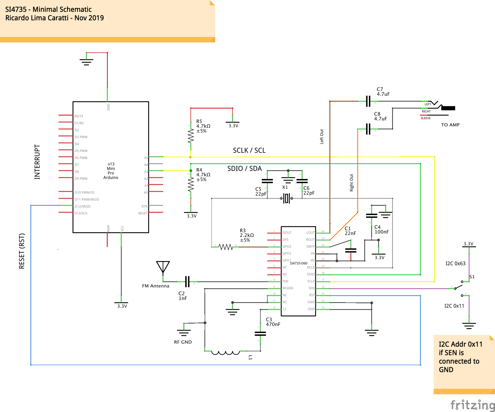

# Basic Examples

This folder has some basic examples that will help you to test you board. 

__All sketches of this folder have been successfully tested on Pro Mini 3.3V; UNO (by using a voltage converter); Arduino Yún (by using a voltage converter); Arduino Micro (see the operating voltage of your Micro); Arduino Mega (by using a voltage converter); Arduino DUE; and ESP32 (Dev Kit and LOLIN32 WEMOS)__

__Regarding SSB support, it is important to say that the SSB patch content is not part of this library__. The paches used here were made available by Mr. [Vadim Afonkin](https://youtu.be/fgjPGnTAVgM) on his [Dropbox repository](https://www.dropbox.com/sh/xzofrl8rfaaqh59/AAA5au2_CVdi50NBtt0IivyIa?dl=0). It is important to note that the author of this library does not encourage anyone to use the SSB patches content for commercial purposes. __In other words, this library only supports SSB patches, the patches themselves are not part of this library__.

The table below show the Si4735 and Arduino Pro Mini pin connections 

| Si4735 pin      |  Arduino Pin  |
| ----------------| ------------  |
| RESET (pin 15)  |     12        |
| SDIO (pin 18)   |     A4        |
| SCLK (pin 17)   |     A5        |

## Example 01 - SI4735_01_POC 

Test and validation of the SI4735 Arduino Library. It is an receiver FM, MW and SW (from 1.7MHz to 30MHz).
The main advantages of using this sketch are: 
* It is a easy way to check if your circuit is working;
* You do not need to connect any display device to make your radio works;
* You do not need connect any push buttons or encoders to change volume and frequency;
* The Arduino IDE is all you need to control the radio.  

__This sketch has been successfully tested on Pro Mini 3.3V; UNO (by using a voltage converter); Arduino Yún (by using a voltage converter); Arduino Micro (see the operating voltage of your Micro); Arduino Mega (by using a voltage converter); Arduino DUE; and ESP32 (LOLIN32 WEMOS)__

I strongly recommend starting with this sketch. This example is a proof of concept of SI4735 Arduino Library. The sketch of this example uses just the __Serial Monitor__ and works only on your __Arduino IDE__. However, you can easily replace the Serial Monitor functions to the device functions that you want to use. 

### Controls used by example 01

| Keyboard command | Description |           
| ---------------- | ----------- |
| A or a | Select MW(AM) |
| F  or f| Select FN |
| U or u | Frequency Up | 
| D or d | Frequency Down |
| S | Seek - Goes to next station |
| s | Seek - Goes to previous station |
| + | Volume Up |
| - | Volume Down |
| 0 | Shows current status | 
| 1 | SW band (from 1.7MHz to 30MHz) | 
| 5-8 | Steps for SW: 5 to step 5kHz; 6 to 10kHz; 7 to 100kHz; 8 to 1000kHz  |

Click [here](https://github.com/pu2clr/SI4735/blob/master/examples/SI4735_01_POC/SI4735_01_POC.ino) to see this example.

 

## Example 02 - SI4735_02_POC_SW 

This example shows how can you use SW features of the Si4735 Arduino Library. Like the previous exemple (Proof of Concept), the sketch of this example __works only on Arduino IDE__. It uses the Serial Monitor to get the commands and show the information. 

__This sketch has been successfully tested on Pro Mini 3.3V; UNO (by using a voltage converter); Arduino Yún (by using a voltage converter); Arduino Micro (see the operating voltage of your Micro); Arduino Mega (by using a voltage converter); Arduino DUE; and ESP32 (LOLIN32 WEMOS)__

### SW Bands used by the example 02
| Band | From (kHz) | To (kHz) | Default (kHz)|
| ---- | ---------- | -------- | ------------ | 
| 60m | 4600| 5200| 4700|
| 49m | 5700| 6200| 6000|
| 40-41m | 7000 | 7500 | 7200|
| 31m | 9300 | 10000 | 9600 |
| 25m | 11400 | 12200 | 1800|
| 22m | 13500 | 13900 | 13600|
| 19m | 15000 | 15800 | 15200|
| 16m | 17400 | 17900 | 17600|
| 21m | 21400 | 21800 | 21500|
| 11m | 27000 | 27500 | 27220|

### Controls used by the example 02

| Keyboard command | Description |
| ---------------- | ----------- | 
| A or a | Select MW(AM) |
| F or f | Select FN |
| U or u | Frequency Up | 
| D or d | Frequency Down |
| S | Seek - Goes to next station |
| s | Seek - Goes to previous station |
| + | Volume Up |
| - | Volume Down |
| 1 | Previous SW band | 
| 2 | Next SW band | 
| 0 | Show current status | 

Click [here](https://github.com/pu2clr/SI4735/blob/master/examples/SI4735_02_POC_SW/SI4735_02_POC_SW.ino) to see this example.

 

## Schematic for Proof of Concept (Examples 01 and 02)

The schematic below is the same shown at the main page of this project and shows how you can setup you SI4735 device.

### SI4735-D60 and SI4732-A10 pinout and replacement 

If you have a SI4732-A10 instead a SI4735-D60 device, [this section can help you](https://github.com/pu2clr/SI4735/tree/master/extras/schematic#si4735-and-si4732-pinout) 

__See some shortwave antenna configuration on__  [Si47XX ANTENNA, SCHEMATIC, LAYOUT, AND DESIGN GUIDELINES; AN383](https://www.silabs.com/documents/public/application-notes/AN383.pdf)

 

## Example 03 - SI4735_03_POC_SSB

This example shows how can you use SSB features of the Si4735 Arduino Library. It uses the Serial Monitor to get the commands and show the information. 

__This sketch has been successfully tested on Pro Mini 3.3V; UNO (by using a voltage converter); Arduino Yún (by using a voltage converter); Arduino Micro (see the operating voltage of your Micro); Arduino Mega (by using a voltage converter); Arduino DUE; and ESP32 (LOLIN32 WEMOS)__

This sketch will download a SSB patch to your SI4735 device (patch_full.h or patch_init.h). It can take up to 15KB of the Arduino memory.
    
In this context, a patch is a piece of software used to change the behavior of the SI4735 device.
There is little information available about patching the SI4735. The following information is the understanding of the author of 
this project and it is not necessarily correct. A patch is executed internally (run by internal MCU) of the device. 
Usually, patches are used to fixes bugs or add improvements and new features of the firmware installed in the internal ROM of the device. 

Patches to the SI4735 are distributed in binary form and have to be transferred to the internal RAM of the device by the host MCU (in this case Arduino). Since the RAM is volatile memory, the patch stored into the device gets lost when you turn off the system. Consequently, the content of the patch has to be transferred again to the device each time after turn on the system or reset the device.

ATTENTION: The author of this project does not guarantee that procedures shown here will work in your development environment. 
Given this, it is at your own risk to continue with the procedures suggested here. 
This library works with the I2C communication protocol and it is designed to apply a SSB extension PATCH to CI SI4735-D60. 
Once again, the author disclaims any liability for any damage this procedure may cause to your SI4735 or other devices that you are using.  

Features of this sketch: 

1) Internal Arduino pull-up (no external resistors on schematic for buttons and encoder);
2) Only SSB (LSB and USB);
3) Audio bandwidth filter 0.5, 1, 1.2, 2.2, 3 and 4kHz;
4) Ten ham radio bands pre configured;
5) BFO Control; and
6) Frequency step switch (1, 5 and 10kHz);

  Main Parts: 
  Encoder with push button; 
  Seven bush buttons;
  OLED Display with I2C protocol;
  Arduino Pro mini 3.3V;  

### Commands tha you can use via Arduino Serial Monitor
| key | Description  |
| --- | -----------  |
| U   | frequency up | 
| D   | frequency down |
| >   | next band | 
| <   | previous band |
| W   | sitches the filter bandwidth |
| B   | increments the BFO |
| b   | decrement the BFO |
| G   | switches on/off the Automatic Gain Control |
| S   | switches the frequency increment and decrement step |
| s   | switches the BFO increment and decrement step |
| X   | shows the current status | 
| H   | shows this help |

For this example you can use the sketch below.

