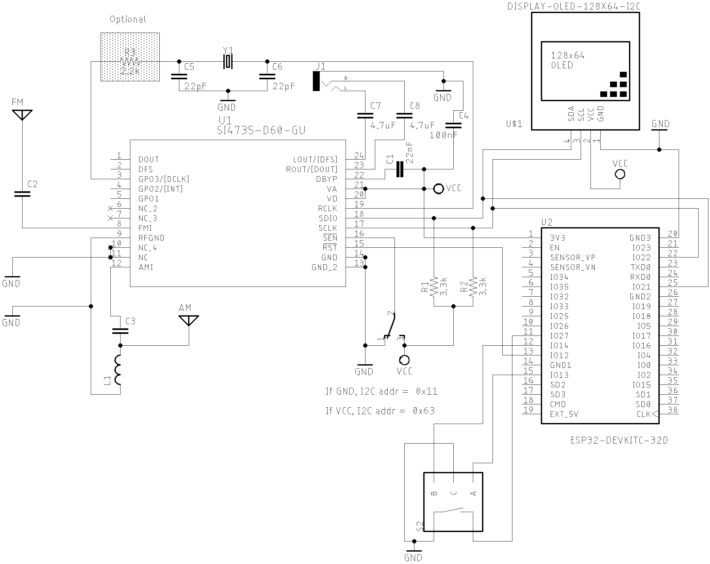
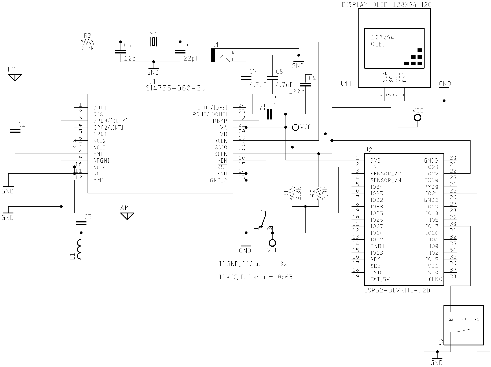
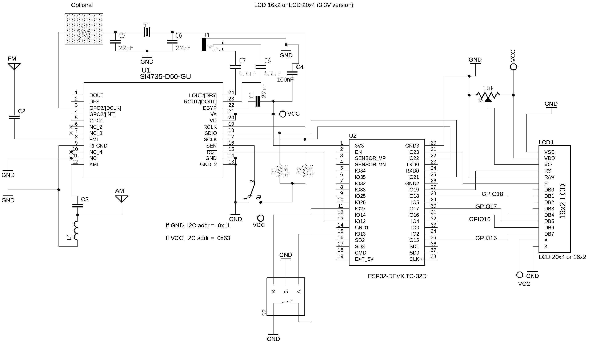

# ESP32 and Si4735 Arduino Library

This folder show some examples with Si4735 Arduino Library  and ESP32 platform.

## Tips to use ESP32 with Arduino:

Before start compiling ESP32 based sketches, you have to configure your Arduino IDE. Follow the steps below:  

* Install the last version of Arduino IDE
* Configure the ESP32 on Arduino IDE 
  * Open the Arduino IDE and select the __Preferences...__ menu item. 
  * Go to __Additional Boards Manager URLs:__ and add the URL: https://raw.githubusercontent.com/espressif/arduino-esp32/gh-pages/package_esp32_index.json
  * After adding the ESP32 URL, go to __Tools__ menu, select the __Boards__ item and then select __Boards Manager...__ option. Finally install ESP32 board .
  
* Install the PU2CLR SI4735 Arduino Library
  * Go to __Tools__ menu and select __Manage libraries...__. Finally install the PU2CLR SI4735 Arduino Library.

* Before compiling, select the ESP32 Board on Arduino IDE.  Go to __Tools__ menu and select __Board__ item. Then, select __ESP32 Arduino__. Finally, select __"ESP32 Dev Module"__ or your specific ESP32 board. You need to know what ESP32 board you are using.  
* If you are using other versions of the ESP32 (ESP32S3, ESP32C3 etc), please check its pinout before. In general the pin setup are not the same shown here.  

## Example SI47XX_01_ESP32_AM_FM_TOUCH_SERIAL_MONITOR

This sketch uses just the Serial Monitor as the human interface to test and validation of the SI4735 Arduino Library on ESP platform. It can be very useful to test your circuit. 

### The main advantages of using this sketch are: 

* It is a easy way to check if your setup is working;
* You do not need to connect any display device to make your radio works;
* You do not need connect any push buttons or encoders to change volume and frequency;
* The Arduino IDE is all you need to control the radio.  


### SI4732 / SI4735 Wire up


ESP32 and SI4735-D60 or SI4732-A10 wire up

| Si4735  | SI4732   | DESC.  | ESP32    (GPIO)    |
|---------| -------- |--------|--------------------|
| pin 15  |  pin 9   | RESET  |   12 (GPIO12)      |  
| pin 18  |  pin 12  | SDIO   |   21 (SDA / GPI21) |
| pin 17  |  pin 11  | SCLK   |   22 (SCL / GPI22) |


## Example SI47XX_02_ESP32_TOUCH_ALL_IN_ONE

This example is a complete FM/AM/LW/SW (with SSB support) receiver based on SI4735 running on ESP32 


### About SSB support

The the __PU2CLR SI4735 Arduino Library__ implements a set of methods to apply patches and deal with SSB mode. All documentation about pathces can be seen [here](https://pu2clr.github.io/SI4735/extras/apidoc/html/group__group17.html).

__First of all, it is important to say that the SSB patch content is not part of this library__. The paches used here were made available by Mr. [Vadim Afonkin](https://youtu.be/fgjPGnTAVgM) on his [Dropbox repository](https://www.dropbox.com/sh/xzofrl8rfaaqh59/AAA5au2_CVdi50NBtt0IivyIa?dl=0). It is important to note that the author of this library does not encourage anyone to use the SSB patches content for commercial purposes. __In other words, this library only supports SSB patches, the patches themselves are not part of this library__.

[Read more about PU2CLR SI4735 Arduino Library SSB support](https://pu2clr.github.io/SI4735/#si4735-patch-support-for-single-side-band)


### ESP32 considerations

The ESP32 has a great resource to interact with system. Instead of buttons, you can use the capacitive sensors available on ESP32 board family. 

__The ESP32 is a 3.3V part. Pay attention on your I2C LCD device voltage. If it is not 3.3V, the system cannot work properly__.

The ESP32 board has enough RAM memory to support all SSB patch and a nice TFT Display library. Consider this feature to improve your sketch.


### Schematic 

You can use the same schematic used on Arduino family. 
However, you have pay attention to the new configuration pins on ESP32. See tables bellow. The circuit below shows a generic setup for ESP32. __It is very important to consider the pinout of your ESP32 board__.

<BR> 

#### ESP32 basic setup



<BR>

#### ESP32 DEVKIT with OLED and Encoder setup




### ESP-LOLIN32-WEMOS touch capacitive 

| GPIO   | Used as  | Constant number (#define)| Function Description | 
| ------ | -------- | ------------------ | ----------- | 
| GPIO32 | Capacitive | 32 (GPIO32) | Switch MODE (Am/LSB/USB) | 
| GPIO33 | Capacitive | 33 (GPIO33) | Used to select the banddwith. Values: 1.2, 2.2, 3.0, 4.0, 0.5, 1.0 kHz |
| GPIO27 | Capacitive | 27 (GPIO27) | Volume Up |
| GPIO14 | Capacitive | 14 (GPIO14) | Volume Down |
| GPIO12 | Capacitive | 12 (GPIO12) | Switch to the next band |
| GPIO4  | Capacitive |  4 (GPIO4)  | Switch to the previous band | 
| GPIO2  | Capacitive |  2 (GPIO2)  | Used to select the increment or decrement frequency step (1, 5 or 10 kHz)
| GPIO15 | Capacitive | 15 (GPUI15) | Used to select the enconder control (BFO or VFO) 


### Encoder wire up

| Encoder   | Function              |ESP LOLIN32 WEMOS (GPIO) |
|-----------| ----------------------|-------------------------|
| A         |  interrupt            |   16  (GPIO16)          |
| B         |  interrupt            |   17  (GPIO17)          |
| BUTTON    |  ENCODER PUSH BUTTON  |   23  (GPIO23)          |  


It seams that in some ESP32 board, the I2C bus is not configured prorpelly by default. However, you can set almost any pin on ESP32 to setup I2C capabilities. All you have to do is call __Wire.begin(SDA, SCL);__ where SDA and SCL are the ESP32 GPIO pins. The code below shows that.

```cpp
// I2C bus pin on ESP32
#define ESP32_I2C_SDA 21
#define ESP32_I2C_SCL 22

.
.
.
.

void setup() {


  // The line below may be necessary to setup I2C pins on ESP32 Dev Module
  Wire.begin(ESP32_I2C_SDA, ESP32_I2C_SCL);


}
```


### Main features:

* This sketch has been successfully tested on ESP LOLIN32 (WEMOS) and ESP32 Devkit;
* It uses the capacitive touch ESP32 resource;
* I2C LiquidCrystal/LCD 20x4;
* Encoder;
* FM, AM (MW and SW) and SSB (LSB and USB);
* Audio bandwidth filter 0.5, 1, 1.2, 2.2, 3 and 4kHz;
* BFO Control; and
* Frequency step switch (1, 5 and 10kHz).


<BR>

### ESP32 and LCD16x2 (3.3V) or LCD20x4 (3.3V) schematic





#### Wire up 

ESP32 Wire up with LCD, encoder/pushbutton and SI4735-D60
    
| Device name               | Device Pin / Description      |  ESP32        |
| ----------------          | ----------------------------- | ------------- |
|    LCD 16x2 or 20x4       |                               |               |
|                           | D4                            |  GPIO18       |
|                           | D5                            |  GPIO17       |
|                           | D6                            |  GPIO16       |
|                           | D7                            |  GPIO15       |
|                           | RS                            |  GPIO19       |
|                           | E/ENA                         |  GPIO23       |
|                           | RW & VSS & K (16)             |  GND          |
|                           | A (15) & VDD                  |  +Vcc         |
|                           | VO (see 20K tripot connection)|  ------------ |
|     SS473X                |                               |               |
|                           | RESET (pin 15)                |  GPIO12       |
|                           | SDIO (pin 18)                 |  GPIO21       |
|                           | SCLK (pin 17)                 |  GPIO22       |
|                           | (*1)SEN (pin 16)              |  +Vcc or GND  |
|    Encoder                |                               |               |
|                           | A                             |  CPIO13       |
|                           | B                             |  GPIO14       |
|                           | PUSH BUTTON (encoder)         |  GPIO27       |


## Example SI47XX_03_ESP32_ALL_IN_ONE_TFT

Still under construction this sketch will show how to use TFT with ESP32, Si4735 device and Si4735 Arduino Library.


### ESP32 and TFT  wire up 
  
|  LCD SCREEN           | NODEMCU ESP32 PIN                          |
| -------------------  | ------------------------------------------- |
|      VCC             |     3.3V                                    |
|      GND             |     GND                                     |
|      LED             |     3.3V                                    |
|   SCL (SPI Clock)    | GPIO18 / VSPI SCK (SPI Clock)               |
|   SDA (SPI Data)     | GPIO23 / VSPI MOSI (MOSI, Data to Screen)   |
|   RS or DC           | GPIO2 (In some boards it is labelled as DC) |
|   RST (Screen reset) | GPIO4                                       |
|   CS  or SS          | GPIO5 VSPI SS (Slave Select or Chip Select) |


### ESP32 OLED_IN_ONE sketch 


#### Wire up 

 ESP32 and components wire up. 
  
  | Device name               | Device Pin / Description      |  ESP32        |
  | ----------------          | ----------------------------- | ------------  |
  |    OLED                   |                               |               |
  |                           | SDA/SDIO                      |  GPI21        | 
  |                           | SCL/SCLK                      |  GPI22        | 
  |    Encoder                |                               |               |
  |                           | A                             |  GPIO 13      |
  |                           | B                             |  GPIO 14      |
  |                           | PUSH BUTTON (encoder)         |  GPIO 27      |


### ESP32 OLED_IN_ONE_TWO_ENCODERS sketch 


#### Wire up 
  
| Device name               | Device Pin / Description      |  ESP32        |
| ----------------          | ----------------------------- | ------------  |
|    OLED                   |                               |               |
|                           | SDA/SDIO                      |  GPI21        | 
|                           | SCL/SCLK                      |  GPI22        | 
|    Encoder1               |                               |               |
|                           | A                             |  GPIO 13      |
|                           | B                             |  GPIO 14      |
|                           | PUSH BUTTON                   |  GPIO 27      | 
|    Encoder2               | A                             |  GPIO 25      |
|                           | B                             |  GPIO 26      |    
|                           | PUSH BUTTON (encoder)         |  GPIO 32      |


