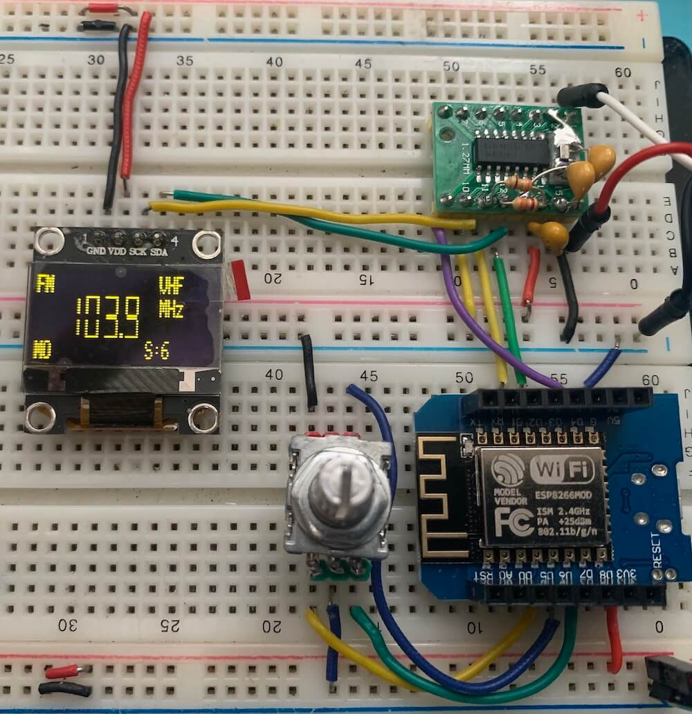

# ESP8266 (ESP-12F) and Si473X Arduino Library

This folder show some examples with Si473X Arduino Library  and ESP8266 platform.

Before start compiling ESP8266 based sketches, you have to configure your Arduino IDE. 
To do this, check [Installing the ESP8266 Board in Arduino IDE (Windows, Mac OS X, Linux)](https://randomnerdtutorials.com/how-to-install-esp8266-board-arduino-ide/).

## Example SI47XX_01_ESP12F_AM_FM_TOUCH_SERIAL_MONITOR

This sketch uses just the Serial Monitor as the human interface to test and validation of the Si473X Arduino Library on ESP platform. It can be very useful to test your circuit. 

### The main advantages of using this sketch are: 

* It is a easy way to check if your setup is working;
* You do not need to connect any display device to make your radio works;
* You do not need connect any push buttons or encoders to change volume and frequency;
* The Arduino IDE is all you need to control the radio.  

### Si4735 Wire up

| Si473X    | Function              |ESP LOLIN32 WEMOS (GPIO) |
|-----------| ----------------------|-------------------------|
| pin 15    |   RESET               |   2 (GPIO2)           |  
| pin 18    |   SDIO                |   4 (SDA / GPIO4)     |
| pin 17    |   SCLK                |   5 (SCL / GPIO5)     |

# ESP8266 SCHEMATICS 

## Standalone ESP12F

## ESP8266 Generic Module

