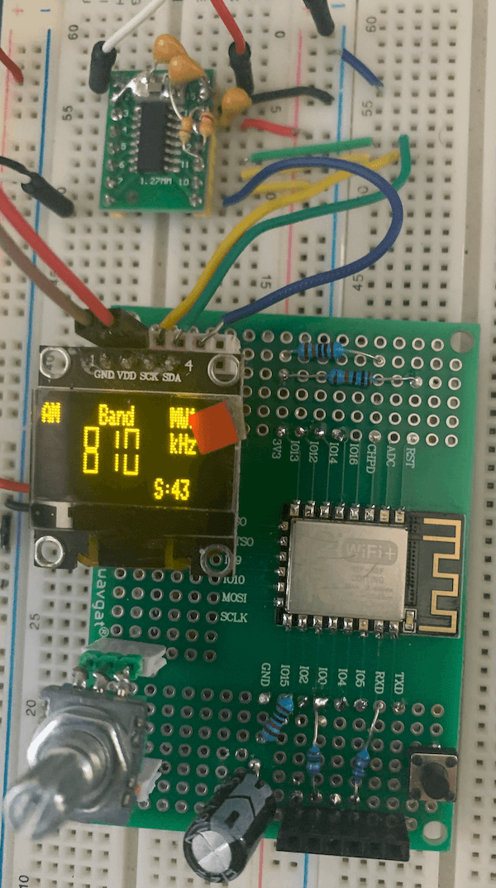
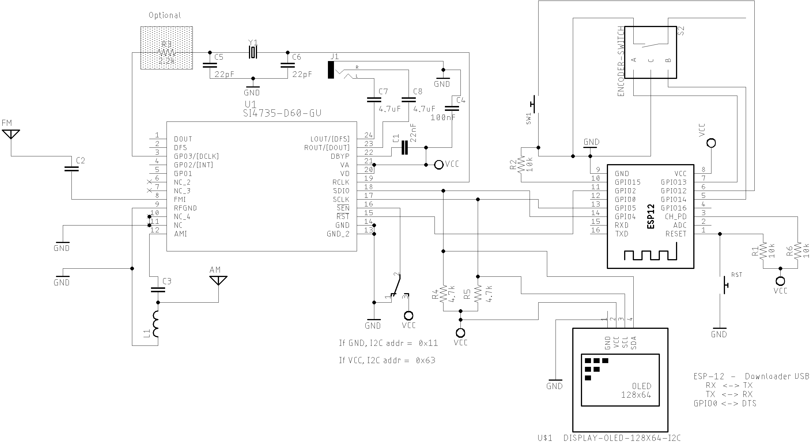

# ESP8266 (ESP-12F) and Si473X Arduino Library

The [ESP8266](https://www.espressif.com/en/products/socs/esp8266) is based on a 32-bit RISC processor, low power consumption;  up to 160 MHz clock speed; Wi-Fi integrated; 64K RAM; 512KB to 4MB flash memory; and 16 GPIO pins.

This folder show some examples with Si473X Arduino Library  and ESP8266 platform.

Before start compiling ESP8266 based sketches, you have to configure your Arduino IDE. 
To do this, check [Installing the ESP8266 Board in Arduino IDE (Windows, Mac OS X, Linux)](https://randomnerdtutorials.com/how-to-install-esp8266-board-arduino-ide/).

## Example SI47XX_01_ESP12F_AM_FM_TOUCH_SERIAL_MONITOR

This sketch uses just the Serial Monitor as the human interface to test and validation of the Si473X Arduino Library on ESP platform. It can be very useful to test your circuit. 

### The main advantages of using this sketch are: 

* It is a easy way to check if your setup is working;
* You do not need to connect any display device to make your radio works;
* You do not need connect any push buttons or encoders to change volume and frequency;
* The Arduino IDE is all you need to control the radio.  

### ESP8266 / ESP12F wire up

#### SI4732-A10 and SI4735-G60 wire up

| Si4735  | SI4732   | DESC.  | ESP8266  (GPIO)    |
|---------| -------- |--------|--------------------|
| pin 15  |  pin 9   | RESET  |   (GPIO2)        |  
| pin 18  |  pin 12  | SDIO   |   (SDA / GPIO4)  |
| pin 17  |  pin 11  | SCLK   |   (SCL / GPIO5)  |

#### ESP8266/ESP12F, OLED and encoder wire up. 
  
| Device name               | Device Pin / Description      |  ESP8266      |
| ----------------          | ----------------------------- | ------------  |
|    OLED                   |                               |               |
|                           | SDA/SDIO                      |  GPIO4        | 
|                           | SCL/SCLK                      |  GPIO5        | 
|    Encoder                |                               |               |
|                           | A                             |  GPIO13       |
|                           | B                             |  GPIO14       |
|                           | PUSH BUTTON (encoder)         |  GPIO12       |

## SI4732-A10 and ESP8266 prototype 

### ESP8266 Module

### ESP8266 standalone ESP12F

# ESP8266 SCHEMATICS 

## Standalone ESP12F

## ESP8266 Generic Module

