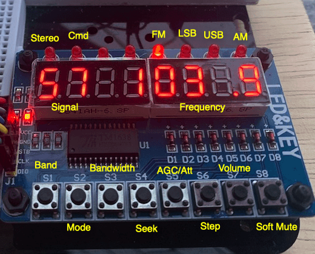
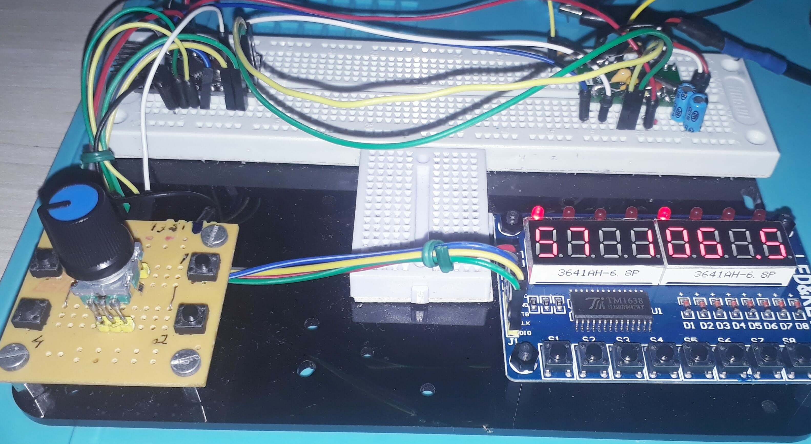

# User manual

## Interface 

### Push Buttons

| push button | Function / action |
| ----------- | ----------------- |
| S1          | Band switch button |
| S2          | Mode FM/AM/SSB |
| S3          | Used to select the banddwith |
| S4          | Seek |  
| S5          | Switch AGC ON/OF |
| S6          | Increment or decrement frequency step (1, 5 or 10 kHz) |
| S7          | Volume Control |
| S8          | External AUDIO MUTE circuit control |
| Encoder     | VFO/BFO switch |

### LED

| LED         | Status            |
| ----------- | ----------------- |
| LED1        | FM mono or stereo |
| LED2        | Indicates the system is running an user command |
| LED3        | Not used |
| LED4        | Not used |  
| LED5        | FM mode  |
| LED6        | LSB mode |
| LED7        | USB mode |
| LED8        | AM mode |

### RSSI status

The RSSI status uses two digits from display array (the leftmost digits) 

### Frequency

The current frequency is show on the the five digits to the right of the display.

## Commands

1. BAND, MODE, AGC/Attenuation, banddwith, STEP, Volume and Soft Mute

Press the desired command  push button (S1, S2, S3 etc) and after, rotate the encoder to select the option you want. 

For example: To switch the band, press the band button (S1) and then rotate the encoder clockwise or counterclockwise.
To switch the mode (AM, LSB or USB), press mode button (S2) and then rotate the encoder.

The same idea you can use to configure AGC/Attenuation, banddwith, STEP , Volume and Soft Mute

After finishing a given setup, you can wait for 1.5 seconds or press the command button again to back the control to VFO.
__You can increase or decrease that time to make the interface more suitable for you by changing the ELAPSED_COMMAND constant__

Tip: Try press and release the push button fastly. I mean, do not keep the button pressed for a long time.
     If you do that, you might alternate the command status (enable and disable) randomly.

1. SEEK COMMAND

The seek button should be used to find a station. The seek direction is based on the last encoder movement.
If clockwise, the seek will go up; if counterclockwise, the seek will go down.
Press the seek push button (S4). 

3. VFO/VFO Switch

To control the VFO and BFO, used the encoder push button. The display will show if you are using VFO or BFO.
It is importante to say the this action work only on SSB mode.

## Wire up on Arduino UNO, Pro mini and SI4735-D60

  | Device name      | Device Pin / Description |  Arduino Pin  |
  | ---------------- | -------------------------| ------------  |
  |    TM1638        |                          |               |
  |                  | STB                      |    4          |
  |                  | CLK                      |    7          |
  |                  | DIO                      |    8          |
  |                  | VCC                      |    3.3V       |
  |                  | GND                      |    GND        |
  |    Si4735        |                          |               |
  |                  | RESET (pin 15)           |     12        |
  |                  | SDIO (pin 18)            |     A4        |
  |                  | SCLK (pin 17)            |     A5        |
  |                  | SEN (pin 16)             |    GND        |
  |    Encoder       |                          |               |
  |                  | A                        |       2       |
  |                  | B                        |       3       |
  |                  | Encoder button           |      A0       |

