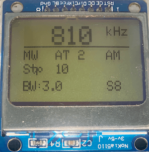
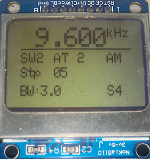
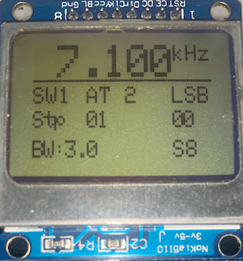
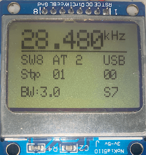
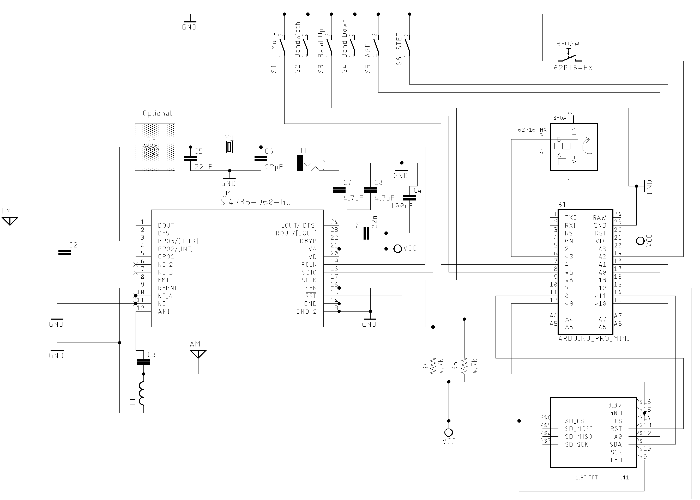
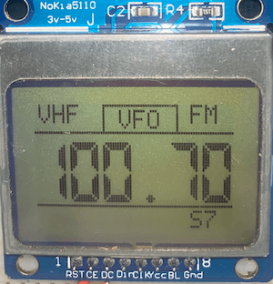
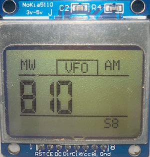
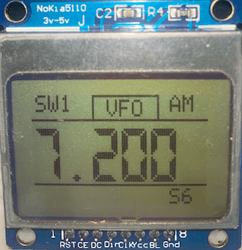
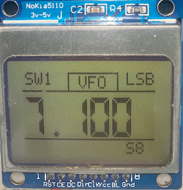
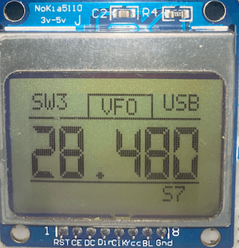

# Arduino / ATmega328 with Nokia 5110

The schematics shown here use the SI4735-D60 device. If you use the SI4732-A10, please check ["SI4735-D60 and SI4732-A10 replacement" table](https://github.com/pu2clr/SI4735/tree/master/extras/schematic#si4735-and-si4732-pinout).  

## Example ALL_IN_ONE_7_BUTTONS (One encoder and 7 buttons) 

This example uses the Adafruit libraries __Adafruit_GFX__ and __Adafruit_PCD8544__. 
The receiver works on VFH/FM (broadcast stations), and  LW,MW and SW on AM and SSB modes.

| FM | MW/AM | SW/AM | 40M/LSB | 10M/USB |
| -- | ----- | ----- | ------- | ------- |
|  |  |  |  |  |  

The schematic below shows the Arduino board based on ATmega 328 and the Nokia 5110 display

## Wire up on Arduino UNO, Pro mini and SI4735-D60

| Device name               | Device Pin / Description      |  Arduino Pin  |
| ----------------          | ----------------------------- | ------------  |
| Display NOKIA             |                               |               |
|                           | (1) RST (RESET)               |     8         |
|                           | (2) CE or CS                  |     9         |
|                           | (3) DC or DO                  |    10         |
|                           | (4) DIN or DI or MOSI         |    11         |
|                           | (5) CLK                       |    13         |
|                           | (6) VCC  (3V-5V)              |    +VCC       |
|                           | (7) BL/DL/LIGHT               |    +VCC       |
|                           | (8) GND                       |    GND        |
|     Si4735                |                               |               |
|                           | (*3) RESET (pin 15)           |     12        |
|                           | (*3) SDIO (pin 18)            |     A4        |
|                           | (*3) SCLK (pin 17)            |     A5        |
|                           | (*4) SEN (pin 16)             |    GND        |
|     Buttons               |                               |               |
|                           | (*1)Switch MODE (AM/LSB/AM)   |      4        |
|                           | (*1)Banddwith                 |      5        |
|                           | (*1)BAND                      |      6        |
|                           | (*2)SEEK                      |      7        |
|                           | (*1)AGC/Attenuation           |     14 / A0   |
|                           | (*1)STEP                      |     15 / A1   |
|                           | VFO/BFO Switch (Encoder)      |     16 / A2   |
|    Encoder                |                               |               |
|                           | A                             |       2       |
|                           | B                             |       3       |

* (*1) You have to press the push button and after, rotate the encoder to select the parameter.      After you activate a command by pressing a push button, it will keep active for 2,5 seconds.
* (*2) The SEEK direction is based on the last movement of the encoder. If the last movement of       the encoder was clockwise, the SEEK will be towards the upper limit. If the last movement of       the encoder was counterclockwise, the SEEK direction will be towards the lower limit.
* (*3) - If you are using the SI4732-A10, check the corresponding pin numbers.
* (*4) - If you are using the SI4735-D60, connect the SEN pin to the ground; If you are using the SI4732-A10, connect the SEN pin to the +Vcc.

## User instructions 

1. BAND, MODE, AGC/Attenuation, banddwith and STEP

Press the the correspondent push button and after, rotate the encoder to select the option. For example: 
To switch the band, press the band button and then rotate the encoder clockwise or counterclockwise. 
The display will show you the current band. 

To switch the mode (AM, LSB or USB), press mode button and then rotate the encoder.

The same idea you can use to AGC/Attenuation, STEP and Banddwith.

Tip: Try press and release the push button fastly. I mean, do not keep the button pressed for a long time. 
     If you do that, you might alternate the command status (enable and disable) randomly. 

2. SEEK COMMAND

The seek button should be used to find a station. The seek direction is based on the last encoder movement.
If clockwise, the seek will go up; if counterclockwise, the seek will go down.

3. VFO/VFO Switch 

To control the VFO and BFO, used the encoder push button. The display will show if you are using VFO or BFO.

## Example ALL_IN_ONE_ONE_ENCODER 

This example uses the Adafruit librarie __LCD5110_Graph__ to control the Nokia 5110. 
It is not available on Arduino IDE. To install __LCD5110_Graph__ library, download that library on [Rinky-Dink Eletronics](http://www.rinkydinkelectronics.com/library.php?id=47) site, unzip the file and move the folder unzipped to your Arduino Libraries folder. 

The receiver works on VFH/FM (broadcast stations), and  LW,MW and SW on AM and SSB modes.

| FM | MW/AM | SW/AM | 40M/LSB | 10M/USB |
| -- | ----- | ----- | ------- | ------- |
|  |  |  |  |  |  

The schematic below shows the Arduino board based on ATmega 328 and the Nokia 5110 display controlled just by one encoder and one push button.

## Wire up on Atmega328 based board (Arduino UNO, Nano or Pro mini) and SI4735-D60

| Device name               | Device Pin / Description      |  Arduino Pin  |
| ----------------          | ----------------------------- | ------------  |
| Display NOKIA             |                               |               |
|                           | (1) RST (RESET)               |     8         |
|                           | (2) CE or CS                  |     9         |
|                           | (3) DC or DO                  |    10         |
|                           | (4) DIN or DI or MOSI         |    11         |
|                           | (5) CLK                       |    13         |
|                           | (6) VCC  (3V-5V)              |    +VCC       |
|                           | (7) BL/DL/LIGHT               |    +VCC       |
|                           | (8) GND                       |    GND        |
|     Si4735                |                               |               |
|                           | (*3) RESET (pin 15)           |     12        |
|                           | (*3) SDIO (pin 18)            |     A4        |
|                           | (*3) SCLK (pin 17)            |     A5        |
|                           | (*4) SEN (pin 16)             |    GND        |
|     Button                |                               |               |
|                           | Encoder Push button           |     14 / A0   |
|     Encoder               |                               |               |
|                           | A                             |       2       |
|                           | B                             |       3       |

### User Instructions

1. BAND SELECTION

   * Select the band by pressing the encoder push button once and then rotate the encoder clockwise or counterclockwise.
   * When the desired band is shown on display, you  can press the button once again or wait for about 2 seconds.
   * You will notice the control will go back to the VFO.

2. STEP, MODE, SEEK UP, SEEK DOWN, AGC/Attenuation, bandwidth, Soft Mute and VOLUME

     * Press the encoder push button twice (within 1/2 second).
     * After that, the display will show you the Menu text. Rotate the encoder clockwise or counterclockwise to select the option (STEP, MODE, AGC/Attenuation, bandwidth, VOLUME, etc).
     * After that, select the option you want to setup by pressing the encoder push button once again.
     * After that, rotate the encoder clockwise or counterclockwise to select the parameter.
     * Finally, you can press the button once again or wait for about 2 seconds.
     * The control will go back to the VFO.  

3. VFO/BFO Switch

    * Press the encoder push button twice (within 1/2 second).
    * Rotate the encoder clockwise or counterclockwise and go to the BFO option. This option is shown only on SSB mode.
    * Press the encoder push button once again.
    * Rotate the encoder clockwise or counterclockwise to increment or decrement the BFO (select the offset).
    * If you press the button again or stop rotating the ancoder for about 2 seconds, the control will go back to the VFO.

__ATTENTION__: Try press and release the push button fastly. I mean, do not keep the button pressed for a long time. If you do that, you might alternate the command status (enable and disable) randomly.

4. EEPROM RESET

   The main information of the receiver is stored into the Arduino EEPROM. This way, when you turn the receiver on, the last receiver status is rescued. To RESET the receiver to DEFAULT status, turn it on with the encoder pust button pressed. Check the message "EEPROM RESETED".

  
