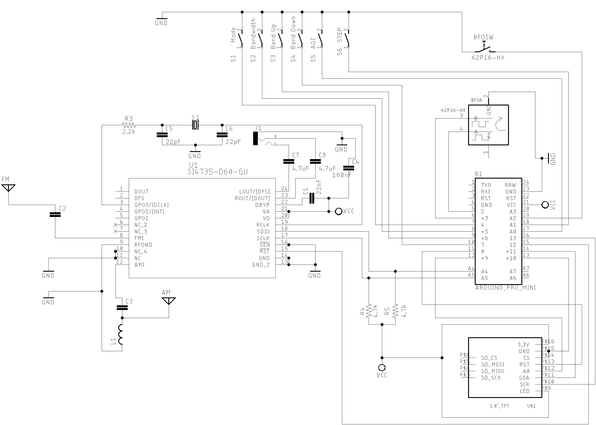
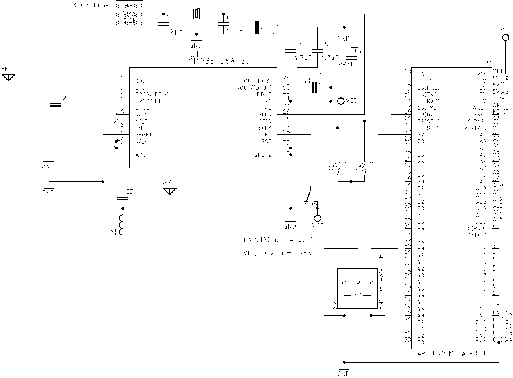

# PU2CLR SI4735 Arduino Library TFT and touch screen examples

This folder has examples of using the TFT  display. If you plan to use the touch screen version, I recommend reading the touch calibration process carefully. Otherwise, your touch will not work properly. See below the [SI47XX_02_RDS_TFT_TOUCH_SHIELD](https://github.com/pu2clr/SI4735/tree/master/examples/SI47XX_10_RDS#si47xx_02_rds_tft_touch_shield) sketch details. 

* __SI47XX_03_RDS_TFT_ILI9225__ sketch uses an Arduino Pro Mini, 3.3V (8MZ) with a SPI TFT from MICROYUM (2" - 176 x 220).  It is also a complete radio capable to tune LW, MW, SW on AM and SSB mode and also receive the regular comercial FM stations. See the source code comments for more information;
* __SI47XX_02_RDS_TFT_TOUCH_SHIELD__ sketch uses the mcufriend TFT touct Display Shield. You can use it on Mega2560 or DUE. It is also an "all in one receiver" (FM, AM and SSB - LW, MW and SW). See the source code comments for more information. __You will need to calibrate your touch screen before. [See how](https://github.com/pu2clr/SI4735/tree/master/examples/SI47XX_10_RDS#si47xx_02_rds_tft_touch_shield)__;
* __SI4735_04_RDS_ALL_IN_ONE_OLED__ sketch is very similar to the __SI47XX_03_RDS_TFT_ILI9225__. It uses __OLED__ display.  See the source code comments for more information.


## SI47XX_03_RDS_TFT_ILI9225 

This sketch uses an Arduino Pro Mini, 3.3V (8MZ) with a [SPI TFT from MICROYUM (2" - 176 x 220)](https://github.com/Nkawu/TFT_22_ILI9225/wiki) based on ILI9225 driver.  The Arduino library used to control that display device is MCUFRIEND_kbv. Please, install it before start working with this sketch.  

It is also a complete radio capable to tune LW, MW, SW on AM and SSB mode and also receive the regular commercial stations.  It is important to know the SSB support works on SI4735-D60 and SI4732-A10 devices. 

1. Encoder to tune stations;
2. Band selection via push buttons
3. AM, FM and SSB;
4. LW, MW and SW;
5. Bandwidth filter;
6. BFO Control; 
7. VFO/BFO switching via encoder push button;
8. 12 SW bands + one from (1.7MHz to 30MHz); 
9. Frequency step switch (1, 5, 10, 100 and 500kHz kHz);
10. FM/RDS functions.
  

### Wire up and functions

The table below show the pins wire up for this example on Arduino Pro Mini.

| Device name               | Device Pin / Description  |  Arduino Pin  |
| ----------------          | --------------------      | ------------  |
| __Display TFT__           |                           |               |                    
|                           | RST (RESET)               |      8        |  
|                           | RS  or DC  or A0          |      9        |
|                           | CS  or SS                 |     10        |
|                           | SDA orSDI or MOSI         |     11        | 
|                           | CLK                       |     13        | 
|                           | BL (LED)                  |    +VCC       |
| __Si4735__                |                           |               |
|                           | *1 RESET (pin 15)         |     12        |
|                           | *1 SDIO (pin 18)          |     A4        |
|                           | *1SCLK (pin 17)           |     A5        |
|                           | *2 SEN (pin 16)           |    GND        | 
| __Buttons__               |                           |               | 
|                           | Switch MODE (AM/LSB/AM)   |      4        |
|                           | Banddwith                 |      5        | 
|                           | Next band                 |      6        |
|                           | Previous band             |      7        |
|                           | AGC ON/OF                 |     14 / A0   |
|                           | Frequency Step            |     15 / A1   | 
|                           | VFO/VFO Switch            |     16 / A2   |
| __Encoder__               |                           |               |
|                           | A                         |       2       |
|                           | B                         |       3       |

  *1 - If you are using the SI4732-A10, check the corresponding pin numbers.  
  *2 - If you are using the SI4735-D60, connect the SEN pin to the ground; 
       If you are using the SI4732-A10, connect the SEN pin to the +Vcc. 

<BR>

The schematic below guides you to build your own receiver based on the SI473X with TFT display. Please, read the comments at the beginning of each sketch example.  





## SI47XX_03_RDS_TFT_ILI9225_NEW

This sketch uses an Arduino Pro Mini, 3.3V (8MZ) with a SPI TFT from MICROYUM (2" - 176 x 220) - ILI9225.
The Arduino library used to control that display device is TFT_22_ILI9225 (seeL https://github.com/Nkawu/TFT_22_ILI9225).
Please, install it before start working  with this sketch.

It is important to know the SSB support works on SI4735-D60 and SI4732-A10 devices.

Wire up on Arduino UNO, Pro mini and SI4735-D60

| Device name               | Device Pin / Description  |  Arduino Pin  |
| ----------------          | --------------------      | ------------  |
| Display TFT               |                           |               |
|                           | RST (RESET)               |      8        |
|                           | RS or DC                  |      9        |
|                           | CS or SS                  |     10        |
|                           | SDI / SDA / MOSI          |     11        |
|                           | CLK                       |     13        |
|     Si4735                |                           |               |
|                           | *1 RESET (pin 15)         |     12        |
|                           | *1 SDIO (pin 18)          |     A4        |
|                           | *1 SCLK (pin 17)          |     A5        |
|                           | *2 SEN (pin 16)           |    GND        |  
|     Buttons               |                           |               |
|                           | Switch MODE (AM/LSB/AM)   |      4        |
|                           | Banddwith                 |      5        |
|                           | Band Switch               |      6        |
|                           | Seek Station              |      7        |
|                           | AGC ON/OF                 |     14 / A0   |
|                           | Frequency Step            |     15 / A1   |
|                           | VFO/VFO Switch            |     16 / A2   |
|    Encoder                |                           |               |
|                           | A                         |       2       |
|                           | B                         |       3       |

  *1 - If you are using the SI4732-A10, check the corresponding pin numbers.  
  *2 - If you are using the SI4735-D60, connect the SEN pin to the ground; 
       If you are using the SI4732-A10, connect the SEN pin to the +Vcc. 


### User manual for SI47XX_03_RDS_TFT_ILI9225_NEW

#### Commands 

1. BAND, MODE, AGC/Attenuation, banddwith and STEP comands

Press the desired command push button and after, rotate the encoder to select the option you want. For example:
To switch the band, press the band button and then rotate the encoder clockwise or counterclockwise.
The display will show you the current band. If you are on AM mode, you can use also the encoder push
button to select the band (on SSB mode the encoder push button is used to switch the VFO and BFO).

To switch the mode (AM, LSB or USB), press Mode push button and then rotate the encoder.

The same idea you can use to AGC/Attenuation, STEP and Banddwith.

2. SEEK COMMAND

The seek button should be used to find a station. The seek direction is based on the last encoder movement.
If clockwise, the seek will go up; if counterclockwise, the seek will go down.

3. VFO/VFO Switch

To control the VFO and BFO, used the encoder push button. The display will show if you are using VFO or BFO.
It is importante to say the this action work only on SSB mode.

Tip: Try press and release the push button fastly. I mean, do not keep the button pressed for a long time.
     If you do that, you might alternate the command status (enable and disable) randomly.


## [SI47XX_02_RDS_TFT_TOUCH_SHIELD](https://github.com/pu2clr/SI4735/tree/master/examples/SI47XX_16_ARDUINO_DUE_MEGA/SI47XX_02_RDS_TFT_TOUCH_SHIELD)

This sketch uses the TFT Touch Shield (2.4") from mcufriend. You can use it on Mega2560 and Arduino DUE. See the wire up below. 

### Wire up


  |Device name      | Function                |  MEGA/DUE Pin     |
  |-----------      | ----------------------  |  -------------    |
  | __Si4735__      |                         |                   |
  | pin 15          |   RESET                 |   22              |  
  | pin 18          |   SDIO                  |   20 (SDA)        |
  | pin 17          |   SCLK                  |   21 (SCL)        |
  | __Encoder__     |                         |                   |
  | A               |                         |   18              |
  | B               |                         |   19              |
  | BUTTON          |  ENCODER PUSH BUTTON    |   23              |  


<BR> 


The schematic below shows just the Arduino DUE and SI473X connections. The touch TFT used by this circuit is a shield that can be connected to the Arduino DUE directly. If you intent to use Arduino Mega, you have to add a bidirectional logic level converter. 





### The photo below shows the SI47XX_02_RDS_TFT_TOUCH_SHIELD version. 


### Touch screen calibration process

The Arduino library used to control the TFT shield from mcufriend or equivalent, is the MCUFRIEND_kbv. Please, install this library before start working with SI47XX_02_TFT_TOUCH_SHIELD sketch.

All toutch screen needs to be calibrated to work properly. To do that, use the __TouchScreen_Calibr_native.ino__ that comes with MCUFRIEND_kbv library. Read the TouchScreen_Calibr_native.ino and check the XP, XM , YP and YM pins configuration. You might need to change the XP, XM , YP and YM values in the TouchScreen_Calibr_native.ino depending on the display you are using.  In the __TouchScreen_Calibr_native.ino__ sketch, check the corresponding code lines as shown below.

```cpp
// MCUFRIEND UNO shield shares pins with the TFT.
#if defined(ESP32)
int XP = 27, YP = 4, XM = 15, YM = 14;  //most common configuration
#else
// int XP = 6, YP = A1, XM = A2, YM = 7;  //most common configuration
int XP = 7, YP = A2, XM = A1, YM = 6;  //most common configuration
#endif
//#include <TouchScreen.h>         //Adafruit Library
//TouchScreen ts(XP, YP, XM, YM, 300);   //re-initialised after diagnose
//TSPoint tp;                            //global point
#include "TouchScreen_kbv.h"         //my hacked version
TouchScreen_kbv ts(XP, YP, XM, YM, 300);   //re-initialised after diagnose
TSPoint_kbv tp;                            //global point
```

__In some TFT devices, it is necessary to change the XP, YP, XM and YM pins setup__.

Follow the instructions provided by the calibration sketch. During the calibration process, the __TouchScreen_Calibr_native.ino__ will give you, via Serial Monitor, the information similar to the shown below. 

cx=184 cy=874 cz=291 LEFT, BOT, Pressure
cx=494 cy=187 cz=595 MIDW, TOP, Pressure
cx=497 cy=872 cz=367 MIDW, BOT, Pressure
cx=800 cy=180 cz=671 RT, TOP, Pressure
cx=802 cy=524 cz=589 RT, MIDH, Pressure
cx=809 cy=865 cz=515 RT, BOT, Pressure
MCUFRIEND_kbv ID=0x2053  240 x 320

```cpp
const int XP=7,XM=A1,YP=A2,YM=6; //240x320 ID=0x2053
const int TS_LEFT=155,TS_RT=831,TS_TOP=158,TS_BOT=892;
```

PORTRAIT CALIBRATION     240 x 320
x = map(p.x, LEFT=155, RT=831, 0, 240)
y = map(p.y, TOP=158, BOT=892, 0, 320)
Touch Pin Wiring XP=7 XM=A1 YP=A2 YM=6
LANDSCAPE CALIBRATION    320 x 240
x = map(p.y, LEFT=158, RT=892, 0, 320)
y = map(p.x, TOP=831, BOT=155, 0, 240)

__Finally, you must copy and paste the two lines highlighted above to the SI47XX_02_RDS_TFT_TOUCH_SHIELD sketch. The following code illustrates this action__.

```cpp
MCUFRIEND_kbv tft;
SI4735 si4735;

// ALL Touch panels and wiring is DIFFERENT
// copy-paste results from TouchScreen_Calibr_native.ino
const int XP=7,XM=A1,YP=A2,YM=6; //240x320 ID=0x2053
const int TS_LEFT=155,TS_RT=831,TS_TOP=158,TS_BOT=892;
```

See more on [MCUFRIEND_kbv documentation](https://github.com/prenticedavid/MCUFRIEND_kbv/blob/master/extras/mcufriend_how_to.txt)

The videos below can help you to to setup your display. 

1. [Setting up 2.4 Inch TFT LCD Arduino Shield ILI9341 HX8347 from Banggood](https://youtu.be/mGevO10I-pU)


# About RDS  


## RDS Terminology

| Term | Description |
| ---- | ----- |
| RDS  | Radio Data System | 
| AF   | alternative frequencies list |
| CT   | clock time and date |
| EON  | enhanced other networks information |
| PI   | programme identification |
| PS   | programme service name |
| PTY  | programme type | 
| REG  | regional |
| RT   | radio text |
| RT+  | radio text plus |
| TA, TP | traffic announcement, traffic programme |
| TMC  | (traffic message channel) |


## RDS Overview


This library implements some RDS features of the SI4735. All function to deal with RDS are documented [here](https://pu2clr.github.io/SI4735/extras/apidoc/html/group__group16.html). Below you have some videos showing the RDS functionalities implemented by the PU2CLR Si4735 Arduino Library.




 

The RDS is communication protocol used to send small messages to regular FM radio receivers.  It is capable to send to your receiver messages about the program type, traffic information, local time, alternative frequencies and text. 

RDS runs at 1187.5 bps. It is based on 26-bit information where 16 bits are the information data and 10 bits are used to error detection. Each four data blocks has 104 bits that are sent continuously. 

That blocks can be identified by the transmitted data. You can receive 16 group types of information where each group has two versions, A or B. The group type and the version (A or B) can be known by reading block B. The table below shows each group type with its respective version and meaning.  


| RDS group type | A Version | B Version| 
| ---------- | ----------| ---------| 
|0|	Basic tuning and switching information only |	Basic tuning and switching information only|
|1|	Program Item Number and slow labeling codes only |	Program Item Number |
|2|	Radiotext |	Radiotext |
|3|	Applications Identification for ODA only |	Open Data Applications |
|4|	Clock-time and date only |	Open Data Applications |
|5|	Transparent Data Channels (32 channels) or ODA | Transparent Data Channels (32 channels) or ODA
|6|	In House applications or ODA |	In House applications or ODA |
|7|	Radio Paging or ODA	 | Open Data Applications |
|8|	Traffic Message Channel (TMC) or ODA | Open Data Applications |
|9|	Emergency Warning System (EWS)or ODA | Open Data Applications |
|10| Program Type Name | Open Data Applications |
|11| Open Data Applications |	Open Data Applications |
|12| Open Data Applications	| Open Data Applications |
|13| Enhanced Radio Paging or ODA |	Open Data Applications |
|14| Enhanced Other Networks information only |	Enhanced Other Networks information onlys |
|15| Defined in RBDS only (Fast switching information) | Fast switching information only |
__Source: http://www.g.laroche.free.fr/english/rds/groupes/listeGroupesRDS.htm__


The Bloco B has the data structure shown below.  

| Information | Bits | Description |
| ----------- | ---- | ----------- |
| groupType   |  4   | Group Type code |
| versionCode |  1   | 0=A; 1=B |
| trafficProgramCode | 1 | |  0 = No Traffic Alerts; 1 = Station gives Traffic Alerts |
| programType  | 5   | PTY (Program Type) code |
| content | 5 | Depends on Group Type and Version codes |


|               | Block 1  	                    | Block 2 |    |    |     |     |
|-------------- | ----------------------------- | ------- | -- | -- | --- | --- |
| Block Meaning            |Program Identification Code |GTYPE |B0  | TP    |PTY  | ????|
| bit notation per block   | b15-b0                     |b15-b12 |b11   |b10 |b9-b5  |b4-b0|
| Fixed Meaning Per Group? | Yes                        |Yes|Yes   |Yes | Yes   |No    |

Source: [Wikipedia, Radio Data System](https://en.wikipedia.org/wiki/Radio_Data_System)


<BR>

__The table below shows the features that this library implements__.

<BR>

#### RDS Features implemented

| Feature | Infoirmation type | Description |  
| ---------- | --------------- | ---------- |
| PTY | Program Type | PTY is a 5-bit that indicates the program type (see table below) |
| PS | Program Service Name | Station name. It has eight static caharacter with the name of the station |
| RT | Radiotext (under construction...) | String with up to 64 characters with additional information about the content currently being transmitted  |
| CT | Clock Time (under construction...) | It provides the the current clock |


<BR>

#### The table below shows the main group types implemented by this library

| Group Type | Description |
| ---------- | ----------- |
| 0A | Basic information [ˆ3] |
| 0B |  Basic information [ˆ3] |
| 1A  | Additional information |
| 3A | Setup open data application |
| 4A | Date and time (UTC) and Offset to convert UTC to local time |
| 10A | Program Type Name |
| 15B | Basic information |

* [ˆ3] The basic information includes the Program Service Name and it has 8 characters. It should identifie just the name of the station. However, some stations might use this resource to show other kind of messages, contradicting what is established by the RDS protocol.

<BR>

#### RDS Program type description


| RDS/RBDS Code | European Program Type | North American Program Type |
| -------- | ---------- | ------ |
| 0 | No program definition type |	No program definition type |
| 1 | News	News |
| 2	 | Current affairs | Information |
| 3	| Information |	Sport |
| 4	| Sport | Talk |
| 5	| Education | Rock |
| 6	| Drama	| Classic Rock |
| 7	| Culture |	Adult Hits |
| 8	| Science |	Soft Rock |
| 9	| Variable | Top 40 |
| 10 | Popular Music (Pop) | Country Music |
| 11 | Rock Music | Oldies Music |
| 12 | Easy Listening |	Soft Music |
| 13 | Light Classical | Nostalgia |
| 14 | Serious Classical | Jazz |
| 15 | Other Music | Classical |
| 16 | Weather | Rhythm & Blues Music |
| 17 | Finance | Soft Rhythm & Blues Music |
| 18 | Children’s Programs | Language |
| 19 | Social Affairs | Religious Music |
| 20 | Religion | Religious Talk |
| 21 | Phone-in Talk | Personality
| 22 | Travel |	Public |
| 23 | Leisure	| College |
| 24 | Jazz Music | Not assigned |
| 25 | Country Music | Not assigned |
| 26 | National Music |	Not assigned |
| 27 | Oldies Music	Not assigned |
| 28 | Folk Music |	Not assigned |
| 29 | Documentary | Weather |
| 30 | Alarm Test | Emergency Test |
| 31 | Alarm | Emergency |

[Go to contents](https://pu2clr.github.io/SI4735/#contents)


## References

1. [Radio Data System](https://en.wikipedia.org/wiki/Radio_Data_System)
2. [Specification of the radio data system (RDS) for VHF/FM sound broadcasting in the frequency range from 87,5 to 108,0 MHz](http://www.interactive-radio-system.com/docs/EN50067_RDS_Standard.pdf)
3. [https://github.com/FlyingLotus1983/Si4735](https://github.com/FlyingLotus1983/Si4735)
4. [MCUFRIEND_kbv Arduino Library](https://github.com/prenticedavid/MCUFRIEND_kbv)

