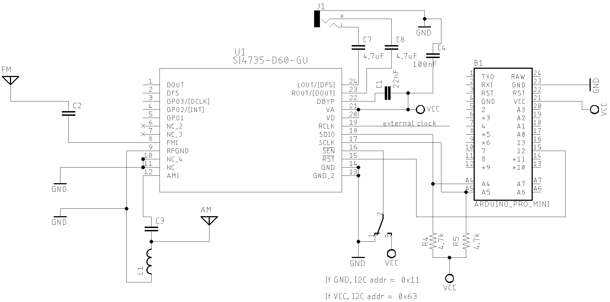

# Using Reference Clock with SI47XX device

The examples found here will show you how to configure the SI473X device with external oscillators (TCXO, Active Crystal, configurable clock generators like SI5351 etc). It can be useful to improve the stability of the system by using more precise oscillators instead of regular passive crystals. 

The folder SI47XX_RDS_TOUCH_SHIELD_REF_CLOCK has a sketch that uses the mcufriend TFT touch Display Shield. This sketch is very similar to the sketch found on SI47XX_10_RDS folder. The main difference is the external clock setup. 

To execute this example, you will need a external clock source. I have used my [Multipurpose signal generator with SI5351](https://github.com/pu2clr/SI5351) project to do that. However, you can use any clock source for this example.

The video [SI4735-D60 and external reference clock test](https://youtu.be/Jgh3ScQUudE) can help you to undertand this example. 


The functions below show how to setup external clock.

```cpp
// Sets the reference clock (REFCLK). A value between 31130 and 34406. Better 32768 Hz.
si4735.setRefClock(clock_value); 

// Sets the number used by the prescaler to divide the external RCLK down to the internal REFCLK  
si4735.setRefClockPrescaler(prescaler);   

// Startup the device with external clock setup. Where XOSCEN_RCLK sets the system to use the external clock
si4735.setup(RESET_PIN, -1, POWER_UP_FM, SI473X_ANALOG_AUDIO, XOSCEN_RCLK); 

```

1. The function __setRefClock__ sets the frequency of the REFCLK from the output of the prescaler. The REFCLK range is 31130 to 34406 Hz (32768 ±5% Hz) in 1 Hz steps, or 0 (to disable AFC). For example, an RCLK of 13 MHz would require a prescaler value of 400 to divide it to 32500 Hz REFCLK. The reference clock frequency property would then need to be set to 32500 Hz. RCLK frequencies between 31130 Hz and 40 MHz are supported, however, there are gaps in frequency coverage for prescaler values ranging from 1 to 10, or frequencies up to 31300 Hz. See table below.
2. The function __setRefClockPrescaler__ sets the number used by the prescaler to divide the external RCLK down to the internal REFCLK. The range may be between 1 and 4095 in 1 unit steps. For example, an RCLK of 13 MHz would require a prescaler value of 400 to divide it to 32500 Hz. The reference clock frequency property would then need to be set to 32500 Hz. __ATTENTION by default, this function considers you are using the RCLK pin as clock source__.
3. Finally, you have to call the __setup__ function with the parameters above. The parameter XOSCEN_RCLK is the clock type you want to use. The __PU2CLR Si4735 Arduino Library__ provides two constants: 

```cpp 
#define XOSCEN_CRYSTAL 1 // Use crystal oscillator
#define XOSCEN_RCLK 0    // Use external RCLK (crystal oscillator disabled).
```

The [PU2CLR Si4735 Arduino Library API documentation](https://pu2clr.github.io/SI4735/extras/apidoc/html/group__group07.html) can give you more detail about reference clock setup.


## SI473X and external active crystal oscillator or signal generator

You can use a signal generator or a active crystal oscillator instead the passive 32768kHz passive crystal with Si473X devices. This setup can be useful to improve the receiver performance or deal with digital audio output. The schematic below shows this setup. 




Check the [PU2CLR SI4735 Arduino Library API documentation](https://pu2clr.github.io/SI4735/extras/apidoc/html/) to deal with external clock reference. The code below shows how to setup external clock. 

```cpp
void setup(void)
{

  .
  .
  .
  si4735.setRefClock(32768);
  si4735.setRefClockPrescaler(1);   // will work with 32768  
 
  si4735.setup(RESET_PIN, -1, POWER_UP_FM, SI473X_ANALOG_AUDIO, XOSCEN_RCLK);
  .
  .
  .
}
```

See the sketch example: [I47XX_02_RDS_TOUCH_SHIELD_REF_CLOCK](https://github.com/pu2clr/SI4735/tree/master/examples/TOOLS/SI47XX_99_NO_CRYSTAL)

Video: 

[SI4735-D60 and external reference clock test](https://youtu.be/Jgh3ScQUudE)




