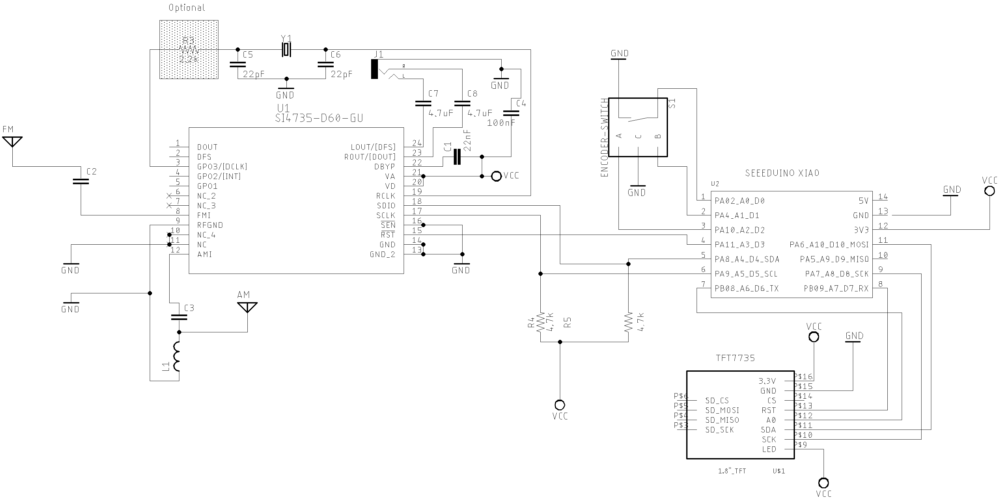

# Seeeduino Xiao Board

The Seeeduino XIAO  is very small board that can be programmed on Arduino IDE platform. This board uses the powerful SAMD21 microchip, ARM® Cortex®-M0+ 32bit 48MHz, with 256KB Flash and 32KB SRAM.

See [Seeeduino XIAO](https://wiki.seeedstudio.com/Seeeduino-XIAO/) for more details.

## Seeeduino XIAO and Si4732 / Si4735 Wire up

| Si4735         | Si4732        | Seeeduino |
| -------------- | ------------  | ----------|
| RESET (pin 15) | RESET (Pin 9) |    3 (D3) |
| SDIO (pin 18)  | SDIO (pin 12) |    4 (A4) |
| CLK (pin 17)   | CLK (pin 11)  |    5 (A5) |

## Seeeduino XIAO and OLED and Encoder

| Device  | Seeeduino |
| --------| ----------|
| OLED    |           |
|   SDA   |    4 (A4) |
|   SCLK  |    5 (A5) |
| Encoder |           |
|   Pin A |    1 (D1) |
|   Pin B |    2 (D2) |
|  Button |    0 (D0) |

## Seeeduino XIAO and TFT ST7735

| ST7735  | Seeeduino |
| --------| ----------|
| DC      |   6 (D4)  | 
| RES     |   7 (D5)  |
| SDA     |  10 (Mosi)| 
| SCL     |   8 (SCK) |
| VCC     |  3V3      | 
| GND     |  GND      |
| BLK     |  3V3      |  

 
## Schematic

## About EEPROM and Seeeduino

There is no EEPROM memory into Seeeduino. However, you can emulate the EEPROM features by using the Seeeduino flash memory. To do that, the best approach is using a library that emulates the flash memory as an EEPROM memory.
The sketches of this folders (OLED_ALL_IN_ONE and TFT_ALL_IN_ONE) use the [FlashStorage_SAMD library for Arduino](https://github.com/khoih-prog/FlashStorage_SAMD). To run these sketches you have to install FlashStorage_SAMD library for Arduino and follow the instructions available on [Packages' Patches section "For Seeeduino SAMD boards"](https://github.com/khoih-prog/FlashStorage_SAMD#3-for-seeeduino-samd-boards).

__ATTENTION:__ 

* Unlike eeprom memory, flash memory information will be lost when you upload a new firmware version. That means the receiver will back to the default configuration when you upload a new sketch;
* Like EEPROM, the flash memory has a limited amount of writing cycles. Typical flash memories can perform about 10000 writes cycles to the same flash block before starting losing the ability to retain data. So, avoid to call the write() function (use update() function instead);

### To try to save cycles, this sketch implements some advices:

* The EEPROM.update avoid write the same data in the same memory position. It will save unnecessary recording.
* Avoid call write() and commit() to store the EEPROM data in flash as possible as you can.
* Use write() and commit() functions with care: Every call writes the complete emulated-EEPROM data to flash.
* Take care when you call these function in a loop or you will lose your flash soon.

__ATTENTION__: The author of the Seeeduino examples is not responsible for damages caused to your devices. 
               You need to know what are you doing before starting playing with FlashStorage_SAMD library for Arduino. 

 

