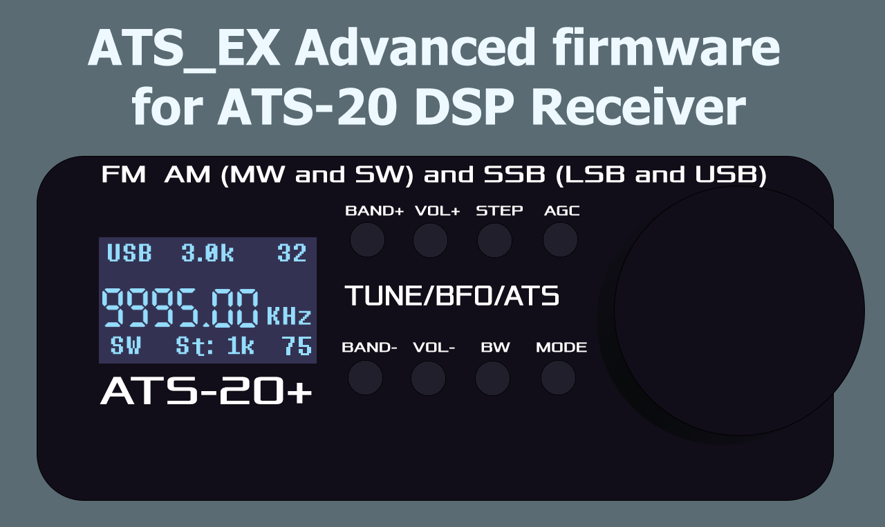
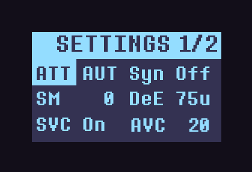
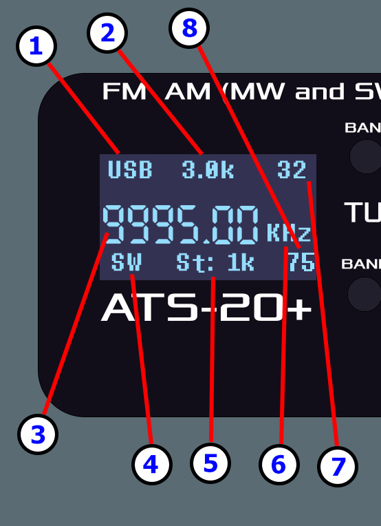

# ATS_EX Firmware for ATS-20 DSP Receiver
### Руководство на русском языке можно прочитать здесь (Russian README is here) :
[>>> Ссылка на русский README. <<<](/rus/README.md)

If you want to donate me, you can do it here: https://t.me/tribute/app?startapp=d7vv
## Basic description
This is advanced firmware for **ATS-20** that is working on **Arduino Nano** and **Si473x** DSP receiver chip.
ATS_EX is created by **Goshante**, based on **PU2CLR** firmware and inspired by **swling.ru** firmware with closed source.

**Latest version:** v1.18 (03.04.2024)

**Download binary .hex link:** [>>> Click here <<<](https://github.com/goshante/ats20_ats_ex/releases/download/v1.18/ATS_EX_v1.18.hex)

    

# Features

 - Fully **reworked interface**. No more ugly stretched fonts. Minimalistic readable interface. 7-Segment frequency font is inspired by swling firmware, but created by me.
 - Fully **reworked controls**. You can read user manual below.
 - **BFO is now part of main frequency** and regulated by frequency step, it is no more dedicated option that makes frequency surfing experience terrible. SSB mode has more precise steps.
 - **LW** Band: From **153** KHz to **520** KHz 
 - **MW** Band: From **520** to **1710** KHz
 - **SW** Band: From **1710** to **30000** KHz (With a lot of sub-bands)
 - **FM** Band: From **64** to **108** MHz.
 - **Dynamic RDS** for **FM** radio stations with an option to switch RDS information lines (Displays UP to 16 characters).
 - AM/FM **Stations scan**.
 - Added **CW mode**.
 - Poorly designed RSSI was removed and replaced with optionaly displayed **S-meter** like scale.
 - All **SW bands** now feel like one large band **from 1710 to 30000 KHz**. It's possible to switch between them, but they no longer restrict the frequency step to the sub-band limits.
 - **The tuning across frequencies has become as smooth as possible** in SSB mode, thanks to the merging of the receive frequency with the BFO. The rough frequency switching now occurs every 16 KHz (**the seamless tuning in both directions covers a full 32 KHz**). In Non-SSB modes now you also can tune faster, **encoder should be more responsive**.
 - **A lot of steps are available for every mode**. In AM you have 1/5/9/10/50/100k/1M steps, in SSB you have 1/5/9/10k steps and 10/25/50/100/500Hz steps for more precise tuning. In FM mode you have 10k/100k/1M steps.
 - Added settings page. You can configure **Gain Control and ATT**, **Soft Mute**, **Automatic Volume Control** (AVC), On or Off **AVC for SSB mode**,  **DeEmphasis** for FM mode and enable or disable **SSB Sync** mode and other useful settings.
 - **BFO** offset **calibration**.
 - Adjustable **screen brightness**.
 - Adjustable **CPU Frequency** for power saving purposes and reducing interference.
 - Added **Mute button** and **Display on/off button**.
 - Added **Battery charge status** (Requires simple physical mod: Make **voltage divider** from two 10 KOhm resistors and solder it's middle output to **A2** pin)
 - Added **S-Meter**
 - **Atm328p controller is now running on it's full clock**. Controls have to be more responsive. (Don't know how it impacts on battery drain.)
 - Code refactoring, optimizations
 - Fixed some bugs

 ## About new feature requests...
 Please, do not request new features. This firmware has hit the limit of maximum flash size and optimized as much as possible so it's impossible to add new features, there is not enough flash memory for new features. It's also has the bootloader and I am not going to remove it. 
 I only accept tickets about bugs and errors. This firmware works on the verge of ATS-20 capabilities.

 If you want to add something new you can try it yourself. All source code is available and present in this repository.

 # How to flash it on my receiver?
You can use any software capable of flashing a .hex firmware file to Arduino. You will only need a Micro USB cable and a **USB UART driver** (most likely, it will be the driver for the **CH341** controller). I recommend using **AVRDUDESS** if you are on Windows. It's a simple tool with a GUI that can dump and flash firmware files onto Atmel microcontrollers (Arduino). 

**There are two types of ATS-20 receivers**: Those on **Arduino Nano** and those on **Arduino Uno**. They are quite easy to distinguish. You need to disassemble and look. The ones on Nano have the Arduino soldered as a separate board onto the main board. If inside there isn't a soldered board and the ATMega368 chip is directly soldered with all components on one board, then you have the Uno revision. This is important to know before flashing. 

You need to select from the **Presets** section either **"Arduino Nano (ATmega328P)"** or **"Arduino Uno (ATmega328P)"**, then select your actual **COM port** and in the **"Flash"** section specify **the path to the .hex firmware file**. Choose the **Write** mode and press the **Go** button next to it. After this, the flashing will start.

Alternatively, you can compile the firmware yourself from the sources that are in this repository. I use Visual Studio 2022 with the VSMicro extension, which uses Arduino IDE 1.8. You can simply use Arduino IDE, compile the sketch yourself, and upload it to the controller directly from the IDE.

## My receiver fails to flash, what should I do?
This can happen if you're flashing through a USB port that's not capable of supplying sufficient current to power the controller along with the entire device. If you turn on the receiver before connecting it to the PC and connect it to a **USB 3.0 port**, your chances of success will be much higher. Yes, the receiver does not use USB 3.0, it has version 2.0, but the third version ports can supply **more current**. And if it still doesn't help, try to reflash the receiver through the Arduino IDE with a **dummy firmware** (empty programm), build an empty new project without any logic, and flash it into the receiver. If you flashing Arduino Nano version make sure you selected **"Old Bootloader"** board version. After that, try to flash the actual firmware into it again.

# User manual
**ATTENTION:** After flashing it's strongly **recommended to reset EEPROM memory**. To do this just hold the **Encoder Button** while turning receiver on.

### Button functionality
#### **BAND+** Button
 1. **Band selection**: Short press to enter band selection mode. Select the band using **Encoder Rotation** and confirm with the **Encoder Button** or by pressing **BAND+** again. Or hold **BAND+** to quickly scroll through bands forward. In **SW mode** switches to the nearest **SW subband**. After latest SW subband switches to the next (or prev) band.
 2. **Settings page switch**: This button switches **settings pages** while settings are open.
#### **BAND-** Button
 1. **Settings menu**: Short press to open/close **settings menu**. When **closing** settings menu all settings are **saved to EEPROM**.
 2. **Band selection**: Long press **BAND-** to quickly scroll through bands backward.
#### **VOL+** Button
 1. **Volume adjustment**: Short press to enter **volume adjustment** mode. Set the volume using **Encoder Rotation** and confirm with the **Encoder Button** or by pressing **VOL+** again.
 2. **Quick volume increase**: Hold for quick volume increase.
#### **VOL-** Button
 1. **Mute**: Short press to **mute and unmute**.
 2. **Quick volume decrease**: Hold for quick volume decrease.
#### **STEP** Button
 1. **Step adjustment**: Short press to enter **step adjustment** mode. Set the step with **Encoder Rotation** and confirm with the **Encoder Button** or by pressing **STEP** again.
 2. **Signal level scale**: Long press shows a signal level bar at the bottom, **similar to an S-meter**. Can be turned off with another long or short press, or by changing the band.
#### **AGC** Button
 1. **Display on/off**: Short press works as a display switch.
 2. **Sync mode for SSB**: Long press to switch to **Sync** mode when **SSB** modulation is active.
#### **BW** Button
 1. **Bandwidth adjustment**: Short press to enter **bandwidth adjustment** mode. Set the step using **Encoder Rotation** and confirm with the **Encoder Button** or by pressing **BW** again. Each modulation has its set of steps.
#### **MODE** Button
 1. **Modulation selection in AM/SSB mode**: Short press to **switch between modulations** in AM/SSB mode. In the **FM** band, the only available modulation is **WFM** (Wide FM), and it's not possible to switch modulation in the FM band (due to Si4735 chip limitations). On all other bands, the following modulations are available: **AM/USB/LSB/CW**. In all modulations (especially in SSB), improved frequency tuning without interruption at each step.
 2. **RDS in FM band**: Short press allows displaying a **metadata line** decoded from the RDS traffic of the current radio station below the frequency. As long as synchronization is not lost, the RDS string can **dynamically update** if the FM radio station cyclically outputs different information there. In this mode, you can switch between **3 different RDS information modes** using the **Encoder Button**: **Station Name**, **Station Information**, and **Program Information**. If any information cell is not decoded or is missing, three dots **...** will be displayed. If RDS data did not display upon activation or after you stopped on right frequency, you should turn RDS off and on again OR move the encoder to another frequency and return to allow the Si4735 chip to synchronize with the RDS traffic stream again. If synchronization is lost, it automatically restores only after changing frequencies.
#### **Encoder Rotation**
1. **Frequency Tuning**: In radio mode (normal mode), rotation adjusts the frequency by the step indicated at the bottom of the screen.
2. **Settings navigation**: In settings mode, the encoder allows you to select the necessary setting and, after selecting, change its value.
#### **Encoder Button**
1. **Frequency scan**: Works **only in FM and AM** modulations and only if option **Sca** is **On** in settings. Press to scan stations by frequency in the last direction with the given step. Rotate encoder or press encoder button to **stop scanning**.
2. **Universal button**: Confirms settings, makes selections, switches RDS modes.
3. **EEPROM reset**: Important functionality that allows **resetting settings to defaults**. To do this, turn on the receiver with the encoder button already pressed. After that, the **EEPROM RESET** message should appear.
4. **Quick step adjustment**: Only for **SSB mode** - pressing allows immediate entry into step adjustment mode. Also works in **AM/FM** modes if option **Sca** is **Off** in settings.

### Settings
Navigate in settings with **Encoder Rotation**, confirm selection with **Encoder Button**, change value with **Encoder Rotation** and save it with **Encoder Button**. Close settings with **BAND-** button. Navigate between **settings pages** with **BAND+** button.

    

**ATT** : **Attenuation** value. **AUT** means **Auto Gain Congrol**. This value can be **AUT** and from **1** to **37**. **Warning:** AGC mode (**AUT**) in any SSB modes will add some constant noize (It is present in ANY firmware). it's not highly noticeble, but still keep this in mind.

**SM** : **Soft Mute**. This is number from **0** to **32**.

**AVC** :  Automatic Volume Control. This is number from **12** to **90**.

**SVC** : Enable or disable **AVC for SSB**.

**DeE** :  Only for **FM** mode. It's **DeEmphasis** value in microseconds. It can be only **50** or **75**.

**Syn** : Enable or disable **Sync mode for SSB**.

**Scr** : **Screen brightness** adjustment. This is number from **5** to **125**.

**SW** : **Frequency units** for AM mode in SW band. It can be only **KHz** or **MHz**. In MHz mode it used dot as delimiter.

**SSM** : **SSB Soft Mute Mode**. It can be only **RSS** (SM based on RSSI) or **SNR** (SM based on SNR).

**COF** : **SSB Cutoff Filter**. It has 3 modes: **On** - Band pass filter to cutoff both the unwanted side band and high frequency components. **Off** - Low pass filter to cutoff the unwanted side band. And **AUT** mode: Automatically turns on and off, depending on **Bandwidth** (Off when bandwidth is higher than **2.0 KHz**).

**CPU** : **CPU Frequency**. This is useful for **battery saving** purposes. It can be only **100** or **50%**. 100% - CPU works on x1 of own frequency, using it's full potential. 50% - CPU works on half of it's own frequency, it's slower, but allowing you to save more battery.

**RDS** : **RDS Decoding error threshold** level. The lower this number, the better the RDS text appears, but the lower the chances for successful sync. The higher this value, the easier it is to decode the RDS stream, but it could look messed up frequently. This is number from **0** to **3**.

**BFO** : **BFO Offset calibration**. One unit of this parameter is **1 Hz * 10** or **0.01 KHz**. This is permanent **BFO offset for SSB**. If you think SSB frequency is not precise enough you can calibrate it. Allowed offset value is from **-60 to 60 units** or from **-0.60 KHz to 0.60 KHz**.

**Uni** : Show/Hide **frequency units**.

**Sca** : On/Off **station scan feature** in AM or FM modes on **encoder button**. In disabled state **encoder button will always act as a Step button**.

**CW** : **CW Side mode**. Based on **LSB** or **USB** modulation.

### Display elements description

    

 **1**. **Current modulation**. From **149** to **30000** KHz you have **AM/LSB/USB/CW** modulations available. When **Sync** is active in **SSB** modes, the  **S** letter will appear near modulation status. In **FM** band you have only **FM** (or **WFM**) modulation. I don't have **NBFM patch** for **Si473x**, so it's not available now.
 
 **2**. **Bandwidth** status. Can be **AUTO** in **FM** mode. Not available in **CW** mode.
 
 **3**.  **Current frequency**. In **FM** and **SSB** modes it has fractional part. 
 
  **4**.  **Band name**. There are such bands as **LW, MW, SW, CB** and **FM**.

**5**.  **Step value**. It is different for all modulations, **SSB has more precise steps**, but doesn't have large. AM has harger steps, but doesn't have precise. If it doesn't have a units suffix, that means that it's **Hz**.

**6**.  **Frequency units**. Units are always displayed, except when decimal part of frequency in **SSB** is **5 digits long**.

**7**.  **Volume**. This is sound volume of receiver. Could be value between **0** and **63**. When mute is enabled it displays letter **M** instead of volume.

**8**.  **Battery charge level** in percents. Requires **voltage divider** soldered to **A2** pin. Not displayed if not connected. When charge level is too low or USB connected on some revisions this indicator will display **---**.

# How to make the battery charge level display?

You will need a soldering iron and two resistors of **10kΩ** each. Solder one resistor to the negative (ground) and the other directly to the positive of the lithium battery. Then solder their meeting point together; this will be their midpoint. You need to solder it to pin **A2** on the controller. Thus, half of the battery voltage will be applied to it. By making such a simple modification, the **ATX_EX** firmware will automatically detect the connected battery voltage pin and start displaying the charge.
