# KIT sold on Aliexpress and eBay

The kit below is sold on Aliexpress and eBay.  Although the seller does not explicitly mention that the Arduino sketch used by the KIT is based on this library (PU2CLR SI4735 Arduino Library), I’ve been testing successfully the sketch [SI473X_ALL_IN_ONE_OLED_RDS_CHINESE_V7](https://github.com/pu2clr/SI4735/tree/master/examples/SI47XX_KITS/AliExpress/SI473X_ALL_IN_ONE_OLED_RDS_CHINESE_V7) on some KITs acquired by some Brazilians experimenters. __The author of this library does not know the seller of this kit and does not have a commercial relationship with any commercial product that uses the library. It is important you understand that there is no guarantee that this sketch will work correctly in your current product__.

__IT IS IMPORTANT TO SAY THAT THE SSB PATCH CONTENT IS NOT PART OF THIS LIBRARY. ALSO, IT IS IMPORTANT TO SAY THAT THE AUTHOR OF THIS LIBRARY DOES NOT ENCOURAGE ANYONE TO USE THE SSB PATCHES CONTENT FOR COMMERCIAL PURPOSES. IN OTHER WORDS, THIS LIBRARY ONLY SUPPORTS SSB PATCHES, THE PATCHES THEMSELVES ARE NOT PART OF THIS LIBRARY__.

 __ATTENTION: If you do not have experience with Arduino platform, please, do not try to upload the sketches available here to your receiver. It can make your device stop working.__ 

__IN NO EVENT SHALL THE AUTHOR OF THIS LIBRARY BE LIABLE FOR ANY CLAIM, DAMAGES OR OTHER LIABILITY, WHETHER IN AN ACTION OF CONTRACT, TORT OR OTHERWISE, ARISING FROM, OUT OF OR IN CONNECTION WITH THE PRODUCT__.

__DO NOT BUY THIS RECEIVER BEFORE READING COMMENTS AND REPORTS ABOUT IT. FOLLOW THE REFERENCES BELOW:__

__PLEASE READ ALL TEXT BELOW BEFORE UPDATING THE FIRMWARE__

## Summary 

* [Firmware Update via Desktop Arduino IDE](https://github.com/pu2clr/SI4735/tree/master/examples/SI47XX_KITS/AliExpress#firmware-update-via-desktop-arduino-ide)
* [Steps to update the firmware using the regular approach](https://github.com/pu2clr/SI4735/tree/master/examples/SI47XX_KITS/AliExpress#steps-to-update-the-firmware-using-the-regular-approach)
* [UPDATING THE FIRMWARE WITH USBasp interface](https://github.com/pu2clr/SI4735/tree/master/examples/SI47XX_KITS/AliExpress#updating-the-firmware-with-usbasp-interface)

## Related Content

* [SWLing - Any thoughts on this inexpensive Si4732-based receiver?](https://swling.com/blog/2021/04/any-thoughts-on-this-inexpensive-si4732-based-receiver/)
* [Kevin O'Reilly: SI4732 The end of the line?](https://youtu.be/A3Mus-7lTrk)
* [Si47XX for Radio Experimenters](https://www.facebook.com/groups/532613604253401)
* [SI4735 SI4732 All Band Radio Receiver User Group](https://www.facebook.com/groups/340642344032449)
* [SI4732 shortwave receiver](https://swli-05940-mi.blogspot.com/2021/04/si4732-shortwave-receiver.html)
* [Amazon - Customer reviews](https://www.amazon.com/product-reviews/B08ZHXWTS1)
* [Si4732 ATS-20 Test and Update - Open Source Receiver 0-30 / 64-108](https://youtu.be/381139I2DCg)
* [ATS-20 Si4732 receiver firmware update](https://blog.marxy.org/2021/06/ats-20-si4732-receiver-firmware-update.html)

The photos below show the KIT sold on Aliexpress and eBay.

  

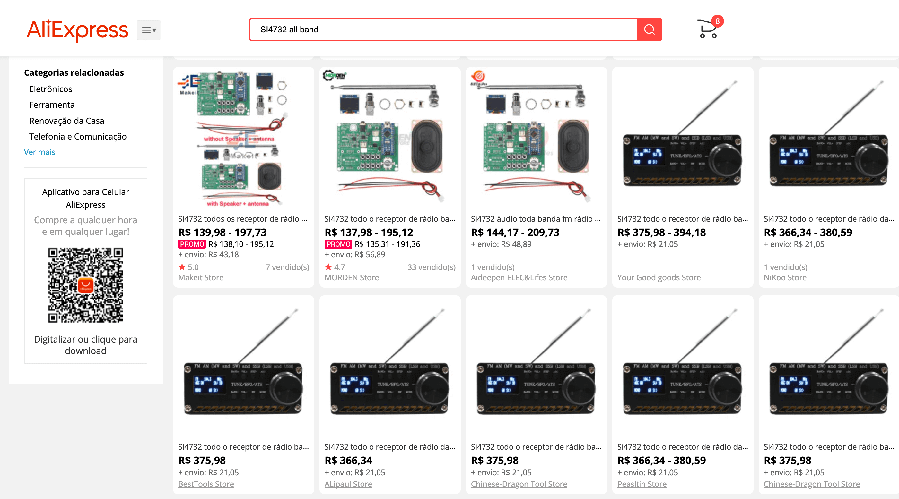

## Be a member of Facebook Group [Si47XX for Radio Experimenters](https://www.facebook.com/groups/532613604253401/)

# Firmware Update via Desktop Arduino IDE

__PLEASE READ ALL TEXT BELOW BEFORE UPDATING THE FIRMWARE__

## New features

* The final code (HEX file) is about 2.5K smaller than the previous one (now  you have more memory to add new features);
* Twenty three bands. Two VHF(FM); one LW; two MW; and Nineteen SW bands covering from 1800 to 30000 kHz;
* Band, Volume, Step, Bandwidth, AGC/Attenuation are now controlled by encoder;
* __"Vol-"__ buttons is free to implement new features. It has no function for while; 
* __"BAND-" __now is used to control Softmute Attenuation__; 
* All the previous status of the receiver can be rescued when you turn it on (including SSB mode, bandwidth, volume, frequency, BFO etc);
* __The bandwidth now is a property of the band (you can use different bandwidth for different bands)__;
* Bandwidth control on FM mode (Auto, 110, 84, 60 and 40 kHz);
* Bandwidth control on AM mode (1, 2, 2.5, 3, 4 and 6 kHz);
* Bandwidth control on SSB mode (0.5, 1, 1.2, 2.2, 3 and 4 kHz);
* AGC (Automatic Gain Control) and Attenuation control; 
* Softmute Attenuation Control;
* FM/RDS presentation was improved;
* __The seek function was improved (it is more precise on FM mode)__. The seek direction is controlled by the encoder (clockwise or counter-clockwise. Press encoder push button for seeking
* Steps: 1, 5, 9, 10, 50 and 100 kHz;
* __Now you can configure MW band space to 9 or 10 kHz__;
* New FM band from 64 to 84 MHz;
* New MW band from 531 to 1701 kHz for Europe, Africa and Asia;
* The frequency on Display is bigger than the previous version;
* Now the bandwidth sequence is ordered by bandwidth values;
* After about 4 seconds, all command buttons are all disabled and the encoder control goes back to the frequency;
* The current status of the receiver will be stored only after 10 seconds of inactivity.

The steps below will guide you to update the firmware of the KIT

DO NOT TRY IT IF YOU DON'T KNOW WHAT ARE YOU DOING.

Be sure you are using the last version of the Arduino IDE.

Read the comments of the sketch before uploading. 

## Steps to update the firmware using the regular approach

### Step 1

Open the Arduino IDE and go to the __Tools__ menu and select  __Manage Libraries…__

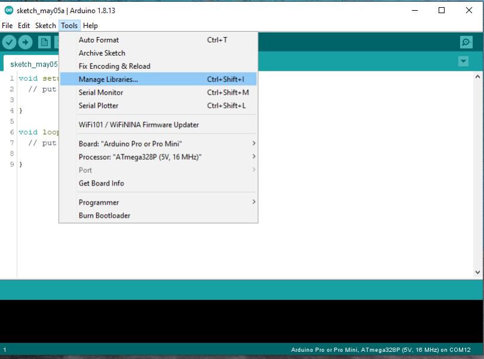

### Step 2

Look for SI4735 library, select __PU2CLR SI4735__ and click on Update

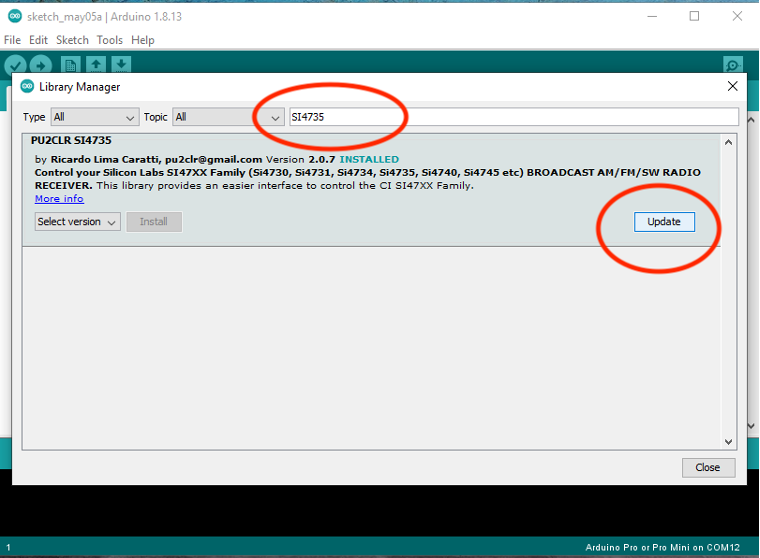

### Sept 3 

Check the version installed. The last version should be 2.0.9 or greater. 

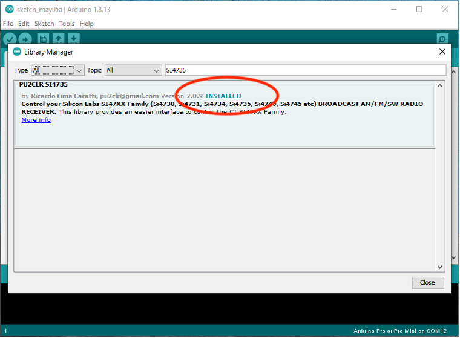

### Step 4

Install the Libraries __Tiny4kOLED__ and __TinyOLED-Fonts__ Arduino libraries for OLED. Use the same approach shown before. 

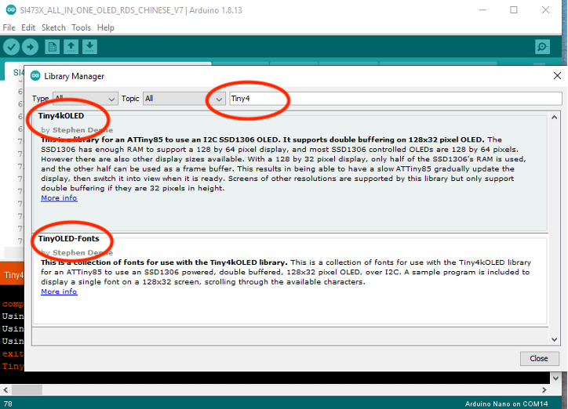

### Step 5

Go to the File Menu, select Examples item and look for the firmware for this receiver / KIT

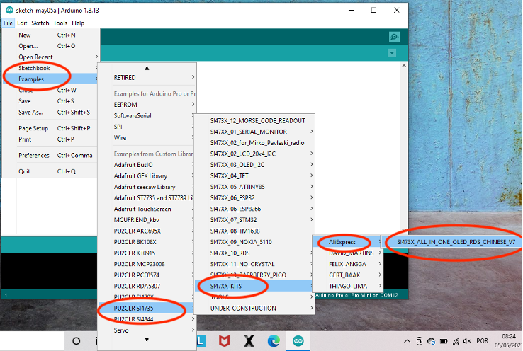

### Step 6

Check the sketch you have just loaded from PU2CLR_SI4735 Examples folder

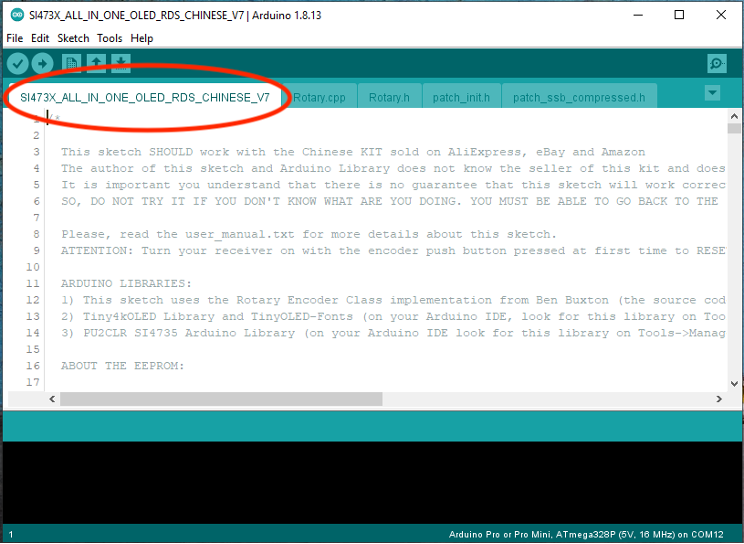

### Step 7

Select the right Arduino Board.  On Tools Menu, select Arduino AVR Boards and __Arduino Nano__. 
Read the comments of the sketche. 

### Step 8 

Select the right Processor. On Tools menu, select __“Processor:”__ item. 
Depending on the version of the Arduino Nano used by your KIT, it can be __ATmega328p (Old Bootloader)__ or just __ATmega328p__.

Select __ATmega328p (Old Bootloader)__ first. If you get error during uploading, try it again with __ATmega328p__.

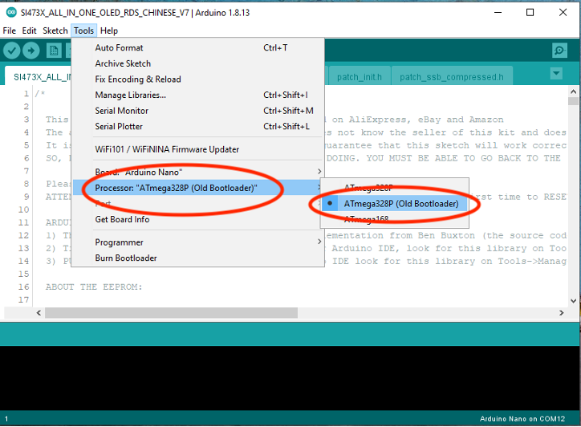

### Setup 9

Connect your Receiver (Arduino device) to your computer and select the right COM port. The COM number will depend on your computer setup.

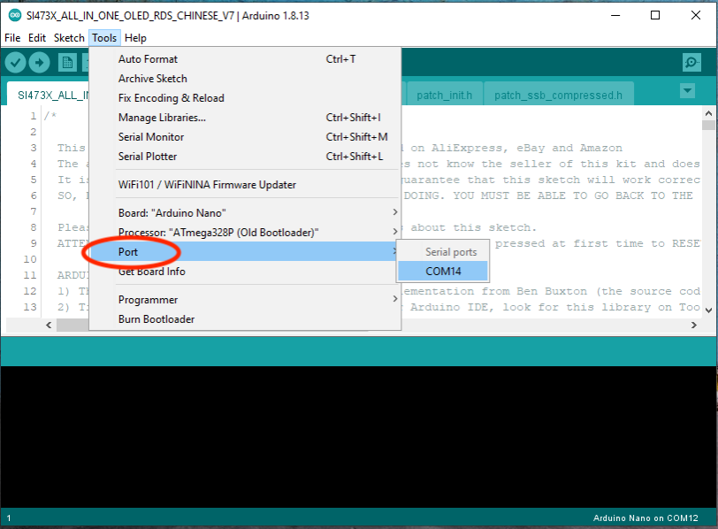

### Step 10

Finally, run the upload. 

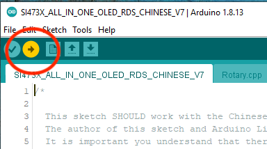

### Final result

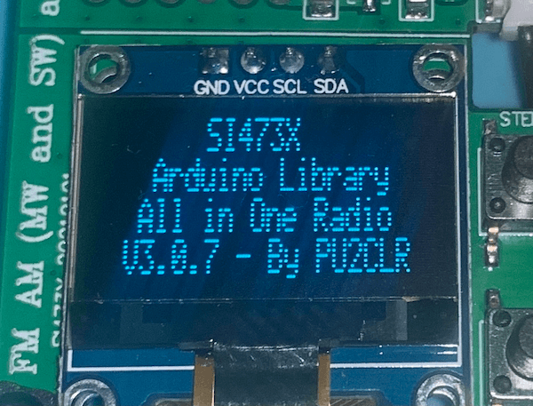

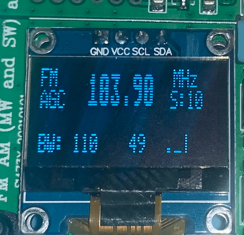

### Video about update the firmware via regular approach

* (KIT ST4732 from China - Firmware Update)[https://youtu.be/K3T6GfjZH8E]

# User Manual 

## COMMANDS

Follow the instruction to operate with the receiver. 

###  DEALING WITH AUDIO VOLUME

Press the __VOL+__ push button and rotate the  encoder. Press the button again to disable the command or wait for 4s;

### SELECTING THE BAND

Press the __BAND+__ push button and rotate the  encoder. Press the button again to disable the command or wait for 4s;

### DEALING WITH AGC (Automatic Gain Control) AND ATTENUATION

Press the __AGC__ push button and rotate the  encoder. Press the button again to disable the command or wait for 4s;

### DEALING WITH AVC (Automatic Volume Control) 

Press the __AVC__ push button and rotate the  encoder. Press the button again to disable the command or wait for 4s;

###  DEALING WITH SOFTMUTE AND ATTENUATION

Press the push button labeled __"BAND-"__ and rotate the  encoder. Press the button again to disable the command or wait for 4s. This button was used to control the band switch. Due to the new interface, this button has lost its original function. 

### SELECTING BANDWIDTH

Press the __BW__  push button and rotate the  encoder. Press the button again to disable the command or wait for 4s;

### SWITCHING THE STEP FREQUENCY

Press the __STEP__  push button and rotate the  encoder. Press the button again to disable the command or wait for 4s;

### SWITCHING THE MODE AM, LSB AND USB

On AM mode press __MODE__ push button to switch to LSB mode; press MODE push button again to switch to USB mode; and finally press MODE push button again to switch AM mode.

### VFO/BFO Switch

To control the VFO and BFO, you can use the encoder push button on SSB mode. The display will show you if you are using VFO or BFO.

### SEEK COMMAND

On FM or AM modes press the encoder push button.
The direction of the seek up or seek down will  depend on the last rotating movement of the encoder, clockwise and counterclockwise respectively.

### RESET EEPROM

__Turn your receiver on with the encoder push button pressed__.    

See also: 
* [#205 Si4732 ATS-20 Test and Update - Open Source Receiver 0-30 / 64-108](https://youtu.be/381139I2DCg)

 
 

## UPDATING THE FIRMWARE WITH USBasp interface

This method can be useful when the regular approach does not work. 

You can find the USBasp device on eBay and AliExpress.  The photos below show the USBasp device used to update the ATS-20 and ATS-20+ receivers. 

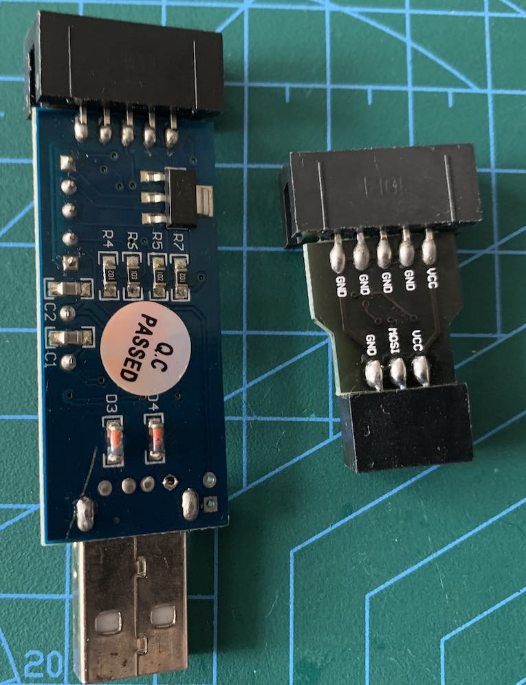

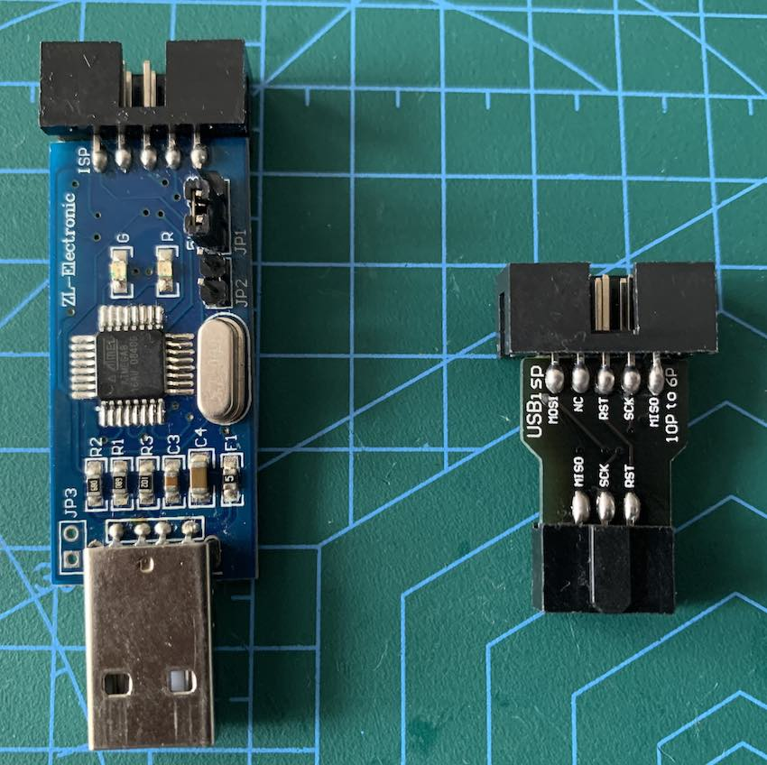

### Contextualization

One year ago I published a tutorial (sections above) on how to update the ATS-20 Firmware using the regular way. I mean, via Arduino board USB. However, some experimenters have been telling me that this approach doesn't work in some cases, especially with the ATS-20+. At first, I thought this might be a problem with the configuration of these experimenters' computers. But, later, I noticed that the number of occurrences was higher than expected. So, more recently I decided to check it out for myself.
 
In fact, when I tried to update the firmware of a ATS-20+ device got from AliExpress, I noticed that the Arduino Nano, for some reason, I do not know why, is not recognized by the Arduino IDE as usual.
 
Normally, when we connect the Arduino board to the computer via the USB port, a serial port is created, allowing the computer to communicate with the Arduino board. However, that's not happening in my case with an ATS-20+ that I get.
 
There are many reasons why the traditional method of updating is not working on this device, including a USB interface problem on the Arduino board.

If that is your issue and assuming you've already installed the Arduino IDE on your computer, please, follow these instruction:

### Steps to update the firmware using USBasp

#### STEP 1

Get a USBasp interface with the 10-pin to 6-pin converter. You can find it on eBay or AliExpress (look for USBasp).

### STEP 2

Install the latest version of the "PU2CLR SI4735 Arduino Library". [This video shows how you can do that](https://youtu.be/M9h-tlV_l-k).

#### Open the Arduino IDE and go to the __Tools__ menu and select  __Manage Libraries…__

#### Look for SI4735 library, select __PU2CLR SI4735__ and click on Install or Update

#### Also install the Libraries __Tiny4kOLED__ and __TinyOLED-Fonts__ Arduino libraries for OLED. Use the same approach shown before. 

__ ATTENTION: If you are using Windows, please install the USBasp driver. See [USBASP Installation in Windows 10](https://www.instructables.com/USBASP-Installation-in-Windows-10/)__. It can work for oldest windows version. 

#### STEP 3

Check THE youtube tutorials below to know how to use USBasp on Arduino Boards. 

* [How to Use USBasp Programmer with Arduino Boards](https://youtu.be/ToKerwRR-70)
* [Programming Arduino Nano with V2.0 USBASP ICSP :DAControl](https://youtu.be/T1OkdPMRBzA)

#### STEP 4

Remove the top cover. You don't need to remove all the screws. Only the top four. Be careful when removing the top cover. There is a speaker connected to the board and the wires can be broken.

#### STEP 5

Configure the Arduino IDE to install the MiniCore Board. (See how to do this here)[https://github.com/MCUdude/MiniCore#how-to-install].

#### STEP 6

On Arduino IDE; menu Tools; Board:; Boards Manager, Install MiniCore (An Arduino core for the ATmega328, ATmega168, ATmega88, ATmega48 and ATmega8, all running a custom version of Optiboot for increased functionality). See this video to know more: [Install MiniCore Arduino IDE Additional Boards for ATmega328, ATmega168, ATmega88, ATmega48 ATmega8](https://youtu.be/YLTuRN1GjCU).

#### STEP 7

On Arduino IDE, menu File, open the source code of the firmware you want to use on ATS-20 or ATS-20+

#### STEP 8

On Arduino IDE; menu Tools; Board:, select the MiniCore board; 

Follow theses setup: a)Board:"Atmega328"; b)Clock:"External 16MHz"; c)BOD:"BOD Disabled"; c) EEPROM: "EEPROM retained"; d)Compiler LTO: "LTO enabled"; e) Variant: "328P / 328PA"; f) Bootloader: "No bootloader".

#### STEP 9 

On Arduino Menu; Programmer: select USBasp (MiniCore) or USBasp slow (MiniCore).

#### STEP 10

Connect the USBasp device to the Arduino Board (ISP interface) and to the computer. See photos below.

##### USBasp device connected to Arduino Nano board

Please, attention to the arrow-shaped bump highlighted in red. See photo below.

##### USBasp device connected to the computer

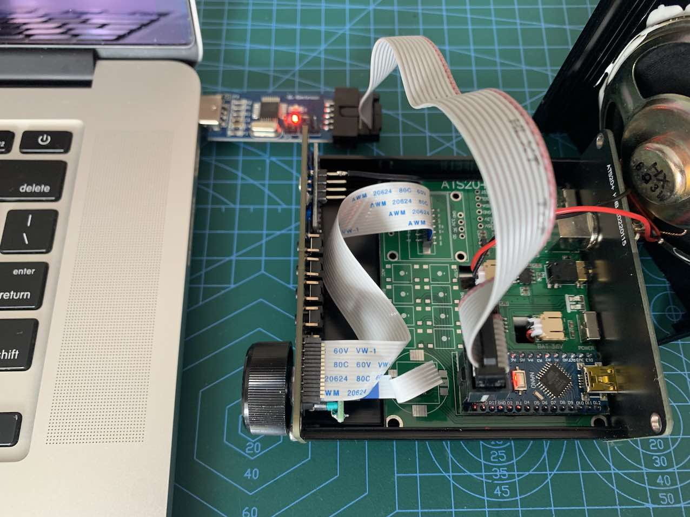

#### STEP 11

Finally, turn the receiver on and click on the Upload icon or on the Sketch menu, select the option Upload. 

[See this video about this tutorial](https://youtu.be/7e9yp1MgGI8) 
    
 

### Problems and solutions reported for some experimenters

#### By Pierangelo Cosimo Dal Maso: 

* MiniCore didn't recognise my USBAsp clone, was looking for usbvendor/usbproduct tags on usb device. I had to comment the corrisponding two lines in AppData\Local\Arduino15\packages\MiniCore\hardware\avr\2.1.3\avrdude.conf file.
* MiniCore fails when generating source listing if your user home directory have spaces in its name. I removed the listing generating step from file c:\Users\xxx yyy\AppData\Local\Arduino15\packages\MiniCore\hardware\avr\2.1.3\platform.txt