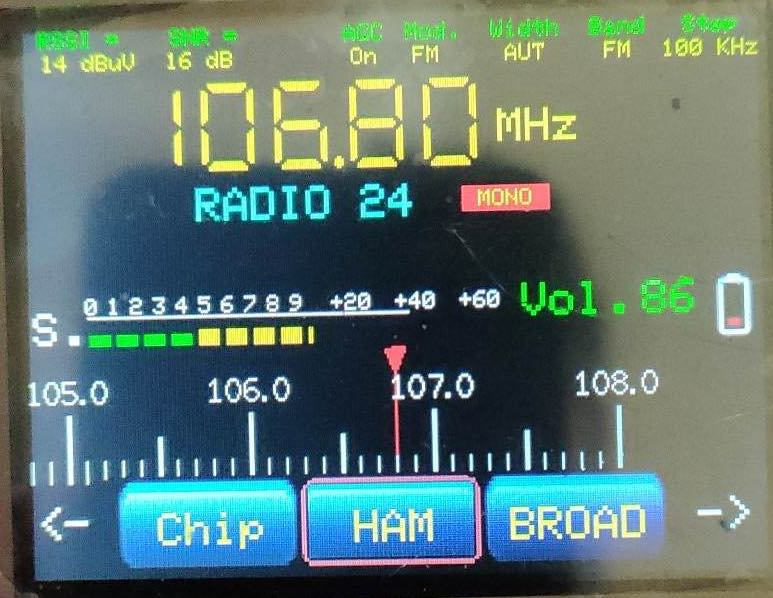

# [Antonio's githup repository](https://github.com/IU4ALH/IU4ALH)

This sketch runs on ESP32 device on a ili9341 display.  It is an adaptation written by IU4ALH, Antonio.

The original interface design of the sketch used here was written by Volos (https://github.com/VolosR/TEmbedFMRadio). 
The Volos' project is a receiver based on the TEA5767 device and the PU2CLR, Ricardo, has adapted it to the SI473X device using the LilyGO T-EMBED painel.  After, IU4ALH, Antonio worked on Ricardo's sketch and adapted it to ESP32 and ili9341 display. This sketch implements the main functions of the SI4732/SI4735. It is  a  complete  radio  capable  to  tune  on  AM  and  SSB  modes from 150 to 30.000 kHz  and also FM mode from 64 to 108 MHz. The original Antonio's work can be found [here - All_in_one_TTGO_for_Esp32_ili9341](https://github.com/IU4ALH/IU4ALH/blob/main/All_in_one_TTGO_for_Esp32_ili9341.rar?fbclid=IwAR1r5e9pZ9zUjsC5eTqZnmnBgN5EqzVxIj5z0SwF64GVHnG_4O45OdzuP_k).

Antonio also worked on Ralph Xavier project and adapted it to ili9341. You can see it on [Xavier_V4.1.1_Mod_IU4ALH_ESP32_ili9341](https://github.com/IU4ALH/IU4ALH/blob/main/Xavier_V4.1.1_Mod_IU4ALH_ESP32_ili9341.rar).

__You also can have the Antonio's sketch [here](https://github.com/pu2clr/SI4735/tree/master/examples/SI47XX_KITS/IU4ALH_Antonino/examples)__.

## Schematic 

