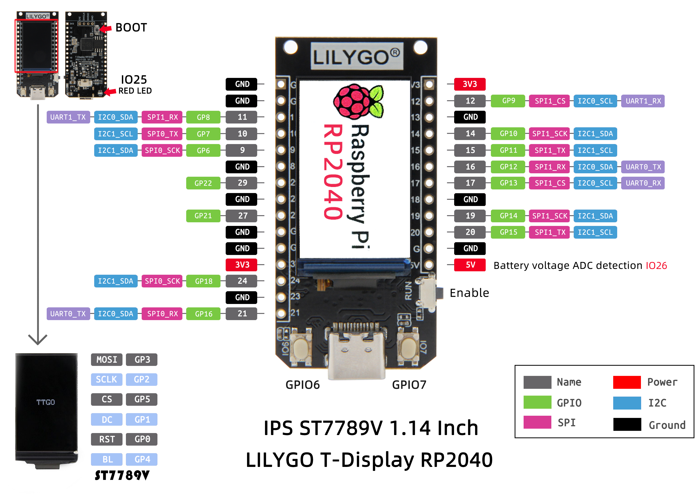

# LilyGO T-Display RP2040

UNDER CONSTRUCTION...

LilyGO T-Display RP2040 is a board based on Raspberry Pi RP2040 that comes with a 1.14-inch TFT display (ST7789V SPI driver - 240×135).

The picture pelow show the LilyGO T-Display RP2040 pinout

## Arduino Setup

[Click here to know how to configure the Arduino with LilyGO T-Display RP2040](https://github.com/Xinyuan-LilyGO/LILYGO-T-display-RP2040)

