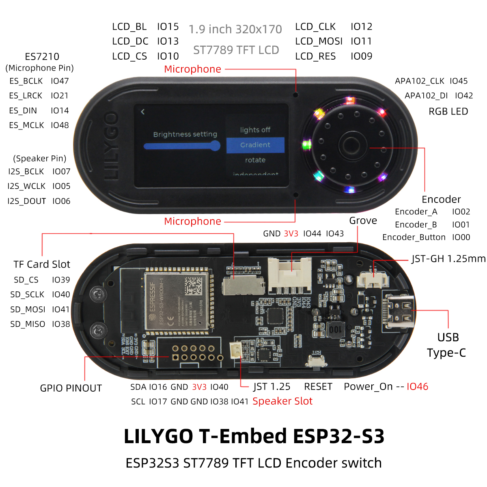

# LilyGO/T-Embed setup

[See this link for more details about LilyGo T-Embed](https://github.com/Xinyuan-LilyGO/T-Embed)

## Arduino setup

On Arduino IDE, go to Preferences, edit the field "Additional Boards Manager URLs:" and add the URL 
https://raw.githubusercontent.com/espressif/arduino-esp32/gh-pages/package_esp32_index.json . 

After, on Tools menu, select the option "Board:", "Boards Manager...". 
Look for esp32 and install it.

