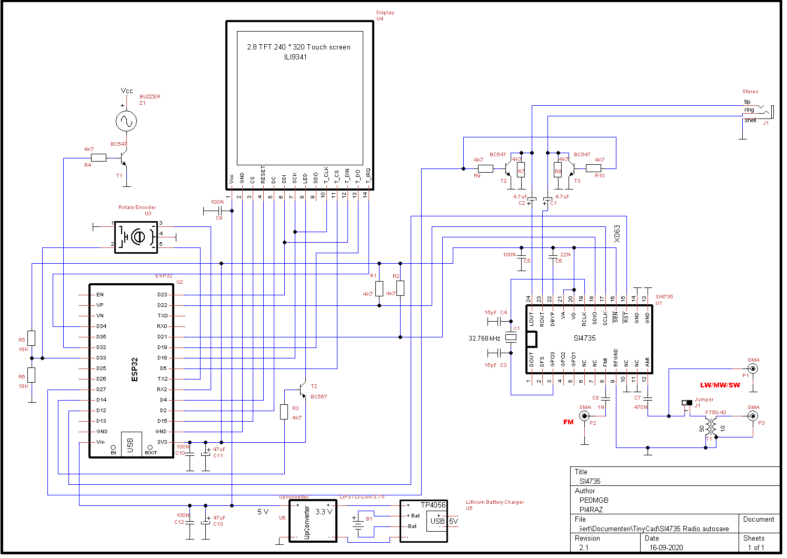

# THIAGO'S KIT SKETCH

The KIT made by Thiago Lima is based on __ESP32 ( ESP32 WROOM-32)__ and __SI4732-A10__ device. 

This KIT was made based on Gert's project. I would like to thank to [Gert Baak](https://github.com/pe0mgb/SI4735-Radio-ESP32-Touchscreen-Arduino?fbclid=IwAR3TQd2j4HxAFvpcGkbXiPuDly8m2OnGclTDiqthnkbqqe2fN1McP2m3WSI).

All sketches in this folder use the "PU2CLR SI4735 Arduino Library" developed by Ricardo.
All sketches were tested on __ESP32 WROOM-32__, TFT 2.8" 240*320 Touchscreen with an __ILI9341 controller__ and Rotary Encoder with push button. For the TFT display the __ESP_eSPI__ Arduino Library is used. The ILI9341 config file is available here.

__After installing the ESP_eSPI Arduino Library, copy the files Setup1_ILI9341.h and User_Setup_Select.h to the /Documents/Arduino/libraries/TFT_eSPI folder. If you are using Windows, check where the Arduino stores the installed libraries.__ 

Read the documentation available in each ino file. The manual controle of the radio is 100% done by the touchscreen and Rotary Encoder.

### Program features :

* FM (VHF) support (64–108 MHz)
* AM (MW) band support (520–1710 kHz)
* SW band support (2.3–30.0 MHz)
* LW band support (153–279 kHz)
* S-meter
* SNR and RSSI indication
* Volume indicator
* FM Stereo and RDS. RDS has a SNR theshold and on / off button
* AM and SSB with 1,5,9 & 10 KHz tuningstep
* FM, AM and SSB (USB & LSB) modulation. SSB controlled by BFO
* Preset for FM controlled by rotary encoder 
* May be finished by rotary encoder switch or automatically by waking up the screen 
* Band selection for Broadcast (17) and Ham bands (11)
* Prefered modulation for all Ham and Broadcast bands
* Bandwidth control for AM and SSB
* On screen Keyboard for frequency control
* Tuningstep control for all broadcast and ham bands (except FM) 
* Mute
* Volume control by rotary encoder. Function is switching off after 30 sec automatically
* AM/FM seek tuning
* Automatic frequency control (AFC)
* Automatic gain control (AGC)
* Manual gain control by the rotary encoder
 
To save power from the battery, display is switching off after 5 minutes. 
Display is waking up by the use of one of the controllers e.g. screen, rotary controller or rotary controller switch.  Power consumption 120 mA and 80 mA when display is switched off.

## Schematic 

### SI4732-A10 version 

### SI4735-G60 version

