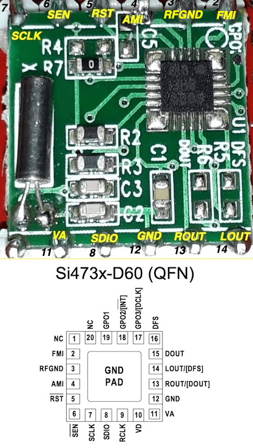
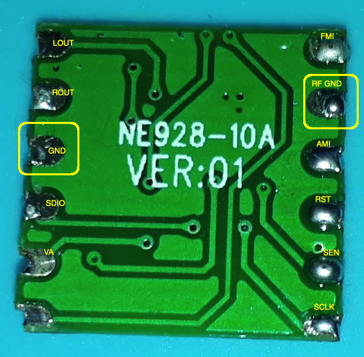
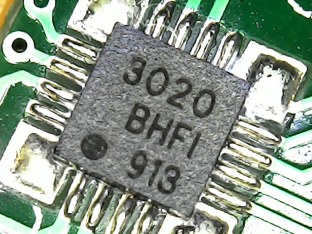

# About the board NE928-10A V:01 

This board is an AM (MW) and FM receiver. It is based on Si4730. The Si4735 Arduino Library is compatible with it.
Unlike the PL102B, a very similar board based on Si4730 and also supported by the Si4735 Arduino Library, the NE928-10A does not support SW. The photos bellow show the NE928-10A V:01.

## NE928-10A V:01 pinout

## NE928-10A V:01 label

## IC label "3020 BHFI 913" (Si4730)

## Arduino Pro Mini 3.3V (8MHz) connection

|  board NE928-10A V:01 |  Arduino Pro Mini |
| --------------------- | ----------------- |
| GND  | GND | 
| VA   | VCC |
| SDIO | A4  |
| SCLK | A5  |
| RST  | D12 |

### Recommended sketches

* [SI4735_01_POC.ino](https://github.com/pu2clr/SI4735/tree/master/examples/SI47XX_01_SERIAL_MONITOR/SI4735_01_POC)
* [SI47XX_01_OLED_I2C.ino](https://github.com/pu2clr/SI4735/tree/master/examples/SI47XX_03_OLED_I2C/SI47XX_01_OLED_I2C)

## The Si473X I2C address 

This board comes with the SEN pin connected to +V. So the I2C buss address is 0x63

## Firmware information 

The table below shows the query result of Firmware Information command.

| Firmware Information | Value |
| ------------------- | ----- |
| Part Number (HEX) | 1E |
| Firmware Major Revision | 50 |
| Firmware Minor Revision | 48 |
| Patch ID | 00 |
| Component Major Revision | 50 |
| Component Minor Revision | 48 |
| Chip Revision | 66 |

## Video



[NE928-10A V:01 board working with "Si4735 Arduino Library](https://youtu.be/An7Iq_BLxJY)

