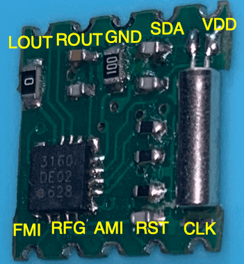
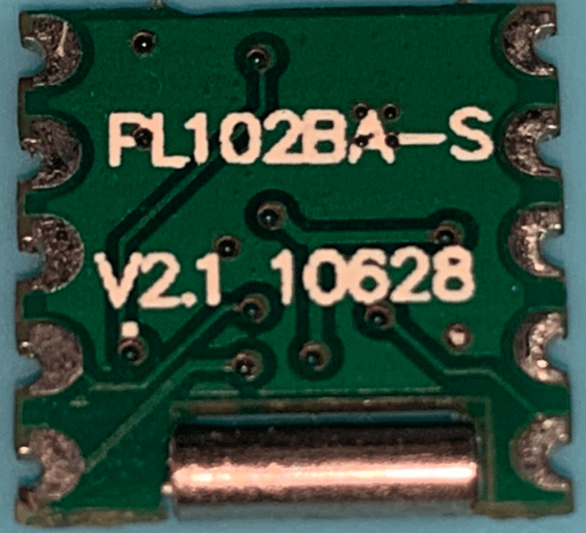
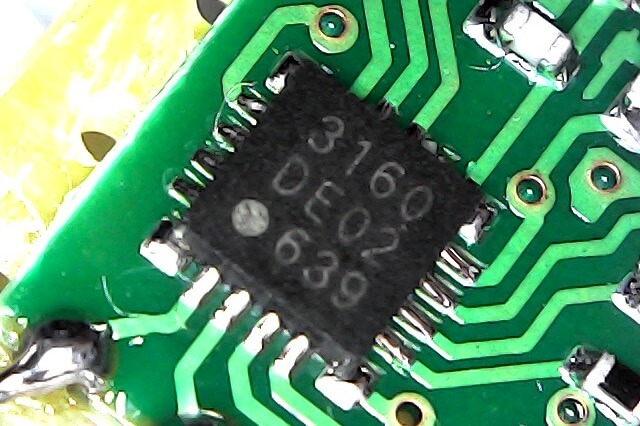
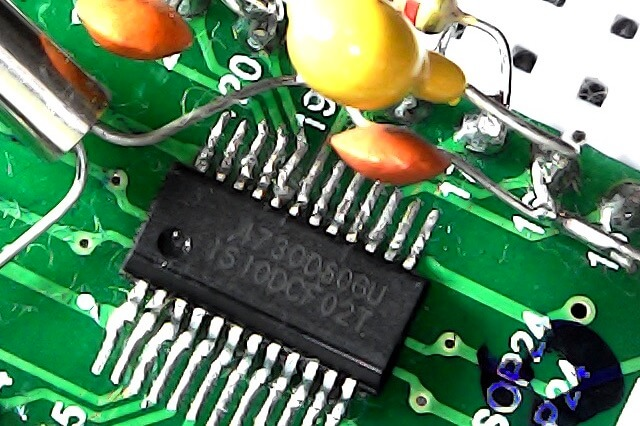
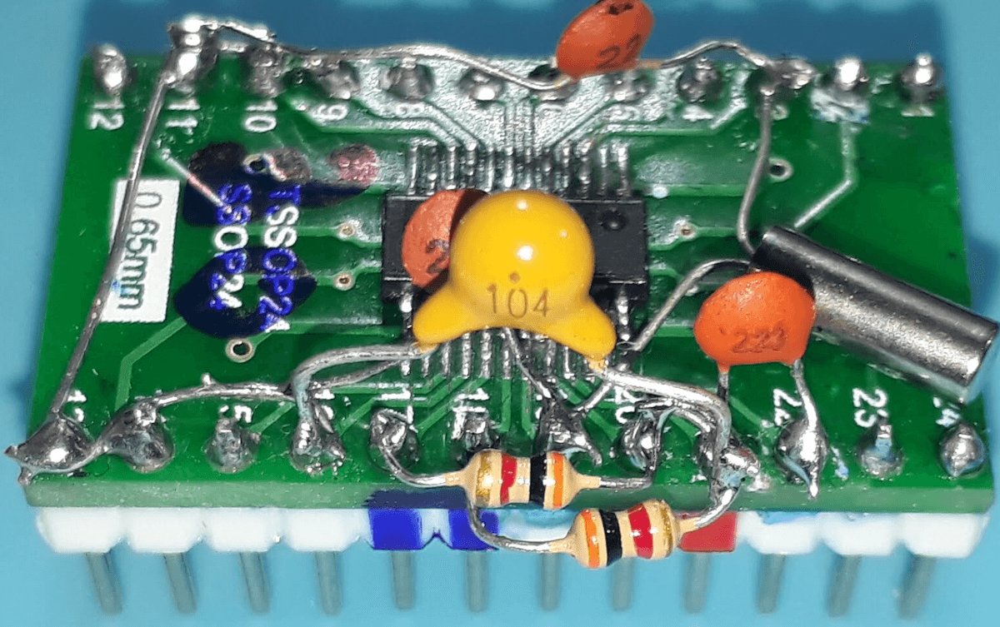

# About the board based on SI4730-D60 labeled "PL102BA-S V:2.1 10628" 

At first glance, the Si4730-D60 was manufactured to work only in FM and AM (MW) modes. There is nothing explicit in Silicon Labs manuals to suggest that this device works on LW or SW and also has FM/RDS functions. However, some hobbyists discovered this "secret" long time before "PU2CLR SI4735 Arduino Library" was released. 

If you are not interested in the SSB mode available on the __SI4735-D60 and SI4732-A10 devices__, you can try the SI4730-D60 or "PL102BA-S V:2.1 10628" as alternative for LW, MW and SW. It is importante to say the author of this document does not encourage anyone to buy the SI4730-D60 or the "PL102BA-S V:2.1 10628" for the purpose of listening to stations on LW and SW.  __If you realy want to build a LW and SW receiver based on SI473X family, it is safer to aquire the Si4732, Si4734 or SI4735 devices, supported by Silicon Labs for LW, MW and SW__.  All SI4730-D60 and "PL102BA-S V: 2.1 10628" devices purchased by the author of this project worked well on MW and SW in addition to FM/RDS.

__Also, it is important to note that there is another breakout board labeled ["NE928 10A V01"](https://pu2clr.github.io/SI4735/extras/BOARD_NE928_10A_V_01/) sold on eBay and AliExpress very similar to the "PL102BA-S V:2.1 10628"  which is also based on the SI4730. However, it DOES NOT WORK on LW and SW__. So, if you want LW, SW and FM/RDS features, please, check the breakout label before buying it. The right breakout label is "PL102BA-S V:2.1 10628". Check also the CHIP ID lebaled "3160 DE02 639". See photos below. __Summarizing, the IC have to be SI4730-D60 if you want LW, SW and FM/RDS support__.

To know more about "NE928 10A V01" (just AM/MW and FM) see [About the board NE928-10A V:01](https://pu2clr.github.io/SI4735/extras/BOARD_NE928_10A_V_01/).

The __PU2CLR SI4735 Arduino Library__ works very well with "NE928 10A V01" (just AM/MW and FM) and "PL102BA-S V:2.1 10628 (all band AM and FM + RDS/RBDS). Any Arduino sketch used for the SI4735 can be used for the SI4730-D60/"PL102BA-S V:2.1 10628". Of course, functions that deal with SSB mode will not work with this devices.

## The photos bellow show the SI4730-D60 based board labeled "PL102BA-S V:2.1 10628" 

### PL102BA-S V:2.1 10628 pinout

## PL102BA-S V:2.1 10628 label

## IC SI4730-D60 QFN  ID/Label "3160 DE02 639"

## IC SI4730-D60 SSOP version

Alternatively, you can buy only the SI4730-D60 (SSOP version) on eBay or AliExpress and build your own board. The photos below show that. 

 

 

 

## Arduino Pro Mini 3.3V (8MHz) connection

|  PL102BA-S V:2.1 10628 / SI4730-D60 |  Arduino Pro Mini |
| ----------------------------------- | ----------------- |
| GND  | GND | 
| VA   | VCC |
| SDA  | A4  |
| CLK  | A5  |
| RST  | D12 |

### Recommended sketches

Any sketch found on [Examples](https://pu2clr.github.io/SI4735/examples/). Remember: the SI4730-D60 does not have support to SSB patches.

## The Si473X I2C address 

The "PL102BA-S V:2.1 10628" comes with the SEN pin connected to +V. So, the I2C bus address is 0x63. 
Some examples in this library detect the bus address automatically. However, you should be aware of this if your assembly does not work at first.

## Video

The video below shows the __"PL102BA-S V:2.1 10628"__ device working with the sketch [SI47XX_02_RDS_TFT_TOUCH_SHIELD](https://github.com/pu2clr/SI4735/tree/master/examples/SI47XX_10_RDS/SI47XX_02_RDS_TFT_TOUCH_SHIELD). That sketch was built to work on SI4735-D60 and SI4735-A10. So, the SSB function will not work. The sketch documentation will guide you to connect the encoder and reset pin. 

The video below shows some tests made with SI4730-D60 and the breakout "PL102BA-S V:2.1 10628"  



[Si4730-D60 ultimate testing (FM/RDS + LW + SW)](https://youtu.be/lRYE854EOrk)

