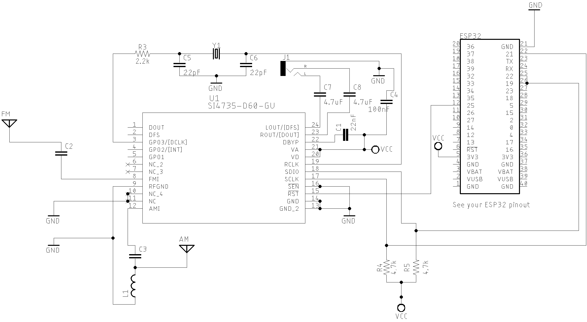

# Schematics and Sketches


Please, also check the comments at the beginning of each sketch example available in this library. You will find the SI473X, button, encoder, display and Arduino settings.  


## Basic Schematic (Atmega328 based board)

The schematic below shows how to connect the SI473X (SSOP24 package) circuit with Arduino Pro Mini 3.3V/8MHz.


[All Sketches on SI47XX_01_SERIAL_MONITOR folder](https://github.com/pu2clr/SI4735/tree/master/examples/SI47XX_01_SERIAL_MONITOR)


<BR>

## Atmega328 based board and OLED


Sketche [SI47XX_02_ALL_IN_ONE_OLED](https://github.com/pu2clr/SI4735/blob/master/examples/SI47XX_03_OLED_I2C/SI47XX_02_ALL_IN_ONE_OLED/)

<BR>

## ESP32 based board 


The schematic below guides you to build a SI473X based receiver using the ESP32 device. 


#### ESP32 basic setup


#### ESP32 DEVKIT with OLED and Encoder setup



[All Sketches on SI47XX_06_ESP32 folder](https://github.com/pu2clr/SI4735/tree/master/examples/SI47XX_01_SERIAL_MONITOR)


* [Si4735 Arduino Library - Arduino Mega 2560 and ESP32 LOLIN32 WEMOS](https://youtu.be/HrxR-bUqbjw)




<BR>

## Standalone ATmega328 with or without external Crystal (SI4735-D60 and LCD 16x2). 

The schematic below can be also used with a regular Arduino Board based on ATmega328. It is almost the same circuit posted by Mirko Pavleski on his [Arduino Project repository](https://create.arduino.cc/projecthub/mircemk/diy-si4730-all-band-radio-lw-mw-sw-fm-1894d9). If you use an SI4735-D60 or SI4732-A10, you can have a All band receiver with FM, AM and SSB modes. 


Sketch [SI47XX_02_for_Mirko_Pavleski_radio](https://github.com/pu2clr/SI4735/tree/master/examples/SI47XX_02_for_Mirko_Pavleski_radio). 


Please, use the [MiniCore](https://github.com/MCUdude/MiniCore) setup on your Arduino IDE to deal with standalone Atmega328.

See  video:

* [All band receiver based on SI473X and standalone ATmega328 Modes: FM (VHF) and AM and SSB (HF)](https://youtu.be/H-uIJclH9l8)




<BR>

## Basic schematic with TFT

The schematic below guides you to build your own receiver based on the SI473X with TFT display. The sketches available on [examples/SI47XX_04_TFT/](https://github.com/pu2clr/SI4735/tree/master/examples/SI47XX_04_TFT) folder decribe the wire up used by the TFT selected by the author. Please, read the comments at the beginning of each sketch example.  


Sketches on [examples/SI47XX_04_TFT/](https://github.com/pu2clr/SI4735/tree/master/examples/SI47XX_04_TFT)

See video:
[Si4735 All in One Receiver running on Arduino Pro Mini 3.3V (8MHz) and TFT Display](https://youtu.be/oL8qyRglZ8I)



<BR>

## Arduino DUE/MEGA and touch TFT display. 

The schematic below shows just the Arduino DUE and SI473X connections. The touch TFT used by this circuit is a shield that can be connected to the Arduino DUE directly. If you intent to use Arduino Mega, you have to add a bidirectional logic level converter. 


Sketches on [SI47XX_10_RDS](https://github.com/pu2clr/SI4735/tree/master/examples/SI47XX_10_RDS)

See videos: 

* [Arduino DUE](https://youtu.be/oI9TfJ-8Z9Q)
* [Arduino MEGA 2560](https://youtu.be/fLA2-WFK6GY)




<BR>

## Attiny85 basic circuit

You can use de Si4735 Arduino Library on the very small ATtiny85 or Attiny84. The schematic below can guide you to build a receiver based on attiny85 device. 


Sketches on [examples/SI47XX_05_ATTINY85](https://github.com/pu2clr/SI4735/tree/master/examples/SI47XX_05_ATTINY85)

See videos: 

* [SI4735 Arduino Library working with ATtiny85](https://youtu.be/oI9TfJ-8Z9Q)
* [How to "SI4735 Arduino Library and ATtiny85"](https://youtu.be/zb9TZtYVu-s)




<BR>

## Bluepill - STM32F103C8 basic schematic

The schematic below guides you to build a SI473X based receiver using the STM32 device. 


Sketches on [SI47XX_07_STM32](https://github.com/pu2clr/SI4735/tree/master/examples/SI47XX_07_STM32)


See video: 

* [Si4735 Arduino Library and Bluepill STM32F103](https://youtu.be/https://youtu.be/v4o5_lKKATc)





<BR>

## [Android and iOS Remote Control for PU2CLR Arduino Library DSP receivers](https://github.com/pu2clr/bluetooth_remote_control)

The schematic below is a simple example that shows a way to use your smartphone as a remote control via Bluetooth. You will find more details [here](https://pu2clr.github.io/bluetooth_remote_control/).


See [Android and iOS Remote Control for PU2CLR Arduino Library DSP receivers](https://pu2clr.github.io/bluetooth_remote_control/).

See video

* [SI4735 receiver prototype controlled by iPhone via Bluetooth](https://youtu.be/Yc9DHl7yQZ0)




<BR>


## External Mute Circuit 

The SI47XX devices have about DC bias component in the analog audio output pins (SI4735-D60 pins 23 and 24). When the device goes to power down mode, the voltage on the audio pins drops to 0V.  The device do it internally and there is not a way to avoid that. When the device goes to power up, that audio pins suddenly goes to high DC again. This transition causes the loud pop in the speaker. It is possible to solve this problem by adding an extra __mute__ circuit and control it by the MCU (Atmega, ESP32, STM32, ATtiny85 etc). 


Considering that you are using a MCU based on Atmega328, when the D14 is HIGH the Si47XX output audio will be drained to the ground. At this condition, no audio will be transferred to the amplifier input and, consequently, to the speaker. So, no loud click in the speaker. 

When the D14 is LOW, the most of signal audio output from the Si47XX will be transfered to the input of the amplifier. 

The code below shows all you have to do in your sketch to implement this resource.


```cpp

#include <SI4735.h>
#define AUDIO_MUTE 14      // Pin A0 - Switch AGC ON/OF

Si4735 r;

void setup() {
  .
  
  // It is all you have to do to control a external audio mute circuit if you have one. 
  r.setAudioMuteMcuPin(AUDIO_MUTE); // Tells the system to control an external audio mute circuit. 

  r.setup(RESET_PIN, -1, 1, SI473X_ANALOG_AUDIO); // Starts on FM mode and ANALOG audio mode. 
  .
  .
  .

} 
```

Some low power audio amplifiers IC also implement mute circuit that can be controlled externally. You can find this resource on __[LM4906](http://www.ti.com/lit/ds/symlink/lm4906.pdf), [LM4863](https://www.ti.com/lit/ds/symlink/lm4863.pdf?ts=1588602798363), KA8602B, MC34119, PAM8403__ and __HT82V739__ devices.

See Video: 

[Removing the loud click in the speaker during power down and power up](https://youtu.be/Ua8rHA0jAPI)




<BR>


## Band Pass Filter controlled by Arduino

It is a HF band pass filter controlled by Arduino. It is designed for HF receivers. With this project, you can use a set of up to four HF bandpass filters that can be selected by Arduino. To do that you will need just two digital Arduino pins. All about this project on [here](https://pu2clr.github.io/auto_bpf_arduino/).


See videos: 

* [HF Auto Bandpass filter controlled by Arduino (first test)](https://youtu.be/M1PDRzVvAm0)
* [HF auto bandpass filter controlled by Arduino (real test)](https://youtu.be/KuAmm0LjUGA)



[Back to the main page](https://pu2clr.github.io/SI4735/)


## Storing data into the internal EEPROM before shutdowning  

This example uses the Arduino Pro Mini 3.3V (8MHz), the SI4735 and OLED. 
 
The EEPROM memory has a life time around 100,000 write/erase cycles. Therefore, writing data to eeprom with each system status change could give an application a very short life. To mitigate this problem, some approaches can be used to save recordings on the EEPROM. 

The following circuit illustrates a way to configure the Arduino based on Atmega328 or similar to record useful information on its internal EEPROM.  The idea of this approach is to obtain the last status of the system after turning it back on.  Observe  in the circuit that a 2200uF electrolytic capacitor has been added. This capacitor is powered by the battery voltage or external power supply while the system is working. When the user turn the system off, the capacitor will still keep the arduino running for a few seconds.  Observe also that the Arduino pin 16 (A2), is connected to the power supply. That setup works as a shutdown detector. I mean, the pin 16 status will keep HIGH while the power supply is on. However, when the turn the system off (no power supply), the pin 16 status will be LOW. In this situation, a sketch code have to check the pin 16 status frequently. If it is LOW, the Arduino will have few seconds to save data into the internal EEPROM. Actually, the best way to save data immediately is using the interrupt approaching via pins 2 or 3 of Atmega328. However, this example uses the pulling approaching. Due to the voltage drop caused by the diode D1, it is important to raise the input voltage to 3.7V. This way the Arduino will continue operating steadily with about 3.0V. The SI4735 and OLED are powered with 3.7V. Only the arduino will keep running for a fews seconds after system shutdown. See circuit and schetch reference below. 


<BR>


<BR>


Sketches on [examples/TOOLS/SI47XX_02_STORE_EEPROM_BEFORE_SHUTDOWN](https://github.com/pu2clr/SI4735/tree/master/examples/TOOLS/SI47XX_02_STORE_EEPROM_BEFORE_SHUTDOWN)


