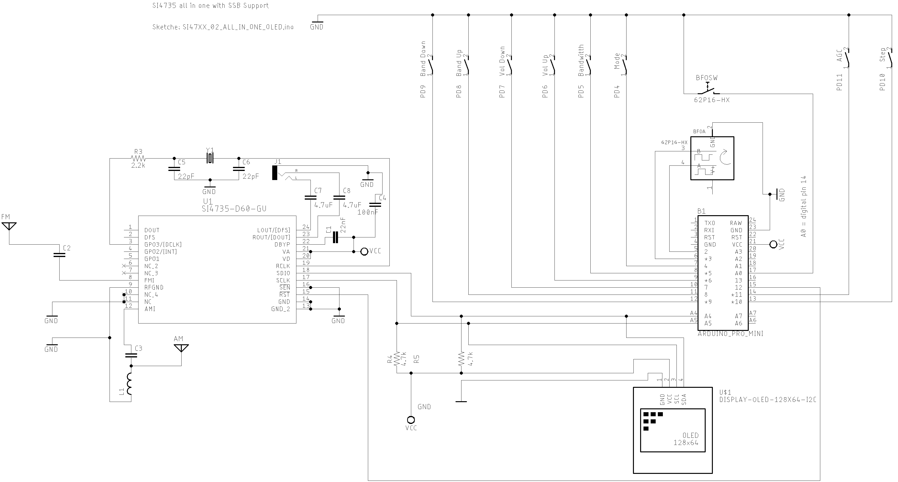
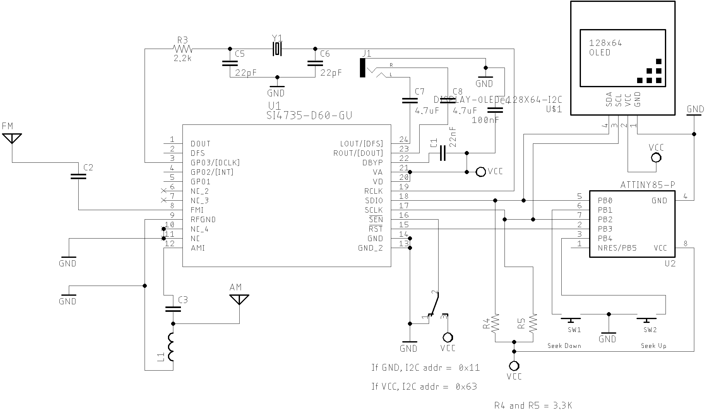
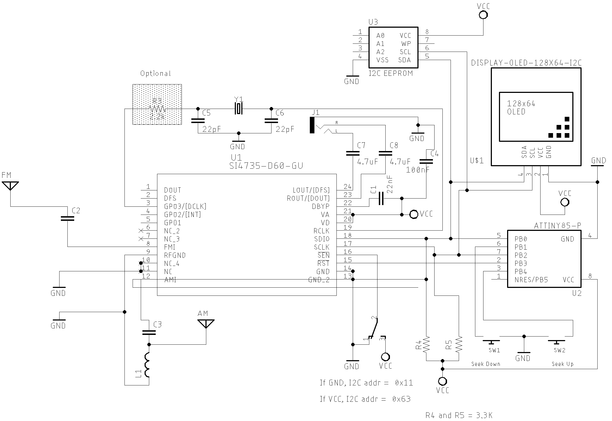
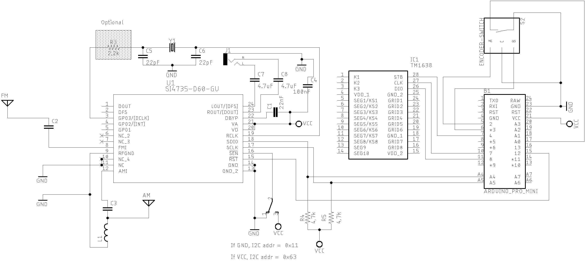
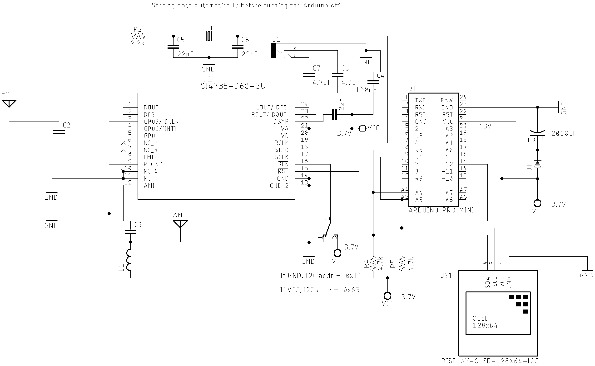

# Schematics and Sketches

This section presents several prototypes and circuits with different displays and controller boards. The source codes for each prototype are stored in the [examples folder](https://github.com/pu2clr/SI4735/tree/master/examples) of this repository. Please, check the comments at the beginning of each sketch example available in this library. You will find the SI473X, button, encoder, display and Arduino settings. There are more than 20 projects that can help you build your own receiver based on the SI47XX IC family. 


__IT IS IMPORTANT TO SAY THAT THE CIRCUITS DESIGN BUILT BY THE AUTHOR ARE NOT INTEND TO BE A FINAL PRODUCT. SOME IMPORTANT ASPECTS AND DETAILS ABOUT A GOOD RECEIVER WERE OMITTED HERE. THE IDEA OF THE CIRCUITS MADE BY THE AUTHOR WERE ORIENTED TO BE A PROOF OF CONCEPT OF THE FUNCTIONS IMPLEMENTED IN THE ARDUINO LIBRARY. SO, COMPONENTS LIKE RF FRONT-END, BAND PASS FILTER,  ESD, ANTENNA DESIGN ARE NOT THE MAIN PART OF THIS PROJECT__.

__This project is about a library to control the SI47XX devices and the focus of this project is the library and its functionalities. Please, don't ask the author to assist you with displays, encoders, buttons or something else out of the "PU2CLR SI4735 Arduino Library" scope. Thanks.__

### Use the following groups to guide you in your projects

* __Facebook__ group called [__Si47XX for Radio Experimenters__](https://www.facebook.com/groups/532613604253401/). The purpose is exchanging experiences with projects based on Silicon Labs  SI47XX IC family. 
* __group.io__ [SI47XX for hobbyists](https://groups.io/g/si47xx). This group is formed by people with experience in electronics and firmware development. 
  

## SI4735 and SI4732 pinout

If the schematic uses the SI4735 device but you have the SI4732 device, all you have to do is following the lables of those devices to replace them. See pictures and the table __SI4735-D60 and SI4732-A10 replacement__  below. 

### The picture below shows the SI4735-D60/SI4730-D60 pinout (SSOP)


### The picture below shows the SI4732-A10 pinout (16L SOIC Package)


 

### SI4735-D60 and SI4732-A10 replacement 

| SI4735-D60 PIN      | SI4732-A10 PIN     | Note | 
| ------------------- | ------------------ | -----| 
| #3 (GP03/[DCLK])    | #2 (GP03/[DCLK])   |      |
| #8 (FMI)            | #6 (FMI)           |      | 
| #9 (RFGND)          | #7 (RFGND)         | Depending on your design, you can use this pin connected to GND |
| #10 and #11 (NC)    | Not applicable     | Connected to GND if you have the SI4735 | 
| #12 (AMI)           | #8 (AMI)           |      |
| #13 and #14 (GND)   | #15 (GND)          |      | 
| #15 (RST)           | #9 (RST)           |      | 
| #16 (SEN)           | #10 (SENB)         | __(*1 ) See the text ATTENTION below__ |  
| #17 (SCLK)          | #11 (SCLK)         |      |
| #18 (SDIO)          | #12 (SDIO)         |      | 
| #19 (RCLK)          | #13 (RCLK)         |      | 
| #20 and #21 (VD VA) | #14 (VDD)          | Connected to +VCC (between 2.8V and 3.7V) | 
| #22 (DBYP)          | Not applicable     |      |
| #23 (ROUT/DOUT)     | #16 (ROUT/DOUT)    |      | 
| #24 (LOUT/DFS)      | #1 (LOUT/DFS)      |      |             

(*1) __ATTENTION__: 

While the Si4735 device provides the 0x11 I²C bus address when the SEN pin is connected to the ground, the SI4732-A10 provides the same address when the SENB pin is connected to the +VCC.  The SI4735 Arduino Library provides the function __getDeviceI2CAddress__ to detect the I²C bus address automatically. This way, you don't need to worry about this setup if you use this function. See [getDeviceI2CAddress()](https://pu2clr.github.io/SI4735/extras/apidoc/html/group__group05.html#ga668008457910e916ebadf15bda2e5b29). By default, connect SEN/SENB pin to the GND. See schematics below.

<BR>

### Basic Schematic (Atmega328 based board) 

The two schematics below show the basic setup. The frist schematic  uses the SI4735-D60 and the secound schematic uses the SI4732-A10. These schematics will help you to replace the SI4735-D60 with the SI4732-A10 or vice versa. 


#### SI4735-D60 Version

The schematic below shows how to connect the SI473X (SSOP24 package) circuit with Arduino Pro Mini 3.3V/8MHz.


[All Sketches on SI47XX_01_SERIAL_MONITOR folder](https://github.com/pu2clr/SI4735/tree/master/examples/SI47XX_01_SERIAL_MONITOR)


|Part	| Description |
|-------| ------------ |
| C1    | 22nF Monolithic Multilayer Chip Ceramic non polarized capacitor (Place it close to VA pin)|
| C2    | 1nF Monolithic Multilayer Chip Ceramic non polarized capacitor |
| C3    | 470nF Monolithic Multilayer Chip Ceramic non polarized capacitor| 
| C4    | 100nF Monolithic Multilayer Chip Ceramic non polarized capacitor (Place it close to VD pin)|
| C5 and C6 | 22pF (Crystal load capacitors) | 
| C7 and C8 *1 | 4.7uF Monolithic Multilayer Chip Ceramic non polarized capacitor | 
| R3    | 2.2K |
| (R4 and R5) *2 | 2.2K to 10K (pull-up resistors) |
| L1 | Ferrite loop stick (about 500 μH) |
| X1    | 32.768 kHz crystal |
| SI4735 | digital CMOS AM(LW, MW and SW)/FM radio receiver IC |

#### SI4732-A10 Version

The schematic below shows how to connect the SI4732-A10  circuit with Arduino Pro Mini 3.3V/8MHz.


[All Sketches on SI47XX_01_SERIAL_MONITOR folder](https://github.com/pu2clr/SI4735/tree/master/examples/SI47XX_01_SERIAL_MONITOR)


<BR>
<BR>

## Atmega328 based board and OLED




Sketche [SI47XX_02_ALL_IN_ONE_OLED](https://github.com/pu2clr/SI4735/blob/master/examples/SI47XX_03_OLED_I2C/SI47XX_02_ALL_IN_ONE_OLED/)

<BR>

## ESP32 based board 


The schematic below guides you to build a SI473X based receiver using the ESP32 device. 


#### ESP32 basic setup


#### ESP32 DEVKIT with OLED and Encoder setup


[All Sketches on SI47XX_06_ESP32 folder](https://github.com/pu2clr/SI4735/tree/master/examples/SI47XX_01_SERIAL_MONITOR)


* [Si4735 Arduino Library - Arduino Mega 2560 and ESP32 LOLIN32 WEMOS](https://youtu.be/HrxR-bUqbjw)




## ESP8266 


## ESP8266 OLED


<BR>

## Standalone ATmega328 with or without external Crystal (SI4735-D60 and LCD 16x2). 

The schematic below can be also used with a regular Arduino Board based on ATmega328. It is almost the same circuit posted by Mirko Pavleski on his [Arduino Project repository](https://create.arduino.cc/projecthub/mircemk/diy-si4730-all-band-radio-lw-mw-sw-fm-1894d9). If you use an SI4735-D60 or SI4732-A10, you can have a All band receiver with FM, AM and SSB modes. 


Sketch [SI47XX_02_for_Mirko_Pavleski_radio](https://github.com/pu2clr/SI4735/tree/master/examples/SI47XX_02_for_Mirko_Pavleski_radio). 


Please, use the [MiniCore](https://github.com/MCUdude/MiniCore) setup on your Arduino IDE to deal with standalone Atmega328.

See  video:

* [All band receiver based on SI473X and standalone ATmega328 Modes: FM (VHF) and AM and SSB (HF)](https://youtu.be/H-uIJclH9l8)




<BR>

## Basic schematic with TFT

The schematic below guides you to build your own receiver based on the SI473X with TFT display. The sketches available on [examples/SI47XX_04_TFT/](https://github.com/pu2clr/SI4735/tree/master/examples/SI47XX_04_TFT) folder decribe the wire up used by the TFT selected by the author. Please, read the comments at the beginning of each sketch example.  


Sketches on [examples/SI47XX_04_TFT/](https://github.com/pu2clr/SI4735/tree/master/examples/SI47XX_04_TFT)

See video:
[Si4735 All in One Receiver running on Arduino Pro Mini 3.3V (8MHz) and TFT Display](https://youtu.be/oL8qyRglZ8I)



<BR>

## Arduino DUE/MEGA and touch TFT display. 

The schematic below shows just the Arduino DUE and SI473X connections. The touch TFT used by this circuit is a shield that can be connected to the Arduino DUE directly. If you intent to use Arduino Mega, you have to add a bidirectional logic level converter. 


Sketches on [SI47XX_10_RDS](https://github.com/pu2clr/SI4735/tree/master/examples/SI47XX_10_RDS)

See videos: 

* [Arduino DUE](https://youtu.be/oI9TfJ-8Z9Q)
* [Arduino MEGA 2560](https://youtu.be/fLA2-WFK6GY)




<BR>

## Attiny85 basic circuit

You can use de Si4735 Arduino Library on the very small ATtiny85 or Attiny84. The schematic below can guide you to build a receiver based on attiny85 device. 





### Attiny85 with external eeprom




Sketches on [examples/SI47XX_05_ATTINY85](https://github.com/pu2clr/SI4735/tree/master/examples/SI47XX_05_ATTINY85)

See videos: 

* [SI4735 Arduino Library working with ATtiny85](https://youtu.be/oI9TfJ-8Z9Q)
* [How to "SI4735 Arduino Library and ATtiny85"](https://youtu.be/zb9TZtYVu-s)




<BR>

## Bluepill - STM32F103C8 basic schematic


### STM32F1 and SI4735-D60 or SI4732-A10 wire up


| Si4735  | SI4732   | DESC.  | ESP32    | 
|---------| -------- |--------|----------|
| pin 15  |  pin 9   | RESET  |   PA12   |  
| pin 18  |  pin 12  | SDIO   |   B7     |
| pin 17  |  pin 11  | SCLK   |   B6     |


The schematic below guides you to build a SI473X based receiver using the STM32 device. 

The schematics below guide you to build a SI473X based receiver using the STM32 device. 


###  Bluepill Basic schematic V1

This version uses a Encoder with Push Button,  and 7 push button.


#### OLED, Encoder and Buttons connections

| Device name   | Device Pin / Description |  STM32F1|
| --------------| -------------------------| --------|
| OLED          |                          |         |
|               | SDA/SDIO                 |  B7     | 
|               | SCL/SCLK                 |  B6     | 
| Encoder       |                          |         |
|               | A                        |  PA0    |
|               | B                        |  PA1    |
|               | PUSH BUTTON (BFO/VFO)    |  PA15   | BFO_SWITCH
| Buttons       |                          |         |
|   MODE_SWITCH | Switch MODE (Am/LSB/USB) |  PA2    |  
|   BANDWIDTH   | Bandwidth                |  PA3    |  
|   VOL         | Volume Up                |  PA4    |
|   VOL_DOWN    | Volume Down              |  PA5    |
|   BAND_UP     | Next Band                |  PA6    | 
|   BAND_DOWN   | Previous band            |  PA7    | 
|   AGC_SWITCH  | Switch AGC               |  PA8    | 
|   STEP_SWITCH | Step Switch              |  PA11   | 


### Bluepill Basic schematic V2

This version uses only a Encoder with Push Button


#### OLED and Encoder connections

  
STM32F1 and components wire up. 
  
| Device name   | Device Pin / Description |  STM32F1 |
| --------------| -------------------------| --------|
|    OLED       |                          |         |
|               | SDA/SDIO                 |  B7     | 
|               | SCL/SCLK                 |  B6     | 
|    Encoder    |                          |         |
|               | A                        |  PA9    |
|               | B                        |  PA10   |
|               | PUSH BUTTON (encoder)    |  PA11   |


Sketches on [SI47XX_07_STM32](https://github.com/pu2clr/SI4735/tree/master/examples/SI47XX_07_STM32)


See video: 

* [Si4735 Arduino Library and Bluepill STM32F103](https://youtu.be/v4o5_lKKATc)





<BR>


## Teensy 3.X and 4.X

The setup bellow works on Teensy 3.X and Teensy 4.X board family. 

### Teensy and components wire up. 

#### OLED and Encoder
  
| Device name   | Device Pin / Description |  Teensy |
| --------------| -------------------------| --------|
|    OLED       |                          |         |
|               | SDA/SDIO                 |  A4     | 
|               | SCL/SCLK                 |  A5     | 
|    Encoder    |                          |         |
|               | A                        |   9     |
|               | B                        |  10     |
|               | PUSH BUTTON (encoder)    |  11     |


#### SI4735-D60 or SI4732-A10 wire up

| Si4735  | SI4732   | DESC.  | Teensy   | 
|---------| -------- |--------|----------|
| pin 15  |  pin 9   | RESET  |   12     |  
| pin 18  |  pin 12  | SDIO   |   A4     |
| pin 17  |  pin 11  | SCLK   |   A5     |


#### Teensy Basic schematic with OLED and Encoder


Sketches on [SI47XX_14_TEENSY](https://github.com/pu2clr/SI4735/tree/master/examples/SI47XX_14_TEENSY)


## Arduino Pro Mini 3.3V and 7SEG Display based on TM1638 


It is a receiver prototype based on SI4735 controlled by TM1638 based devices with buttons, LEDs and 7 segment display. 
This receiver covers AM and SSB (LW, MW and SW) and FM from 64 to 108 MHz.  

The photo below shows the TM1638 based device.


### SI4735, Arduino Pro Mini 3.3V, encoder and TM1638




Sketches on [SI47XX_08_TM1638](https://github.com/pu2clr/SI4735/tree/master/examples/SI47XX_08_TM1638)


See video: 

* [FM, AM and SSB receiver with Arduino and TM1638 7 segments display device](https://youtu.be/VqXkffHu6D8)




## Arduino / ATmega328 with Nokia 5110


### Example One encoder and 7 push buttons to control the receiver

This example uses the Adafruit libraries __Adafruit_GFX__ and __Adafruit_PCD8544__. 
The receiver works on VFH/FM (broadcast stations), and  LW,MW and SW on AM and SSB modes.

| FM | MW/AM | SW/AM | 40M/LSB | 10M/USB |
| -- | ----- | ----- | ------- | ------- |
|  |  |  |  |  |  


The schematic below shows the Arduino board based on ATmega 328 and the Nokia 5110 display


Sketches on [SI47XX_08_TM1638](https://github.com/pu2clr/SI4735/tree/master/examples/SI47XX_09_NOKIA_5110)


### Example one encoder with push button to control the receiver

This example uses the Adafruit librarie __LCD5110_Graph__ to control the Nokia 5110. 
It is not available on Arduino IDE. To install __LCD5110_Graph__ library, download that library on [Rinky-Dink Eletronics](http://www.rinkydinkelectronics.com/library.php?id=47) site, unzip the file and move the folder unzipped to your Arduino Libraries folder. 


The receiver works on VFH/FM (broadcast stations), and  LW,MW and SW on AM and SSB modes.

| FM | MW/AM | SW/AM | 40M/LSB | 10M/USB |
| -- | ----- | ----- | ------- | ------- |
|  |  |  |  |  |  


The schematic below shows the Arduino board based on ATmega 328 and the Nokia 5110 display controlled just by one encoder and one push button.


[Video](https://youtu.be/gN06g6vqt8Q)



## [Android and iOS Remote Control for PU2CLR Arduino Library DSP receivers](https://github.com/pu2clr/bluetooth_remote_control)

The schematic below is a simple example that shows a way to use your smartphone as a remote control via Bluetooth. You will find more details [here](https://pu2clr.github.io/bluetooth_remote_control/).


See [Android and iOS Remote Control for PU2CLR Arduino Library DSP receivers](https://pu2clr.github.io/bluetooth_remote_control/).

See video

* [SI4735 receiver prototype controlled by iPhone via Bluetooth](https://youtu.be/Yc9DHl7yQZ0)




<BR>


## External Mute Circuit 

The SI47XX devices have about 0,7V DC bias component in the analog audio output pins (SI4735-D60 pins 23 and 24). When the device goes to power down mode, the voltage on the audio pins drops to 0V.  The device do it internally and there is not a way to avoid that. When the device goes to power up, that audio pins suddenly goes to high DC again. This transition causes the loud pop in the speaker. It is possible to solve this problem by adding an extra __mute__ circuit and control it by the MCU (Atmega, ESP32, STM32, ATtiny85 etc). 


Considering that you are using a MCU based on Atmega328, when the D14 is HIGH the Si47XX output audio will be drained to the ground. At this condition, no audio will be transferred to the amplifier input and, consequently, to the speaker. So, no loud click in the speaker. 

When the D14 is LOW, the most of signal audio output from the Si47XX will be transfered to the input of the amplifier. 

The code below shows all you have to do in your sketch to implement this resource.


```cpp

#include <SI4735.h>
#define AUDIO_MUTE 14      // Pin A0 - Switch AGC ON/OF

Si4735 r;

void setup() {
  .
  
  // It is all you have to do to control a external audio mute circuit if you have one. 
  r.setAudioMuteMcuPin(AUDIO_MUTE); // Tells the system to control an external audio mute circuit. 

  r.setup(RESET_PIN, -1, 1, SI473X_ANALOG_AUDIO); // Starts on FM mode and ANALOG audio mode. 
  .
  .
  .

} 
```

Some low power audio amplifiers IC also implement mute circuit that can be controlled externally. You can find this resource on __[LM4906](http://www.ti.com/lit/ds/symlink/lm4906.pdf), [LM4863](https://www.ti.com/lit/ds/symlink/lm4863.pdf?ts=1588602798363), KA8602B, MC34119, PAM8403__ and __HT82V739__ devices.

See Video: 

[Removing the loud click in the speaker during power down and power up](https://youtu.be/Ua8rHA0jAPI)




<BR>


## SI473X and external active crystal oscillator or signal generator

You can use a signal generator or a active crystal oscillator instead the passive 32768kHz  crystal with Si473X devices. This setup can be useful to improve the receiver performance or deal with digital audio output. The schematic below shows this setup. 


If you have an active crystal or other signal generator that oscillates at Z Hz, where Z is a value greater than 31130Hz, do the follow steps: 
 * __Choosing a reference clock value between 31130Hz and 34406 Hz that multiplied by N (prescaler) is equal or very close to Z__. 
 * call the setRefClock(R). Where R (reference clock) have to be a value between 31130Hz and 34406;
 * call the setRefClockPrescaler(N). Where N (prescaler) is a value that multiplied by R is equal to the frequency of your active crystal or signal renerator;
 * call the setup() function with the parameter XOSCEN_RCLK

For example:  
If you have an active crystal that oscillates at 32500Hz (32.5kHz), the N must be equal to 1. 
So, the right setup for this case is: 

si4735.setRefClock(32500);  // Reference clock = 32500		
si4735.setRefClockPrescaler(1);   // Prescaler = 1  
si4735.setup(RESET_PIN, -1, POWER_UP_FM, SI473X_ANALOG_AUDIO, XOSCEN_RCLK);

__As you may notice, some active crystals or some frequencies will not work properly, as the product of R and N will result in values far from the oscillation frequency provided by the source__. 
__For example: A signal generator running at 40kHz__. 

Check the [PU2CLR SI4735 Arduino Library API documentation](https://pu2clr.github.io/SI4735/extras/apidoc/html/) to deal with external clock reference. The code below shows how to setup 32.768kHz external clock. 

The example below shows the setup to an active crystal that oscillate at 32768Hz. 

```cpp
void setup(void)
{
  .
  .
  .
  si4735.setRefClock(32768);        // Ref = 32768Hz 
  si4735.setRefClockPrescaler(1);   // prescaler = 150 =>  32768 x 1 = 32768  
 
  si4735.setup(RESET_PIN, -1, POWER_UP_FM, SI473X_ANALOG_AUDIO, XOSCEN_RCLK); // XOSCEN_RCLK means: external clock source setup
  .
  .
  .
}
```

__IMPORTANT__: use a reference clock between 31130Hz to 34406Hz;  

#### Some examples below

##### 100kHz 
if you have an active 100kHz crystal, you must select the reference clock of 33333Hz (33kHz) and a prescaler of 3 (3 x 33333 = ~100000Hz). Example: 

```cpp
rx.setRefClock(33333);           
rx.setRefClockPrescaler(3);     
rx.setup(RESET_PIN, 0, POWER_UP_AM, SI473X_ANALOG_AUDIO, XOSCEN_RCLK);      
```

__It is important to note the setup function and the parameter XOSCEN_RCLK__. 

##### 4.9152MHz  

```cpp
rx.setRefClock(32768);        // Ref = 32768Hz
rx.setRefClockPrescaler(150); // prescaler = 150 ==> 32768 x 150 = 4915200Hz (4.9152MHz)
rx.setup(RESET_PIN, 0, POWER_UP_AM, SI473X_ANALOG_AUDIO, XOSCEN_RCLK);      
```

##### 13MHz

```cpp
si4735.setRefClock(32500);          // Ref = 32.5kHz
si4735.setRefClockPrescaler(400);   // prescaler = 400 ==> 32500 x 400 = 13000000 (13MHz)
rx.setup(RESET_PIN, 0, POWER_UP_AM, SI473X_ANALOG_AUDIO, XOSCEN_RCLK); 
```

##### 13.107200MHz: 

```cpp
rx.setRefClock(32768);        // Ref = 32768Hz
rx.setRefClockPrescaler(400); // prescaler = 400 ==> 32768 x 400 = 13.107200MHz 
rx.setup(RESET_PIN, 0, POWER_UP_AM, SI473X_ANALOG_AUDIO, XOSCEN_RCLK);      
```

See the sketch example: [I47XX_02_RDS_TOUCH_SHIELD_REF_CLOCK](https://github.com/pu2clr/SI4735/tree/master/examples/TOOLS/SI47XX_99_NO_CRYSTAL)

Video: 

[SI4735-D60 and external reference clock test](https://youtu.be/Jgh3ScQUudE)




## Band Pass Filter controlled by Arduino

It is a HF band pass filter controlled by Arduino. It is designed for HF receivers. With this project, you can use a set of up to four HF bandpass filters that can be selected by Arduino. To do that you will need just two digital Arduino pins. All about this project on [here](https://pu2clr.github.io/auto_bpf_arduino/).


See videos: 

* [HF Auto Bandpass filter controlled by Arduino (first test)](https://youtu.be/M1PDRzVvAm0)
* [HF auto bandpass filter controlled by Arduino (real test)](https://youtu.be/KuAmm0LjUGA)




## Storing data into the internal EEPROM before shutdowning  

This example uses the Arduino Pro Mini 3.3V (8MHz), the SI4735 and OLED.
 
The EEPROM has a lifetime around 100,000 write/erase cycles. On "Atmel, ATmega328P, 8-bit AVR Microcontroller with 32K Bytes In-System Programmable Flash". The DATASHEET, page 19, you will find: "The Atmel® ATmega328P contains 1Kbyte of data EEPROM memory. It is organized as a separate data space, in which single bytes can be read and written. The EEPROM has an endurance of at least 100,000 write/erase cycles". Therefore, writing data to eeprom with each system status change could give an application a very short life. To mitigate this problem, some approaches can be used to save recordings on the EEPROM.

The following circuit illustrates a way to configure an Arduino based on Atmega328 to record useful information on its internal EEPROM.  The idea of this approach is to obtain the last status of the system after turning it on.    Observe  in the circuit that a 1000uF electrolytic capacitor has been added. Depending on the arduino board, the time needed to record the information and the shutdown check time, the capacitor value may be different. This capacitor is powered by the battery voltage or external power supply while the system is working. When the user turns the system off, the capacitor will still keep the arduino running for a few seconds.  Observe also that the Arduino pin 16 (A2), is connected to the power supply. That setup works as a shutdown detector. I mean, the pin 16 status will keep HIGH while the power supply is on. However, when the user turns the system off (no power supply), the pin 16 status will be LOW. In this condition, a few lines of code have to be added to the loop function to check the pin 16 status frequently. If the pin 16  is LOW, the Arduino will have few seconds to save data into the internal EEPROM. Be aware the capacitance of the capacitor must be high enough to allow the arduino to record all needed data. Increase the capacitance value if 1000uF does not provide enough time for your setup.
Actually, the best way to save data immediately is using the interrupt approaching via digital pins 2 or 3 of Atmega328  . However, this example uses with success the pulling approach.  
 
 Due to the voltage drop caused by the diode D1, it is important to raise the input voltage to 3.7V. This way the Arduino will continue operating steadily with about 3V. The SI4735 and OLED are powered with 3.7V, a safe voltage for both devices. Only the arduino will keep running for a few seconds after system shutdown. See circuit and sketch reference below.


<BR>



<BR>

### Arduino sketch setup

<BR>

```cpp

#include <SI4735.h>
#include <EEPROM.h>

#define SHUTDOWN_DETECTOR 16 // A2 - Arduino pin 16 configured as digital

const uint8_t app_id =  35; // Useful to check the EEPROM content before processing useful data
const int eeprom_address = 0;

void setup() {
  pinMode(SHUTDOWN_DETECTOR, INPUT); // If HIGH power supply detected; else, no power supply detected
  pinMode(VOLUME_DOWN, INPUT_PULLUP);
  pinMode(VOLUME_UP, INPUT_PULLUP);  
  .
  .
  // If you want to reset (erase) the eeprom, keep the VOLUME_UP button pressed during statup
  if (digitalRead(VOLUME_UP) == LOW)
  {
    EEPROM.write(eeprom_address, 0); // In our case, just the app_id is enough.
    oled.print("EEPROM RESETED");
    delay(2000);
  }

  // Checking the EEPROM content 
  if (EEPROM.read(eeprom_address) == app_id) { // There are useful data stored to rescue
    volume = EEPROM.read(eeprom_address + 1); // Gets the stored volume;
    freqByteHigh = EEPROM.read(eeprom_address + 2); // Gets the frequency high byte
    freqByteLow = EEPROM.read(eeprom_address + 3);  // Gets the frequency low  byte
    currentFrequency = (freqByteHigh << 8) | freqByteLow; // Converts the stored frequency to SI473X frequency.
  } else { // No data found
    volume = 45;
    currentFrequency = 10390; // 103.9MHz
  }
  .
  .
  .
  rx.setup(RESET_PIN, FM_FUNCTION);
  rx.setFM(8400, 10800, currentFrequency, 10);
  rx.setVolume(volume);
  .
  .
  .
}

/** 
 *  Saves the current volume and frequency into the internal EEPROM
 */
void writeReceiverData() {
  EEPROM.write(eeprom_address, app_id); // stores the app id;
  EEPROM.write(eeprom_address + 1, rx.getVolume()); // stores the current Volume
  EEPROM.write(eeprom_address + 2, (currentFrequency >> 8) );   // stores the current Frequency HIGH byte
  EEPROM.write(eeprom_address + 3, (currentFrequency & 0xFF));  // stores the current Frequency LOW byte
}


void loop {
  .
  .
  .
  // Checks the shutdown status
  if (digitalRead(SHUTDOWN_DETECTOR) == LOW ) {
    writeReceiverData();
    while(1); // Stop working
  }
}


```

See the complete sketches on [examples/TOOLS/SI47XX_02_STORE_EEPROM_BEFORE_SHUTDOWN](https://github.com/pu2clr/SI4735/tree/master/examples/TOOLS/SI47XX_02_STORE_EEPROM_BEFORE_SHUTDOWN)


See video:
* [Storing the current status of the SI473X based receivers into the Arduino eeprom automatically](https://youtu.be/ahavz9PHjng)




[Back to the main page](https://pu2clr.github.io/SI4735/)


### Another method to store data into the EEPROM  

You also can store useful data without a special circuit. This approach will store data every time some important status changes. The idea is store data only if it is necessary.

Steps: 

* Select the data you want to keep into the EEPROM;
* Add the code to monitor the data in your sketch;
* Add code to save the data. In this case, you need to define the criteria that will be used to perform a recording on the EEPROM. In general, a good criteria is:  any change of useful data AND elapsed time. It will depend on your application.   
* Consider using the method EEPROM.update instead EEPROM.write. It will not write information if it is the same stored before;
* Add the code to restore data from EEPROM;
* Add the code to check if exist useful data stored into EEPROM. It can be a single byte indicating that exist valid information for the system. Use an identification number (ID) that will be understood as valid data by the system.  
* Add code to erase the information in EEPROM. All you have to do is erasing the identification number. Actually just change the ID value. In other words, you do not need erease all data stored into EEPROM to reset the data to the system.
* Add code to RESET the system. At system start up check if a given button is pressed and then erase the ID;


#### Example

```cpp

#define STORE_TIME 10000      // Time of inactivity to make the current receiver status writable (10 seconds).

const uint8_t app_id = 35;     // Application ID. Any value from 1 to 255.  It will be useful to check the EEPROM content before processing useful data
const int eeprom_address = 0;  // Address where the data will be stored into EEPROM
long storeTime = millis();     // elapsed time control 


void setup() {

  .
  .
  .

  // If you want to reset the eeprom, keep the  button pressed during statup
  if (digitalRead(GIVEN_BUTTON) == LOW)
  {
    EEPROM.write(eeprom_address, 0); // Changes the application ID. It invalidates all stotred information. 
    delay(2000);
  }

  .
  .
  .

  // Checking the EEPROM content and read if it has valid information
  if (EEPROM.read(eeprom_address) == app_id)
  {
    readAllReceiverInformation();
  }

  .
  .
  .

}


void saveAllReceiverInformation()
{
  EEPROM.update(eeprom_address, app_id);                      // stores the app id;
  EEPROM.update(eeprom_address + 1, si4735.getVolume());      // stores the current Volume
  EEPROM.update(eeprom_address + 2, currentMode);             // Stores the current Mode (FM / AM / SSB)
  EEPROM.update(eeprom_address + 3, currentFrequency >> 8);   // Store the current frequency
  EEPROM.update(eeprom_address + 4, currentFrequency & 0XFF);
  .
  .
  .
  
}


void readAllReceiverInformation()
{
  volume = EEPROM.read(eeprom_address + 1);                 // Gets the stored volume;
  currentMode = EEPROM.read(eeprom_address + 2);            // Gets the stored mode
  currentFrequency = EEPROM.read(eeprom_address + 3) << 8;  // Gets the stored frequency 
  currentFrequency |= EEPROM.read(eeprom_address + 4);
  .
  .
  .
}


void loop() {
  .
  .
  .
  // Monitor your data and set statusChanged variable to true if any useful data has changed. 
  .
  .
  .
  
  // check if some status was changed  
  if ( statusChanged )
  {
    // If the status has changed and the elapsed time is less than minimal time, wait a bit more for saving new data. 
    if ((millis() - storeTime) > STORE_TIME) 
    {
      saveAllReceiverInformation();
      storeTime = millis();
      statusChanged = false;
    }
  }
   
}

```

See this aproach working on: 
* [Receiver based on SI473X by Mirko Pavleski](https://github.com/pu2clr/SI4735/tree/master/examples/SI47XX_02_for_Mirko_Pavleski_radio/MIRKO_V2)
* [KIT based on SI4732 and OLED sold by Aliexpress and eBay](https://github.com/pu2clr/SI4735/tree/master/examples/SI47XX_KITS/AliExpress/SI473X_ALL_IN_ONE_OLED_RDS_CHINESE_V7)
* [ESP32 with SI473X and OLED](https://github.com/pu2clr/SI4735/tree/master/examples/SI47XX_06_ESP32/OLED_ALL_IN_ONE)
* [ESP8266 (ESP-12F) and Si473X](https://github.com/pu2clr/SI4735/tree/master/examples/SI47XX_06_ESP8266/OLED_ALL_IN_ONE)
* [SI47XX ALL IN ONE NEW INTERFACE V2](https://github.com/pu2clr/SI4735/tree/master/examples/SI47XX_03_OLED_I2C/SI47XX_03_ALL_IN_ONE_NEW_INTERFACE_V2)
  

